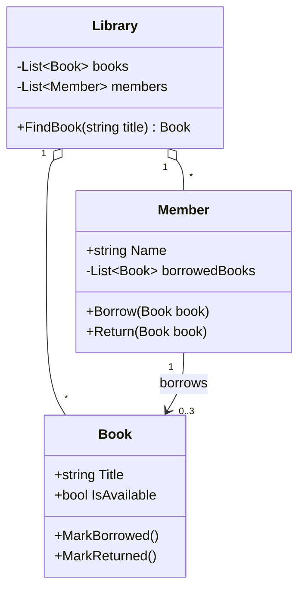
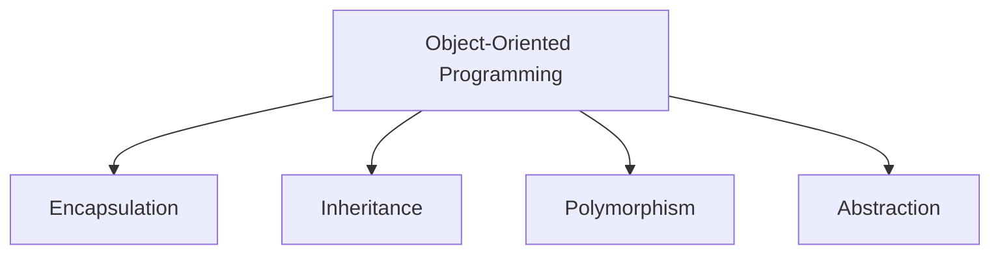

# 01. Introduction to Object-Oriented Programming

> Learn what OOP is, why it exists, and how to start thinking in objects before writing any advanced C#.

**Level:** 🟢 Beginner
**Prerequisites:** None (basic familiarity with C# syntax helps, but is not required)

---

## 📑 In This Chapter

1. What is OOP?
2. Procedural Programming vs OOP
3. Why OOP?
4. Advantages and Disadvantages
5. The Four Pillars of OOP
6. Real-World OOP Thinking
7. Real-World Example
8. Interview Questions

---

## 🎯 Learning Objectives

By the end of this chapter you will be able to:

- Define Object-Oriented Programming in your own words.
- Explain the difference between procedural and object-oriented design.
- Name the four pillars of OOP and describe each in one sentence.
- Identify classes, objects, state and behavior in a real-world scenario.
- Understand the trade-offs of OOP, including when it is not the best fit.

---

## 📖 Concept

**Object-Oriented Programming (OOP)** is a programming paradigm that organizes software around **objects**: units that bundle **data** (state) and the **operations** (behavior) that work on that data.

In C#:

| OOP Term | C# Meaning | Example |
|---|---|---|
| **Class** | A blueprint (type definition) | `class Car { }` |
| **Object** | An instance of a class created at runtime | `new Car()` |
| **State** | Data held by an object (fields, properties) | `Speed`, `Color` |
| **Behavior** | Operations an object can perform (methods) | `Accelerate()`, `Brake()` |
| **Message passing** | One object calling another's members | `car.Accelerate(10)` |

> 💡 C# is primarily a **class-based, object-oriented** language that also supports other styles (functional, procedural). Almost everything you write in C# lives inside a type.

### Procedural Programming vs OOP

**Procedural programming** organizes code as a sequence of procedures (functions) that operate on data passed to them. Data and functions are separate.

**OOP** organizes code around objects that own their data and expose behavior.

```csharp
// ❌ Procedural style: data and functions are separate
public static class BankProcedures
{
    public static decimal Deposit(decimal balance, decimal amount)
    {
        return balance + amount;
    }

    public static decimal Withdraw(decimal balance, decimal amount)
    {
        return balance - amount; // Nothing stops the balance going negative
    }
}

// Caller must manage the balance manually
decimal balance = 100m;
balance = BankProcedures.Withdraw(balance, 500m); // balance = -400
```

```csharp
// ✅ Object-oriented style: data and behavior live together
public class BankAccount
{
    private decimal _balance;

    public BankAccount(decimal openingBalance)
    {
        _balance = openingBalance;
    }

    public decimal Balance => _balance;

    public void Deposit(decimal amount)
    {
        if (amount <= 0)
            throw new ArgumentOutOfRangeException(nameof(amount));
        _balance += amount;
    }

    public void Withdraw(decimal amount)
    {
        if (amount <= 0)
            throw new ArgumentOutOfRangeException(nameof(amount));
        if (amount > _balance)
            throw new InvalidOperationException("Insufficient funds.");
        _balance -= amount;
    }
}
```

The object **protects its own rules**. Callers can no longer put the account into an invalid state.

---

## 🤔 Why It Matters

Without a clear structure, programs become hard to change as they grow. OOP helps by:

- **Grouping related data and logic** so you know where to look.
- **Protecting data** from accidental or invalid changes.
- **Modeling real-world concepts** in a way people can reason about.
- **Enabling reuse** through inheritance and composition.
- **Reducing the impact of change**, because well-designed objects hide their internals.

Almost every modern C# framework, including the .NET base class library itself, is built from classes and interfaces. Understanding OOP is a prerequisite for understanding them.

---

## 🧩 Syntax

The smallest possible object-oriented program in C#:

```csharp
// 1. Define a class (blueprint)
public class Dog
{
    // State
    public string Name { get; set; } = "";

    // Behavior
    public void Bark()
    {
        Console.WriteLine($"{Name} says: Woof!");
    }
}

// 2. Create an object (instance) and use it
Dog myDog = new Dog { Name = "Rex" };
myDog.Bark();
```

---

## 💻 Basic Example

```csharp
public class Car
{
    public string Model { get; }
    public int Speed { get; private set; }

    public Car(string model)
    {
        Model = model;
    }

    public void Accelerate(int amount)
    {
        Speed += amount;
        Console.WriteLine($"{Model} is now going {Speed} km/h.");
    }

    public void Brake()
    {
        Speed = 0;
        Console.WriteLine($"{Model} has stopped.");
    }
}

// Two independent objects created from one class
var car1 = new Car("Toyota");
var car2 = new Car("Honda");

car1.Accelerate(50);
car2.Accelerate(80);
car1.Brake();
```

**Output**

```text
Toyota is now going 50 km/h.
Honda is now going 80 km/h.
Toyota has stopped.
```

Each object keeps its **own state** (`Speed`), while sharing the same **behavior definition** (the class).

---

## 🌍 Real-World Example

A simplified online-shop domain showing objects collaborating:

```csharp
public class Product
{
    public string Name { get; }
    public decimal Price { get; }

    public Product(string name, decimal price)
    {
        Name = name;
        Price = price;
    }
}

public class ShoppingCart
{
    private readonly List<Product> _items = new();

    public void Add(Product product) => _items.Add(product);

    public decimal GetTotal()
    {
        decimal total = 0;
        foreach (var item in _items)
            total += item.Price;
        return total;
    }
}

var cart = new ShoppingCart();
cart.Add(new Product("Keyboard", 49.99m));
cart.Add(new Product("Mouse", 19.99m));

Console.WriteLine($"Total: {cart.GetTotal():C}");
```

**Output** (currency symbol depends on your culture)

```text
Total: $69.98
```

Notice how the problem is described using **nouns** (`Product`, `ShoppingCart`) and **verbs** (`Add`, `GetTotal`). That is the heart of OOP thinking.

---

## 🧠 How It Works

- A **class** is a type definition. It describes what members an object will have. It is not the object itself.
- The `new` keyword asks the runtime to **allocate a new object** and run its constructor.
- Variables of class types hold a **reference** to the object, not the object itself. Two variables can refer to the same object.
- Each object has its **own copy of instance state**; methods are defined once on the type and operate on whichever object they are called on.

```csharp
var a = new Car("Toyota");
var b = a;            // b refers to the SAME object as a
b.Accelerate(30);
Console.WriteLine(a.Speed); // 30
```

> ⚠️ Avoid the oversimplification "classes live on the heap, so objects are always on the heap". Where an object's memory lives is a runtime implementation detail. What matters now: class instances have **reference semantics**. Chapter [03 Objects](../03-objects/README.md) covers this in depth.

### The Four Pillars of OOP

| Pillar | One-line meaning | C# tools | Chapter |
|---|---|---|:---:|
| **Encapsulation** | Bundle data with behavior and hide internal details | access modifiers, properties | [08](../08-encapsulation/README.md) |
| **Inheritance** | A type reuses and extends another type | `:` base class, `base` | [09](../09-inheritance/README.md) |
| **Polymorphism** | One interface, many forms of behavior | `virtual`, `override`, interfaces | [10](../10-polymorphism/README.md) |
| **Abstraction** | Expose what an object does, hide how it does it | `abstract`, `interface` | [11](../11-abstraction/README.md) |

> 📝 Some textbooks list only three pillars (omitting abstraction) or add others. The four above are the most common in interviews and teaching material.

### Real-World OOP Thinking

A simple 4-step method for turning a requirement into objects:

1. **Find the nouns** → candidate classes (`Customer`, `Order`, `Invoice`).
2. **Find the data each noun owns** → fields and properties.
3. **Find the verbs** → methods (`Place()`, `Cancel()`, `CalculateTotal()`).
4. **Decide who is responsible** for each action and how objects collaborate.

**Example requirement:** *"A library lets members borrow books. A member cannot borrow more than 3 books."*

| Noun (class) | State | Behavior |
|---|---|---|
| `Book` | `Title`, `IsAvailable` | `MarkBorrowed()`, `MarkReturned()` |
| `Member` | `Name`, `BorrowedBooks` | `Borrow(Book)`, `Return(Book)` |
| `Library` | `Books`, `Members` | `FindBook(title)` |

The rule *"max 3 books"* belongs inside `Member.Borrow`, the object that owns the data it protects.

---

## 📊 Diagram





*(Larger diagrams live in [`/diagrams`](../diagrams).)*

---

## ⚔️ Important Comparisons

### Procedural vs Object-Oriented

| Aspect | Procedural | Object-Oriented |
|---|---|---|
| **Main unit** | Function / procedure | Object / class |
| **Data and logic** | Separate | Bundled together |
| **Data protection** | Limited (data often shared freely) | Strong (access modifiers, encapsulation) |
| **Reuse** | Copy or call functions | Inheritance, composition, interfaces |
| **Scaling to large systems** | Gets harder | Designed for it |
| **Best for** | Small scripts, simple pipelines | Complex domains with many interacting concepts |

### Class vs Object

| Aspect | Class | Object |
|---|---|---|
| **What it is** | A blueprint (type definition) | An instance of that blueprint |
| **Exists** | At compile time as a type | At runtime in memory |
| **Count** | One definition | Many instances possible |
| **Example** | `Car` | `new Car("Toyota")` |

### Advantages and Disadvantages

| ✅ Advantages | ⚠️ Disadvantages |
|---|---|
| Models real-world problems naturally | More upfront design effort |
| Encapsulation protects data integrity | Can be over-engineered for simple tasks |
| Code reuse through inheritance and composition | Deep inheritance hierarchies become fragile |
| Easier maintenance and testing of isolated units | Extra abstraction can add indirection and some overhead |
| Supports team work: clear boundaries between types | Learning curve for beginners |

---

## ⚠️ Common Mistakes

1. ❌ **Confusing class and object.** A class is the definition; an object is a created instance. Fix: remember `Car` vs `new Car()`.
2. ❌ **Making everything `public`.** This exposes internals and defeats encapsulation. Fix: start `private`, widen only when needed.
3. ❌ **"God classes".** One class doing everything (data access, validation, printing). Fix: give each class a single, clear responsibility.
4. ❌ **Using inheritance just to reuse code.** Inheritance models an *is-a* relationship. If it is not true, prefer composition (*has-a*).
5. ❌ **Thinking OOP means "use classes everywhere".** OOP is about responsibility and collaboration, not just the `class` keyword.
6. ❌ **Assuming two variables hold two objects.** For class types, assignment copies the **reference**, not the object.

---

## ✅ Best Practices

- Name classes with **singular nouns** (`Customer`) and methods with **verbs** (`CalculateTotal`).
- Keep data **private** and expose behavior or controlled properties.
- Give each class **one clear responsibility**.
- Prefer **composition over inheritance** when the *is-a* relationship is doubtful.
- Let objects **protect their own invariants** (e.g., a balance cannot go negative).
- Model the **problem domain** first; worry about frameworks later.

---

## 🎯 Interview Questions

<details>
<summary><b>Q1. What is Object-Oriented Programming?</b></summary>

OOP is a programming paradigm that structures software as a collection of objects. Each object combines state (data) and behavior (methods), and objects interact by calling each other's members. It is usually described using four pillars: encapsulation, inheritance, polymorphism and abstraction.

</details>

<details>
<summary><b>Q2. What is the difference between a class and an object?</b></summary>

A class is a type definition (blueprint) that describes the members an object will have. An object is a runtime instance of that class, created with `new`, with its own copy of instance state.

</details>

<details>
<summary><b>Q3. What are the four pillars of OOP?</b></summary>

- **Encapsulation:** bundling data with behavior and restricting direct access to internals.
- **Inheritance:** a derived type reuses and extends a base type.
- **Polymorphism:** the same call can behave differently depending on the actual object type.
- **Abstraction:** exposing essential behavior while hiding implementation details.

</details>

<details>
<summary><b>Q4. How does OOP differ from procedural programming?</b></summary>

Procedural programming organizes code as functions operating on separate data. OOP bundles data and the functions that operate on it into objects, giving better data protection, reuse and structure for large systems.

</details>

<details>
<summary><b>Q5. Is C# a pure object-oriented language?</b></summary>

No. C# is a multi-paradigm language that is strongly object-oriented, but it also has value types such as `int` and `struct` that behave differently from classes, plus static members, and support for functional and procedural styles. Even so, every type derives from `System.Object`, which makes the type system unified.

</details>

<details>
<summary><b>Q6. What are the disadvantages of OOP?</b></summary>

It requires more upfront design, can lead to over-engineering and overly deep inheritance hierarchies, introduces some indirection, and has a steeper learning curve. It is not always the best fit for small scripts or purely data-transformation tasks.

</details>

<details>
<summary><b>Q7. What is the difference between state and behavior?</b></summary>

State is the data an object holds (fields and properties). Behavior is what the object can do (methods). Together they define the object.

</details>

<details>
<summary><b>Q8. Why is it a problem when two variables refer to the same object?</b></summary>

For class types, assigning one variable to another copies the reference. A change made through one variable is visible through the other, which can cause unexpected side effects if you assumed you had an independent copy.

</details>

---

## 📝 Practice Problems

| # | Problem | Difficulty | Solution |
|:-:|---|:-:|:-:|
| 1 | Create a `Student` class with `Name` and `Age`, plus an `Introduce()` method. Instantiate two students. | 🟢 | [View →](../solutions/01-oop-introduction/) |
| 2 | Rewrite a procedural temperature converter (static functions) as a `Temperature` class that holds its value. | 🟢 | [View →](../solutions/01-oop-introduction/) |
| 3 | Given the requirement *"A restaurant takes orders for menu items"*, list the nouns, state and behavior, then sketch the classes. | 🟢 | [View →](../solutions/01-oop-introduction/) |
| 4 | Build a `BankAccount` that rejects negative deposits and overdrafts. | 🟡 | [View →](../solutions/01-oop-introduction/) |
| 5 | Write a program showing that `var b = a;` for a class makes both variables affect the same object. Explain the output. | 🟡 | [View →](../solutions/01-oop-introduction/) |
| 6 | Model a simple library (`Book`, `Member`, `Library`) enforcing a maximum of 3 borrowed books per member. | 🟡 | [View →](../solutions/01-oop-introduction/) |

Starter files: [`/exercises/01-oop-introduction`](../exercises/01-oop-introduction/)

---

## 🔑 Key Takeaways

- OOP organizes code around **objects** that combine **state** and **behavior**.
- A **class** is the blueprint; an **object** is a runtime instance.
- The four pillars are **encapsulation, inheritance, polymorphism and abstraction**.
- Objects should **protect their own data** and rules.
- Class-type variables hold **references**, so assignment copies the reference, not the object.
- OOP has trade-offs: use it to manage complexity, not to add it.

---

[🏠 Main README](../README.md)
&nbsp;&nbsp;•&nbsp;&nbsp;
[Next: Classes ➡](../02-classes/README.md)
