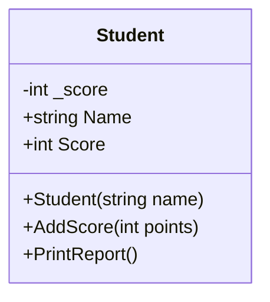
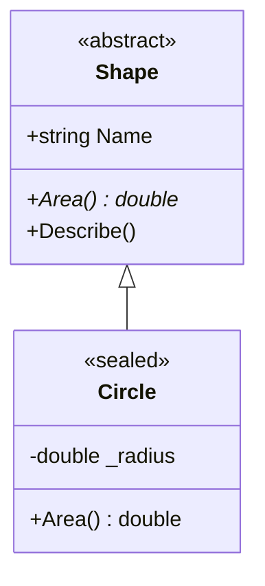
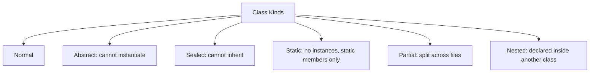

# 02. Classes

> Learn how to define classes in C#, what they can contain, and how the different class kinds (nested, static, partial, sealed, abstract) change their behavior.

**Level:** 🟢 Beginner
**Prerequisites:** [01. Introduction to OOP](../01-oop-introduction/README.md)

---

## 📑 In This Chapter

1. What is a Class?
2. Class Syntax
3. Class Members
4. Class Design
5. Nested Classes
6. Static Classes
7. Partial Classes
8. Sealed Classes
9. Abstract Classes
10. Real-World Example
11. Interview Questions

---

## 🎯 Learning Objectives

By the end of this chapter you will be able to:

- Define a class and explain what it represents.
- Write a class with fields, properties, constructors and methods.
- List the kinds of members a class can contain.
- Apply basic class design rules (single responsibility, naming, encapsulation).
- Use nested, static, partial, sealed and abstract classes and know when each is appropriate.

---

## 📖 Concept

A **class** is a **reference type** that defines the structure and behavior of objects. It describes:

- **What data** an object holds (state).
- **What operations** an object can perform (behavior).
- **How** an object is created and initialized (constructors).

A class by itself does nothing at runtime. You create **objects** (instances) from it using `new` (see [03. Objects](../03-objects/README.md)).

### Class Syntax

```text
[access-modifier] [class-modifier] class ClassName [: BaseClass, Interface1, ...]
{
    // members
}
```

```csharp
public class Person
{
    // members go here
}
```

**Common class modifiers**

| Modifier | Meaning |
|---|---|
| `public` | Accessible from any assembly |
| `internal` | Accessible only within the same assembly (**default for top-level types**) |
| `abstract` | Cannot be instantiated; meant to be a base class |
| `sealed` | Cannot be inherited |
| `static` | Cannot be instantiated; contains only static members |
| `partial` | Class definition is split across multiple parts |

### Class Members

| Member | Purpose | Chapter |
|---|---|:---:|
| **Fields** | Variables that store state | [04](../04-fields/README.md) |
| **Properties** | Controlled access to state | [05](../05-properties/README.md) |
| **Methods** | Behavior | [06](../06-methods/README.md) |
| **Constructors** | Initialize new objects | [07](../07-constructors/README.md) |
| **Constants** | Compile-time fixed values (`const`) | [04](../04-fields/README.md) |
| **Indexers** | Array-like access via `obj[i]` | [17](../17-this-keyword/README.md) |
| **Events** | Notifications raised by the object | n/a |
| **Operators** | Custom operator behavior (e.g., `+`) | n/a |
| **Finalizers** | Cleanup before garbage collection | [23](../23-garbage-collection/README.md) |
| **Nested types** | Types declared inside a class | This chapter |

> 📝 Members declared without an access modifier are **`private` by default**. Top-level types without a modifier are **`internal`**.

---

## 🤔 Why It Matters

Classes are the **primary building block** of C# programs. They let you:

- Group related data and behavior into one named unit.
- Create many objects from one definition.
- Hide implementation details behind a public surface.
- Build larger designs through inheritance, interfaces and composition.

Poorly designed classes (too large, too open, unclear purpose) are the most common cause of hard-to-maintain code.

---

## 🧩 Syntax

```csharp
namespace Shop;                          // file-scoped namespace (C# 10+)

public class Product                     // class declaration
{
    private decimal _price;              // field

    public string Name { get; }          // property

    public Product(string name, decimal price)   // constructor
    {
        Name = name;
        _price = price;
    }

    public decimal GetPriceWithTax(decimal rate) // method
        => _price * (1 + rate);
}
```

**Special class forms**

```csharp
public abstract class Shape { }            // abstract
public sealed class Circle : Shape { }     // sealed
public static class MathHelper { }         // static
public partial class Customer { }          // partial

public class Outer
{
    public class Inner { }                 // nested
}
```

---

## 💻 Basic Example

```csharp
public class Student
{
    // Fields
    private int _score;

    // Properties
    public string Name { get; }
    public int Score => _score;

    // Constructor
    public Student(string name)
    {
        Name = name;
    }

    // Methods
    public void AddScore(int points)
    {
        if (points < 0)
            throw new ArgumentOutOfRangeException(nameof(points));
        _score += points;
    }

    public void PrintReport()
    {
        Console.WriteLine($"{Name}: {_score} points");
    }
}

var alice = new Student("Alice");
alice.AddScore(40);
alice.AddScore(25);
alice.PrintReport();

var bob = new Student("Bob");
bob.AddScore(70);
bob.PrintReport();
```

**Output**

```text
Alice: 65 points
Bob: 70 points
```

One class, two independent objects, each with its own `_score`.

---

## 🌍 Real-World Example

A `Playlist` class that uses a **nested class** to hide an implementation detail, and a **static class** for a stateless utility.

```csharp
public class Playlist
{
    // Nested class: an implementation detail nobody outside needs
    private class Track
    {
        public string Title { get; }
        public TimeSpan Duration { get; }

        public Track(string title, TimeSpan duration)
        {
            Title = title;
            Duration = duration;
        }
    }

    private readonly List<Track> _tracks = new();

    public string Name { get; }

    public Playlist(string name) => Name = name;

    public void AddTrack(string title, int seconds)
        => _tracks.Add(new Track(title, TimeSpan.FromSeconds(seconds)));

    public TimeSpan TotalDuration
    {
        get
        {
            var total = TimeSpan.Zero;
            foreach (var track in _tracks)
                total += track.Duration;
            return total;
        }
    }
}

// Static class: stateless helper, no instances needed
public static class DurationFormatter
{
    public static string Format(TimeSpan duration)
        => $"{(int)duration.TotalMinutes}:{duration.Seconds:D2}";
}

var playlist = new Playlist("Focus");
playlist.AddTrack("Intro", 125);
playlist.AddTrack("Deep Work", 310);

Console.WriteLine($"{playlist.Name}: {DurationFormatter.Format(playlist.TotalDuration)}");
```

**Output**

```text
Focus: 7:15
```

Callers never see `Track`. Its design can change freely without affecting any other code.

---

## 🧠 How It Works

### Class design basics

| Guideline | Why |
|---|---|
| **One clear responsibility** per class | Easier to understand, test and change |
| **Singular noun, PascalCase** names (`Invoice`, not `invoices`) | .NET naming conventions |
| **Private state, public behavior** | Protects invariants (see [08. Encapsulation](../08-encapsulation/README.md)) |
| **One top-level class per file**, file named after the class | Easier navigation |
| **Prefer small, cohesive classes** | Avoids "god classes" |

### Nested classes

A class declared **inside another class**.

```csharp
public class Order
{
    public class Line
    {
        public string Product { get; init; } = "";
        public int Quantity { get; init; }
    }

    private readonly List<Line> _lines = new();
    public void Add(string product, int qty)
        => _lines.Add(new Line { Product = product, Quantity = qty });
}

var line = new Order.Line { Product = "Pen", Quantity = 3 };   // accessed via outer name
```

- Nested types are **`private` by default**.
- A nested type can access the **private members of its containing type** (through an instance reference).
- Use them for **helpers that belong to exactly one outer class**.

### Static classes

```csharp
public static class TemperatureConverter
{
    public static double CelsiusToFahrenheit(double c) => c * 9 / 5 + 32;
}

double f = TemperatureConverter.CelsiusToFahrenheit(100); // 212
```

- Cannot be instantiated (`new` is not allowed) or inherited.
- Can contain **only static members**.
- Good for **stateless utilities** and extension methods (see [13. Static Members](../13-static-members/README.md)).

### Partial classes

One class split across **multiple files** in the same assembly and namespace.

```csharp
// Customer.cs
public partial class Customer
{
    public string Name { get; set; } = "";
}

// Customer.Validation.cs
public partial class Customer
{
    public bool IsValid() => !string.IsNullOrWhiteSpace(Name);
}
```

- Every part must use the `partial` keyword.
- The compiler **merges the parts into one class**.
- Common uses: **code generators** (designer files, source generators) and separating generated code from hand-written code.
- Do not use it just to hide a class that is too large; split the **responsibilities** instead.

### Sealed classes

```csharp
public sealed class Circle : Shape { }

// public class SpecialCircle : Circle { }   // ❌ compile error: cannot derive from sealed type
```

- Prevents inheritance.
- Useful when a class is **not designed to be extended**, for security or design clarity.
- Details in [14. Sealed Members](../14-sealed-members/README.md).

### Abstract classes

```csharp
public abstract class Shape
{
    public string Name { get; }
    protected Shape(string name) => Name = name;

    public abstract double Area();     // no body: derived classes must implement
    public void Describe() => Console.WriteLine($"{Name}: area {Area():F2}");
}

public sealed class Circle : Shape
{
    private readonly double _radius;
    public Circle(double radius) : base("Circle") => _radius = radius;
    public override double Area() => Math.PI * _radius * _radius;
}

Shape s = new Circle(2);
s.Describe();       // Circle: area 12.57
// var x = new Shape("x");   // ❌ cannot create an instance of an abstract class
```

- Cannot be instantiated directly.
- May contain **abstract members** (no body) and **normal members** (with body).
- Covered fully in [11. Abstraction](../11-abstraction/README.md) and [15. Abstract Class vs Interface](../15-abstract-class-vs-interface/README.md).

---

## 📊 Diagram







*(Larger diagrams live in [`/diagrams`](../diagrams).)*

---

## ⚔️ Important Comparisons

### Special class kinds

| Kind | Instantiable? | Inheritable? | Can contain | Typical use |
|---|:-:|:-:|---|---|
| **Normal** | ✅ | ✅ | Any members | General modeling |
| **Abstract** | ❌ | ✅ (meant to be) | Abstract + concrete members | Shared base with required overrides |
| **Sealed** | ✅ | ❌ | Any members | Final implementations |
| **Static** | ❌ | ❌ | Static members only | Utilities, extension methods |
| **Partial** | Depends on other modifiers | Depends | Any members | Generated + hand-written code |
| **Nested** | Depends on accessibility | Depends | Any members | Private helpers of one outer class |

### Class vs Struct (brief)

| Aspect | `class` | `struct` |
|---|---|---|
| **Type category** | Reference type | Value type |
| **Assignment** | Copies the reference | Copies the value |
| **Inheritance** | Supports class inheritance | No inheritance from other structs/classes |
| **Default value** | `null` | All fields zeroed |
| **Best for** | Entities with identity and behavior | Small, immutable value-like data |

> Where a value lives (stack, heap, register) is a runtime detail. Rely on **semantics** (copy vs reference), not on memory location. See [20. Boxing & Unboxing](../20-boxing-unboxing/README.md).

---

## ⚠️ Common Mistakes

1. ❌ **Making every member `public`.** This breaks encapsulation. Fix: default to `private`, expose only what callers need.
2. ❌ **God classes.** One class that handles validation, storage and printing. Fix: split by responsibility.
3. ❌ **Static class holding mutable state.** It behaves like a hidden global variable and makes testing hard. Fix: use instances, or keep static classes stateless.
4. ❌ **Using inheritance for reuse alone.** If it is not an *is-a* relationship, use composition.
5. ❌ **Forgetting `partial` on one part.** All parts of a partial class must carry the keyword, otherwise you get a duplicate-definition error.
6. ❌ **Trying to instantiate an abstract or static class.** Instantiate a concrete derived class (abstract) or call static members directly (static).
7. ❌ **Assuming a nested class is automatically accessible.** Nested types are `private` unless declared otherwise.

---

## ✅ Best Practices

- Keep classes **small and cohesive**.
- Use **nouns** for class names and **verbs** for method names.
- Start with **`private`** and widen accessibility only when needed.
- Mark classes **`sealed`** by default unless you intend them to be inherited.
- Keep **static classes stateless**.
- Use **nested classes** only for helpers tied to one outer class.
- Use **partial** primarily for generated code, not as an organizing shortcut.
- Initialize objects to a **valid state** through constructors.

---

## 🎯 Interview Questions

<details>
<summary><b>Q1. What is a class in C#?</b></summary>

A class is a reference type that defines the data (fields, properties) and behavior (methods) that its objects will have. It is a blueprint from which instances are created with `new`.

</details>

<details>
<summary><b>Q2. What kinds of members can a class contain?</b></summary>

Fields, constants, properties, methods, constructors, finalizers, indexers, events, operators and nested types.

</details>

<details>
<summary><b>Q3. What is the default access modifier for a class and for its members?</b></summary>

A top-level class defaults to `internal`. Members of a class (including nested types) default to `private`.

</details>

<details>
<summary><b>Q4. What is a static class and when would you use it?</b></summary>

A static class cannot be instantiated or inherited and may contain only static members. It is used for stateless utility functions and for hosting extension methods.

</details>

<details>
<summary><b>Q5. What is a partial class?</b></summary>

A class whose definition is split across multiple files using the `partial` keyword. The compiler merges all parts into a single class. It is mostly used to separate generated code from hand-written code.

</details>

<details>
<summary><b>Q6. What is the difference between an abstract class and a sealed class?</b></summary>

An abstract class cannot be instantiated and is designed to be inherited, often with members that derived classes must implement. A sealed class can be instantiated but cannot be inherited.

</details>

<details>
<summary><b>Q7. Can a class be both `abstract` and `sealed`?</b></summary>

No. They are contradictory: an abstract class must be inherited to be useful, and a sealed class cannot be inherited. A static class is implicitly both abstract and sealed in the compiled form, but you cannot write both modifiers yourself.

</details>

<details>
<summary><b>Q8. Why use a nested class?</b></summary>

To define a helper type that logically belongs to one outer class, keeping it out of the public API. A nested type can also access the outer type's private members through an instance.

</details>

<details>
<summary><b>Q9. What is the difference between a class and a struct?</b></summary>

A class is a reference type: variables hold references and assignment copies the reference. A struct is a value type: assignment copies the value. Classes support inheritance; structs do not inherit from other types (they can implement interfaces).

</details>

---

## 📝 Practice Problems

| # | Problem | Difficulty | Solution |
|:-:|---|:-:|:-:|
| 1 | Create a `Book` class with `Title`, `Author` and a `Describe()` method. | 🟢 | [View →](../solutions/02-classes/) |
| 2 | Create a `Rectangle` class with width, height, `Area()` and `Perimeter()`. | 🟢 | [View →](../solutions/02-classes/) |
| 3 | Write a static class `StringHelper` with a method that reverses a string. | 🟢 | [View →](../solutions/02-classes/) |
| 4 | Create an abstract `Employee` class with an abstract `CalculatePay()`, then implement `FullTimeEmployee` and `PartTimeEmployee`. | 🟡 | [View →](../solutions/02-classes/) |
| 5 | Split a `Customer` class into two `partial` files: data in one, validation in the other. | 🟡 | [View →](../solutions/02-classes/) |
| 6 | Build an `Order` class with a nested `Line` class and a method computing the order total. | 🟡 | [View →](../solutions/02-classes/) |
| 7 | Mark a class `sealed`, then try to inherit from it and explain the compiler error. | 🟢 | [View →](../solutions/02-classes/) |

Starter files: [`/exercises/02-classes`](../exercises/02-classes/)

---

## 🔑 Key Takeaways

- A **class** is a reference-type blueprint defining state and behavior.
- Class members include **fields, properties, methods, constructors, indexers, events, operators, finalizers** and nested types.
- Top-level types default to **`internal`**; members default to **`private`**.
- **Nested** classes hide helpers inside one outer class.
- **Static** classes are stateless utility holders: no instances, no inheritance.
- **Partial** classes split one class across files, mainly for generated code.
- **Sealed** classes cannot be inherited; **abstract** classes cannot be instantiated.
- Good class design means **small, cohesive, well-encapsulated** types.

---

[⬅ Previous: Introduction to OOP](../01-oop-introduction/README.md)
&nbsp;&nbsp;•&nbsp;&nbsp;
[🏠 Main README](../README.md)
&nbsp;&nbsp;•&nbsp;&nbsp;
[Next: Objects ➡](../03-objects/README.md)
