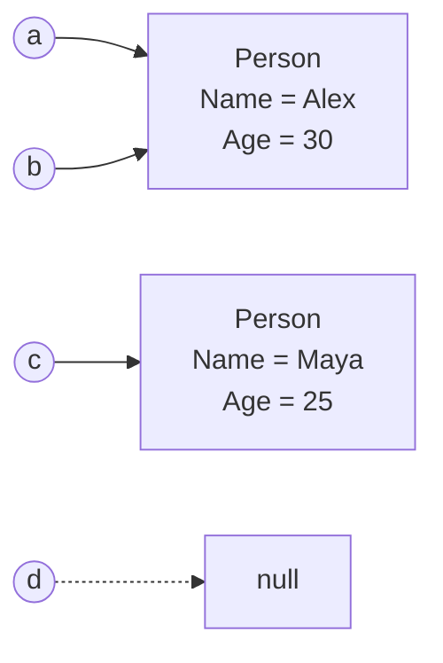
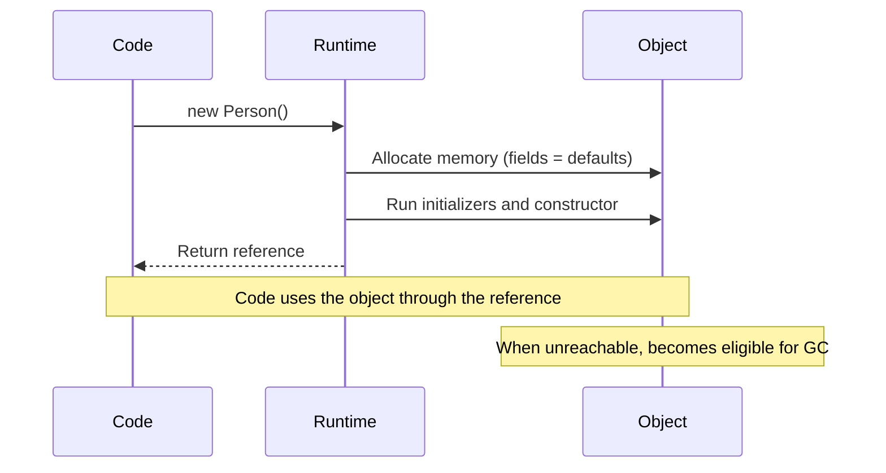

# 03. Objects

> Understand what an object is, how to create one, how references work, and how an object lives and dies at runtime.

**Level:** 🟢 Beginner
**Prerequisites:** [02. Classes](../02-classes/README.md)

---

## 📑 In This Chapter

1. What is an Object?
2. Creating Objects
3. Object References
4. Passing Objects to Methods
5. Identity vs Equality
6. Object Lifetime
7. Memory Model Overview
8. Real-World Example
9. Interview Questions

---

## 🎯 Learning Objectives

By the end of this chapter you will be able to:

- Explain what an object is in terms of **identity, state and behavior**.
- Create objects using `new`, object initializers and target-typed `new`.
- Explain what a **reference variable** holds and what `null` means.
- Predict what happens when objects are assigned or passed to methods.
- Distinguish **reference equality** from **value equality**.
- Describe when an object becomes eligible for garbage collection.

---

## 📖 Concept

An **object** is a runtime **instance of a class**. Every object has three characteristics:

| Characteristic | Meaning | Example (`Person`) |
|---|---|---|
| **Identity** | It is a distinct entity, even if its data matches another object | Two `Person` objects both named "Sam" are still two objects |
| **State** | The current values of its data | `Name = "Sam"`, `Age = 30` |
| **Behavior** | What it can do (methods) | `Introduce()` |

A class is the **definition**; an object is the **thing created from it**.

```text
Class  : Person              (one definition)
Objects: p1, p2, p3 ...      (many instances, each with its own state)
```

### Creating Objects

The `new` operator creates an object and runs its constructor.

```csharp
Person p1 = new Person();               // explicit type
var p2 = new Person();                  // type inferred (var)
Person p3 = new();                      // target-typed new (C# 9+)
var p4 = new Person { Name = "Sam" };   // object initializer
```

**What `new` does (simplified):**

1. The runtime **allocates memory** for the object, with all fields set to default values.
2. **Field initializers and constructors** run (see [07. Constructors](../07-constructors/README.md)).
3. `new` **returns a reference** to the new object.

### Object References

For class types, a variable does **not** contain the object. It contains a **reference** to the object (or `null`).

```csharp
Person a = new Person { Name = "Sam" };
Person b = a;          // copies the REFERENCE, not the object

b.Name = "Alex";
Console.WriteLine(a.Name);   // Alex  (a and b refer to the same object)
```

| Expression | Meaning |
|---|---|
| `Person p = new Person();` | `p` refers to a new object |
| `Person q = p;` | `q` refers to the **same** object as `p` |
| `Person r = null;` | `r` refers to **no object** |
| `p = new Person();` | `p` now refers to a **different** object; the old one is unaffected |

---

## 🤔 Why It Matters

Misunderstanding references is the source of many real bugs:

- Changing an object through one variable and being surprised when another variable "changes too".
- `NullReferenceException` from using a variable that refers to nothing.
- Wrong equality checks (`==` comparing references instead of data).
- Memory leaks caused by keeping references alive longer than intended.

Once you understand identity, references and lifetime, much of C# behavior becomes predictable.

---

## 🧩 Syntax

```csharp
// Declaration only: no object exists yet (reference is null)
Person person;

// Creation
person = new Person();

// Declaration + creation
Person person2 = new Person();

// Object initializer: sets accessible members right after construction
var person3 = new Person { Name = "Sam", Age = 30 };

// Null reference
Person? nobody = null;           // '?' marks it as intentionally nullable

// Safe access
string display = nobody?.Name ?? "Unknown";
```

---

## 💻 Basic Example

```csharp
public class Person
{
    public string Name { get; set; } = "";
    public int Age { get; set; }

    public void Introduce()
    {
        Console.WriteLine($"Hi, I'm {Name} and I'm {Age}.");
    }
}

var p1 = new Person { Name = "Sam", Age = 30 };
var p2 = new Person { Name = "Maya", Age = 25 };

p1.Introduce();
p2.Introduce();

p2.Age = 26;               // changes only p2's state
p2.Introduce();
```

**Output**

```text
Hi, I'm Sam and I'm 30.
Hi, I'm Maya and I'm 25.
Hi, I'm Maya and I'm 26.
```

Two objects from one class, each with independent state.

---

## 🌍 Real-World Example

Objects collaborating, with one `Customer` object **shared by reference** across several orders.

```csharp
public class Customer
{
    public string Name { get; set; } = "";
    public string Email { get; set; } = "";
}

public class Order
{
    public int Id { get; }
    public Customer Customer { get; }

    public Order(int id, Customer customer)
    {
        Id = id;
        Customer = customer;
    }

    public void PrintSummary()
        => Console.WriteLine($"Order #{Id} for {Customer.Name} ({Customer.Email})");
}

var customer = new Customer { Name = "Nadia", Email = "nadia@old-mail.com" };

var order1 = new Order(1, customer);
var order2 = new Order(2, customer);   // same Customer object

customer.Email = "nadia@new-mail.com"; // one change

order1.PrintSummary();
order2.PrintSummary();
```

**Output**

```text
Order #1 for Nadia (nadia@new-mail.com)
Order #2 for Nadia (nadia@new-mail.com)
```

Both orders see the update because they hold references to the **same** `Customer` object. This is useful when sharing is intended, and a bug when it is not.

---

## 🧠 How It Works

### Passing objects to methods

A reference is passed **by value**: the method receives a **copy of the reference**. Both the caller's variable and the parameter refer to the same object.

```csharp
static void Rename(Person p)
{
    p.Name = "Changed";            // modifies the shared object → caller sees it
}

static void Replace(Person p)
{
    p = new Person { Name = "New" };   // reassigns only the local copy → caller does NOT see it
}

var person = new Person { Name = "Original" };

Rename(person);
Console.WriteLine(person.Name);    // Changed

Replace(person);
Console.WriteLine(person.Name);    // Changed (still the same object)
```

To make a method reassign the caller's variable itself, you would need `ref` (see [06. Methods](../06-methods/README.md)).

### Identity vs equality

```csharp
var x = new Person { Name = "Sam", Age = 30 };
var y = new Person { Name = "Sam", Age = 30 };
var z = x;

Console.WriteLine(x == y);                    // False: different objects
Console.WriteLine(x == z);                    // True : same object
Console.WriteLine(ReferenceEquals(x, y));     // False
Console.WriteLine(ReferenceEquals(x, z));     // True
```

- For ordinary classes, `==` and `Equals` compare **references** by default.
- A class can override `Equals`/`GetHashCode` (or overload `==`) to provide **value equality**. `string` does this, and `record` types do it automatically.
- See [19. System.Object](../19-object-class/README.md) and [22. Record vs Class](../22-record-vs-class/README.md).

### Null and `NullReferenceException`

```csharp
Person? p = null;

Console.WriteLine(p?.Name ?? "no person");   // safe: prints "no person"
Console.WriteLine(p.Name);                   // ❌ NullReferenceException at runtime
```

Nullable reference types (enabled by default in new projects) make the compiler warn you when a reference might be `null`.

### Object lifetime

An object's lifetime is **not** tied to the scope of the variable that referenced it.

```csharp
void Demo()
{
    var temp = new Person { Name = "Temp" };   // object created
    temp.Introduce();
}   // 'temp' goes out of scope here → the object is now unreachable
    // The object is NOT destroyed immediately; it becomes eligible for garbage collection
```

Lifecycle:

1. **Created** with `new`.
2. **Reachable** while at least one live reference can still reach it.
3. **Unreachable** when no live reference remains (variable out of scope, reassigned, set to `null`, or the owner itself is unreachable).
4. **Collected** at some later, **non-deterministic** time by the garbage collector.

You do not free managed objects manually. Objects that hold **unmanaged resources** (files, handles) need explicit cleanup through `IDisposable` (see [23. Garbage Collection](../23-garbage-collection/README.md)).

### Memory model overview

Keep this high-level picture, and avoid the common oversimplification "reference types live on the heap, value types live on the stack".

| Concept | Accurate view |
|---|---|
| **Reference variable** | A variable that stores a reference (a pointer-like handle) to an object, or `null` |
| **Class instance** | Allocated by the runtime in **managed memory** (the managed heap in practice) and managed by the GC |
| **Value-type variable** | Stores the value **directly where it is declared** (a local, inside another object, an array element, etc.) |
| **Where things physically live** | A runtime/JIT implementation detail that can change (for example, the JIT may optimize short-lived objects) |

What you should rely on is the **semantics**:

- Class types → **reference semantics** (assignment copies the reference).
- Struct types → **value semantics** (assignment copies the value).

```text
 Variables (references)            Managed memory (objects)

  a ────────────────┐
                    ├──►  [ Person: Name="Alex", Age=30 ]
  b ────────────────┘

  c ───────────────────►  [ Person: Name="Maya", Age=25 ]

  d ──► null
```

---

## 📊 Diagram





*(Larger diagrams live in [`/diagrams`](../diagrams).)*

---

## ⚔️ Important Comparisons

### Reference semantics vs value semantics

| Aspect | Class (reference type) | Struct (value type) |
|---|---|---|
| **Variable holds** | A reference to an object | The value itself |
| **Assignment `b = a`** | Both refer to the same object | `b` gets an independent copy |
| **Can be `null`** | Yes (`Person?`) | Only as `Nullable<T>` (`int?`) |
| **Mutation through one variable** | Visible via the other | Not visible via the copy |

### `==` vs `Equals` vs `ReferenceEquals`

| Check | Default for a plain class | Can be customized? |
|---|---|:-:|
| `==` | Reference comparison | ✅ (operator overload) |
| `.Equals()` | Reference comparison | ✅ (override) |
| `ReferenceEquals(a, b)` | Always reference comparison | ❌ |

### Variable scope vs object lifetime

| | Variable | Object |
|---|---|---|
| **Ends when** | Leaves its scope | No live references remain **and** GC collects it |
| **Deterministic?** | Yes | No |

---

## ⚠️ Common Mistakes

1. ❌ **Thinking `b = a` copies the object.** It copies the reference. Fix: create a new object (or implement a copy/clone approach) if you need independence.
2. ❌ **Using a variable before assigning an object.** A `null` reference throws `NullReferenceException`. Fix: initialize it, or check/handle `null`.
3. ❌ **Comparing objects with `==` and expecting data comparison.** Fix: override `Equals`/`GetHashCode`, or use a `record`.
4. ❌ **Believing `p = new Person()` inside a method changes the caller's variable.** It only changes the local copy of the reference. Fix: mutate the object, return the new object, or use `ref`.
5. ❌ **Assuming an object is destroyed at the end of a block.** It only becomes *eligible* for collection. Fix: use `IDisposable`/`using` for resources that need prompt cleanup.
6. ❌ **Keeping unneeded references** (for example in long-lived collections or static fields), which prevents collection. Fix: remove references you no longer need.
7. ❌ **Repeating "objects live on the heap, primitives on the stack" as a rule.** It is an oversimplification. Reason in terms of reference vs value semantics.

---

## ✅ Best Practices

- Create objects in a **valid state** (use constructors, and initializers where appropriate).
- Enable **nullable reference types** and treat warnings seriously.
- Use `?.`, `??` and guard clauses to handle `null` safely.
- Be deliberate about **shared references**; prefer immutability when sharing.
- Override **equality** when two objects with the same data should be considered equal.
- Limit the **scope and lifetime** of references to what is necessary.
- Wrap objects that own unmanaged resources in **`using`**.

---

## 🎯 Interview Questions

<details>
<summary><b>Q1. What is an object?</b></summary>

An object is a runtime instance of a class. It has identity (it is distinct from other objects), state (its current data) and behavior (the methods defined by its class).

</details>

<details>
<summary><b>Q2. What does the `new` keyword do?</b></summary>

It allocates memory for a new object, runs its field initializers and constructor, and returns a reference to the object.

</details>

<details>
<summary><b>Q3. What does a variable of a class type actually store?</b></summary>

A reference to an object, or `null` if it refers to no object. It does not contain the object's data directly.

</details>

<details>
<summary><b>Q4. What happens when you assign one object variable to another (`b = a`)?</b></summary>

The reference is copied, so both variables refer to the same object. A change made through one variable is visible through the other.

</details>

<details>
<summary><b>Q5. If you pass an object to a method, is it passed by value or by reference?</b></summary>

The reference is passed **by value**. The method gets a copy of the reference to the same object, so it can modify the object's state, but reassigning the parameter does not affect the caller's variable unless `ref` or `out` is used.

</details>

<details>
<summary><b>Q6. What is the difference between `==`, `Equals` and `ReferenceEquals` for classes?</b></summary>

By default, `==` and `Equals` compare references, and `ReferenceEquals` always does. A class may override `Equals` or overload `==` to compare values, as `string` and record types do.

</details>

<details>
<summary><b>Q7. When does an object become eligible for garbage collection?</b></summary>

When it is no longer reachable from any live reference (roots such as locals, static fields, etc.). The actual collection happens later, at a time determined by the GC.

</details>

<details>
<summary><b>Q8. What causes a `NullReferenceException`?</b></summary>

Accessing a member (method, property, field) through a reference that is `null`. Prevent it by initializing references, checking for `null`, using `?.`, and enabling nullable reference types.

</details>

<details>
<summary><b>Q9. Do reference types always live on the heap and value types on the stack?</b></summary>

No, that is an oversimplification. Class instances are generally allocated in managed memory and tracked by the GC, but value types can be stored inline inside objects, arrays or locals, and the runtime may optimize allocation. The reliable distinction is reference semantics versus value semantics.

</details>

---

## 📝 Practice Problems

| # | Problem | Difficulty | Solution |
|:-:|---|:-:|:-:|
| 1 | Create a `Car` class and instantiate three cars with an object initializer. Print each one. | 🟢 | [View →](../solutions/03-objects/) |
| 2 | Write code showing that `var b = a;` makes `a` and `b` refer to the same object. Verify with `ReferenceEquals`. | 🟢 | [View →](../solutions/03-objects/) |
| 3 | Demonstrate the difference between a method that mutates an object parameter and one that reassigns it. Explain the output. | 🟡 | [View →](../solutions/03-objects/) |
| 4 | Create two `Person` objects with identical data. Show that `==` is `false`, then override `Equals` and `GetHashCode` to make them equal. | 🟡 | [View →](../solutions/03-objects/) |
| 5 | Write code that triggers a `NullReferenceException`, then fix it in two different ways. | 🟢 | [View →](../solutions/03-objects/) |
| 6 | Model `Customer` and `Order` so two orders share one customer. Change the customer once and show both orders reflect it. | 🟡 | [View →](../solutions/03-objects/) |
| 7 | Create a copy of a `Person` that is independent of the original (a manual copy method). Prove changes do not affect the original. | 🟡 | [View →](../solutions/03-objects/) |

Starter files: [`/exercises/03-objects`](../exercises/03-objects/)

---

## 🔑 Key Takeaways

- An **object** is an instance of a class with **identity, state and behavior**.
- `new` allocates the object, runs initialization and **returns a reference**.
- Class-type variables hold **references** (or `null`), so assignment copies the reference, not the object.
- Objects are passed to methods by **reference-by-value**: mutation is visible, reassignment is not.
- `==` and `Equals` default to **reference equality** for classes; override them for value equality.
- An object's lifetime is independent of variable scope: it becomes **eligible for GC** when unreachable.
- Think in **reference vs value semantics**, not "heap vs stack".

---

[⬅ Previous: Classes](../02-classes/README.md)
&nbsp;&nbsp;•&nbsp;&nbsp;
[🏠 Main README](../README.md)
&nbsp;&nbsp;•&nbsp;&nbsp;
[Next: Fields ➡](../04-fields/README.md)
