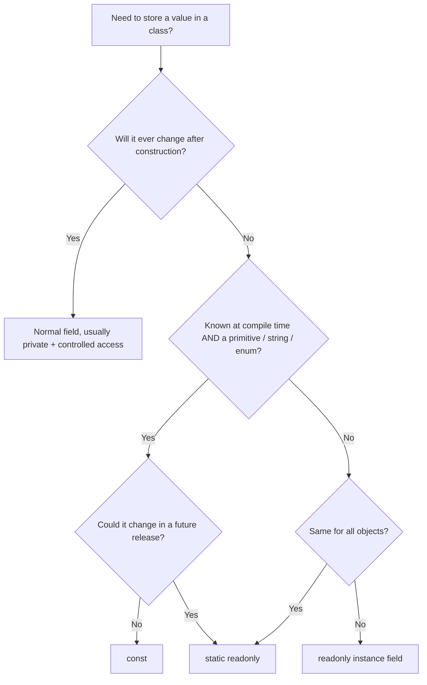
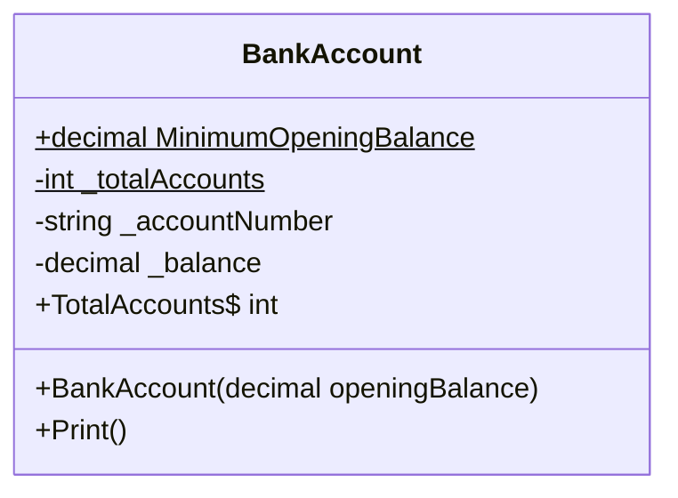

# 04. Fields

> Learn how classes store state: instance and static fields, private fields, `readonly`, `const`, and when to choose each.

**Level:** 🟢 Beginner
**Prerequisites:** [03. Objects](../03-objects/README.md)

---

## 📑 In This Chapter

1. What is a Field?
2. Instance Fields
3. Static Fields
4. Private Fields
5. `readonly` Fields
6. `const` Fields
7. `const` vs `readonly`
8. Default Values and Initialization
9. Real-World Example
10. Interview Questions

---

## 🎯 Learning Objectives

By the end of this chapter you will be able to:

- Define a field and explain how it differs from a local variable and a property.
- Distinguish **instance** fields (one per object) from **static** fields (one per type).
- Use **private fields** with the standard naming convention.
- Use `readonly` and `const` correctly and explain the differences.
- Explain default values and the order in which fields are initialized.
- Avoid common pitfalls such as public fields and mutable shared static state.

---

## 📖 Concept

A **field** is a variable declared **directly inside a class or struct**. Fields hold the **state** of an object (or of the type itself, when static).

```csharp
public class Car
{
    private string _model = "Unknown";   // field
    private int _speed;                  // field (defaults to 0)
}
```

### Field vs local variable vs property

| Aspect | Field | Local variable | Property |
|---|---|---|---|
| **Declared in** | Class/struct body | Inside a method/block | Class/struct body |
| **Lifetime** | As long as its object (or the type, if static) | Until the block ends | Backed by a field (or computed) |
| **Default value** | Automatically set to a default | None; must be assigned before use | Depends on backing field |
| **Access control** | Has access modifiers | No access modifiers | Has access modifiers and accessors |
| **Purpose** | Store state | Temporary work | Controlled access to state |

### Instance Fields

Each object gets **its own copy**. Changing one object's field does not affect others.

```csharp
public class Counter
{
    private int _count;                      // one per Counter object

    public void Increment() => _count++;
    public int GetCount() => _count;
}

var c1 = new Counter();
var c2 = new Counter();
c1.Increment();
c1.Increment();
c2.Increment();

Console.WriteLine(c1.GetCount());   // 2
Console.WriteLine(c2.GetCount());   // 1
```

### Static Fields

A `static` field belongs to the **type**, not to any object. There is **one shared copy**, accessed through the type name.

```csharp
public class Visitor
{
    public static int TotalVisitors;         // one copy shared by all
    public string Name = "";                 // one per object

    public Visitor(string name)
    {
        Name = name;
        TotalVisitors++;
    }
}

var v1 = new Visitor("Ana");
var v2 = new Visitor("Ben");

Console.WriteLine(Visitor.TotalVisitors);    // 2
// Console.WriteLine(v1.TotalVisitors);      // ❌ compile error: access via the type name
```

> 📝 Static fields of a generic type are per **closed** type: `Box<int>` and `Box<string>` each get their own copy.

### Private Fields

Fields should normally be **`private`**, so only the class itself can change its state. Outside code interacts through methods and properties (see [05. Properties](../05-properties/README.md) and [08. Encapsulation](../08-encapsulation/README.md)).

**Common naming convention:**

| Kind | Convention | Example |
|---|---|---|
| Private instance field | `_camelCase` | `_balance` |
| Private static field | `_camelCase` (or `s_camelCase` in some teams) | `_nextId` |
| `const` | `PascalCase` | `MaxRetries` |
| Public/static readonly | `PascalCase` | `DefaultTimeout` |

### `readonly` Fields

A `readonly` field can be assigned **only**:

- at the point of **declaration**, or
- inside a **constructor** of the same class (instance constructor for instance fields, static constructor for static fields).

After that, it cannot be reassigned.

```csharp
public class Account
{
    private readonly string _id;                        // assigned in constructor
    private readonly DateTime _createdAt = DateTime.UtcNow;   // assigned at declaration

    public Account(string id)
    {
        _id = id;                 // ✅ allowed here
    }

    public void Rename(string newId)
    {
        // _id = newId;           // ❌ compile error: readonly field outside constructor
    }
}
```

> ⚠️ `readonly` makes the **variable** unchangeable, **not the object it refers to**. A `readonly List<int>` cannot be pointed at a different list, but you can still call `Add` on it.

### `const` Fields

A `const` is a **compile-time constant**. Its value must be a constant expression known at compile time.

```csharp
public class Circle
{
    public const double Pi = 3.14159265358979;   // implicitly static
    public const string Unit = "cm";
    public const int MaxRadius = 1000;
}

double p = Circle.Pi;       // accessed via the type name
```

Rules:

- **Implicitly `static`**; you cannot write `static const`.
- Allowed types: built-in numeric types, `bool`, `char`, `string`, `decimal`, enums, and `null` for reference types.
- Cannot be used with types such as `DateTime` or arbitrary classes.
- The compiler **copies the value into every place it is used** (inlining).

### `const` vs `readonly`

| Aspect | `const` | `readonly` |
|---|---|---|
| **Value determined** | At **compile time** | At **runtime** (declaration or constructor) |
| **Allowed types** | Primitives, `string`, `decimal`, enums, `null` | Any type |
| **Static or instance** | Always static | Instance **or** static |
| **Assignable in constructor** | ❌ | ✅ |
| **Can differ per object** | ❌ | ✅ (instance `readonly`) |
| **Cross-assembly behavior** | Value is **baked into** consumers; changing it requires recompiling them | Consumers read the current value at runtime |
| **Use when** | Value will truly **never change** (e.g., `Pi`, days in a week) | Value is fixed after creation but not known at compile time |

**Typical pattern for a shared, non-compile-time constant:** `static readonly`.

```csharp
public class AppInfo
{
    public static readonly DateTime StartedAt = DateTime.UtcNow;   // runtime value, set once
    public static readonly string[] SupportedLanguages = { "en", "bn" };
}
```

---

## 🤔 Why It Matters

Fields are where an object's **state actually lives**. Decisions about them determine:

- Whether objects can be put into an **invalid state** (public mutable fields allow it).
- Whether shared data causes **hidden coupling** (mutable static fields).
- Whether values that should never change are **protected** (`readonly`, `const`).
- Whether library updates **break consumers** (`const` inlining).

Good field design is the foundation of encapsulation.

---

## 🧩 Syntax

```csharp
public class Sample
{
    // [access] [static] [readonly] Type name [= initializer];

    private int _instanceField;                       // instance
    private int _withInitializer = 10;                // instance + initializer
    private static int _sharedField;                  // static
    private readonly string _fixedAfterCtor;          // readonly instance
    private static readonly int _fixedShared = 42;    // static readonly
    public const int MaxItems = 100;                  // const (implicitly static)

    public Sample(string value)
    {
        _fixedAfterCtor = value;
    }
}
```

---

## 💻 Basic Example

```csharp
public class BankAccount
{
    public const decimal MinimumOpeningBalance = 0m;     // const

    private static int _totalAccounts;                   // static: shared
    private readonly string _accountNumber;              // readonly: set once per object
    private decimal _balance;                            // instance: per object

    public BankAccount(decimal openingBalance)
    {
        if (openingBalance < MinimumOpeningBalance)
            throw new ArgumentOutOfRangeException(nameof(openingBalance));

        _totalAccounts++;
        _accountNumber = $"ACC-{_totalAccounts:D3}";
        _balance = openingBalance;
    }

    public static int TotalAccounts => _totalAccounts;

    public void Print() => Console.WriteLine($"{_accountNumber}: {_balance:F2}");
}

var a = new BankAccount(100m);
var b = new BankAccount(250m);

a.Print();
b.Print();
Console.WriteLine($"Total accounts: {BankAccount.TotalAccounts}");
```

**Output**

```text
ACC-001: 100.00
ACC-002: 250.00
Total accounts: 2
```

Four kinds of field working together: `const` (rule), `static` (shared counter), `readonly` (identity), instance (balance).

---

## 🌍 Real-World Example

An `Invoice` that uses a `const` tax rate, a static ID generator, a `readonly` identifier, and a `readonly` collection.

```csharp
public class Invoice
{
    private const decimal TaxRate = 0.15m;                  // never changes
    private static int _nextId = 1;                         // shared generator

    private readonly int _id;                               // fixed per invoice
    private readonly List<decimal> _lineAmounts = new();    // reference fixed, contents can change

    public Invoice()
    {
        _id = _nextId++;
    }

    public void AddLine(decimal amount)
    {
        if (amount <= 0)
            throw new ArgumentOutOfRangeException(nameof(amount));
        _lineAmounts.Add(amount);                           // ✅ allowed: modifies the list, not the field
    }

    public decimal Total()
    {
        decimal subtotal = 0m;
        foreach (var amount in _lineAmounts)
            subtotal += amount;

        return subtotal * (1 + TaxRate);
    }

    public void Print() => Console.WriteLine($"Invoice #{_id} total: {Total():F2}");
}

var inv1 = new Invoice();
inv1.AddLine(100m);
inv1.AddLine(50m);

var inv2 = new Invoice();
inv2.AddLine(200m);

inv1.Print();
inv2.Print();
```

**Output**

```text
Invoice #1 total: 172.50
Invoice #2 total: 230.00
```

Outside code cannot touch `_id`, `_nextId`, or `_lineAmounts` directly. The class controls every change.

---

## 🧠 How It Works

### Default values

Fields are automatically initialized to their **default value** when the object (or type) is created. Local variables are not.

| Type | Default |
|---|---|
| Numeric types (`int`, `double`, `decimal`, ...) | `0` |
| `bool` | `false` |
| `char` | `'\0'` |
| Reference types (`string`, classes, arrays) | `null` |
| Structs | All their fields set to defaults |
| Enums | `0` (the underlying value) |

```csharp
public class Defaults
{
    public int Number;        // 0
    public bool Flag;         // false
    public string? Text;      // null
}
```

> With nullable reference types enabled, a non-nullable `string` field that is never assigned produces a **compiler warning** (CS8618). Give it a value in the constructor or an initializer, or make it nullable (`string?`) if `null` is valid.

### Initialization order

When an object is created:

1. Memory is allocated and all fields are set to **defaults**.
2. **Field initializers** run (in the textual order they appear).
3. The **constructor body** runs (and can assign `readonly` fields).

(Details with inheritance are in [07. Constructors](../07-constructors/README.md).)

For **static fields**:

- Static field initializers and the static constructor run **once**, before the type is first used.
- They run in textual order, so do not make one static initializer depend on a later one.

### What the compiler does with `const`

```csharp
public class Config
{
    public const int Timeout = 30;
}

int t = Config.Timeout;     // compiled as: int t = 30;
```

The literal `30` is copied into the calling code. If another assembly uses `Config.Timeout` and you later change it to `60`, that assembly keeps `30` until it is **recompiled**. Use `static readonly` for values that may change between releases.

### Decision guide



---

## 📊 Diagram



```text
 Type: BankAccount                 (one shared set)
 ┌───────────────────────────────┐
 │ static  _totalAccounts = 2    │
 │ const   MinimumOpeningBalance │
 └───────────────────────────────┘

 Object a                          Object b                          (one set per object)
 ┌──────────────────────┐          ┌──────────────────────┐
 │ _accountNumber ACC-001│         │ _accountNumber ACC-002│
 │ _balance       100.00 │         │ _balance       250.00 │
 └──────────────────────┘          └──────────────────────┘
```

*(Larger diagrams live in [`/diagrams`](../diagrams).)*

---

## ⚔️ Important Comparisons

### Instance vs static fields

| Aspect | Instance field | Static field |
|---|---|---|
| **Belongs to** | Each object | The type |
| **Copies** | One per object | One per type (per closed generic type) |
| **Accessed via** | Object reference | Type name |
| **Created when** | Object is created | Type is first initialized |
| **Typical use** | Object state | Shared counters, caches, constants |

### Field vs property (preview)

| Aspect | Field | Property |
|---|---|---|
| **Logic on access** | None | Can validate, compute, or restrict |
| **Binary/API stability** | Changing to a property later is a breaking change | Implementation can change without breaking callers |
| **Recommended visibility** | `private` | `public` when exposure is needed |

### `readonly` vs `const` vs `static readonly`

| | `const` | `static readonly` | instance `readonly` |
|---|:-:|:-:|:-:|
| Known at compile time | ✅ | ❌ | ❌ |
| Shared across objects | ✅ | ✅ | ❌ |
| Any type | ❌ | ✅ | ✅ |
| Safe to change between releases | ❌ | ✅ | ✅ |

---

## ⚠️ Common Mistakes

1. ❌ **Making fields `public`.** Anyone can set invalid values. Fix: use `private` fields with methods or properties.
2. ❌ **Thinking `readonly` means immutable.** A `readonly` reference can still point to a mutable object. Fix: use immutable types or expose read-only views when needed.
3. ❌ **Using `const` for values that may change.** Consumers have the old value baked in. Fix: use `static readonly`.
4. ❌ **Accessing a static field through an instance** (`obj.Count`). It will not compile. Fix: use `TypeName.Count`.
5. ❌ **Mutable static state.** Shared mutable fields create hidden coupling and are not thread-safe by default. Fix: avoid, or protect access (for example with locking or `Interlocked`).
6. ❌ **Assigning a `readonly` field outside a constructor.** Compile error. Fix: assign in the constructor or initializer, or drop `readonly` if it truly must change.
7. ❌ **Trying `const` with a non-constant type** (for example `const DateTime`). Fix: use `static readonly`.
8. ❌ **Ignoring non-nullable field warnings.** An unassigned `string` field is `null` at runtime. Fix: initialize it or mark it nullable.

---

## ✅ Best Practices

- Keep fields **`private`**; expose behavior or properties instead.
- Name private fields **`_camelCase`**, constants **`PascalCase`**.
- Mark fields **`readonly`** whenever they are assigned only once.
- Use **`const`** only for true, never-changing compile-time values.
- Use **`static readonly`** for shared values not known at compile time or likely to change.
- Avoid **mutable static fields**; prefer instances and dependency injection.
- Initialize fields to **valid values** so objects are never half-built.
- Initialize collections once (`readonly List<T> _items = new();`) and never expose the raw list.

---

## 🎯 Interview Questions

<details>
<summary><b>Q1. What is a field in C#?</b></summary>

A field is a variable declared directly in a class or struct. It stores the state of an object (instance field) or of the type (static field).

</details>

<details>
<summary><b>Q2. What is the difference between a field and a local variable?</b></summary>

A field belongs to a type or object, lives as long as that object or type, has access modifiers and a default value. A local variable is declared inside a method or block, lives only until the block ends, has no access modifier, and must be definitely assigned before use.

</details>

<details>
<summary><b>Q3. What is the difference between an instance field and a static field?</b></summary>

An instance field has a separate copy for every object. A static field has a single copy shared by the whole type and is accessed through the type name.

</details>

<details>
<summary><b>Q4. What is the difference between `const` and `readonly`?</b></summary>

`const` is a compile-time constant, implicitly static, limited to primitive types, `string`, `decimal`, enums and `null`, and its value is inlined into consuming code. `readonly` is assigned at declaration or in a constructor at runtime, works with any type, and can be per-instance or static.

</details>

<details>
<summary><b>Q5. Where can a `readonly` field be assigned?</b></summary>

At its declaration, or in a constructor of the same class (an instance constructor for instance fields, the static constructor for static fields).

</details>

<details>
<summary><b>Q6. Does `readonly` make an object immutable?</b></summary>

No. It prevents reassigning the field. If the field refers to a mutable object (such as a `List<T>`), the object's contents can still be changed.

</details>

<details>
<summary><b>Q7. What is `static readonly` used for, and why prefer it over `const` sometimes?</b></summary>

It defines a shared value that is set once at runtime. It is preferred when the value is not a compile-time constant, is of a non-primitive type, or might change in a later version, because `const` values are baked into other assemblies at compile time.

</details>

<details>
<summary><b>Q8. What are the default values of fields?</b></summary>

Numeric types are `0`, `bool` is `false`, `char` is `'\0'`, and reference types are `null`. Struct fields are all set to their defaults.

</details>

<details>
<summary><b>Q9. In what order are field initializers and the constructor executed?</b></summary>

Fields are first set to defaults, then field initializers run in textual order, then the constructor body runs. Static initializers and the static constructor run once, before the type is first used.

</details>

<details>
<summary><b>Q10. Why should fields usually be private?</b></summary>

To protect the object's state and invariants. Exposing fields directly lets any code set invalid values and makes later changes (adding validation, changing storage) a breaking change. Private fields plus methods or properties keep control inside the class.

</details>

---

## 📝 Practice Problems

| # | Problem | Difficulty | Solution |
|:-:|---|:-:|:-:|
| 1 | Create a `Student` class with private instance fields `_name` and `_grade` and methods to read and update the grade with validation. | 🟢 | [View →](../solutions/04-fields/) |
| 2 | Add a `static` counter to a `Product` class that tracks how many products were created. Print it. | 🟢 | [View →](../solutions/04-fields/) |
| 3 | Create a `Circle` class with `const double Pi` and a method that computes the area. | 🟢 | [View →](../solutions/04-fields/) |
| 4 | Create an `Employee` class with a `readonly` `_employeeId` assigned in the constructor. Try to reassign it in a method and explain the error. | 🟢 | [View →](../solutions/04-fields/) |
| 5 | Demonstrate that a `readonly List<int>` can still be modified with `Add`, but cannot be reassigned. | 🟡 | [View →](../solutions/04-fields/) |
| 6 | Write a class with a `static readonly DateTime` start time and a `const int` limit. Explain why each uses its keyword. | 🟡 | [View →](../solutions/04-fields/) |
| 7 | Build a `Ticket` class that generates unique sequential IDs using a static field. Create five tickets and print their IDs. | 🟡 | [View →](../solutions/04-fields/) |
| 8 | Explain (in a short comment block) what happens if assembly B uses a `const` from assembly A, A changes the value, and only A is recompiled. How would `static readonly` behave? | 🟠 | [View →](../solutions/04-fields/) |

Starter files: [`/exercises/04-fields`](../exercises/04-fields/)

---

## 🔑 Key Takeaways

- A **field** is a variable declared directly in a class or struct; it holds state.
- **Instance fields** are per object; **static fields** are shared by the type.
- Make fields **`private`** and expose behavior or properties instead.
- **`readonly`** fields are set once (declaration or constructor) but do **not** make the referenced object immutable.
- **`const`** is a compile-time, implicitly static constant that gets **inlined** into callers.
- Use **`static readonly`** when a shared value is not a compile-time constant or may change in future versions.
- Fields get **default values** automatically; initializers run before the constructor body.
- Avoid **mutable static state**.

---

[⬅ Previous: Objects](../03-objects/README.md)
&nbsp;&nbsp;•&nbsp;&nbsp;
[🏠 Main README](../README.md)
&nbsp;&nbsp;•&nbsp;&nbsp;
[Next: Properties ➡](../05-properties/README.md)
