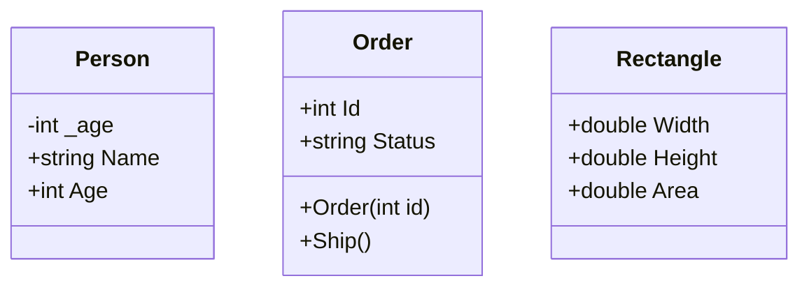
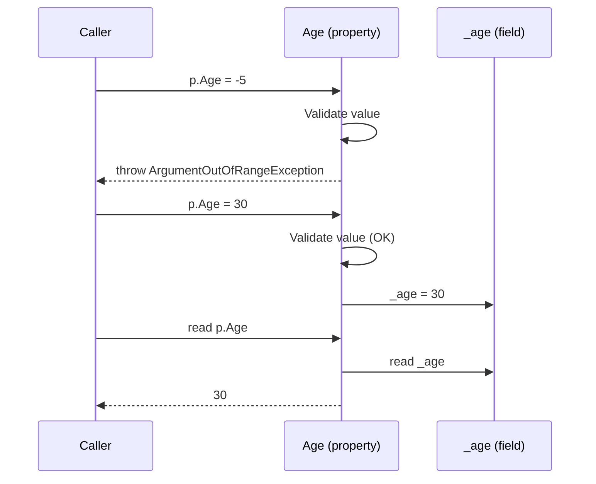
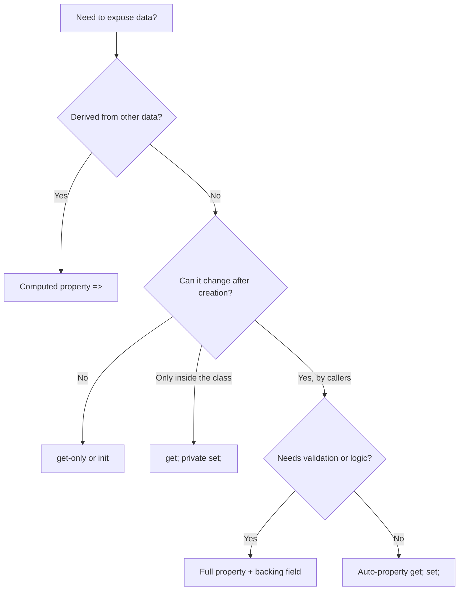

# 05. Properties

> Learn how properties give controlled, validated and flexible access to an object's state: accessors, auto-properties, backing fields, `init`, and expression-bodied members.

**Level:** 🟢 Beginner
**Prerequisites:** [04. Fields](../04-fields/README.md)

---

## 📑 In This Chapter

1. What is a Property?
2. Getters and Setters
3. Backing Fields
4. Auto-Properties
5. Read-Only Properties
6. `init` Accessors
7. Validation
8. Expression-Bodied Properties
9. Accessor Accessibility
10. Real-World Example
11. Interview Questions

---

## 🎯 Learning Objectives

By the end of this chapter you will be able to:

- Explain what a property is and why it is preferred over a public field.
- Write full properties with `get`, `set` and a backing field.
- Use auto-properties, read-only properties and `init`-only properties.
- Add validation inside setters.
- Write computed (expression-bodied) properties.
- Restrict a single accessor with `private set` or `protected set`.
- Choose correctly between a property and a method.

---

## 📖 Concept

A **property** is a class member that exposes a value through **accessors**: a `get` accessor to read it and a `set` (or `init`) accessor to write it. To the caller it looks like a field. Internally it runs code.

```csharp
public class Person
{
    private string _name = "";       // field: the storage

    public string Name               // property: the controlled access point
    {
        get { return _name; }
        set { _name = value; }
    }
}

var p = new Person();
p.Name = "Sam";                      // calls the set accessor
Console.WriteLine(p.Name);           // calls the get accessor
```

Behind the scenes the compiler turns a property into **accessor methods** (`get_Name` and `set_Name`). A property is **not storage by itself**; it is an access mechanism, often backed by a field.

### Getters and Setters

| Accessor | Runs when | Notes |
|---|---|---|
| `get` | The property is **read** | Must return a value of the property type |
| `set` | The property is **assigned** | Receives the new value through the implicit parameter `value` |
| `init` | The property is assigned **during object initialization only** | Enables immutable-after-creation objects (C# 9+) |

### Backing Fields

A **backing field** is the private field that stores the data behind a property.

```csharp
private int _age;                    // backing field

public int Age
{
    get => _age;
    set => _age = value;
}
```

### Auto-Properties

When no extra logic is needed, let the compiler generate the backing field for you.

```csharp
public class Customer
{
    public string Name { get; set; } = "";     // auto-property with initializer
    public int Id { get; set; }
}
```

The compiler creates a hidden private field. You cannot access it directly.

> 📝 **C# 14 (.NET 10)** adds a contextual `field` keyword so you can add logic to one accessor while the compiler still generates the backing field (for example `set => field = value.Trim();`). The full-property pattern with an explicit field, shown in this chapter, works in every C# version and remains the clearest way to learn the concept.

### Read-Only Properties

| Declaration | Who can set it | Typical use |
|---|---|---|
| `{ get; }` | Only the constructor or the declaration initializer | Immutable identity (`Id`) |
| `{ get; private set; }` | Only code inside the class | State the object changes itself (`Balance`) |
| `{ get; init; }` | Constructor, initializer, or object initializer; **not afterwards** | Immutable data objects |
| `=> expression;` | Nobody; the value is computed | Derived values (`FullName`, `Area`) |

```csharp
public class Order
{
    public int Id { get; }                         // get-only
    public string Status { get; private set; } = "New";   // private set

    public Order(int id) => Id = id;               // ✅ allowed in constructor

    public void Ship() => Status = "Shipped";      // ✅ allowed inside the class
}

var order = new Order(7);
// order.Id = 8;           // ❌ compile error
// order.Status = "X";     // ❌ compile error: set accessor is private
order.Ship();
```

### `init` Accessors

`init` makes a property settable **only while the object is being created**.

```csharp
public class Product
{
    public required string Name { get; init; }     // must be set at creation
    public decimal Price { get; init; }
}

var pen = new Product { Name = "Pen", Price = 2.50m };   // ✅
// pen.Price = 3m;                                       // ❌ compile error after creation
```

- `required` (C# 11+) forces the caller to set the member in the object initializer (or constructor).
- `init` is the standard way to create **immutable-after-construction** classes. The `with` expression (non-destructive mutation) is covered with records in [22. Record vs Class](../22-record-vs-class/README.md).

### Validation

A setter can **enforce rules** so the object never holds invalid data.

```csharp
public class Person
{
    private int _age;

    public int Age
    {
        get => _age;
        set
        {
            if (value < 0 || value > 150)
                throw new ArgumentOutOfRangeException(nameof(value), "Age must be between 0 and 150.");
            _age = value;
        }
    }
}
```

This is the heart of encapsulation. See [08. Encapsulation](../08-encapsulation/README.md) for invariants.

### Expression-Bodied Properties

Use `=>` for concise accessors or computed properties.

```csharp
public class Rectangle
{
    public double Width { get; init; }
    public double Height { get; init; }

    public double Area => Width * Height;                 // computed, get-only
    public bool IsSquare => Width == Height;
}

public class Person
{
    private string _name = "";

    public string Name
    {
        get => _name;                                      // expression-bodied accessors
        set => _name = value?.Trim() ?? "";
    }

    public string First { get; init; } = "";
    public string Last { get; init; } = "";
    public string FullName => $"{First} {Last}".Trim();    // no backing field at all
}
```

---

## 🤔 Why It Matters

Compared with public fields, properties let you:

- **Validate** data when it is set.
- **Compute** values on demand instead of storing them.
- **Restrict** write access separately from read access.
- **Change the internal implementation** (new storage, lazy loading, logging) without breaking callers.
- Work with frameworks that expect properties (data binding, serialization, ORMs).

Switching a public field to a property later is a **breaking change** for compiled consumers, so start with a property whenever you must expose data.

---

## 🧩 Syntax

```csharp
public class Sample
{
    private int _value;                                      // backing field

    // Full property
    public int Value
    {
        get { return _value; }
        set { _value = value; }
    }

    // Auto-property forms
    public string A { get; set; } = "";                      // read/write
    public string B { get; } = "fixed";                      // get-only
    public string C { get; private set; } = "";              // private set
    public string D { get; init; } = "";                     // init-only
    public required string E { get; init; }                  // must be provided at creation

    // Computed / expression-bodied
    public string F => $"{A}-{B}";                           // get-only, no storage
    public int G { get => _value; set => _value = value; }   // expression-bodied accessors
}
```

---

## 💻 Basic Example

```csharp
public class Person
{
    private int _age;                                  // backing field

    public string Name { get; set; } = "";             // auto-property

    public int Age                                     // full property with validation
    {
        get => _age;
        set
        {
            if (value < 0 || value > 150)
                throw new ArgumentOutOfRangeException(nameof(value), "Age must be between 0 and 150.");
            _age = value;
        }
    }
}

var p = new Person { Name = "Sam", Age = 30 };
Console.WriteLine($"{p.Name} is {p.Age}");

try
{
    p.Age = -5;
}
catch (ArgumentOutOfRangeException)
{
    Console.WriteLine("Invalid age rejected.");
}

Console.WriteLine($"Age is still {p.Age}");
```

**Output**

```text
Sam is 30
Invalid age rejected.
Age is still 30
```

The invalid assignment was rejected and the object stayed in a valid state.

---

## 🌍 Real-World Example

An order line that combines `init`, `required`, a validated setter and a computed property.

```csharp
public class Product
{
    public required string Name { get; init; }
    public decimal Price { get; init; }
}

public class OrderLine
{
    private int _quantity;

    public Product Product { get; }                         // get-only: set in constructor

    public int Quantity                                      // validated, mutable
    {
        get => _quantity;
        set
        {
            if (value <= 0)
                throw new ArgumentOutOfRangeException(nameof(value), "Quantity must be positive.");
            _quantity = value;
        }
    }

    public decimal Total => Product.Price * Quantity;        // computed: always up to date

    public OrderLine(Product product, int quantity)
    {
        Product = product;
        Quantity = quantity;                                 // reuses the validation
    }

    public void Print() => Console.WriteLine($"{Product.Name} x{Quantity} = {Total:F2}");
}

var pen = new Product { Name = "Pen", Price = 2.50m };
var line = new OrderLine(pen, 4);
line.Print();

line.Quantity = 6;
line.Print();
```

**Output**

```text
Pen x4 = 10.00
Pen x6 = 15.00
```

`Total` is never stored, so it can never be out of sync with `Price` and `Quantity`. The constructor assigns through the property, so validation is applied from the very first moment.

---

## 🧠 How It Works

### Accessors are methods

```csharp
p.Age = 30;          // compiled as: p.set_Age(30)
int a = p.Age;       // compiled as: p.get_Age()
```

Because they are methods, accessors can contain any logic, be inlined by the JIT, be `virtual`/`abstract`, and be declared in interfaces (see [10. Polymorphism](../10-polymorphism/README.md) and [12. Interfaces](../12-interfaces/README.md)).

### The implicit `value` parameter

Inside a `set` or `init` accessor, `value` holds the assigned data.

```csharp
set => _name = value.Trim();
```

### Accessor accessibility

One accessor can be **more restrictive** than the property itself.

```csharp
public class BankAccount
{
    public decimal Balance { get; private set; }        // anyone reads, only this class writes

    public void Deposit(decimal amount)
    {
        if (amount <= 0)
            throw new ArgumentOutOfRangeException(nameof(amount));
        Balance += amount;
    }
}
```

Rules:

- Only **one** accessor may have its own modifier.
- The accessor modifier must be **more restrictive** than the property's accessibility.

### Auto-property vs full property

| Question | Choose |
|---|---|
| No validation or logic needed? | **Auto-property** |
| Need validation, normalization or side effects on set? | **Full property** with backing field |
| Value is derived from other data? | **Computed property** (`=>`), no field |
| Must never change after creation? | `{ get; }` or `{ get; init; }` |
| Only the class should change it? | `{ get; private set; }` |

### Property or method?

| Use a **property** when | Use a **method** when |
|---|---|
| It represents data or a characteristic | It represents an action |
| Reading is cheap and fast | The work is expensive or slow |
| Reading has no side effects | It changes state or has side effects |
| Repeated reads give the same result (unless state changed) | The result depends on timing or randomness (`NextRandom()`) |
| It needs no parameters | It needs arguments |

### Exposing collections safely

```csharp
public class Team
{
    private readonly List<string> _members = new();

    public IReadOnlyList<string> Members => _members;      // callers can read, not modify

    public void Add(string member) => _members.Add(member);
}
```

Returning the raw `List<string>` would let callers bypass your validation.

---

## 📊 Diagram







*(Larger diagrams live in [`/diagrams`](../diagrams).)*

---

## ⚔️ Important Comparisons

### Field vs property

| Aspect | Public field | Property |
|---|---|---|
| **Validation** | ❌ Not possible | ✅ In accessors |
| **Computed values** | ❌ | ✅ |
| **Different read/write access** | ❌ | ✅ (`private set`, `init`) |
| **Can change implementation later** | ❌ Breaking change | ✅ |
| **Interface member** | ❌ | ✅ |
| **Data binding / serialization support** | Often limited | Standard |
| **Recommendation** | Avoid for public API | ✅ Preferred |

### Property forms at a glance

| Form | Read | Set after creation | Set in initializer | Set in constructor |
|---|:-:|:-:|:-:|:-:|
| `{ get; set; }` | ✅ | ✅ | ✅ | ✅ |
| `{ get; private set; }` | ✅ | Inside class only | ❌ | ✅ |
| `{ get; init; }` | ✅ | ❌ | ✅ | ✅ |
| `{ get; }` | ✅ | ❌ | ❌ | ✅ |
| `=> expr` | ✅ | ❌ | ❌ | ❌ |

### `{ get; }` vs `{ get; init; }`

| Aspect | `{ get; }` | `{ get; init; }` |
|---|---|---|
| **Set via object initializer** | ❌ | ✅ |
| **Needs a constructor to populate** | Yes (or a default) | No |
| **Style** | Constructor-driven immutability | Initializer-driven immutability |

---

## ⚠️ Common Mistakes

1. ❌ **Infinite recursion in a setter.** `public string Name { get => Name; set => Name = value; }` calls itself until a stack overflow. Fix: assign to the **backing field** (`_name`).
2. ❌ **Public fields instead of properties.** Fix: expose `public` properties, keep fields `private`.
3. ❌ **Auto-property when validation is required.** A plain `{ get; set; }` accepts anything. Fix: use a full property with a backing field.
4. ❌ **Expensive or side-effecting getters.** Callers assume reads are cheap and repeatable. Fix: use a method (`LoadReport()`, `Calculate()`).
5. ❌ **Throwing exceptions from getters** for ordinary situations. Fix: reserve exceptions for invalid setter input or truly exceptional states.
6. ❌ **Returning the internal mutable collection.** Callers can change your state. Fix: return `IReadOnlyList<T>`/`IReadOnlyCollection<T>` or a copy.
7. ❌ **Forgetting `required`/initialization for non-nullable `string` properties**, leaving them `null` at runtime. Fix: initialize with `= ""`, use `required`, or set in a constructor.
8. ❌ **Assuming `init` allows later changes.** After construction an `init` property is read-only. Fix: use `set` if mutation is intended.
9. ❌ **Making setters public by default.** Fix: prefer `private set` or `init` and expose behavior through methods.

---

## ✅ Best Practices

- Name properties with **PascalCase** nouns (`FirstName`, `IsActive`, `Total`).
- Keep **fields private** and expose **properties**.
- Prefer **auto-properties** unless you need logic.
- Prefer **`init`** or **`private set`** over a public `set` when possible.
- Use **`required`** for values that must be supplied at creation.
- Validate in the **setter** (or constructor through the property) so invalid state never exists.
- Keep accessors **fast and side-effect free**.
- Use **computed properties** for derived data instead of storing duplicates.
- Expose collections as **read-only interfaces**.
- Use `bool` properties named like statements (`IsEmpty`, `HasItems`, `CanExecute`).

---

## 🎯 Interview Questions

<details>
<summary><b>Q1. What is a property in C#?</b></summary>

A property is a class member that provides controlled access to a value through `get` and `set` (or `init`) accessors. It looks like a field to callers but is implemented as methods, so it can include validation, computation or other logic.

</details>

<details>
<summary><b>Q2. What is the difference between a field and a property?</b></summary>

A field is storage. A property is an access mechanism that may or may not use a field. Properties can validate, compute, restrict reads/writes separately, appear in interfaces, and keep the public API stable if the implementation changes. Public fields cannot do any of that.

</details>

<details>
<summary><b>Q3. What is a backing field?</b></summary>

The private field that actually stores the value of a property. In an auto-property, the compiler generates it automatically; in a full property you declare it yourself.

</details>

<details>
<summary><b>Q4. What is an auto-implemented property?</b></summary>

A property declared like `public string Name { get; set; }` where the compiler creates the hidden backing field and trivial accessors. It is used when no extra logic is needed.

</details>

<details>
<summary><b>Q5. How do you make a read-only property?</b></summary>

Declare only a `get` accessor (`{ get; }`), which can be assigned in the constructor or by an initializer, or use an expression-bodied property (`=> expression`) for a computed value. For class-internal changes only, use `{ get; private set; }`.

</details>

<details>
<summary><b>Q6. What is `init` and how does it differ from `set`?</b></summary>

`init` allows assignment only during object initialization (constructor, object initializer, or inside another `init` accessor). After creation the property is read-only. `set` allows assignment at any time the accessor is accessible.

</details>

<details>
<summary><b>Q7. What does the `required` modifier do?</b></summary>

Introduced in C# 11, it forces callers to set the member when creating the object (via an object initializer or constructor), otherwise the compiler reports an error. It is commonly paired with `init`.

</details>

<details>
<summary><b>Q8. What is the `value` keyword in a setter?</b></summary>

An implicit parameter available inside `set` and `init` accessors that holds the value being assigned.

</details>

<details>
<summary><b>Q9. Can the `get` and `set` accessors have different access modifiers?</b></summary>

Yes. One accessor can be more restrictive than the property, for example `public decimal Balance { get; private set; }`. Only one accessor can carry its own modifier, and it must be more restrictive than the property's accessibility.

</details>

<details>
<summary><b>Q10. When should you use a method instead of a property?</b></summary>

When the operation is expensive, has side effects, can produce different results on repeated calls, requires parameters, or represents an action rather than a characteristic of the object.

</details>

<details>
<summary><b>Q11. What is a computed (expression-bodied) property?</b></summary>

A property whose value is calculated from other members each time it is read, such as `public double Area => Width * Height;`. It has no backing field.

</details>

<details>
<summary><b>Q12. Why is `public string Name { get => Name; }` a bug?</b></summary>

The getter returns the property itself, which calls the getter again, causing infinite recursion and a `StackOverflowException`. It should return a backing field instead.

</details>

---

## 📝 Practice Problems

| # | Problem | Difficulty | Solution |
|:-:|---|:-:|:-:|
| 1 | Create a `Student` class with auto-properties `Name` and `Id`. Create two students with an object initializer. | 🟢 | [View →](../solutions/05-properties/) |
| 2 | Add an `Age` property with a backing field that rejects values below 0 or above 120. | 🟢 | [View →](../solutions/05-properties/) |
| 3 | Create a `Rectangle` with `Width`, `Height` and computed properties `Area` and `Perimeter`. | 🟢 | [View →](../solutions/05-properties/) |
| 4 | Build a `BankAccount` with `Balance { get; private set; }` plus `Deposit` and `Withdraw` methods that enforce rules. | 🟡 | [View →](../solutions/05-properties/) |
| 5 | Create an immutable `Point` class using `init` properties. Prove that changing a value after creation fails to compile. | 🟡 | [View →](../solutions/05-properties/) |
| 6 | Create a `Person` with `FirstName`, `LastName` and a computed `FullName`. Make `FirstName` trim whitespace in its setter. | 🟡 | [View →](../solutions/05-properties/) |
| 7 | Build a `Playlist` that exposes its songs as `IReadOnlyList<string>` and offers an `Add` method. Show that callers cannot add directly. | 🟡 | [View →](../solutions/05-properties/) |
| 8 | Use `required` on an `Email` property. Show the compiler error when it is omitted. | 🟡 | [View →](../solutions/05-properties/) |
| 9 | Write a `Temperature` class with `Celsius` as a stored property and `Fahrenheit` as a computed property. Make `Fahrenheit` settable by converting back to Celsius. | 🟠 | [View →](../solutions/05-properties/) |

Starter files: [`/exercises/05-properties`](../exercises/05-properties/)

---

## 🔑 Key Takeaways

- A **property** exposes state through **accessors** (`get`, `set`, `init`) that compile to methods.
- Keep **fields private** and expose **properties**; public fields cannot validate or evolve safely.
- **Auto-properties** are for simple cases; use a **full property with a backing field** for validation or logic.
- **`{ get; }`**, **`{ get; private set; }`** and **`{ get; init; }`** control who can change a value and when.
- **`required`** forces callers to supply a value at creation.
- **Computed properties** (`=>`) derive values without storing them.
- Properties should be **cheap, predictable and side-effect free**; otherwise use a method.
- Never expose an internal mutable collection directly.

---

[⬅ Previous: Fields](../04-fields/README.md)
&nbsp;&nbsp;•&nbsp;&nbsp;
[🏠 Main README](../README.md)
&nbsp;&nbsp;•&nbsp;&nbsp;
[Next: Methods ➡](../06-methods/README.md)