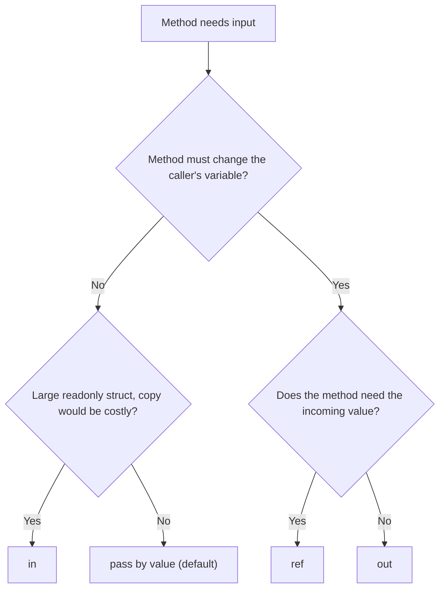
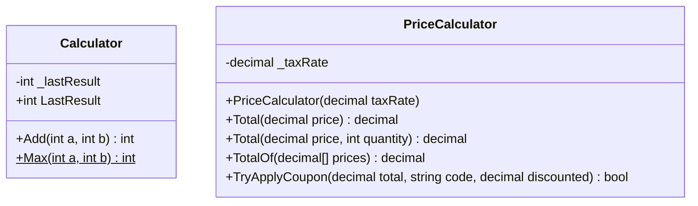
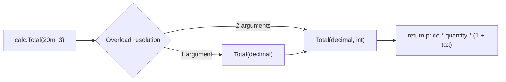

# 06. Methods

> Learn how classes define behavior: instance and static methods, parameters, return values, overloading, parameter modifiers (`ref`, `out`, `in`, `params`), extension methods, and expression-bodied members.

**Level:** 🟢 Beginner
**Prerequisites:** [05. Properties](../05-properties/README.md)

---

## 📑 In This Chapter

1. What is a Method?
2. Instance Methods
3. Static Methods
4. Parameters
5. Return Values
6. Method Overloading
7. `ref`, `out`, `in`
8. `params`
9. Extension Methods
10. Expression-Bodied Methods
11. Real-World Example
12. Interview Questions

---

## 🎯 Learning Objectives

By the end of this chapter you will be able to:

- Declare methods and read their signatures.
- Distinguish **instance** from **static** methods.
- Pass arguments by value, by reference (`ref`), as outputs (`out`) and as read-only references (`in`).
- Accept a variable number of arguments with `params`.
- Overload methods correctly and predict which overload is called.
- Write extension methods and understand what they really are.
- Use expression-bodied syntax appropriately.

---

## 📖 Concept

A **method** is a named block of code inside a class or struct that performs an action. Methods define an object's **behavior**.

```text
[access] [static] ReturnType MethodName(ParameterList)
{
    // body
    return value;       // if ReturnType is not void
}
```

```csharp
public int Add(int a, int b)
{
    return a + b;
}
```

| Part | Example | Meaning |
|---|---|---|
| **Access modifier** | `public` | Who can call it |
| **Return type** | `int` | What it gives back (`void` if nothing) |
| **Name** | `Add` | PascalCase, usually a verb |
| **Parameters** | `int a, int b` | Inputs |
| **Body** | `{ return a + b; }` | The work |

The **method signature** is the name plus the number, types and modifiers (`ref`/`out`/`in`) of its parameters. The **return type is not part of the signature**.

### Instance Methods

Belong to an **object** and can use that object's state through the implicit `this`.

```csharp
public class Counter
{
    private int _count;

    public void Increment() => _count++;      // reads and changes this object's state
    public int GetCount() => _count;
}

var c = new Counter();
c.Increment();
c.Increment();
Console.WriteLine(c.GetCount());   // 2
```

### Static Methods

Belong to the **type**, are called through the type name, and have **no `this`**. They cannot directly access instance members.

```csharp
public class Calculator
{
    public static int Max(int a, int b) => a > b ? a : b;
}

Console.WriteLine(Calculator.Max(7, 4));    // 7
```

More on static members in [13. Static Members](../13-static-members/README.md).

### Parameters

Parameters are the inputs a method declares; **arguments** are the values the caller passes.

```csharp
static string Greet(string name, string greeting = "Hello")   // 'greeting' is optional
    => $"{greeting}, {name}!";

Console.WriteLine(Greet("Sam"));                              // Hello, Sam!
Console.WriteLine(Greet("Sam", "Welcome"));                   // Welcome, Sam!
Console.WriteLine(Greet(greeting: "Hi", name: "Maya"));       // Hi, Maya!  (named arguments)
```

| Feature | Rule |
|---|---|
| **Optional parameters** | Need a compile-time constant default; must come after required ones |
| **Named arguments** | Pass by name in any order; improves readability |
| **Default passing** | **By value**: the method receives a copy of the argument |

> For **reference types**, "by value" means the **reference** is copied, so the method can change the object but not the caller's variable. See [03. Objects](../03-objects/README.md).

### Return Values

```csharp
static int Square(int n) => n * n;                 // returns one value
static void Log(string message) => Console.WriteLine(message);   // returns nothing (void)

// Multiple values with a tuple
static (int Min, int Max) MinMax(int[] values)
{
    int min = values[0], max = values[0];
    foreach (var v in values)
    {
        if (v < min) min = v;
        if (v > max) max = v;
    }
    return (min, max);
}

var (lo, hi) = MinMax(new[] { 4, 9, 1, 7 });
Console.WriteLine($"{lo} {hi}");     // 1 9
```

- `return` ends the method immediately (early return is fine and often clearer).
- A non-`void` method must return a value on **every** code path.

### Method Overloading

Several methods can share a **name** if their **signatures differ** (number, types or order of parameters).

```csharp
public class Printer
{
    public void Print(int value)        => Console.WriteLine($"int: {value}");
    public void Print(double value)     => Console.WriteLine($"double: {value}");
    public void Print(string value)     => Console.WriteLine($"string: {value}");
    public void Print(string a, string b) => Console.WriteLine($"two strings: {a}, {b}");
}

var p = new Printer();
p.Print(5);          // int: 5
p.Print(5.5);        // double: 5.5
p.Print("hi");       // string: hi
p.Print("a", "b");   // two strings: a, b
```

**Valid overloads differ by:** parameter count, parameter types, or parameter order of different types.
**Not valid:** differing only by **return type**, parameter **names**, or `ref` vs `out` vs `in` against each other.

Overloading is resolved by the **compiler** at compile time (compile-time polymorphism, see [10. Polymorphism](../10-polymorphism/README.md)).

### `ref`, `out`, `in`

| Modifier | Meaning | Caller must initialize? | Method must assign? | Keyword at call site |
|---|---|:-:|:-:|:-:|
| *(none)* | Pass a **copy** | Yes | n/a | No |
| `ref` | Pass by **reference**, read and write | **Yes** | No | **Required** |
| `out` | Pass by reference, **method outputs** a value | No | **Yes** (before returning) | **Required** |
| `in` | Pass by reference, **read-only** | Yes | n/a (cannot modify) | Optional |

**By value (default):**

```csharp
static void AddOne(int n) => n++;      // changes only the local copy

int x = 5;
AddOne(x);
Console.WriteLine(x);                  // 5
```

**`ref`: two-way:**

```csharp
static void AddOne(ref int n) => n++;

int x = 5;
AddOne(ref x);
Console.WriteLine(x);                  // 6

static void Swap(ref int a, ref int b)
{
    (a, b) = (b, a);
}
```

**`out`: extra outputs, the `Try...` pattern:**

```csharp
static bool TryDivide(int a, int b, out int result)
{
    if (b == 0)
    {
        result = 0;           // must assign on every path
        return false;
    }
    result = a / b;
    return true;
}

if (TryDivide(10, 2, out int quotient))
    Console.WriteLine(quotient);       // 5

if (!TryDivide(1, 0, out _))           // '_' discards an output you do not need
    Console.WriteLine("Cannot divide by zero");
```

The framework uses the same pattern: `int.TryParse("42", out int n)`.

**`in`: read-only reference, for large structs:**

```csharp
public readonly struct Vector3
{
    public double X { get; }
    public double Y { get; }
    public double Z { get; }
    public Vector3(double x, double y, double z) { X = x; Y = y; Z = z; }
}

static double Length(in Vector3 v) => Math.Sqrt(v.X * v.X + v.Y * v.Y + v.Z * v.Z);

Console.WriteLine(Length(new Vector3(1, 2, 2)));   // 3
```

`in` avoids copying large value types while guaranteeing the method cannot modify them. For small structs and reference types it brings no benefit.

### `params`

`params` lets a method accept **any number of arguments** as an array.

```csharp
static int Sum(params int[] numbers)
{
    int total = 0;
    foreach (var n in numbers) total += n;
    return total;
}

Console.WriteLine(Sum());            // 0
Console.WriteLine(Sum(1, 2, 3));     // 6
Console.WriteLine(Sum(new[] { 4, 5 }));   // 9  (an array can also be passed directly)
```

Rules: only **one** `params` parameter per method, and it must be **last**. Newer C# versions also allow `params` with other collection types such as `ReadOnlySpan<T>`.

### Extension Methods

An **extension method** adds a method to an existing type **without modifying or inheriting** it. It is a **static method** in a **static class** whose first parameter is marked `this`.

```csharp
public static class StringExtensions
{
    public static string Truncate(this string text, int maxLength)
        => text.Length <= maxLength ? text : text[..maxLength] + "...";

    public static int WordCount(this string text)
        => text.Split(' ', StringSplitOptions.RemoveEmptyEntries).Length;
}

Console.WriteLine("Hello, world".Truncate(5));      // Hello...
Console.WriteLine("one two three".WordCount());     // 3
```

What really happens: the compiler rewrites `"one two three".WordCount()` into `StringExtensions.WordCount("one two three")`.

Key facts:

- Extension methods are **not real members** of the type; they cannot access its `private` members.
- An **actual instance method wins** over an extension method with the same signature.
- The extension's **namespace must be imported** (`using`) to be visible.
- LINQ is built entirely from extension methods on `IEnumerable<T>`.

### Expression-Bodied Methods

For methods whose body is a **single expression**, use `=>`.

```csharp
public int Square(int n) => n * n;
public string Describe() => $"{Name} ({Age})";
public void Log(string message) => Console.WriteLine(message);
```

Use them for short, obvious logic. Prefer a regular block body when the method needs several statements.

---

## 🤔 Why It Matters

- Methods are how objects **do things**; without them a class is just a data bag.
- Good method design keeps code **readable, reusable and testable**.
- Choosing the right parameter kind (`ref`, `out`, `in`, value) communicates **intent** and avoids bugs.
- Overloading gives callers a **simple, consistent API** (`Print(int)`, `Print(string)`).
- Extension methods let you add convenience behavior to types **you do not own**.

---

## 🧩 Syntax

```csharp
public class Sample
{
    // Instance method
    public int Add(int a, int b) { return a + b; }

    // Static method
    public static int Max(int a, int b) => a > b ? a : b;

    // Optional + named parameters
    public string Greet(string name, string greeting = "Hello") => $"{greeting}, {name}";

    // ref / out / in
    public void Increment(ref int value) => value++;
    public bool TryParse(string text, out int number) => int.TryParse(text, out number);
    public double Length(in Vector3 v) => Math.Sqrt(v.X * v.X + v.Y * v.Y + v.Z * v.Z);

    // params
    public int Sum(params int[] numbers) { /* ... */ return 0; }

    // Overloads
    public void Print(int value) { }
    public void Print(string value) { }
}

// Extension method (separate static class)
public static class Extensions
{
    public static bool IsEmpty(this string s) => s.Length == 0;
}
```

---

## 💻 Basic Example

```csharp
public class Calculator
{
    private int _lastResult;

    public int LastResult => _lastResult;

    // Instance method: updates this object's state
    public int Add(int a, int b)
    {
        _lastResult = a + b;
        return _lastResult;
    }

    // Static method: needs no object
    public static int Max(int a, int b) => a > b ? a : b;
}

var calc = new Calculator();

Console.WriteLine(calc.Add(2, 3));             // uses an instance
Console.WriteLine(calc.LastResult);
Console.WriteLine(Calculator.Max(7, 4));       // uses the type
```

**Output**

```text
5
5
7
```

---

## 🌍 Real-World Example

A `PriceCalculator` that combines overloads, `params`, an `out` parameter (`Try...` pattern) and expression-bodied methods.

```csharp
public class PriceCalculator
{
    private readonly decimal _taxRate;

    public PriceCalculator(decimal taxRate) => _taxRate = taxRate;

    // Overloads: same name, different signatures
    public decimal Total(decimal price) => Total(price, 1);

    public decimal Total(decimal price, int quantity)
        => price * quantity * (1 + _taxRate);

    // params: any number of prices
    public decimal TotalOf(params decimal[] prices)
    {
        decimal sum = 0m;
        foreach (var price in prices)
            sum += price;
        return sum * (1 + _taxRate);
    }

    // Try-pattern with out
    public bool TryApplyCoupon(decimal total, string code, out decimal discounted)
    {
        if (code == "SAVE10")
        {
            discounted = total * 0.90m;
            return true;
        }

        discounted = total;
        return false;
    }
}

var calc = new PriceCalculator(0.10m);

Console.WriteLine($"{calc.Total(20m):F2}");
Console.WriteLine($"{calc.Total(20m, 3):F2}");
Console.WriteLine($"{calc.TotalOf(10m, 5m, 5m):F2}");

if (calc.TryApplyCoupon(calc.Total(20m, 3), "SAVE10", out var discounted))
    Console.WriteLine($"Coupon applied: {discounted:F2}");

if (!calc.TryApplyCoupon(66m, "BAD", out _))
    Console.WriteLine("Coupon invalid");
```

**Output**

```text
22.00
66.00
22.00
Coupon applied: 59.40
Coupon invalid
```

The `Total(decimal)` overload delegates to the more general one, so the logic lives in one place.

---

## 🧠 How It Works

### Overload resolution

When you call an overloaded method, the compiler:

1. Collects all methods with that **name** that are **accessible**.
2. Keeps those whose **parameters can accept** the arguments (including implicit conversions).
3. Chooses the **best match** (exact type match beats a conversion, non-`params` form beats `params` expansion, and so on).
4. Reports an **ambiguity error** if no single best match exists.

```csharp
p.Print(5);      // Print(int)    : exact match
p.Print(5.5);    // Print(double) : exact match
p.Print('a');    // Print(int)    : char converts implicitly to int
```

### How arguments travel

```text
By value                    ref / out / in
┌────────┐   copy           ┌────────┐
│ caller │ ──────► [n]      │ caller │ ◄──────┐
│  x = 5 │      (local)     │  x = 5 │        │ same variable,
└────────┘                  └────────┘        │ accessed through a reference
                                       method ┘
```

- **By value:** the method works on its own copy. For a **reference type**, the copy is the reference, so the object is shared but the caller's variable is not reassigned.
- **`ref`/`out`/`in`:** the method works on the **caller's variable itself**.

### Instance vs static, mechanically

An instance method receives a hidden first argument, `this`, that refers to the object. A static method receives none.

```csharp
c.Increment();                  // conceptually: Counter.Increment(this: c)
Calculator.Max(7, 4);           // no 'this'
```

### Optional parameters are baked into the caller

The compiler copies the default value into each **call site** at compile time (like `const`, see [04. Fields](../04-fields/README.md)). If you change a default in a library, callers keep the old value until recompiled. For public APIs that evolve, prefer **overloads**.

### Choosing a parameter style



---

## 📊 Diagram





*(Larger diagrams live in [`/diagrams`](../diagrams).)*

---

## ⚔️ Important Comparisons

### Parameter modifiers

| | value | `ref` | `out` | `in` | `params` |
|---|:-:|:-:|:-:|:-:|:-:|
| Passes | Copy | Reference | Reference | Read-only reference | Array/collection of values |
| Method can modify caller's variable | ❌ | ✅ | ✅ | ❌ | ❌ |
| Caller must initialize first | ✅ | ✅ | ❌ | ✅ | n/a |
| Callee must assign | ❌ | ❌ | ✅ | ❌ | n/a |
| Keyword needed at call | ❌ | ✅ | ✅ | optional | ❌ |
| Typical use | Most parameters | Update/swap | `Try...` results, extra outputs | Big readonly structs | Variable argument count |

### Instance vs static vs extension methods

| Aspect | Instance | Static | Extension |
|---|---|---|---|
| **Declared in** | Any class/struct | Any class/struct | **Static class** |
| **Called on** | An object | The type name | An object (syntax), static call (reality) |
| **Has `this`** | ✅ | ❌ | Receives it as the first parameter |
| **Access to private members** | ✅ | Of its own type only | ❌ |
| **Needs an object** | ✅ | ❌ | ✅ (the extended value) |
| **Can be overridden** | ✅ (if `virtual`) | ❌ | ❌ |
| **Use for** | Behavior using object state | Stateless utilities | Adding helpers to types you do not own |

### Overloading vs overriding

| | Overloading | Overriding |
|---|---|---|
| **Same name** | ✅ | ✅ |
| **Signature** | **Different** | **Same** |
| **Where** | Same class (or inherited) | Derived class replaces base `virtual` method |
| **Resolved** | Compile time | Run time |
| **Covered in** | This chapter, [10](../10-polymorphism/README.md) | [10](../10-polymorphism/README.md) |

---

## ⚠️ Common Mistakes

1. ❌ **Expecting a value parameter to change the caller's variable.** `AddOne(x)` leaves `x` unchanged. Fix: return the result, or use `ref`/`out`.
2. ❌ **Confusing `ref` and `out`.** `ref` needs an initialized variable and may read it; `out` need not be initialized but **must be assigned** before returning.
3. ❌ **Forgetting to assign an `out` parameter on every path**, including early returns. The compiler rejects it.
4. ❌ **Overloading by return type only.** `int Get()` and `string Get()` do not compile. Fix: rename or change parameters.
5. ❌ **Ambiguous overloads with optional parameters.** Two overloads that both accept the call cause an error or surprising choices. Fix: simplify, or use distinct names.
6. ❌ **Placing `params` anywhere but last**, or using more than one. Fix: one `params`, last.
7. ❌ **Too many parameters.** Long lists are error-prone. Fix: group related values into a type, or split the method.
8. ❌ **Boolean flag parameters** like `Save(data, true, false)`. Unreadable. Fix: separate methods or an enum/options object.
9. ❌ **Many `out` parameters instead of a return type.** Fix: return a tuple or a small type; keep `out` mainly for the `Try...` pattern.
10. ❌ **Assuming extension methods can reach private members**, or expecting them to override instance methods. They cannot.
11. ❌ **Using `in` with small types or reference types** and expecting a speedup. Fix: reserve `in` for large readonly structs.
12. ❌ **Relying on optional-parameter defaults in public library APIs** that may change later. Fix: use overloads.

---

## ✅ Best Practices

- Name methods with **PascalCase verbs** (`CalculateTotal`, `SendEmail`); `bool` methods read like questions (`IsValid`, `CanShip`).
- Keep methods **short and focused on one task**.
- Keep parameter lists **short** (aim for four or fewer).
- Use **guard clauses** and early returns to reduce nesting.
- Prefer **return values** over `ref`/`out`; use `out` mainly for `TryXxx` patterns.
- Return **tuples or small types** instead of several `out` parameters.
- Use **named arguments** when a call has several same-typed or boolean arguments.
- Make a method **`static`** if it does not use instance state.
- Put shared logic in **one overload** and let the others call it.
- Use **extension methods** sparingly, in clearly named static classes and namespaces.
- Use `=>` for **one-expression** methods only.

---

## 🎯 Interview Questions

<details>
<summary><b>Q1. What is a method signature?</b></summary>

The method name together with the number, types, order and modifiers (`ref`, `out`, `in`) of its parameters. The return type and parameter names are not part of the signature.

</details>

<details>
<summary><b>Q2. What is the difference between an instance method and a static method?</b></summary>

An instance method belongs to an object, receives `this`, and can use instance state. A static method belongs to the type, is called through the type name, has no `this`, and cannot directly access instance members.

</details>

<details>
<summary><b>Q3. What is method overloading, and what can differ between overloads?</b></summary>

Defining multiple methods with the same name but different signatures: a different number, types or order of parameters. Return type alone is not enough.

</details>

<details>
<summary><b>Q4. What is the difference between `ref` and `out`?</b></summary>

Both pass an argument by reference. With `ref`, the variable must be initialized before the call and the method may read and write it. With `out`, the variable need not be initialized, but the method must assign it before returning. Both keywords are required at the call site.

</details>

<details>
<summary><b>Q5. What does the `in` modifier do?</b></summary>

It passes an argument by **read-only reference**. The method cannot modify it. It avoids copying large structs; the `in` keyword at the call site is optional.

</details>

<details>
<summary><b>Q6. What does `params` do, and what are its restrictions?</b></summary>

It allows a caller to pass a variable number of arguments, which the method receives as an array (or another supported collection type). A method can have only one `params` parameter and it must be the last parameter.

</details>

<details>
<summary><b>Q7. What is an extension method?</b></summary>

A static method in a static class whose first parameter is prefixed with `this`, letting it be called with instance syntax on the extended type. It does not modify the type, cannot access private members, and an actual instance method with the same signature takes precedence.

</details>

<details>
<summary><b>Q8. If you pass an object to a method by value, can the method change the object?</b></summary>

Yes, it can change the object's state, because the copied reference points to the same object. It cannot make the caller's variable point to a different object unless the parameter is `ref` or `out`.

</details>

<details>
<summary><b>Q9. What is the `Try...` pattern?</b></summary>

A method such as `int.TryParse(text, out int value)` that returns a `bool` indicating success and delivers the result through an `out` parameter, avoiding exceptions for expected failures.

</details>

<details>
<summary><b>Q10. Can you overload a method by changing only the return type?</b></summary>

No. The compiler cannot choose an overload from the return type alone, so the signature must differ in its parameters.

</details>

<details>
<summary><b>Q11. What is the difference between overloading and overriding?</b></summary>

Overloading uses the same name with different parameters, resolved at compile time. Overriding replaces a base class `virtual`/`abstract` method with the same signature in a derived class, resolved at run time.

</details>

<details>
<summary><b>Q12. What are the risks of optional parameters?</b></summary>

Default values are compiled into the caller, so changing them in a library does not affect already-compiled callers until they are rebuilt. They can also create ambiguity with overloads. For evolving public APIs, overloads are safer.

</details>

---

## 📝 Practice Problems

| # | Problem | Difficulty | Solution |
|:-:|---|:-:|:-:|
| 1 | Create a `MathHelper` class with static methods `Square`, `Cube` and `IsEven`. | 🟢 | [View →](../solutions/06-methods/) |
| 2 | Create a `Counter` class with instance methods `Increment`, `Decrement` and `Reset`, and a way to read the value. | 🟢 | [View →](../solutions/06-methods/) |
| 3 | Overload a `Print` method for `int`, `double`, `string` and `bool`. Call each and note which overload runs. | 🟢 | [View →](../solutions/06-methods/) |
| 4 | Write `Swap(ref int a, ref int b)` and demonstrate it. Then explain why it fails without `ref`. | 🟢 | [View →](../solutions/06-methods/) |
| 5 | Write `TryDivide(int a, int b, out int result)` that returns `false` for division by zero. | 🟡 | [View →](../solutions/06-methods/) |
| 6 | Write `Average(params double[] values)` that handles an empty call safely. | 🟡 | [View →](../solutions/06-methods/) |
| 7 | Write a method returning a tuple `(int Min, int Max, double Average)` for an array. | 🟡 | [View →](../solutions/06-methods/) |
| 8 | Create extension methods `IsPalindrome(this string)` and `Capitalize(this string)`. | 🟡 | [View →](../solutions/06-methods/) |
| 9 | Show that passing an object by value lets a method change the object, but reassigning the parameter does not affect the caller. Then fix it with `ref`. | 🟡 | [View →](../solutions/06-methods/) |
| 10 | Design a `ShippingCalculator` with overloads and one shared core method; make each overload delegate to it. | 🟠 | [View →](../solutions/06-methods/) |

Starter files: [`/exercises/06-methods`](../exercises/06-methods/)

---

## 🔑 Key Takeaways

- A **method** defines behavior; its **signature** is name + parameter types/modifiers (not return type).
- **Instance** methods use object state; **static** methods belong to the type.
- Arguments are passed **by value** by default; for reference types the **reference** is copied.
- Use **`ref`** (read/write), **`out`** (method outputs), **`in`** (read-only reference) deliberately.
- **`params`** accepts a variable number of arguments; it must be the only and last `params` parameter.
- **Overloading** is resolved at compile time by signature, never by return type alone.
- **Extension methods** are static methods with `this` on the first parameter; they add syntax, not true members.
- Keep methods **small, focused and well named**.

---

[⬅ Previous: Properties](../05-properties/README.md)
&nbsp;&nbsp;•&nbsp;&nbsp;
[🏠 Main README](../README.md)
&nbsp;&nbsp;•&nbsp;&nbsp;
[Next: Constructors ➡](../07-constructors/README.md)