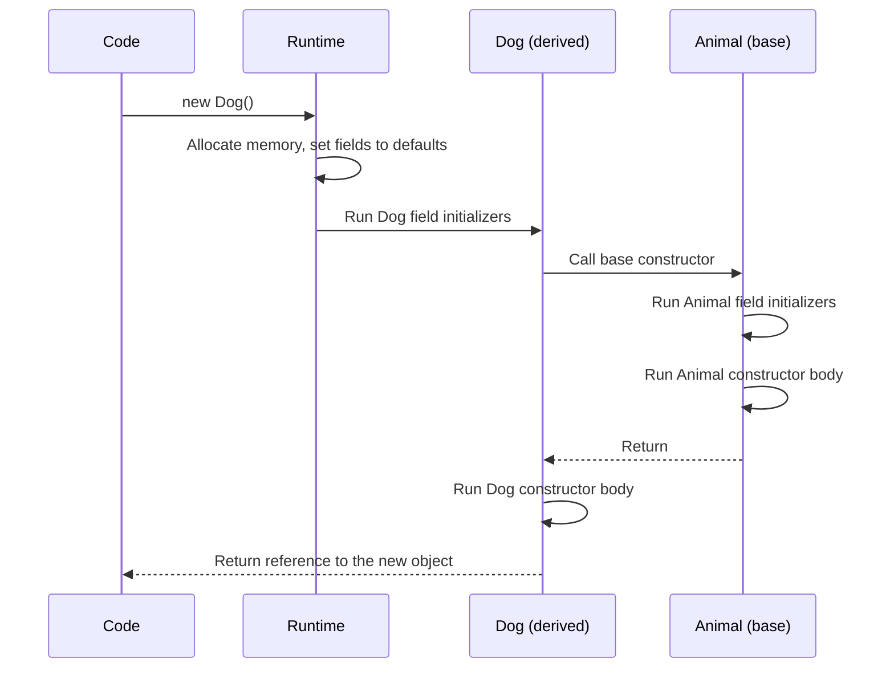
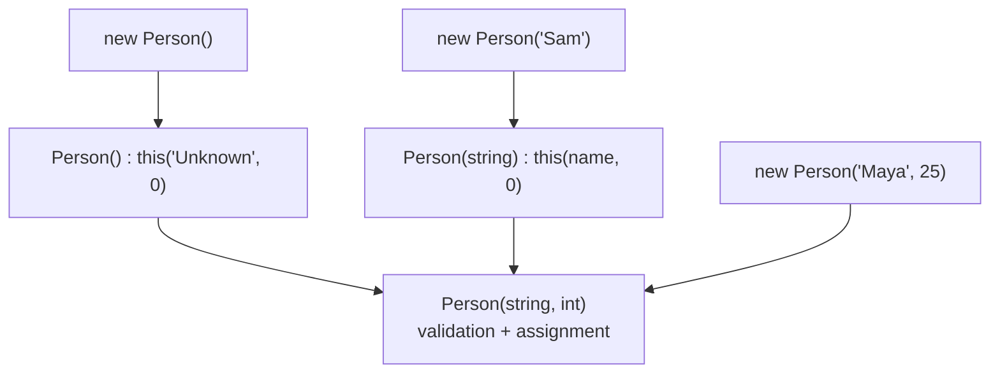
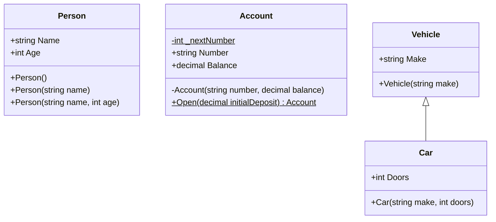

# 07. Constructors

> Learn how objects are born in a valid state: default, parameterized, copy, private and static constructors, constructor chaining with `this` and `base`, and the exact order in which initialization runs.

**Level:** 🟢 Beginner
**Prerequisites:** [06. Methods](../06-methods/README.md)

---

## 📑 In This Chapter

1. What is a Constructor?
2. Default Constructor
3. Parameterized Constructor
4. Copy Constructor Pattern
5. Private Constructor
6. Static Constructor
7. Constructor Chaining
8. `this` and `base` in Constructors
9. Constructor Execution Order
10. Primary Constructors (C# 12)
11. Real-World Example
12. Interview Questions

---

## 🎯 Learning Objectives

By the end of this chapter you will be able to:

- Explain what a constructor is and what it guarantees.
- Know when the compiler generates a default constructor and when it does not.
- Write overloaded, parameterized and copy constructors.
- Use private constructors for factory methods and singletons.
- Use a static constructor to initialize type-level state.
- Chain constructors with `this(...)` and call base constructors with `base(...)`.
- Predict the exact execution order of field initializers and constructors in an inheritance chain.

---

## 📖 Concept

A **constructor** is a special member that runs when an object is created with `new`. Its job is to put the new object into a **valid, usable state**.

```csharp
public class Person
{
    public string Name { get; }

    public Person(string name)      // constructor: same name as the class, no return type
    {
        Name = name;
    }
}

var p = new Person("Sam");          // the constructor runs here
```

| Rule | Detail |
|---|---|
| **Name** | Same as the class |
| **Return type** | None (not even `void`) |
| **Called** | Automatically by `new`; you cannot call it like a method |
| **Overloading** | Allowed (different parameter lists) |
| **Inheritance** | Constructors are **not inherited**; each class defines its own |
| **Access modifiers** | Allowed: `public`, `private`, `protected`, `internal`, etc. |
| **Cannot be** | `virtual`, `abstract`, `override` or `static` (static constructors are a separate kind) |

### Default Constructor

A **default constructor** is a constructor with **no parameters**.

If you declare **no constructors at all**, the compiler generates a parameterless one for you.

```csharp
public class Car
{
    public string Model { get; set; } = "Unknown";
}

var car = new Car();     // ✅ works: the compiler supplied Car()
```

**The trap:** the moment you declare **any** constructor, the compiler **stops** generating the default one.

```csharp
public class Car
{
    public string Model { get; }
    public Car(string model) => Model = model;
}

// var car = new Car();     // ❌ compile error: no parameterless constructor
var car = new Car("Toyota");
```

If you still want `new Car()`, declare it yourself.

> 📝 For an `abstract` class the generated default constructor is `protected`. A `static` class has no instance constructor at all.

### Parameterized Constructor

Takes parameters so callers supply the data needed to create a valid object.

```csharp
public class Rectangle
{
    public double Width { get; }
    public double Height { get; }

    public Rectangle(double width, double height)
    {
        if (width <= 0) throw new ArgumentOutOfRangeException(nameof(width));
        if (height <= 0) throw new ArgumentOutOfRangeException(nameof(height));

        Width = width;
        Height = height;
    }
}

var r = new Rectangle(4, 5);
```

Constructors can be **overloaded**, just like methods:

```csharp
public Rectangle(double side) : this(side, side) { }    // square shortcut
```

Validate input in the constructor so an invalid object can **never exist**.

### Copy Constructor Pattern

C# has **no built-in copy constructor**. The **pattern** is a constructor that takes another instance of the same type and copies its data.

```csharp
public class Playlist
{
    private readonly List<string> _songs;

    public string Name { get; }
    public int Count => _songs.Count;

    public Playlist(string name)
    {
        Name = name;
        _songs = new List<string>();
    }

    public Playlist(Playlist other)                     // copy constructor
    {
        Name = other.Name + " (copy)";
        _songs = new List<string>(other._songs);        // new list: independent of the original
    }

    public void Add(string song) => _songs.Add(song);
}

var original = new Playlist("Focus");
original.Add("Intro");
original.Add("Deep Work");

var copy = new Playlist(original);
copy.Add("Outro");

Console.WriteLine($"{original.Name}: {original.Count}");
Console.WriteLine($"{copy.Name}: {copy.Count}");
```

**Output**

```text
Focus: 2
Focus (copy): 3
```

> ⚠️ **Shallow vs deep copy.** Copying a reference field (`_songs = other._songs`) makes both objects share the same list. Create a **new** collection (and clone nested mutable objects) when you need an independent copy.
> `record` types get a compiler-generated copy constructor used by `with` (see [22. Record vs Class](../22-record-vs-class/README.md)).

### Private Constructor

A `private` constructor **prevents code outside the class from creating instances** directly.

Common uses:

| Use | How |
|---|---|
| **Factory methods** | A `public static` method validates input and calls the private constructor |
| **Singleton** | One shared instance exposed through a static member |
| **Utility types** | Block instantiation (though a `static class` is usually better) |

```csharp
public class AppSettings
{
    public static readonly AppSettings Instance = new AppSettings();   // the only instance

    public string Theme { get; set; } = "Light";

    private AppSettings() { }                                          // nobody else can call this
}

var settings = AppSettings.Instance;
// var other = new AppSettings();      // ❌ constructor is inaccessible
```

> The `static readonly` initializer is run once by the runtime and is thread-safe, which makes this a simple, safe singleton. Use singletons sparingly: they act like global state (see [24. SOLID Principles](../24-solid-principles/README.md)).

### Static Constructor

A **static constructor** initializes **type-level (static) state**. It runs **once**, automatically.

```csharp
public class Logger
{
    private static readonly DateTime _startedAt;

    static Logger()                         // no access modifier, no parameters
    {
        _startedAt = DateTime.UtcNow;
        Console.WriteLine("Logger type initialized.");
    }

    public static void Log(string message) => Console.WriteLine(message);
}
```

Rules:

- **No access modifier** and **no parameters**.
- At most **one** per class.
- You **never call it**; the runtime runs it **before the first instance is created or the first static member is accessed**.
- It runs **at most once** per type (per closed generic type).
- If it throws, the type becomes unusable and a `TypeInitializationException` is thrown.

### Constructor Chaining

**Chaining** lets one constructor call another so the initialization logic lives in **one place**.

- `: this(...)` → call another constructor in the **same** class.
- `: base(...)` → call a constructor in the **base** class.

```csharp
public class Person
{
    public string Name { get; }
    public int Age { get; }

    public Person() : this("Unknown", 0) { }                 // → Person(string, int)
    public Person(string name) : this(name, 0) { }           // → Person(string, int)

    public Person(string name, int age)                      // the one "master" constructor
    {
        ArgumentException.ThrowIfNullOrWhiteSpace(name);
        if (age < 0) throw new ArgumentOutOfRangeException(nameof(age));

        Name = name;
        Age = age;
    }

    public override string ToString() => $"{Name}, {Age}";
}

Console.WriteLine(new Person());
Console.WriteLine(new Person("Sam"));
Console.WriteLine(new Person("Maya", 25));
```

**Output**

```text
Unknown, 0
Sam, 0
Maya, 25
```

### `this` and `base` in Constructors

```csharp
public class Vehicle
{
    public string Make { get; }

    public Vehicle(string make)
    {
        Make = make;
    }
}

public class Car : Vehicle
{
    public int Doors { get; }

    public Car(string make, int doors) : base(make)     // call the base constructor first
    {
        Doors = doors;
    }

    public Car(string make) : this(make, 4) { }         // reuse the other Car constructor
}
```

Important rule: **if the base class has no accessible parameterless constructor, every derived constructor must call `: base(...)` explicitly**, otherwise the code does not compile.

More in [17. `this` Keyword](../17-this-keyword/README.md) and [18. `base` Keyword](../18-base-keyword/README.md).

### Constructor Execution Order

When you run `new Dog()` where `Dog : Animal`:

1. Memory is allocated; all fields are set to **default values**.
2. **Derived class field initializers** run.
3. The **base constructor chain** runs: base field initializers, then the base constructor body (and so on up to `object`).
4. The **derived constructor body** runs.

So: **field initializers run most-derived first; constructor bodies run base first.**

```csharp
public class Animal
{
    private readonly string _animalField = Log("1) Animal field initializer");

    public Animal()
    {
        Console.WriteLine("2) Animal constructor body");
    }

    protected static string Log(string message)
    {
        Console.WriteLine(message);
        return message;
    }
}

public class Dog : Animal
{
    private readonly string _dogField = Log("0) Dog field initializer");

    public Dog()
    {
        Console.WriteLine("3) Dog constructor body");
    }
}

var dog = new Dog();
```

**Output**

```text
0) Dog field initializer
1) Animal field initializer
2) Animal constructor body
3) Dog constructor body
```

With `: this(...)` chaining, field initializers run only once, in the constructor that finally goes on to call `base`.

### Primary Constructors (C# 12)

A class or struct can declare its constructor parameters directly on the type.

```csharp
public class Customer(string name, string email)
{
    public string Name { get; } = name;          // parameters initialize members you declare
    public string Email { get; } = email;

    public string Describe() => $"{name} <{email}>";   // parameters are also in scope in members
}
```

- The parameters are **not** automatically properties or fields.
- If a member uses a parameter directly, the compiler **captures** it into hidden storage.
- For `record` types, primary constructor parameters **do** become properties (see [22. Record vs Class](../22-record-vs-class/README.md)).
- Once you declare a primary constructor, other constructors must chain to it with `: this(...)`.

---

## 🤔 Why It Matters

- Constructors guarantee an object is **never observed half-built**.
- They are the best place to enforce **required data and invariants** (see [08. Encapsulation](../08-encapsulation/README.md)).
- Private constructors and factory methods give you **control over how and how many** objects get created.
- Chaining removes duplicated initialization code.
- Understanding execution order prevents subtle bugs in inheritance hierarchies.
- Constructors are where dependencies are supplied in **dependency injection** (see [12. Interfaces](../12-interfaces/README.md) and [24. SOLID Principles](../24-solid-principles/README.md)).

---

## 🧩 Syntax

```csharp
public class Sample
{
    private static readonly int _typeLevel;

    static Sample()                                  // static constructor
    {
        _typeLevel = 42;
    }

    public Sample() : this("default") { }            // default, chained with this

    public Sample(string name) : base()              // parameterized, explicit base call
    {
        // initialization
    }

    public Sample(Sample other)                      // copy constructor pattern
    {
        // copy data from 'other'
    }

    private Sample(int id, string name) { }          // private constructor
}

public class Derived : Sample
{
    public Derived(string name) : base(name) { }     // pass arguments to the base constructor
}
```

---

## 💻 Basic Example

```csharp
public class Student
{
    public string Name { get; }
    public int Grade { get; private set; }

    public Student(string name) : this(name, 0) { }

    public Student(string name, int grade)
    {
        ArgumentException.ThrowIfNullOrWhiteSpace(name);
        if (grade < 0 || grade > 100)
            throw new ArgumentOutOfRangeException(nameof(grade));

        Name = name;
        Grade = grade;
    }

    public void Print() => Console.WriteLine($"{Name}: {Grade}");
}

new Student("Alice").Print();
new Student("Bob", 85).Print();

try
{
    var invalid = new Student("Eve", 150);
}
catch (ArgumentOutOfRangeException)
{
    Console.WriteLine("Invalid grade: object was never created.");
}
```

**Output**

```text
Alice: 0
Bob: 85
Invalid grade: object was never created.
```

---

## 🌍 Real-World Example

An `Account` that combines a **static constructor**, a **private constructor** and a **static factory method**.

```csharp
public class Account
{
    private static int _nextNumber;

    static Account()                                        // runs once, before first use
    {
        _nextNumber = 1000;
        Console.WriteLine("Static constructor ran (once).");
    }

    public string Number { get; }
    public decimal Balance { get; private set; }

    private Account(string number, decimal balance)         // only Account can call this
    {
        Number = number;
        Balance = balance;
    }

    public static Account Open(decimal initialDeposit)      // the public way to create accounts
    {
        if (initialDeposit < 0)
            throw new ArgumentOutOfRangeException(nameof(initialDeposit));

        return new Account($"ACC-{_nextNumber++}", initialDeposit);
    }
}

var a = Account.Open(100m);
var b = Account.Open(250m);

Console.WriteLine($"{a.Number}: {a.Balance:F2}");
Console.WriteLine($"{b.Number}: {b.Balance:F2}");

// var c = new Account("X", 0);     // ❌ compile error: constructor is private
```

**Output**

```text
Static constructor ran (once).
ACC-1000: 100.00
ACC-1001: 250.00
```

Callers cannot bypass validation or invent account numbers; the class controls every creation path.

---

## 🧠 How It Works

### What `new` does, step by step



### Calling virtual members from a constructor is dangerous

During construction, a virtual call dispatches to the **most derived override**, even though the derived constructor body **has not run yet**.

```csharp
public class Base
{
    public Base() => Show();                 // ⚠️ virtual call in constructor
    public virtual void Show() { }
}

public class Derived : Base
{
    private string _text = "ready";          // initializer runs before Base()
    private string? _set;                    // assigned in the constructor body, so still null here

    public Derived() => _set = "done";

    public override void Show() => Console.WriteLine(_set ?? "not initialized yet");
}

new Derived();      // prints: not initialized yet
```

Avoid calling `virtual`/`abstract` members from constructors.

### Static initialization

- Static field initializers and the static constructor run **once**, **before first use** of the type.
- With an **explicit static constructor**, the runtime guarantees it runs right before the first instance is created or the first static member is accessed.
- Without one, the runtime may run static field initializers somewhat earlier, but still before first access.
- Static initializers run in **textual order**; do not make one depend on a later one.

### Constructor chaining flow



---

## 📊 Diagram



*(Larger diagrams live in [`/diagrams`](../diagrams).)*

---

## ⚔️ Important Comparisons

### Constructor vs method

| Aspect | Constructor | Method |
|---|---|---|
| **Name** | Same as class | Any name |
| **Return type** | None | Required (`void` or a type) |
| **Called** | Automatically via `new` | Explicitly by name |
| **Purpose** | Initialize a new object | Perform behavior |
| **Inherited** | ❌ | ✅ (if accessible) |
| **Can be `virtual`** | ❌ | ✅ |

### Instance vs static constructor

| Aspect | Instance constructor | Static constructor |
|---|---|---|
| **Runs** | Every time `new` is used | Once per type |
| **Parameters** | Allowed | ❌ None |
| **Access modifier** | Allowed | ❌ None |
| **Initializes** | Instance state | Static state |
| **Called by** | `new` | The runtime, automatically |
| **How many** | Many (overloads) | At most one |

### `this(...)` vs `base(...)`

| | `: this(...)` | `: base(...)` |
|---|---|---|
| **Calls** | Another constructor of the same class | A constructor of the base class |
| **Purpose** | Reuse initialization logic | Initialize the inherited part |
| **Default if omitted** | n/a | `: base()` is added implicitly |

### Constructor vs object initializer

| Aspect | Constructor | Object initializer |
|---|---|---|
| **Syntax** | `new Person("Sam", 30)` | `new Person { Name = "Sam", Age = 30 }` |
| **Can enforce required data** | ✅ | Only with `required` members |
| **Works with get-only properties** | ✅ | ❌ (needs `set` or `init`) |
| **Runs validation logic** | ✅ (in constructor) | Through setters only |
| **Runs after the constructor** | n/a | ✅ |

---

## ⚠️ Common Mistakes

1. ❌ **Forgetting the default constructor** after adding a parameterized one. `new Car()` stops compiling (and some serializers/frameworks need it). Fix: add an explicit parameterless constructor if it is needed.
2. ❌ **Base class without a parameterless constructor.** Derived constructors fail to compile. Fix: call `: base(args)` explicitly.
3. ❌ **Calling virtual methods in a constructor.** An override can run before the derived object is ready. Fix: avoid it, or use a separate initialization step.
4. ❌ **Duplicating initialization code** across overloads. Fix: chain with `: this(...)` to one master constructor.
5. ❌ **Shallow copy in a copy constructor.** Both objects share the same mutable list. Fix: create new collections and clone nested mutable objects.
6. ❌ **Putting an access modifier or parameters on a static constructor.** Not allowed. Fix: `static ClassName() { }` only.
7. ❌ **Throwing from a static constructor.** The type becomes permanently unusable (`TypeInitializationException`). Fix: keep static initialization simple and safe.
8. ❌ **Heavy work in constructors** (I/O, network calls, long computations). It makes objects slow and hard to test. Fix: keep constructors light; use factory methods or explicit methods for heavy work.
9. ❌ **Circular chaining** (`A() : this(1)` and `A(int) : this()`). Compile error. Fix: chain toward one master constructor.
10. ❌ **Adding a return type to a "constructor".** `public void Person()` is just a method. Fix: no return type.
11. ❌ **Assuming constructors are inherited.** Each derived class must declare its own. Fix: declare them and pass arguments to `base(...)`.
12. ❌ **Letting a constructor leave the object invalid** (unassigned required fields, no validation). Fix: validate arguments and assign every required member.

---

## ✅ Best Practices

- Make constructors guarantee a **valid object**: validate arguments, assign all required state.
- Use **one master constructor** and chain the others to it.
- Keep constructors **fast and side-effect free**.
- Use **`readonly` fields and get-only/`init` properties** assigned in constructors for immutability.
- Use a **private constructor + static factory** when creation can fail, needs a descriptive name (`Open`, `FromJson`), or must be controlled.
- Make constructors of **abstract classes `protected`**.
- Do **not call virtual members** from constructors.
- Inject **dependencies through the constructor** instead of creating them inside the class.
- Use guard helpers such as `ArgumentNullException.ThrowIfNull(...)` and `ArgumentException.ThrowIfNullOrWhiteSpace(...)` (.NET 6+/.NET 8+).
- Keep **static constructors** minimal and exception-free.
- Limit parameters; group related values into a type when a constructor needs many.

---

## 🎯 Interview Questions

<details>
<summary><b>Q1. What is a constructor?</b></summary>

A special member with the same name as its class and no return type that runs automatically when an object is created with `new`. Its purpose is to initialize the object into a valid state.

</details>

<details>
<summary><b>Q2. When does the compiler generate a default constructor?</b></summary>

Only when the class declares **no** constructors. As soon as you declare any constructor, the compiler no longer generates the parameterless one.

</details>

<details>
<summary><b>Q3. Can constructors be overloaded?</b></summary>

Yes. A class can have multiple constructors as long as their parameter lists differ.

</details>

<details>
<summary><b>Q4. Does C# have copy constructors?</b></summary>

Not as a built-in language feature. A copy constructor is a **pattern**: a constructor that accepts an instance of the same type and copies its data. Records get a compiler-generated copy constructor that supports `with`.

</details>

<details>
<summary><b>Q5. What is a private constructor and why use it?</b></summary>

A constructor only accessible inside the class. It is used to force creation through static factory methods, to implement singletons, or to prevent instantiation.

</details>

<details>
<summary><b>Q6. What is a static constructor and what are its rules?</b></summary>

A constructor that initializes static state. It has no access modifier and no parameters, a class can have only one, it is called automatically by the runtime exactly once before the first instance is created or static member accessed, and an exception inside it results in a `TypeInitializationException`.

</details>

<details>
<summary><b>Q7. What is constructor chaining?</b></summary>

One constructor calling another using `: this(...)` (same class) or `: base(...)` (base class), so initialization logic is written once.

</details>

<details>
<summary><b>Q8. In what order do field initializers and constructors run in an inheritance chain?</b></summary>

Fields are set to defaults, then the derived class's field initializers run, then the base constructor chain runs (base field initializers, then base constructor body), and finally the derived constructor body runs.

</details>

<details>
<summary><b>Q9. Are constructors inherited?</b></summary>

No. A derived class must define its own constructors and use `: base(...)` to invoke the appropriate base constructor.

</details>

<details>
<summary><b>Q10. What happens if the base class has no parameterless constructor?</b></summary>

Each derived constructor must explicitly call a base constructor with `: base(...)`, otherwise the code does not compile.

</details>

<details>
<summary><b>Q11. Why should you avoid calling virtual methods in a constructor?</b></summary>

The call is dispatched to the most derived override, which may run before the derived class's constructor body has initialized its state, leading to unexpected behavior.

</details>

<details>
<summary><b>Q12. Can a constructor be `virtual`, `abstract` or `static`?</b></summary>

No for `virtual` and `abstract`. A **static constructor** is a distinct feature for type initialization, but an instance constructor cannot be static.

</details>

<details>
<summary><b>Q13. What is the difference between a constructor and an object initializer?</b></summary>

A constructor is code that runs during creation and can enforce rules. An object initializer sets accessible properties or fields after the constructor has finished. Initializers need settable (`set` or `init`) members; `required` can force callers to provide values.

</details>

---

## 📝 Practice Problems

| # | Problem | Difficulty | Solution |
|:-:|---|:-:|:-:|
| 1 | Create a `Book` class with a constructor taking `title` and `author`. Reject empty values. | 🟢 | [View →](../solutions/07-constructors/) |
| 2 | Add a parameterless constructor to `Book` that chains to the main one with default values. | 🟢 | [View →](../solutions/07-constructors/) |
| 3 | Show that adding a parameterized constructor removes the compiler's default constructor. Fix the error two ways. | 🟢 | [View →](../solutions/07-constructors/) |
| 4 | Write a copy constructor for a `ShoppingCart` that contains a list of items. Prove the copy is independent. | 🟡 | [View →](../solutions/07-constructors/) |
| 5 | Create a singleton `Configuration` class using a private constructor. Prove only one instance exists. | 🟡 | [View →](../solutions/07-constructors/) |
| 6 | Add a static constructor with a `Console.WriteLine` and show it runs only once, even after many objects are created. | 🟡 | [View →](../solutions/07-constructors/) |
| 7 | Build `Employee : Person` where `Person` has only a parameterized constructor. Use `: base(...)` correctly. | 🟡 | [View →](../solutions/07-constructors/) |
| 8 | Create a three-level hierarchy (`A`, `B : A`, `C : B`) where each class has a field initializer and a constructor that print messages. Predict then verify the output order. | 🟠 | [View →](../solutions/07-constructors/) |
| 9 | Build an `Email` class with a private constructor and a `static Email Create(string address)` factory that validates the address format. | 🟠 | [View →](../solutions/07-constructors/) |
| 10 | Demonstrate the danger of calling a virtual method from a base constructor, then refactor to avoid it. | 🟠 | [View →](../solutions/07-constructors/) |

Starter files: [`/exercises/07-constructors`](../exercises/07-constructors/)

---

## 🔑 Key Takeaways

- A **constructor** initializes a new object into a valid state; it has the class name and no return type.
- The compiler provides a **default constructor only if you declare none**.
- **Overload** constructors and **chain** them with `: this(...)` to keep logic in one place.
- C# has **no built-in copy constructor**; write one as a pattern and beware of shallow copies.
- A **private constructor** controls creation (factories, singletons).
- A **static constructor** runs once, takes no parameters or modifiers, and initializes static state.
- Constructors are **not inherited**; use `: base(...)` to initialize the base part.
- **Execution order:** derived field initializers → base initializers → base constructor body → derived constructor body.
- Never call **virtual members** from constructors.

---

[⬅ Previous: Methods](../06-methods/README.md)
&nbsp;&nbsp;•&nbsp;&nbsp;
[🏠 Main README](../README.md)
&nbsp;&nbsp;•&nbsp;&nbsp;
[Next: Encapsulation ➡](../08-encapsulation/README.md)