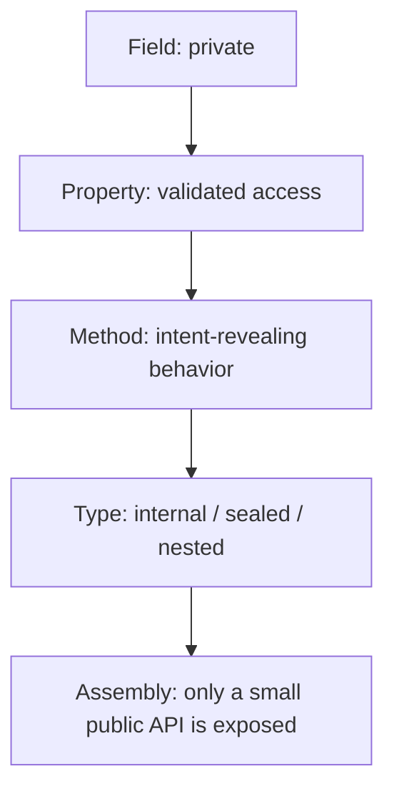
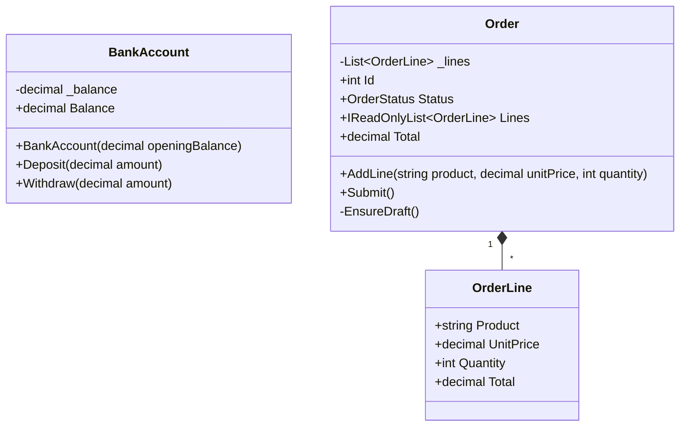
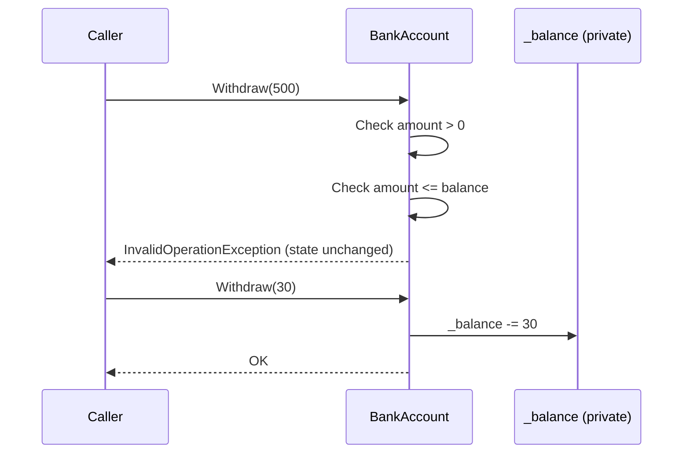

# 08. Encapsulation

> Learn how to protect an object's state and rules: data hiding, access control, private fields, properties, validation, and invariants.

**Level:** 🟡 Core OOP
**Prerequisites:** [04. Fields](../04-fields/README.md), [05. Properties](../05-properties/README.md), [07. Constructors](../07-constructors/README.md)

---

## 📑 In This Chapter

1. What is Encapsulation?
2. Data Hiding
3. Access Control
4. Private Fields
5. Properties as Controlled Access
6. Validation
7. Invariants
8. Behavior Over Setters
9. Encapsulating Collections
10. Immutability
11. Encapsulation vs Abstraction
12. Real-World Example
13. Interview Questions

---

## 🎯 Learning Objectives

By the end of this chapter you will be able to:

- Define encapsulation as **bundling** data with behavior and **restricting** direct access to internal state.
- Hide fields and expose a small, controlled public surface.
- Choose appropriate access levels for members.
- Enforce validation and **invariants** at every entry point.
- Recognize and fix leaky encapsulation (public setters, exposed collections, shared mutable references).
- Explain the difference between encapsulation and abstraction.

---

## 📖 Concept

**Encapsulation** has two parts that work together:

1. **Bundling:** data and the code that operates on it live in the same unit (the class).
2. **Hiding:** the internal state and implementation details are **not directly accessible**; outsiders use a **controlled public interface** (methods and properties).

The goal is for an object to **protect its own correctness**: no outside code can put it into an invalid state.

### Without vs with encapsulation

```csharp
// ❌ No encapsulation: anyone can break the object
public class BadAccount
{
    public decimal Balance;                   // public field
}

var bad = new BadAccount();
bad.Balance = -1_000_000m;                    // nothing stops this
```

```csharp
// ✅ Encapsulated: state is private, rules live inside the class
public class BankAccount
{
    private decimal _balance;                 // hidden

    public decimal Balance => _balance;       // read-only view

    public void Deposit(decimal amount)
    {
        if (amount <= 0) throw new ArgumentOutOfRangeException(nameof(amount));
        _balance += amount;
    }
}
```

### Data Hiding

**Data hiding** (information hiding) means internal data is kept `private`. Other code cannot read or write it directly; it can only ask the object to do something.

| Hidden (implementation) | Exposed (interface) |
|---|---|
| `private decimal _balance;` | `Deposit(...)`, `Withdraw(...)`, `Balance` (read-only) |
| `private List<OrderLine> _lines;` | `AddLine(...)`, `Lines` (read-only view) |
| Validation helpers, caching, storage format | Behavior the caller actually needs |

Because the internals are hidden, you can **change them later** (new storage, caching, different algorithm) without breaking callers.

### Access Control

C# access modifiers decide **who can see** a member. (Full details in [16. Access Modifiers](../16-access-modifiers/README.md).)

| Modifier | Visible to |
|---|---|
| `private` | The declaring class only (**default for members**) |
| `protected` | The class and its derived classes |
| `internal` | The same assembly |
| `public` | Everyone |
| `protected internal` / `private protected` | Combinations of the above |

**Rule of thumb:** use the **most restrictive** access that still lets the code work. Start with `private`, widen only when there is a reason.

### Private Fields

State is stored in **private fields** (see [04. Fields](../04-fields/README.md)). Convention: `_camelCase`.

```csharp
public class Thermostat
{
    private double _targetCelsius = 21;          // internal detail
}
```

Public fields are the opposite of encapsulation: they are part of your public contract and cannot validate anything.

### Properties as Controlled Access

Properties (see [05. Properties](../05-properties/README.md)) are the standard gateway to state. Choose the **narrowest** form that fits:

| Need | Use |
|---|---|
| Read only from outside | `{ get; }` or `{ get; private set; }` |
| Set only at creation | `{ get; init; }` |
| Callers may change it, with rules | Full property with validation |
| Derived value | Computed property (`=>`) |

### Validation

Validate **before** changing state. Reject bad input immediately.

```csharp
public class Thermostat
{
    private double _targetCelsius = 21;

    public double TargetCelsius
    {
        get => _targetCelsius;
        set
        {
            if (value < 5 || value > 30)
                throw new ArgumentOutOfRangeException(nameof(value), "Target must be between 5 and 30 °C.");
            _targetCelsius = value;
        }
    }
}
```

### Invariants

An **invariant** is a condition that must be **true for every valid instance, at all times** (outside of a method's brief internal work).

| Class | Example invariants |
|---|---|
| `BankAccount` | Balance is never negative; amounts are positive |
| `DateRange` | `Start <= End` |
| `Order` | Cannot contain zero-quantity lines; cannot change after submission |
| `Email` | Always contains a valid address format |

**The class owns its invariants.** They must be enforced at **every** place state can change:

```text
Constructor ──┐
Setters      ─┤──►  all must preserve the invariants
Methods      ─┘
```

If even one entry point skips the check, the invariant is not guaranteed.

### Behavior Over Setters

Exposing a setter for every field (`SetBalance`, `{ get; set; }` everywhere) is **encapsulation in name only**: callers still make all the decisions and can break rules. Prefer **methods that express intent** and apply the rules themselves ("Tell, Don't Ask").

```csharp
// ❌ Caller decides and can get it wrong
account.Balance = account.Balance - 50;

// ✅ Object applies the rules
account.Withdraw(50);
```

### Encapsulating Collections

Returning your internal collection hands callers the keys to your state.

```csharp
// ❌ Leaks the list: callers can Add/Remove/Clear freely
public List<string> Members { get; } = new();

// ✅ Keeps control
private readonly List<string> _members = new();

public IReadOnlyList<string> Members => _members.AsReadOnly();

public void AddMember(string name)
{
    ArgumentException.ThrowIfNullOrWhiteSpace(name);
    _members.Add(name);
}
```

Also **copy incoming collections** (a *defensive copy*), otherwise the caller keeps a reference and can change your state later:

```csharp
public class Team
{
    private readonly List<string> _members;

    public Team(IEnumerable<string> members)
    {
        _members = new List<string>(members);          // defensive copy
    }

    public IReadOnlyList<string> Members => _members.AsReadOnly();
}
```

### Immutability

The strongest form of encapsulation: state **cannot change after creation**, so invariants checked in the constructor stay true forever.

```csharp
public class Money
{
    public decimal Amount { get; }
    public string Currency { get; }

    public Money(decimal amount, string currency)
    {
        if (amount < 0) throw new ArgumentOutOfRangeException(nameof(amount));
        ArgumentException.ThrowIfNullOrWhiteSpace(currency);

        Amount = amount;
        Currency = currency;
    }

    public Money Add(Money other)
    {
        if (other.Currency != Currency)
            throw new InvalidOperationException("Currency mismatch.");
        return new Money(Amount + other.Amount, Currency);     // new object, original unchanged
    }
}
```

Immutable objects are also naturally safe to share and to use across threads. (See [22. Record vs Class](../22-record-vs-class/README.md).)

### Encapsulation vs Abstraction

They are related but different ideas:

| | **Encapsulation** | **Abstraction** |
|---|---|---|
| **Focus** | Protecting **state** and rules | Hiding **complexity**, exposing essentials |
| **Question answered** | "How do I stop outsiders breaking my data?" | "What does the caller need to know?" |
| **Achieved with** | Access modifiers, private fields, validation, properties | Abstract classes, interfaces, well-chosen public APIs |
| **Result** | Object is always valid | Simple, stable view of a complex thing |
| **Chapter** | This chapter | [11. Abstraction](../11-abstraction/README.md) |

---

## 🤔 Why It Matters

- **Correctness:** invalid states become impossible, so entire categories of bugs disappear.
- **Maintainability:** internals can change without touching callers.
- **Debugging:** if state is wrong, only the class's own code could have changed it.
- **Safety in teams:** other developers cannot misuse your class in ways you did not intend.
- **Testability:** behavior is tested through a small public surface.

---

## 🧩 Syntax

```csharp
public class Sample
{
    private int _value;                          // hidden state

    public int Value                             // controlled access with validation
    {
        get => _value;
        set
        {
            if (value < 0) throw new ArgumentOutOfRangeException(nameof(value));
            _value = value;
        }
    }

    public int Id { get; }                       // read-only from outside
    public string Status { get; private set; } = "New";   // only the class changes it
    public string Name { get; init; } = "";      // set only during creation

    private readonly List<string> _items = new();                     // hidden collection
    public IReadOnlyList<string> Items => _items.AsReadOnly();        // read-only view

    public Sample(int id) => Id = id;

    public void DoSomething() { /* behavior that applies the rules */ }
}
```

---

## 💻 Basic Example

```csharp
public class BankAccount
{
    private decimal _balance;                                 // hidden state

    public decimal Balance => _balance;                       // read-only exposure

    public BankAccount(decimal openingBalance)
    {
        if (openingBalance < 0)
            throw new ArgumentOutOfRangeException(nameof(openingBalance));
        _balance = openingBalance;                            // invariant: balance >= 0
    }

    public void Deposit(decimal amount)
    {
        if (amount <= 0)
            throw new ArgumentOutOfRangeException(nameof(amount));
        _balance += amount;
    }

    public void Withdraw(decimal amount)
    {
        if (amount <= 0)
            throw new ArgumentOutOfRangeException(nameof(amount));
        if (amount > _balance)
            throw new InvalidOperationException("Insufficient funds.");
        _balance -= amount;
    }
}

var account = new BankAccount(100m);
account.Deposit(50m);
account.Withdraw(30m);
Console.WriteLine($"Balance: {account.Balance:F2}");

try
{
    account.Withdraw(500m);
}
catch (InvalidOperationException ex)
{
    Console.WriteLine(ex.Message);
}

Console.WriteLine($"Balance: {account.Balance:F2}");
```

**Output**

```text
Balance: 120.00
Insufficient funds.
Balance: 120.00
```

The failed withdrawal changed nothing: the invariant `balance >= 0` held the whole time.

---

## 🌍 Real-World Example

An `Order` that protects its lifecycle rules, its lines, and its total.

```csharp
public enum OrderStatus
{
    Draft,
    Submitted
}

public class OrderLine
{
    public string Product { get; }
    public decimal UnitPrice { get; }
    public int Quantity { get; }
    public decimal Total => UnitPrice * Quantity;

    public OrderLine(string product, decimal unitPrice, int quantity)
    {
        ArgumentException.ThrowIfNullOrWhiteSpace(product);
        if (unitPrice < 0) throw new ArgumentOutOfRangeException(nameof(unitPrice));
        if (quantity <= 0) throw new ArgumentOutOfRangeException(nameof(quantity));

        Product = product;
        UnitPrice = unitPrice;
        Quantity = quantity;
    }
}

public class Order
{
    private readonly List<OrderLine> _lines = new();

    public int Id { get; }
    public OrderStatus Status { get; private set; } = OrderStatus.Draft;
    public IReadOnlyList<OrderLine> Lines => _lines.AsReadOnly();

    public decimal Total
    {
        get
        {
            decimal total = 0m;
            foreach (var line in _lines)
                total += line.Total;
            return total;
        }
    }

    public Order(int id) => Id = id;

    public void AddLine(string product, decimal unitPrice, int quantity)
    {
        EnsureDraft();
        _lines.Add(new OrderLine(product, unitPrice, quantity));
    }

    public void Submit()
    {
        EnsureDraft();
        if (_lines.Count == 0)
            throw new InvalidOperationException("Cannot submit an empty order.");
        Status = OrderStatus.Submitted;
    }

    private void EnsureDraft()
    {
        if (Status != OrderStatus.Draft)
            throw new InvalidOperationException("Cannot modify a submitted order.");
    }
}

var order = new Order(1);
order.AddLine("Pen", 2.50m, 4);
order.AddLine("Notebook", 6.00m, 2);
order.Submit();

Console.WriteLine($"Order #{order.Id} {order.Status}: {order.Total:F2}");

try
{
    order.AddLine("Eraser", 1.00m, 1);
}
catch (InvalidOperationException ex)
{
    Console.WriteLine(ex.Message);
}

// order.Lines.Add(...)     // ❌ does not compile: IReadOnlyList has no Add
// order.Status = ...       // ❌ does not compile: setter is private
```

**Output**

```text
Order #1 Submitted: 22.00
Cannot modify a submitted order.
```

Outside code can never create a negative quantity, skip the submit rule, edit a submitted order, or tamper with the list of lines. The private `EnsureDraft` helper is hidden implementation detail.

---

## 🧠 How It Works

### Where the protection comes from

The compiler **enforces accessibility**: code outside the class cannot name a `private` member, so the **only** way in is the public interface, and that interface is written to preserve the invariants.

```text
 Outside code
      │   can only call
      ▼
┌──────────────────────────────┐
│  Public interface            │
│  Deposit() Withdraw() Balance│
├──────────────────────────────┤   ← validation + rules live here
│  Private state               │
│  _balance                    │
└──────────────────────────────┘
```

### Cross-property invariants need a single entry point

Per-property setters cannot protect rules that involve **several** values.

```csharp
// ❌ Each setter looks fine, but the pair can become invalid
public DateOnly CheckIn  { get; set; }
public DateOnly CheckOut { get; set; }       // CheckOut < CheckIn is possible
```

```csharp
// ✅ One method changes both together and checks the combined rule
public class Reservation
{
    public DateOnly CheckIn { get; private set; }
    public DateOnly CheckOut { get; private set; }

    public Reservation(DateOnly checkIn, DateOnly checkOut)
    {
        EnsureValid(checkIn, checkOut);
        CheckIn = checkIn;
        CheckOut = checkOut;
    }

    public void Reschedule(DateOnly checkIn, DateOnly checkOut)
    {
        EnsureValid(checkIn, checkOut);          // validate first, then change both
        CheckIn = checkIn;
        CheckOut = checkOut;
    }

    private static void EnsureValid(DateOnly checkIn, DateOnly checkOut)
    {
        if (checkOut <= checkIn)
            throw new ArgumentException("Check-out must be after check-in.");
    }
}
```

### Read-only view vs snapshot

- `_lines.AsReadOnly()` returns a **read-only wrapper over the same list**. Callers cannot modify it, but they **see later changes** the owner makes.
- If you need a **frozen copy**, return `_lines.ToArray()` (or `new List<T>(_lines)`).
- Returning the raw `_lines` typed as `IReadOnlyList<T>` looks safe, but a caller could **cast it back to `List<T>`** and modify it. The wrapper from `AsReadOnly()` prevents that. (Chapter 05 used the simpler form to introduce the idea.)

### Leaking mutable references

```csharp
public class Employee
{
    private readonly Address _address;                 // Address is a mutable class

    public Employee(Address address) => _address = address;

    public Address GetAddress() => _address;           // ❌ caller can mutate Employee's internals
}
```

Fix by returning a **copy**, returning an **immutable** type, or exposing only the needed values.

### `private` is a design boundary, not a security boundary

Reflection and unsafe code can bypass `private`. Encapsulation protects against **accidental misuse and bad design**, not against a determined attacker running in the same process.

### Levels of encapsulation



---

## 📊 Diagram





*(Larger diagrams live in [`/diagrams`](../diagrams).)*

---

## ⚔️ Important Comparisons

### Encapsulated vs not

| Aspect | Not encapsulated | Encapsulated |
|---|---|---|
| **Fields** | `public` | `private` |
| **Changing state** | Anyone, any time | Only through validated members |
| **Validation** | Scattered in callers (or missing) | Centralized in the class |
| **Invariants** | Cannot be guaranteed | Guaranteed |
| **Changing internals later** | Breaks callers | Safe |
| **Collections** | Raw list exposed | Read-only view + methods |

### Property styles and what they protect

| Style | Outside can read | Outside can write | Protects |
|---|:-:|:-:|---|
| `public int X;` (field) | ✅ | ✅ | Nothing |
| `{ get; set; }` | ✅ | ✅ | Nothing (just a field in disguise) |
| `{ get; set; }` + validation | ✅ | ✅ (validated) | Single-value rules |
| `{ get; private set; }` | ✅ | ❌ | Controlled changes via methods |
| `{ get; init; }` | ✅ | Only at creation | Immutability after creation |
| `{ get; }` | ✅ | ❌ (constructor only) | Immutability |

### Encapsulation vs information hiding vs abstraction

| Concept | Meaning |
|---|---|
| **Encapsulation** | Bundling data + behavior and controlling access to it |
| **Information hiding** | Design principle: hide decisions likely to change (the "why" behind private members) |
| **Abstraction** | Presenting only what is essential to the caller |

---

## ⚠️ Common Mistakes

1. ❌ **Public fields.** They expose state with no protection. Fix: `private` fields plus properties or methods.
2. ❌ **`{ get; set; }` on everything.** It is a public field with extra syntax. Fix: use `private set`, `init`, or read-only, and add behavior methods.
3. ❌ **Exposing the internal collection** (`public List<T> Items { get; }`). Callers can bypass your rules. Fix: private list + `IReadOnlyList<T>` via `AsReadOnly()` + `Add...` methods.
4. ❌ **Not copying incoming collections or mutable objects.** The caller keeps a reference and changes your state later. Fix: defensive copy in the constructor/method.
5. ❌ **Returning internal mutable objects.** Same leak in reverse. Fix: return a copy, an immutable type, or just the needed values.
6. ❌ **Validating in only one place.** A setter validates, but the constructor assigns the field directly. Fix: route all assignments through the same validation (for example, constructor assigns through the property or a shared helper).
7. ❌ **Cross-property rules enforced by independent setters.** `Start`/`End` can become inconsistent. Fix: one method that changes them together, or immutability.
8. ❌ **Temporal coupling.** Object is invalid until `Initialize()` is called. Fix: require everything in the constructor, or use a factory.
9. ❌ **Changing state before validating.** An exception leaves the object half-modified. Fix: validate first, then assign.
10. ❌ **Treating `private` as security.** Reflection can read private members. Fix: use proper security measures for sensitive data.
11. ❌ **Over-encapsulating trivial data holders** with ceremony that adds nothing. Fix: for simple data transfer objects, use plain `init` properties or a `record`.

---

## ✅ Best Practices

- Keep **fields private**; start every member as `private` and widen only when needed.
- Define each class's **invariants** explicitly and enforce them in **constructors, setters and methods**.
- Prefer **intent-revealing methods** (`Withdraw`, `Submit`) over exposing setters.
- **Validate first, then change** state.
- Expose collections as **read-only views** and add explicit `Add`/`Remove` methods.
- Make **defensive copies** of mutable inputs and outputs.
- Prefer **immutable** designs (`readonly`, get-only, `init`) wherever practical.
- Use **`private set`** or **`init`** instead of public setters.
- Keep **helpers `private`** (like `EnsureDraft`) so the public surface stays small.
- Use `internal`/`sealed` to limit what other assemblies can see or extend.
- Throw **clear exceptions** (`ArgumentOutOfRangeException`, `InvalidOperationException`) with helpful messages.

---

## 🎯 Interview Questions

<details>
<summary><b>Q1. What is encapsulation?</b></summary>

Encapsulation is bundling data and the methods that operate on it in one class and restricting direct access to the internal state, so the object is accessed only through a controlled public interface that protects its rules.

</details>

<details>
<summary><b>Q2. How do you achieve encapsulation in C#?</b></summary>

By making fields `private`, exposing state through properties and methods, using access modifiers appropriately, validating input in constructors, setters and methods, and using read-only/`init`/`private set` where outside code should not modify values.

</details>

<details>
<summary><b>Q3. What is data hiding?</b></summary>

Keeping the internal data and implementation of a class inaccessible from outside code, so it can be changed freely and cannot be misused directly.

</details>

<details>
<summary><b>Q4. Why are public fields discouraged?</b></summary>

They allow any code to set any value without validation, cannot enforce invariants, and become part of the public contract. Changing a field to a property later is a breaking change.

</details>

<details>
<summary><b>Q5. Are auto-properties (`{ get; set; }`) encapsulation?</b></summary>

Not by themselves. A public auto-property with a public setter is effectively a public field. Encapsulation comes from restricting access (`private set`, `init`), adding validation, and exposing behavior methods.

</details>

<details>
<summary><b>Q6. What is an invariant?</b></summary>

A condition that must always hold for a valid object, such as "balance is never negative" or "start date is before end date". The class is responsible for enforcing it at every point where state can change.

</details>

<details>
<summary><b>Q7. What is the difference between encapsulation and abstraction?</b></summary>

Encapsulation protects an object's state and rules by hiding internals and controlling access. Abstraction hides complexity by exposing only the essential behavior to the caller, typically via abstract classes, interfaces, or a well-designed public API.

</details>

<details>
<summary><b>Q8. How do you safely expose a collection from a class?</b></summary>

Keep the collection private, expose it as a read-only view (for example `IReadOnlyList<T>` returned through `AsReadOnly()`), and provide methods such as `Add` or `Remove` that enforce the class's rules. Copy incoming collections defensively.

</details>

<details>
<summary><b>Q9. What is a defensive copy?</b></summary>

Copying a mutable object or collection when receiving it or returning it, so outside code holding the original reference cannot change the class's internal state.

</details>

<details>
<summary><b>Q10. Does `readonly` guarantee encapsulation?</b></summary>

No. It prevents reassigning the field but not mutating the object it refers to. A `readonly List<T>` can still be modified unless the list itself is not exposed.

</details>

<details>
<summary><b>Q11. How do you protect an invariant that involves two properties?</b></summary>

Avoid independent public setters. Change both values through a single method (or the constructor) that validates the combination first, or make the object immutable.

</details>

<details>
<summary><b>Q12. Is `private` a security feature?</b></summary>

No. It is a compile-time design boundary. Reflection and other mechanisms can access private members at runtime, so it does not protect secrets.

</details>

<details>
<summary><b>Q13. What are the benefits of encapsulation?</b></summary>

Guaranteed object validity, easier maintenance and refactoring (callers are insulated from internal changes), simpler debugging, safer collaboration, and easier testing through a small public surface.

</details>

---

## 📝 Practice Problems

| # | Problem | Difficulty | Solution |
|:-:|---|:-:|:-:|
| 1 | Refactor a class with a `public decimal Balance;` field into an encapsulated `BankAccount` with `Deposit` and `Withdraw`. | 🟢 | [View →](../solutions/08-encapsulation/) |
| 2 | Create a `Student` class where `Grade` must be between 0 and 100 and cannot be set directly to an invalid value. | 🟢 | [View →](../solutions/08-encapsulation/) |
| 3 | Create a `Thermostat` with a validated `TargetCelsius` property and a read-only `CurrentCelsius`. | 🟢 | [View →](../solutions/08-encapsulation/) |
| 4 | Build a `Team` class that exposes members as a read-only view and provides `AddMember`/`RemoveMember`. Show callers cannot modify the list directly. | 🟡 | [View →](../solutions/08-encapsulation/) |
| 5 | Write a `Team` constructor that takes a list and demonstrate the bug without a defensive copy, then fix it. | 🟡 | [View →](../solutions/08-encapsulation/) |
| 6 | Create an immutable `Money` class and a method `Add` that returns a new instance. | 🟡 | [View →](../solutions/08-encapsulation/) |
| 7 | Create a `Reservation` whose `CheckIn`/`CheckOut` can only change together via `Reschedule`. | 🟡 | [View →](../solutions/08-encapsulation/) |
| 8 | Build a `Password` class that never exposes the raw value, only `Verify(string attempt)`. | 🟡 | [View →](../solutions/08-encapsulation/) |
| 9 | Implement an `Order` with a lifecycle (`Draft → Submitted → Shipped`) where invalid transitions throw. | 🟠 | [View →](../solutions/08-encapsulation/) |
| 10 | Find and fix every encapsulation leak in a provided class (public fields, exposed list, returned mutable object, `{ get; set; }` everywhere). | 🟠 | [View →](../solutions/08-encapsulation/) |

Starter files: [`/exercises/08-encapsulation`](../exercises/08-encapsulation/)

---

## 🔑 Key Takeaways

- **Encapsulation = bundling data with behavior + hiding internals behind a controlled interface.**
- Keep **fields private**; expose **properties and methods** with the narrowest access that works.
- An object must **protect its own invariants** at every entry point: constructors, setters and methods.
- Prefer **behavior methods** (`Withdraw`, `Submit`) over blanket setters.
- **Validate first, then change** state.
- Do not leak **collections or mutable references**; use read-only views and defensive copies.
- **Immutability** is the strongest form of encapsulation.
- Encapsulation protects **state**; abstraction hides **complexity**. They are related but distinct.
- `private` is a design boundary, **not** a security mechanism.

---

[⬅ Previous: Constructors](../07-constructors/README.md)
&nbsp;&nbsp;•&nbsp;&nbsp;
[🏠 Main README](../README.md)
&nbsp;&nbsp;•&nbsp;&nbsp;
[Next: Inheritance ➡](../09-inheritance/README.md)