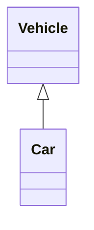
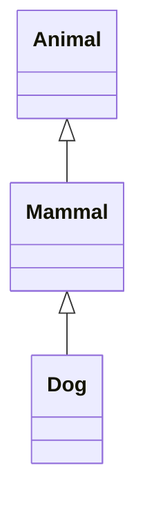
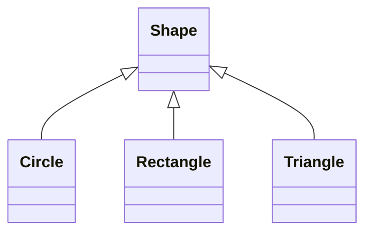
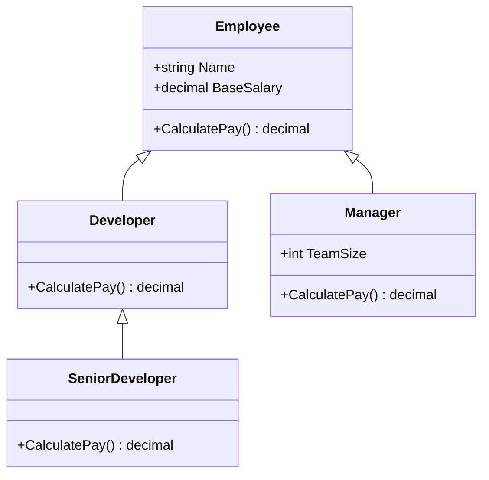
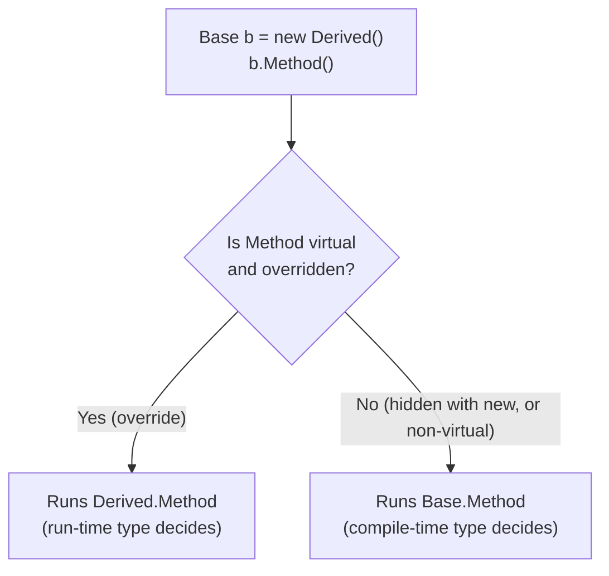
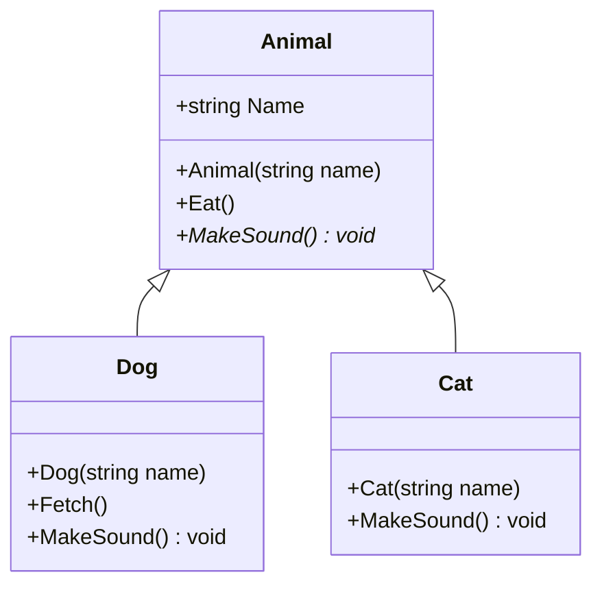
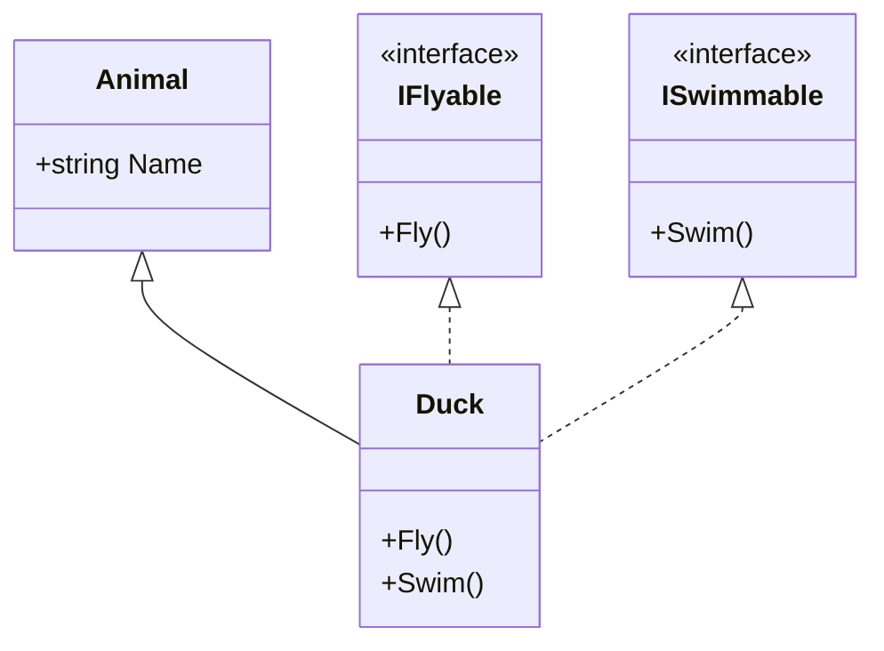

# 09. Inheritance

> Learn how a class can reuse and extend another class: base and derived classes, inheritance hierarchies, `base`, overriding, method hiding, and why C# does not allow multiple class inheritance.

**Level:** 🟡 Core OOP
**Prerequisites:** [02. Classes](../02-classes/README.md), [07. Constructors](../07-constructors/README.md), [08. Encapsulation](../08-encapsulation/README.md)

---

## 📑 In This Chapter

1. What is Inheritance?
2. Base Class and Derived Class
3. What Is (and Is Not) Inherited
4. Single Inheritance
5. Multilevel Inheritance
6. Hierarchical Inheritance
7. The `base` Keyword
8. Method Overriding
9. Method Hiding
10. Multiple Inheritance Limitation
11. Inheritance vs Composition
12. Real-World Example
13. Interview Questions

---

## 🎯 Learning Objectives

By the end of this chapter you will be able to:

- Define inheritance and the **is-a** relationship.
- Create base and derived classes and pass data up with `base(...)`.
- Describe single, multilevel and hierarchical inheritance.
- Extend base behavior with `virtual`, `override` and `base.Method()`.
- Explain **method hiding** (`new`) and how it differs from overriding.
- Explain why C# supports only **single class inheritance** and how interfaces fill the gap.
- Decide when to use inheritance and when to prefer composition.

---

## 📖 Concept

**Inheritance** lets a class (the **derived** class) acquire the accessible members of another class (the **base** class) and then **add to or specialize** them. It models an **is-a** relationship: a `Dog` **is an** `Animal`.

```csharp
public class Animal                      // base class (parent, superclass)
{
    public void Eat() => Console.WriteLine("Eating...");
}

public class Dog : Animal                // derived class (child, subclass)
{
    public void Bark() => Console.WriteLine("Woof!");
}

var dog = new Dog();
dog.Eat();      // inherited from Animal
dog.Bark();     // defined in Dog
```

Syntax:

```text
class DerivedClass : BaseClass
```

| Term | Meaning |
|---|---|
| **Base class** | The class being inherited from |
| **Derived class** | The class that inherits (and may extend) |
| **`System.Object`** | The implicit root: every class ultimately derives from it |
| **Is-a test** | "Is a Dog an Animal?" ✅ Inheritance fits. "Is a Car an Engine?" ❌ Use composition |

### What Is (and Is Not) Inherited

| Base member | Accessible in derived class? |
|---|:-:|
| `public` | ✅ |
| `protected` | ✅ |
| `internal` | ✅ (same assembly) |
| `protected internal` | ✅ |
| `private protected` | ✅ (same assembly, derived types) |
| `private` | ❌ (exists in the object, but cannot be accessed) |
| **Constructors** | ❌ Not inherited (call them with `base(...)`) |

Other rules:

- A derived class **cannot be more accessible** than its base (a `public` class cannot derive from an `internal` one).
- **Structs cannot inherit** from classes or structs (they can implement interfaces).
- A `sealed` class cannot be inherited ([14. Sealed Members](../14-sealed-members/README.md)).
- A `static` class cannot be inherited.

### Single Inheritance

One derived class, one base class.

```csharp
public class Vehicle { public int Speed { get; set; } }
public class Car : Vehicle { public int Doors { get; set; } }
```



### Multilevel Inheritance

A chain: a class derives from a class that itself derives from another.

```csharp
public class Animal { public void Eat() => Console.WriteLine("Eating"); }
public class Mammal : Animal { public void Breathe() => Console.WriteLine("Breathing air"); }
public class Dog : Mammal { public void Bark() => Console.WriteLine("Woof"); }

var dog = new Dog();
dog.Eat();        // from Animal
dog.Breathe();    // from Mammal
dog.Bark();       // from Dog
```



### Hierarchical Inheritance

**Several** classes derive from the **same** base class.

```csharp
public class Shape { public string Color { get; set; } = "Black"; }
public class Circle : Shape { public double Radius { get; set; } }
public class Rectangle : Shape { public double Width { get; set; } public double Height { get; set; } }
```



### The `base` Keyword

`base` refers to the **base class** from inside a derived class. Two main uses (details in [18. `base` Keyword](../18-base-keyword/README.md)):

```csharp
public class Animal
{
    public string Name { get; }
    public Animal(string name) => Name = name;

    public virtual void MakeSound() => Console.WriteLine($"{Name} makes a sound.");
}

public class Dog : Animal
{
    public Dog(string name) : base(name) { }          // 1) call the base constructor

    public override void MakeSound()
    {
        base.MakeSound();                              // 2) reuse the base implementation
        Console.WriteLine($"{Name} also says Woof!");
    }
}
```

**Rule:** if the base class has no accessible parameterless constructor, each derived constructor **must** call `: base(...)`. Constructor execution order is covered in [07. Constructors](../07-constructors/README.md).

### Method Overriding

**Overriding** lets a derived class **replace** the implementation of a base method. The base method must be marked `virtual` (or `abstract`), and the derived method uses `override`.

```csharp
public class Animal
{
    public virtual string Speak() => "...";
}

public class Dog : Animal
{
    public override string Speak() => "Woof";
}

public class Cat : Animal
{
    public override string Speak() => "Meow";
}

Animal a = new Dog();
Console.WriteLine(a.Speak());      // Woof   ← the actual object type decides
```

Rules:

| Rule | Detail |
|---|---|
| Base method must be | `virtual`, `abstract`, or itself an `override` |
| Signature | Same name, parameters and accessibility |
| Cannot override | Non-virtual, `static`, or `sealed` members |
| Stop further overriding | `sealed override` |

Overriding is the foundation of **runtime polymorphism**; the full story (dynamic dispatch) is in [10. Polymorphism](../10-polymorphism/README.md).

### Method Hiding

**Hiding** creates a **new, unrelated** member in the derived class that has the same name as a base member. Use the `new` modifier to say it is intentional.

```csharp
public class Base
{
    public string Describe() => "Base.Describe";                 // NOT virtual
    public virtual string Identify() => "Base.Identify";
}

public class Derived : Base
{
    public new string Describe() => "Derived.Describe";          // hides
    public override string Identify() => "Derived.Identify";     // overrides
}

Derived d = new Derived();
Base b = d;                                // same object, viewed as Base

Console.WriteLine(d.Describe());           // Derived.Describe
Console.WriteLine(b.Describe());           // Base.Describe      ← hiding: reference type decides
Console.WriteLine(d.Identify());           // Derived.Identify
Console.WriteLine(b.Identify());           // Derived.Identify   ← overriding: object type decides
```

Without `new`, the compiler gives warning **CS0108** ("hides inherited member").

> ⚠️ Hiding is usually a **design smell**. Callers get different behavior depending on the variable's declared type. Prefer `virtual`/`override`, or rename the member.

### Multiple Inheritance Limitation

C# allows a class to inherit from **only one** base class.

```csharp
public class Bird { }
public class Fish { }

// public class FlyingFish : Bird, Fish { }     // ❌ CS1721: cannot have multiple base classes
```

**Why?** Multiple class inheritance causes the **diamond problem**: if two base classes both provide the same member and a derived class inherits from both, which version should it use? Which base constructor runs first? Which copy of a shared grandparent's state exists?

```text
        Animal
        /    \
     Bird    Fish          Which Animal state does FlyingFish get?
        \    /             Which Describe() wins?
      FlyingFish
```

**C#'s answer:** **one base class + any number of interfaces.** An interface defines a contract with no instance state, avoiding the ambiguity.

```csharp
public interface IFlyable { void Fly(); }
public interface ISwimmable { void Swim(); }

public class Animal
{
    public string Name { get; }
    public Animal(string name) => Name = name;
}

public class Duck : Animal, IFlyable, ISwimmable        // one class + two interfaces
{
    public Duck(string name) : base(name) { }
    public void Fly() => Console.WriteLine($"{Name} flies.");
    public void Swim() => Console.WriteLine($"{Name} swims.");
}
```

(See [12. Interfaces](../12-interfaces/README.md) and [15. Abstract Class vs Interface](../15-abstract-class-vs-interface/README.md).)

### Inheritance vs Composition

Inheritance is **powerful but tightly couples** the derived class to its base. Before inheriting, ask:

| Question | If "yes" |
|---|---|
| Is the relationship truly **is-a**, in every situation? | Inheritance may fit |
| Can a derived object be used **anywhere** the base is expected without surprises (Liskov Substitution)? | Inheritance may fit |
| Do you only want to **reuse code**? | Prefer **composition** |
| Is the relationship **has-a** or **uses-a**? | Use **composition** |

```csharp
// ❌ A car is not an engine
public class Car : Engine { }

// ✅ A car has an engine
public class Car
{
    private readonly Engine _engine = new Engine();
    public void Start() => _engine.Ignite();
}
```

---

## 🤔 Why It Matters

- **Code reuse:** shared members live in one place.
- **Specialization:** derived classes add or refine behavior without copying code.
- **Polymorphism:** a derived object can be used wherever a base type is expected (enabled by inheritance + `virtual`/`override`).
- **Modeling:** natural hierarchies (`Shape → Circle`, `Employee → Manager`) become explicit in code.
- **Cost:** inheritance creates strong coupling, so misuse produces rigid, fragile designs. Knowing *when not to inherit* is just as important.

---

## 🧩 Syntax

```csharp
public class Base
{
    public Base(string name) { }                          // constructors are not inherited

    public void Normal() { }                              // inherited as-is
    public virtual void CanOverride() { }                 // may be replaced
    protected void ForDerivedOnly() { }                   // visible to derived classes
}

public class Derived : Base                               // inherit with ':'
{
    public Derived(string name) : base(name) { }          // call base constructor

    public override void CanOverride()                    // replace behavior
    {
        base.CanOverride();                               // optionally reuse base behavior
    }

    public new void Normal() { }                          // hide (usually avoid)
}

public sealed class Final : Derived                       // cannot be inherited further
{
    public Final() : base("final") { }
}

public class WithInterfaces : Base, IDisposable           // one base class + interfaces
{
    public WithInterfaces() : base("x") { }
    public void Dispose() { }
}
```

---

## 💻 Basic Example

```csharp
public class Animal
{
    public string Name { get; }

    public Animal(string name) => Name = name;

    public void Eat() => Console.WriteLine($"{Name} is eating.");

    public virtual void MakeSound() => Console.WriteLine($"{Name} makes a sound.");
}

public class Dog : Animal
{
    public Dog(string name) : base(name) { }

    public void Fetch() => Console.WriteLine($"{Name} fetches the ball.");

    public override void MakeSound() => Console.WriteLine($"{Name} says Woof!");
}

var dog = new Dog("Rex");
dog.Eat();             // inherited
dog.MakeSound();       // overridden
dog.Fetch();           // Dog-only

Animal pet = dog;      // a Dog is an Animal
pet.MakeSound();       // still the Dog version
// pet.Fetch();        // ❌ compile error: Animal has no Fetch
```

**Output**

```text
Rex is eating.
Rex says Woof!
Rex fetches the ball.
Rex says Woof!
```

Through an `Animal` variable you can only use members that `Animal` declares, but an overridden member still runs the `Dog` version.

---

## 🌍 Real-World Example

An employee hierarchy using multilevel and hierarchical inheritance, with each class extending the pay calculation through `base.CalculatePay()`.

```csharp
public class Employee
{
    public string Name { get; }
    public decimal BaseSalary { get; }

    public Employee(string name, decimal baseSalary)
    {
        Name = name;
        BaseSalary = baseSalary;
    }

    public virtual decimal CalculatePay() => BaseSalary;

    public override string ToString() => $"{GetType().Name} {Name}: {CalculatePay():F2}";
}

public class Developer : Employee
{
    public Developer(string name, decimal baseSalary) : base(name, baseSalary) { }

    public override decimal CalculatePay() => base.CalculatePay() + 500m;      // tools allowance
}

public class SeniorDeveloper : Developer                                         // multilevel
{
    public SeniorDeveloper(string name, decimal baseSalary) : base(name, baseSalary) { }

    public override decimal CalculatePay() => base.CalculatePay() * 1.10m;     // 10% seniority bonus
}

public class Manager : Employee                                                  // hierarchical
{
    public int TeamSize { get; }

    public Manager(string name, decimal baseSalary, int teamSize) : base(name, baseSalary)
        => TeamSize = teamSize;

    public override decimal CalculatePay() => base.CalculatePay() + TeamSize * 100m;
}

Employee[] staff =
{
    new Developer("Dev", 4000m),
    new SeniorDeveloper("Sen", 5000m),
    new Manager("Mia", 6000m, 5)
};

foreach (var employee in staff)
    Console.WriteLine(employee);
```

**Output**

```text
Developer Dev: 4500.00
SeniorDeveloper Sen: 6050.00
Manager Mia: 6500.00
```

Trace for `SeniorDeveloper`: `Employee` returns 5000 → `Developer` adds 500 → `SeniorDeveloper` multiplies by 1.10 → **6050**. Each level builds on the one above through `base`.



---

## 🧠 How It Works

### A derived object contains the base part

A `Dog` object is **one object** that contains the `Animal` portion plus the `Dog` portion. That is why creating a `Dog` runs the `Animal` constructor first, and why a `Dog` reference can be treated as an `Animal` reference.

```text
 Dog object in memory (conceptual)
 ┌────────────────────────────┐
 │ Animal part: Name          │ ← inherited state
 │ Dog part   : (own fields)  │ ← added state
 └────────────────────────────┘
 Animal reference ─┐
 Dog reference    ─┴──► same object
```

### Compile-time type vs run-time type

```csharp
Animal pet = new Dog("Rex");
//  ^^^^^^        ^^^
//  compile-time  run-time
//  type          type
```

| Member kind | Chosen by |
|---|---|
| **Overridden** (`virtual`/`override`) | The object's **run-time** type |
| **Hidden** (`new`) and non-virtual members | The variable's **compile-time** type |

### Lookup in a hierarchy

Calling `dog.Eat()` makes the compiler search `Dog`, then `Mammal`, then `Animal`, then `object`, and use the first match. A derived member with the same name **hides** (or overrides) the one above it.

### Hiding vs overriding at a glance



### The fragile base class problem

A change in a base class (a new member, a changed behavior, a different call order between virtual methods) can silently break derived classes that you do not control. That is why **inheritance should be designed for**, not added by accident, and why `sealed` is a good default for classes not meant to be extended.

---

## 📊 Diagram





*(Larger diagrams live in [`/diagrams`](../diagrams).)*

---

## ⚔️ Important Comparisons

### Types of inheritance

| Type | Shape | C# support |
|---|---|:-:|
| **Single** | `A → B` | ✅ |
| **Multilevel** | `A → B → C` | ✅ |
| **Hierarchical** | `A → B`, `A → C` | ✅ |
| **Multiple (classes)** | `A, B → C` | ❌ |
| **Multiple (interfaces)** | `C : IA, IB` | ✅ |

### Overriding vs hiding

| Aspect | Overriding (`virtual` + `override`) | Hiding (`new`) |
|---|---|---|
| **Base member must be** | `virtual`/`abstract`/`override` | Any member |
| **Relationship** | Replaces the base implementation | Creates a separate, unrelated member |
| **Chosen by** | Run-time type | Compile-time (variable) type |
| **Polymorphic** | ✅ | ❌ |
| **Keyword** | `override` | `new` (optional but recommended) |
| **Recommended** | ✅ | Rarely |

### Inheritance vs composition

| Aspect | Inheritance (**is-a**) | Composition (**has-a**) |
|---|---|---|
| **Coupling** | Tight | Loose |
| **Flexibility** | Fixed at compile time | Can swap parts at run time |
| **Exposes base API** | Yes (all accessible members) | Only what you choose |
| **Code reuse** | ✅ | ✅ |
| **Risk** | Fragile base class, LSP violations | More delegation code |
| **Default choice** | When the is-a relationship is genuine | When in doubt |

### Abstract/virtual/override/new/sealed quick reference

| Keyword | Meaning | Chapter |
|---|---|:-:|
| `virtual` | Base member **may** be overridden | [10](../10-polymorphism/README.md) |
| `abstract` | Base member **must** be overridden (no body) | [11](../11-abstraction/README.md) |
| `override` | Derived replaces a virtual/abstract member | [10](../10-polymorphism/README.md) |
| `new` | Derived hides an inherited member | This chapter |
| `sealed` | Prevents further inheritance/overriding | [14](../14-sealed-members/README.md) |

---

## ⚠️ Common Mistakes

1. ❌ **Inheriting just to reuse code.** `class Stack : List<int>` exposes every list operation and breaks the stack concept. Fix: use composition.
2. ❌ **Forgetting `virtual`.** Without it, `override` is a compile error and a same-named method only hides. Fix: mark intended extension points `virtual`.
3. ❌ **Accidental hiding** (ignoring warning CS0108). Behavior now depends on the variable's declared type. Fix: use `override`, rename, or add `new` deliberately.
4. ❌ **Not calling the base constructor** when the base has no parameterless one. Fix: `: base(args)`.
5. ❌ **Deep hierarchies** (five or more levels). They are hard to understand and change. Fix: keep them shallow; favor composition and interfaces.
6. ❌ **Breaking the is-a contract** (Liskov violation), such as `Square : Rectangle` where setting `Width` also changes `Height`. Fix: redesign, or do not inherit. See [24. SOLID Principles](../24-solid-principles/README.md).
7. ❌ **Making members `protected` by default.** Protected members are part of your public contract to all subclasses. Fix: default to `private`; expose `protected` only deliberately.
8. ❌ **Overriding with different semantics** (a `Dog.Eat()` that deletes files). Fix: overrides must honor the base contract.
9. ❌ **Trying to inherit from a `sealed` class, a `static` class or a struct.** Compile errors. Fix: use composition or change the design.
10. ❌ **Expecting multiple class inheritance.** Fix: one base class plus interfaces.
11. ❌ **Calling virtual methods from a constructor.** The override can run before the derived part is initialized. See [07. Constructors](../07-constructors/README.md).
12. ❌ **Making a derived class more accessible than its base** (`public` derived from `internal`). Compile error. Fix: align accessibility.

---

## ✅ Best Practices

- Use inheritance only for a **genuine is-a** relationship that holds in every context.
- **Favor composition over inheritance** when unsure.
- Keep hierarchies **shallow** (ideally two or three levels).
- **Design for inheritance or prevent it:** mark extension points `virtual`/`abstract` and document them; otherwise `sealed`.
- Ensure derived objects are **substitutable** for base objects (Liskov Substitution Principle).
- Call **`base.Method()`** when extending (not replacing) behavior.
- Avoid **hiding** with `new`; prefer overriding or renaming.
- Keep **`protected`** surface minimal.
- Put **shared behavior in the base**, and **variation in the derived** classes.
- Use **interfaces** for capabilities shared across unrelated classes.
- Use an **abstract base class** when the base should never be instantiated by itself ([11. Abstraction](../11-abstraction/README.md)).

---

## 🎯 Interview Questions

<details>
<summary><b>Q1. What is inheritance?</b></summary>

A mechanism by which a derived class acquires the accessible members of a base class and can extend or specialize them. It models an is-a relationship and enables code reuse and polymorphism.

</details>

<details>
<summary><b>Q2. What types of inheritance does C# support?</b></summary>

Single, multilevel and hierarchical inheritance for classes. Multiple inheritance of classes is not supported, but a class can implement multiple interfaces.

</details>

<details>
<summary><b>Q3. Why doesn't C# support multiple class inheritance?</b></summary>

It leads to ambiguity known as the diamond problem: when two base classes provide the same member (or share a common ancestor), it is unclear which implementation or state the derived class should inherit. C# avoids this by allowing one base class plus multiple interfaces.

</details>

<details>
<summary><b>Q4. Are constructors inherited?</b></summary>

No. Each class defines its own constructors, and a derived constructor calls a base constructor using `: base(...)`.

</details>

<details>
<summary><b>Q5. Are private members inherited?</b></summary>

They exist in the derived object's memory, but they are not accessible from the derived class. Only the base class's own code can use them.

</details>

<details>
<summary><b>Q6. What is the `base` keyword used for?</b></summary>

To call a base class constructor (`: base(...)`) and to access base class members from a derived class, such as `base.Method()` to reuse the base implementation inside an override.

</details>

<details>
<summary><b>Q7. What is the difference between method overriding and method hiding?</b></summary>

Overriding replaces a `virtual`/`abstract` base method (using `override`), and the object's run-time type decides which version runs. Hiding (`new`) declares a separate member with the same name, and the variable's compile-time type decides which version runs.

</details>

<details>
<summary><b>Q8. What happens if you omit `new` when hiding a member?</b></summary>

The code compiles, but the compiler emits warning CS0108 telling you that the member hides an inherited member. Adding `new` states the intent explicitly.

</details>

<details>
<summary><b>Q9. What does `virtual` do?</b></summary>

It marks a base member as overridable, allowing derived classes to replace its implementation with `override`.

</details>

<details>
<summary><b>Q10. Can a class inherit from a struct, or a struct from a class?</b></summary>

No. Structs cannot be inherited from and cannot inherit from classes or other structs. They implicitly derive from `System.ValueType` and can implement interfaces.

</details>

<details>
<summary><b>Q11. When should you prefer composition over inheritance?</b></summary>

When the relationship is has-a or uses-a rather than is-a, when you only need code reuse, when you need to change behavior at run time, or when inheriting would expose members that do not make sense for the new type.

</details>

<details>
<summary><b>Q12. What is the Liskov Substitution Principle in the context of inheritance?</b></summary>

Objects of a derived class must be usable wherever the base class is expected without breaking correctness. Overrides must honor the base class's contract (preconditions, postconditions, invariants).

</details>

<details>
<summary><b>Q13. What is the fragile base class problem?</b></summary>

Changes to a base class can unintentionally break derived classes, because derived classes depend on the base's implementation details and behavior. It is a key reason to keep hierarchies shallow and to seal classes not designed for extension.

</details>

<details>
<summary><b>Q14. What class do all classes inherit from?</b></summary>

`System.Object`, implicitly, even if no base class is written. See [19. System.Object](../19-object-class/README.md).

</details>

---

## 📝 Practice Problems

| # | Problem | Difficulty | Solution |
|:-:|---|:-:|:-:|
| 1 | Create `Vehicle` and a derived `Car` class. Add shared members to `Vehicle` and specific ones to `Car`. | 🟢 | [View →](../solutions/09-inheritance/) |
| 2 | Create `Animal → Dog` where `Animal` has a constructor taking `name`. Make `Dog` call it with `base`. | 🟢 | [View →](../solutions/09-inheritance/) |
| 3 | Build a multilevel chain `Person → Student → GraduateStudent`, each adding one member. | 🟢 | [View →](../solutions/09-inheritance/) |
| 4 | Build a hierarchical design: `Shape` with `Circle`, `Rectangle`, `Triangle`, each overriding `Area()`. | 🟡 | [View →](../solutions/09-inheritance/) |
| 5 | Write the `Base`/`Derived` hiding example from this chapter and explain each of the four outputs. | 🟡 | [View →](../solutions/09-inheritance/) |
| 6 | Reproduce warning CS0108 and fix it in two different ways (`override` and `new`). | 🟡 | [View →](../solutions/09-inheritance/) |
| 7 | Create a `Duck : Animal, IFlyable, ISwimmable`. Explain why `Duck : Animal, Bird` would not compile. | 🟡 | [View →](../solutions/09-inheritance/) |
| 8 | Build an `Employee` hierarchy where each level calls `base.CalculatePay()` and adds its own rule. | 🟡 | [View →](../solutions/09-inheritance/) |
| 9 | Refactor `class Stack : List<int>` into a composition-based `Stack` that exposes only `Push`, `Pop` and `Count`. | 🟠 | [View →](../solutions/09-inheritance/) |
| 10 | Demonstrate the `Rectangle`/`Square` Liskov violation, then propose a redesign. | 🟠 | [View →](../solutions/09-inheritance/) |

Starter files: [`/exercises/09-inheritance`](../exercises/09-inheritance/)

---

## 🔑 Key Takeaways

- **Inheritance** lets a derived class reuse and extend a base class; it models **is-a**.
- Syntax: `class Derived : Base`. Constructors are **not** inherited; use `: base(...)`.
- C# supports **single, multilevel and hierarchical** class inheritance, and **one base class only**.
- Use **one base class + multiple interfaces** to get multiple-inheritance benefits without the diamond problem.
- **`virtual` + `override`** replaces behavior and is chosen by the **run-time type**.
- **`new` (hiding)** creates a separate member chosen by the **compile-time type**; avoid it.
- Use `base.Member()` to extend rather than replace base behavior.
- **Prefer composition** unless the is-a relationship is genuine and substitutable.
- Keep hierarchies **shallow**, and seal classes that are not designed for inheritance.

---

[⬅ Previous: Encapsulation](../08-encapsulation/README.md)
&nbsp;&nbsp;•&nbsp;&nbsp;
[🏠 Main README](../README.md)
&nbsp;&nbsp;•&nbsp;&nbsp;
[Next: Polymorphism ➡](../10-polymorphism/README.md)