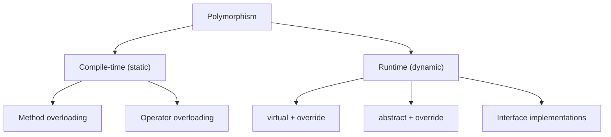
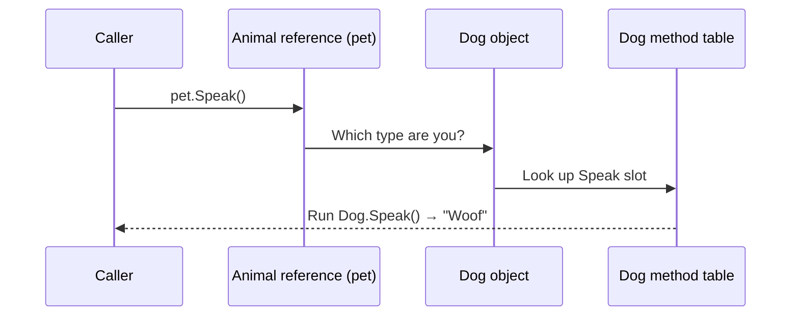
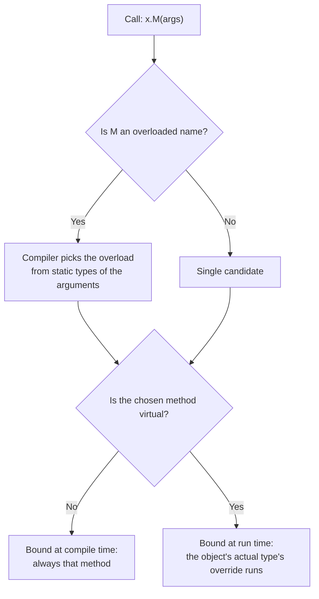
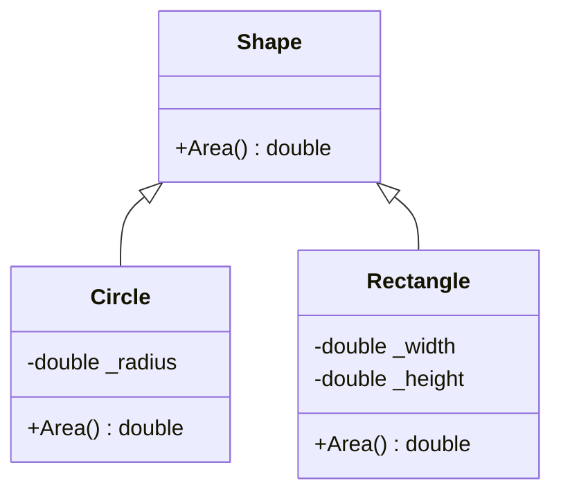
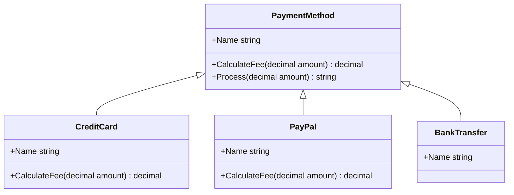

# 10. Polymorphism

> Learn how one call can produce different behavior: compile-time polymorphism (overloading), runtime polymorphism (`virtual` and `override`), and the dynamic dispatch mechanism behind it.

**Level:** 🟡 Core OOP
**Prerequisites:** [06. Methods](../06-methods/README.md), [09. Inheritance](../09-inheritance/README.md)

---

## 📑 In This Chapter

1. What is Polymorphism?
2. Compile-Time Polymorphism
3. Method Overloading
4. Runtime Polymorphism
5. Method Overriding
6. `virtual` and `override`
7. Dynamic Dispatch
8. Polymorphism in Practice
9. Real-World Example
10. Interview Questions

---

## 🎯 Learning Objectives

By the end of this chapter you will be able to:

- Define polymorphism and explain why it matters.
- Distinguish **compile-time** from **runtime** polymorphism.
- Write overloaded methods and predict which overload the compiler picks.
- Use `virtual` and `override` to customize behavior in derived classes.
- Explain **dynamic dispatch** and how the run-time type selects the method.
- Replace type-checking `if`/`switch` chains with polymorphic design.
- Avoid common traps: overload-vs-override confusion, accidental hiding, virtual calls in constructors.

---

## 📖 Concept

**Polymorphism** means **"many forms"**: the **same call** (same method name or same base-type reference) can **behave differently** depending on the types involved.

```csharp
Shape shape = GetSomeShape();        // could be a Circle, Rectangle, Triangle...
double area = shape.Area();          // the right calculation runs automatically
```

The caller does not need to know the concrete type. This is what lets you add new types **without changing existing code**.

C# offers two main kinds:

| Kind | Also called | Decided | Mechanism |
|---|---|---|---|
| **Compile-time polymorphism** | Static / early binding | By the **compiler** | Method overloading, operator overloading (generics are a related, *parametric* form) |
| **Runtime polymorphism** | Dynamic / late binding | By the **CLR at run time** | `virtual`/`override`, `abstract`, interfaces |



### Compile-Time Polymorphism

The compiler chooses the exact method **while compiling**, based on the **declared (static) types** of the arguments.

### Method Overloading

Same method name, **different parameter lists**, in the same class (or inherited into it).

```csharp
public class Printer
{
    public void Print(int value)          => Console.WriteLine($"int: {value}");
    public void Print(double value)       => Console.WriteLine($"double: {value}");
    public void Print(string value)       => Console.WriteLine($"string: {value}");
    public void Print(string a, string b) => Console.WriteLine($"two strings: {a}, {b}");
}

var p = new Printer();
p.Print(42);          // int: 42
p.Print(3.14);        // double: 3.14
p.Print("hello");     // string: hello
p.Print("a", "b");    // two strings: a, b
```

Overloads must differ in **parameter count, types or order**. They cannot differ only by return type or parameter names (see [06. Methods](../06-methods/README.md)).

**Overloading uses the compile-time type, not the run-time type:**

```csharp
public class Animal { }
public class Dog : Animal { }

static string Describe(Animal a) => "Animal overload";
static string Describe(Dog d)    => "Dog overload";

Animal pet = new Dog();

Console.WriteLine(Describe(pet));          // Animal overload ← variable's declared type is Animal
Console.WriteLine(Describe(new Dog()));    // Dog overload
Console.WriteLine(Describe((Dog)pet));     // Dog overload    ← the cast changes the static type
```

This is a very common source of confusion: **overloads are not dynamic**. If you want behavior to follow the actual object, use `virtual`/`override`.

**Operator overloading** is also compile-time polymorphism:

```csharp
public readonly struct Vector2
{
    public double X { get; }
    public double Y { get; }

    public Vector2(double x, double y) { X = x; Y = y; }

    public static Vector2 operator +(Vector2 a, Vector2 b)
        => new(a.X + b.X, a.Y + b.Y);
}

var sum = new Vector2(1, 2) + new Vector2(3, 4);     // (4, 6)
```

### Runtime Polymorphism

Which implementation runs is decided **while the program runs**, from the **actual type of the object**, not the type of the variable.

```csharp
Animal pet = new Dog();     // variable type: Animal   | object type: Dog
pet.Speak();                // runs Dog.Speak (if Speak is virtual and overridden)
```

### Method Overriding

A derived class **replaces** a base method's implementation by declaring a method with the **same signature** marked `override`.

```csharp
public class Animal
{
    public virtual string Speak() => "...";
}

public class Dog : Animal
{
    public override string Speak() => "Woof";
}

public class Cat : Animal
{
    public override string Speak() => "Meow";
}

public class Fish : Animal { }          // does not override: keeps the base behavior

Animal[] animals = { new Dog(), new Cat(), new Fish() };

foreach (var animal in animals)
    Console.WriteLine(animal.Speak());
```

**Output**

```text
Woof
Meow
...
```

### `virtual` and `override`

| Keyword | Where | Meaning |
|---|---|---|
| `virtual` | Base class member | "Derived classes **may** replace this" |
| `override` | Derived class member | "I **replace** the inherited virtual/abstract member" |
| `abstract` | Base class member (no body) | "Derived classes **must** provide this" ([11. Abstraction](../11-abstraction/README.md)) |
| `sealed override` | Derived class member | "Replaced here, and **no further overriding**" ([14. Sealed Members](../14-sealed-members/README.md)) |
| `new` | Derived class member | "I **hide** the inherited member; this is not polymorphic" ([09. Inheritance](../09-inheritance/README.md)) |

Rules for overriding:

- The base member must be `virtual`, `abstract`, or itself an `override`.
- Signature (name and parameters) and **accessibility must match**.
- `static` and `private` members cannot be `virtual`.
- Properties (and indexers, events) can be virtual and overridden too.
- Since C# 9, an override may return a **more derived type** than the base (covariant return types).
- In C#, methods are **non-virtual by default**; you opt in with `virtual`.

### Dynamic Dispatch

**Dynamic dispatch** is the runtime mechanism that picks the correct override.

How it works conceptually:

1. Every object knows its **actual type**.
2. Every type has a **method table** (often called a *vtable*): a list of slots, one per virtual method, pointing to the implementation for that type.
3. When you call a virtual method, the CLR looks in the **object's actual type's table** and runs that implementation.

```text
 Animal pet = new Dog();
 pet.Speak();

   variable 'pet' ──► [ Dog object ] ──► Dog method table
                                          ├─ Speak  → Dog.Speak()   ← chosen at run time
                                          ├─ ToString → Object.ToString()
                                          └─ ...
```



Compile time vs run time for the same line:

| | Decided at compile time | Decided at run time |
|---|---|---|
| **Is `Speak` accessible on `Animal`?** | ✅ (compiler checks the variable type) | |
| **Which `Speak` implementation runs?** | | ✅ (object's actual type) |

---

## 🤔 Why It Matters

- **Extensibility:** add a new type (`Triangle`) and existing code that works with `Shape` keeps working unchanged. This is the heart of the **Open/Closed Principle** ([24. SOLID Principles](../24-solid-principles/README.md)).
- **Less branching:** polymorphism replaces long `if (x is A) ... else if (x is B) ...` chains.
- **Decoupling:** callers depend on the base type or interface, not on concrete classes.
- **Testability:** substitute a fake or alternative implementation behind the same type.
- **Readability:** `shape.Area()` expresses intent; the details live where they belong.

---

## 🧩 Syntax

```csharp
public class Base
{
    public virtual string Greet() => "Hello from Base";          // can be overridden
    public virtual string Title => "Base";                       // virtual property
}

public class Derived : Base
{
    public override string Greet() => "Hello from Derived";      // runtime polymorphism
    public override string Title => "Derived";
}

public class Sealed : Derived
{
    public sealed override string Greet() => "Final greeting";   // stops further overriding
}

public class Overloads
{
    public void Do(int x) { }                                    // compile-time polymorphism
    public void Do(string x) { }
    public void Do(int x, int y) { }
}

Base b = new Derived();
Console.WriteLine(b.Greet());        // Hello from Derived  (dynamic dispatch)
```

---

## 💻 Basic Example

```csharp
public class Shape
{
    public virtual double Area() => 0;

    public override string ToString() => $"{GetType().Name} area: {Area():F2}";
}

public class Circle : Shape
{
    private readonly double _radius;

    public Circle(double radius) => _radius = radius;

    public override double Area() => Math.PI * _radius * _radius;
}

public class Rectangle : Shape
{
    private readonly double _width;
    private readonly double _height;

    public Rectangle(double width, double height)
    {
        _width = width;
        _height = height;
    }

    public override double Area() => _width * _height;
}

Shape[] shapes =
{
    new Circle(1),
    new Rectangle(2, 3),
    new Shape()
};

foreach (var shape in shapes)
    Console.WriteLine(shape);
```

**Output**

```text
Circle area: 3.14
Rectangle area: 6.00
Shape area: 0.00
```

One loop, one call (`shape.Area()` inside `ToString`), three different behaviors. The loop code never mentions `Circle` or `Rectangle`.

---

## 🌍 Real-World Example

Payment processing where each payment method calculates its own fee. The `Process` method is written **once** in the base class and relies on virtual members.

```csharp
public class PaymentMethod
{
    public virtual string Name => "Generic";

    public virtual decimal CalculateFee(decimal amount) => 0m;

    public string Process(decimal amount)                  // non-virtual: fixed workflow
    {
        decimal fee = CalculateFee(amount);                // virtual: varies per type
        return $"{Name}: charged {amount + fee:F2} (fee {fee:F2})";
    }
}

public class CreditCard : PaymentMethod
{
    public override string Name => "Credit Card";
    public override decimal CalculateFee(decimal amount) => amount * 0.029m;
}

public class PayPal : PaymentMethod
{
    public override string Name => "PayPal";
    public override decimal CalculateFee(decimal amount) => amount * 0.034m + 0.30m;
}

public class BankTransfer : PaymentMethod
{
    public override string Name => "Bank Transfer";        // keeps the base fee (0)
}

PaymentMethod[] methods = { new CreditCard(), new PayPal(), new BankTransfer() };

foreach (var method in methods)
    Console.WriteLine(method.Process(100m));
```

**Output**

```text
Credit Card: charged 102.90 (fee 2.90)
PayPal: charged 103.70 (fee 3.70)
Bank Transfer: charged 100.00 (fee 0.00)
```

Adding a `CryptoPayment` class requires **no change** to `Process` or to the loop.

### Before and after

```csharp
// ❌ Without polymorphism: every new type edits this method
decimal GetFee(object method, decimal amount)
{
    if (method is CreditCard)    return amount * 0.029m;
    else if (method is PayPal)   return amount * 0.034m + 0.30m;
    else if (method is BankTransfer) return 0m;
    throw new NotSupportedException();
}

// ✅ With polymorphism: the type itself knows its fee
decimal fee = method.CalculateFee(amount);
```

---

## 🧠 How It Works

### Compile-time vs run-time binding



Both can happen on one call: the compiler first **picks the overload** (compile time), and if that method is virtual, the CLR then **picks the override** (run time).

### Overloading, overriding, and hiding side by side

```csharp
public class Base
{
    public virtual string Show(int x)    => "Base.Show(int)";
    public string Plain()                => "Base.Plain";
}

public class Derived : Base
{
    public override string Show(int x)   => "Derived.Show(int)";       // overrides
    public string Show(string s)         => "Derived.Show(string)";    // overloads
    public new string Plain()            => "Derived.Plain";           // hides
}

Base b = new Derived();
Console.WriteLine(b.Show(1));       // Derived.Show(int)  ← override: run-time type
Console.WriteLine(b.Plain());       // Base.Plain         ← hiding: compile-time type
// b.Show("x");                     // ❌ Base has no Show(string); overload is invisible via Base
```

### Overriding with the wrong signature silently creates a new method (if you forget `override`)

```csharp
public class Base { public virtual void Save(int id) { } }

public class Derived : Base
{
    public void Save(long id) { }               // ⚠️ just an overload, NOT an override
    // public override void Save(long id) { }   // ✅ compile error: nothing to override
}
```

Always write `override` explicitly so the compiler checks your intent.

### Calling virtual methods from constructors

A virtual call in a base constructor runs the **most-derived override**, which may execute **before the derived constructor body runs**. Avoid it. See [07. Constructors](../07-constructors/README.md).

### Extending, not replacing

```csharp
public class Logger
{
    public virtual void Log(string message) => Console.WriteLine(message);
}

public class TimestampLogger : Logger
{
    public override void Log(string message)
        => base.Log($"[{DateTime.UtcNow:HH:mm:ss}] {message}");     // reuse + extend
}
```

---

## 📊 Diagram





*(Larger diagrams live in [`/diagrams`](../diagrams).)*

---

## ⚔️ Important Comparisons

### Compile-time vs runtime polymorphism

| Aspect | Compile-time (static) | Runtime (dynamic) |
|---|---|---|
| **Also called** | Early binding | Late binding |
| **Mechanism** | Overloading, operator overloading | `virtual`/`override`, `abstract`, interfaces |
| **Resolved by** | Compiler | CLR at run time |
| **Based on** | Declared (static) types of arguments | Actual (run-time) type of the object |
| **Needs inheritance** | No | Yes (or an interface) |
| **Performance** | Fastest (direct call) | Slightly slower (table lookup), rarely significant |
| **Flexibility** | Fixed at compile time | Behavior can vary per object |

### Overloading vs overriding vs hiding

| Aspect | Overloading | Overriding | Hiding (`new`) |
|---|---|---|---|
| **Signature** | **Different** | **Same** | Same |
| **Where** | Same class (or inherited) | Derived class | Derived class |
| **Keywords** | None | `virtual` + `override` | `new` |
| **Resolved** | Compile time | Run time | Compile time |
| **Polymorphic** | Static only | ✅ | ❌ |
| **Recommended** | ✅ | ✅ | Rarely |

### `virtual` vs `abstract`

| Aspect | `virtual` | `abstract` |
|---|---|---|
| **Has a body** | ✅ (default implementation) | ❌ |
| **Override required** | ❌ Optional | ✅ Mandatory (in concrete derived classes) |
| **Allowed in** | Any non-sealed class | Abstract classes only |

---

## ⚠️ Common Mistakes

1. ❌ **Confusing overloading with overriding.** Overloading = same name, different parameters, compile time. Overriding = same signature, derived class, run time.
2. ❌ **Forgetting `virtual` in the base** and then using `new` in the derived class. The result is hiding, not polymorphism. Fix: mark the base member `virtual` and use `override`.
3. ❌ **Omitting `override`** and accidentally creating an overload or hidden member. Fix: always write `override`; the compiler will verify a matching virtual member exists.
4. ❌ **Expecting overload resolution to use the runtime type.** `Describe(Animal)` vs `Describe(Dog)` with an `Animal` variable calls the `Animal` version. Fix: use virtual methods, or cast deliberately.
5. ❌ **Calling virtual methods in constructors.** The override may run on a half-initialized object. Fix: avoid, or use a separate initialization step.
6. ❌ **Replacing polymorphism with `if (x is Type)` chains.** Every new type forces edits across the code. Fix: move behavior into the types.
7. ❌ **Overrides that change the meaning** of the base behavior (for example, a `Save()` override that deletes data). Fix: honor the base contract (Liskov Substitution Principle).
8. ❌ **Making everything `virtual` "just in case".** Each virtual member is a promise you must keep stable for subclasses. Fix: virtualize only deliberate extension points.
9. ❌ **Trying to change accessibility in an override** (`protected virtual` → `public override`). Compile error. Fix: keep the same accessibility.
10. ❌ **Trying to override `static`, non-virtual or `private` members.** Not possible. Fix: make the base member `virtual`, or redesign.
11. ❌ **Forgetting `base.Method()`** when the override is meant to extend, not replace. Fix: call `base` where the base logic is still needed.

---

## ✅ Best Practices

- Prefer **polymorphism over type checks** (`is`, `switch` on type).
- Mark only intended extension points **`virtual`** and document the contract.
- **Always use `override`** (never rely on accidentally matching signatures).
- Keep overrides **consistent with the base contract** (substitutability).
- Use **`sealed override`** to lock behavior you do not want further changed.
- Use `abstract` when **every** derived class must supply the behavior ([11. Abstraction](../11-abstraction/README.md)).
- Prefer **interfaces** for capabilities shared across unrelated types ([12. Interfaces](../12-interfaces/README.md)).
- Keep overloads **semantically equivalent**: same operation, different input types.
- Do **not** call virtual members from constructors.
- Program to the **base type or interface**, not to concrete classes.
- Use the **Template Method** idea: a fixed non-virtual workflow that calls virtual steps.

---

## 🎯 Interview Questions

<details>
<summary><b>Q1. What is polymorphism?</b></summary>

The ability for the same call or the same base-type reference to behave differently depending on the actual types involved. In C# it appears as compile-time polymorphism (overloading) and runtime polymorphism (virtual/override, abstract members, interfaces).

</details>

<details>
<summary><b>Q2. What is the difference between compile-time and runtime polymorphism?</b></summary>

Compile-time polymorphism is resolved by the compiler using the declared types of the arguments (method and operator overloading). Runtime polymorphism is resolved by the CLR using the actual type of the object (virtual/override and interface dispatch).

</details>

<details>
<summary><b>Q3. What is method overloading?</b></summary>

Defining several methods with the same name but different parameter lists (count, types or order) in the same class. The compiler selects the best match at compile time. Return type alone cannot distinguish overloads.

</details>

<details>
<summary><b>Q4. What is method overriding?</b></summary>

A derived class providing its own implementation of a base class `virtual` or `abstract` member, using `override` with the same signature and accessibility.

</details>

<details>
<summary><b>Q5. What do `virtual` and `override` do?</b></summary>

`virtual` marks a base member as replaceable. `override` in a derived class replaces that implementation. Together they enable runtime polymorphism.

</details>

<details>
<summary><b>Q6. What is dynamic dispatch?</b></summary>

The runtime process of selecting which implementation of a virtual method to call based on the object's actual type. Conceptually, the CLR consults the type's method table (vtable) to find the correct override.

</details>

<details>
<summary><b>Q7. What is the difference between overriding and overloading?</b></summary>

Overloading has the same name with different signatures and is resolved at compile time. Overriding has the same signature in a derived class and is resolved at run time. Overloading does not need inheritance; overriding does.

</details>

<details>
<summary><b>Q8. What is the difference between overriding and hiding?</b></summary>

An override replaces a virtual member and is chosen by the run-time type. Hiding (`new`) creates a separate member with the same name and is chosen by the compile-time type, so it is not polymorphic.

</details>

<details>
<summary><b>Q9. If you have `Animal a = new Dog();` which `Speak()` runs?</b></summary>

If `Speak` is `virtual` in `Animal` and overridden in `Dog`, `Dog.Speak()` runs, because the object's actual type decides. If `Dog` only hides it with `new`, or `Speak` is non-virtual, `Animal.Speak()` runs.

</details>

<details>
<summary><b>Q10. Can you override a static method? A private method?</b></summary>

No. Only instance members declared `virtual`, `abstract` or `override` can be overridden. `static` and `private` members cannot be virtual.

</details>

<details>
<summary><b>Q11. Can a constructor be virtual?</b></summary>

No. Constructors are not inherited and cannot be `virtual`, `abstract` or `override`.

</details>

<details>
<summary><b>Q12. What is the difference between `virtual` and `abstract`?</b></summary>

A `virtual` member has a default implementation and may optionally be overridden. An `abstract` member has no implementation and must be overridden by non-abstract derived classes; it can only exist in an abstract class.

</details>

<details>
<summary><b>Q13. Why is calling a virtual method from a constructor dangerous?</b></summary>

The call dispatches to the most-derived override even though the derived constructor body has not yet run, so the override may operate on uninitialized state.

</details>

<details>
<summary><b>Q14. How does polymorphism support the Open/Closed Principle?</b></summary>

Code written against a base type or interface can work with new derived types without being modified, so the system is open for extension (new types) but closed for modification (existing code unchanged).

</details>

<details>
<summary><b>Q15. What does `sealed override` do?</b></summary>

It overrides a virtual member and prevents any further derived class from overriding it again.

</details>

---

## 📝 Practice Problems

| # | Problem | Difficulty | Solution |
|:-:|---|:-:|:-:|
| 1 | Create an overloaded `Add` method for `int`, `double` and `string`. Call each and explain which overload runs. | 🟢 | [View →](../solutions/10-polymorphism/) |
| 2 | Create `Animal` with `virtual Speak()` and derive `Dog`, `Cat`, `Cow`. Loop through an `Animal[]` and print each sound. | 🟢 | [View →](../solutions/10-polymorphism/) |
| 3 | Reproduce the `Describe(Animal)` / `Describe(Dog)` overload example and explain why `Describe(pet)` picks the `Animal` version. | 🟡 | [View →](../solutions/10-polymorphism/) |
| 4 | Build `Shape` → `Circle`, `Rectangle`, `Triangle` with `Area()` overrides. Compute the total area of a `List<Shape>`. | 🟡 | [View →](../solutions/10-polymorphism/) |
| 5 | Show what happens when you forget `override` and change the parameter type by accident. Fix it. | 🟡 | [View →](../solutions/10-polymorphism/) |
| 6 | Create a `Logger` base class and a `TimestampLogger` that extends `Log` with `base.Log(...)`. | 🟡 | [View →](../solutions/10-polymorphism/) |
| 7 | Overload the `+` operator for a `Money` struct (same currency only). | 🟡 | [View →](../solutions/10-polymorphism/) |
| 8 | Refactor a method full of `if (x is A) ... else if (x is B) ...` into polymorphic classes. | 🟠 | [View →](../solutions/10-polymorphism/) |
| 9 | Build a `Notification` system (`Email`, `Sms`, `Push`) using a fixed non-virtual `Send` workflow that calls virtual steps. | 🟠 | [View →](../solutions/10-polymorphism/) |
| 10 | Demonstrate the danger of a virtual call in a base constructor, then fix the design. | 🟠 | [View →](../solutions/10-polymorphism/) |
| 11 | Use `sealed override` to stop a third level of the hierarchy from changing a method; show the compile error when it tries. | 🟠 | [View →](../solutions/10-polymorphism/) |

Starter files: [`/exercises/10-polymorphism`](../exercises/10-polymorphism/)

---

## 🔑 Key Takeaways

- **Polymorphism** = one call, many behaviors.
- **Compile-time:** overloading (and operator overloading), resolved by the compiler from **declared types**.
- **Runtime:** `virtual`/`override` (plus `abstract` and interfaces), resolved by the CLR from the **actual object type** through **dynamic dispatch**.
- Overloading is **not** dynamic; use virtual methods when behavior should follow the real object.
- Always use **`override`** explicitly; avoid **`new`** hiding.
- Polymorphism replaces **type-checking chains** and makes code **open for extension, closed for modification**.
- Make only deliberate extension points **`virtual`**, and keep overrides faithful to the base contract.
- Never call **virtual members from constructors**.

---

[⬅ Previous: Inheritance](../09-inheritance/README.md)
&nbsp;&nbsp;•&nbsp;&nbsp;
[🏠 Main README](../README.md)
&nbsp;&nbsp;•&nbsp;&nbsp;
[Next: Abstraction ➡](../11-abstraction/README.md)