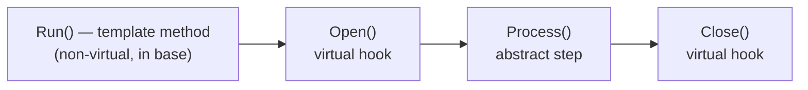
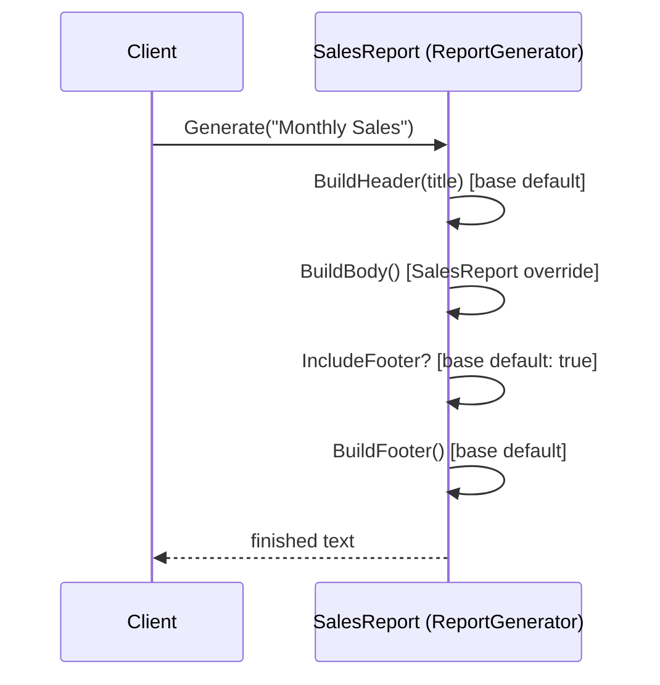
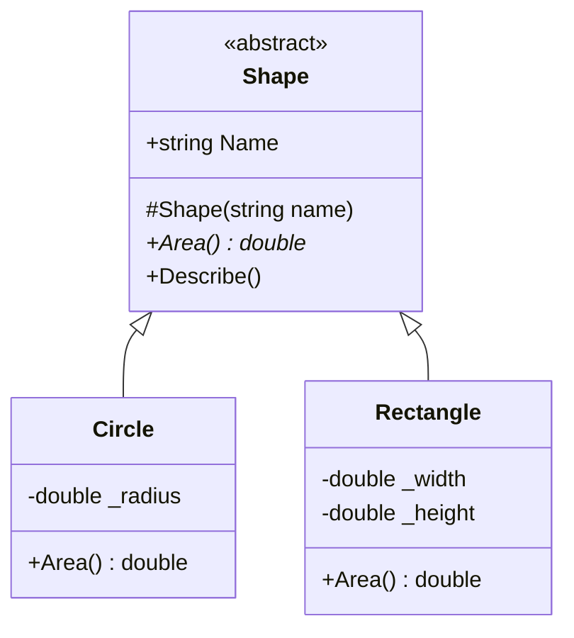
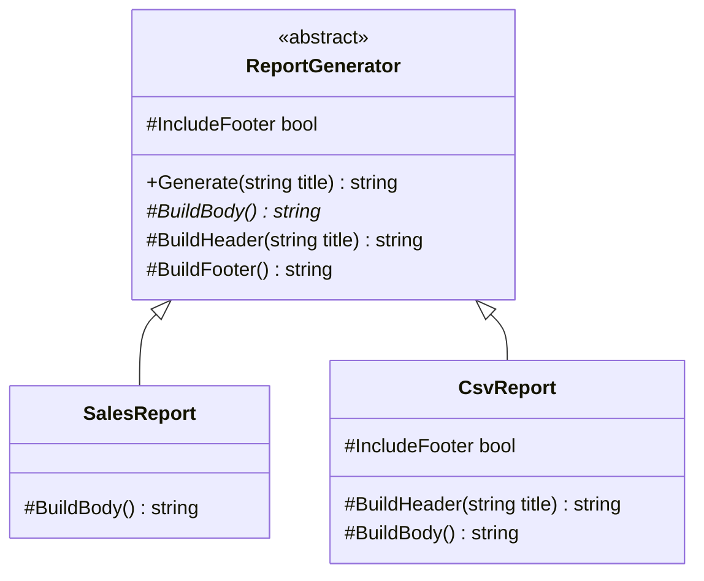
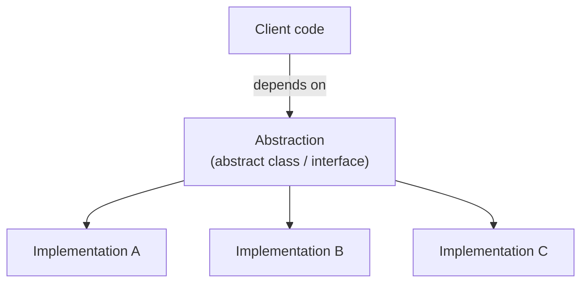

# 11. Abstraction

> Learn how to expose what matters and hide what does not: abstraction as a design idea, abstract classes and methods, implementation hiding, and the Template Method pattern.

**Level:** 🟡 Core OOP
**Prerequisites:** [08. Encapsulation](../08-encapsulation/README.md), [09. Inheritance](../09-inheritance/README.md), [10. Polymorphism](../10-polymorphism/README.md)

---

## 📑 In This Chapter

1. What Abstraction Means
2. Abstract Classes
3. Abstract Methods
4. Rules for Abstract Members
5. Implementation Hiding
6. Template Method Concept
7. Abstraction in the .NET Library
8. Real-World Example
9. Interview Questions

---

## 🎯 Learning Objectives

By the end of this chapter you will be able to:

- Explain abstraction as **exposing essentials and hiding detail**.
- Declare abstract classes and abstract members, and implement them in derived classes.
- State the rules that govern `abstract`.
- Hide implementation details behind a stable public contract.
- Apply the **Template Method** idea: a fixed algorithm with variable steps.
- Distinguish abstraction from encapsulation.
- Recognize leaky or premature abstractions.

---

## 📖 Concept

**Abstraction** is the practice of presenting **only the essential features** of something and **hiding the details** that callers do not need.

When you drive a car you use a steering wheel, pedals and a gear selector. You do not manage fuel injection timing. The controls are the **abstraction**; the engine mechanics are the **hidden implementation**.

```csharp
// The caller knows WHAT happens, not HOW
shape.Area();
storage.Save("report.txt", content);
payment.Process(100m);
```

In C#, abstraction is built with:

| Tool | Role |
|---|---|
| **Abstract classes** | Partial blueprint: shared code + members derived classes must supply |
| **Interfaces** | Pure contract with no required state ([12. Interfaces](../12-interfaces/README.md)) |
| **Well-designed public APIs** | Small, meaningful methods that hide complexity |
| **Encapsulation** | Keeps the hidden parts truly hidden ([08. Encapsulation](../08-encapsulation/README.md)) |

### Abstract Classes

An **abstract class** is a class marked `abstract`. It is **designed to be a base class** and **cannot be instantiated directly**.

```csharp
public abstract class Shape
{
    public string Name { get; }

    protected Shape(string name) => Name = name;      // constructor for derived classes to call

    public abstract double Area();                    // no body: derived classes must provide it

    public void Describe()                            // concrete member: shared by all shapes
        => Console.WriteLine($"{Name} with area {Area():F2}");
}

// var s = new Shape("generic");     // ❌ CS0144: cannot create an instance of an abstract class
```

An abstract class can contain:

- Fields, properties, methods, events, indexers
- **Constructors** (they run when a derived object is created)
- **Concrete** members (with bodies), `virtual` members, and **abstract** members (without bodies)
- Static members and nested types

### Abstract Methods

An **abstract method** declares a **signature with no body**. Every **non-abstract** derived class **must** implement it with `override`.

```csharp
public class Circle : Shape
{
    private readonly double _radius;

    public Circle(double radius) : base("Circle") => _radius = radius;

    public override double Area() => Math.PI * _radius * _radius;
}

public class Rectangle : Shape
{
    private readonly double _width;
    private readonly double _height;

    public Rectangle(double width, double height) : base("Rectangle")
    {
        _width = width;
        _height = height;
    }

    public override double Area() => _width * _height;
}
```

Abstract **properties** work the same way:

```csharp
public abstract class Employee
{
    public abstract decimal MonthlyPay { get; }       // derived classes supply the logic
}
```

If a derived class does **not** implement every abstract member, the derived class must itself be declared `abstract`, otherwise you get compiler error **CS0534**.

### Rules for Abstract Members

| Rule | Detail |
|---|---|
| Where allowed | Only inside an **abstract class** |
| Body | **None**: ends with `;` |
| Implicitly | `virtual` (you cannot write `abstract virtual`) |
| Cannot be | `private`, `static`, or `sealed` |
| Implementation | Derived classes use `override` |
| Class-level | An abstract class **cannot be `sealed` or `static`** |
| Instances | Abstract classes cannot be created with `new`, but variables of the abstract type can refer to concrete derived objects |
| Zero abstract members | Allowed: a class can be `abstract` just to block instantiation |

### Implementation Hiding

Abstraction lets callers depend on **what** a type does while the **how** stays private and can change.

```csharp
public abstract class Notifier
{
    public void Notify(string user, string message)       // the public contract
    {
        string text = Format(user, message);              // hidden steps
        Deliver(text);
    }

    protected abstract string Format(string user, string message);
    protected abstract void Deliver(string text);
}
```

- Callers see `Notify(...)`, nothing else.
- Steps are `protected`: visible to subclasses, hidden from everyone else.
- Helpers stay `private`; whole helper types can be `internal`.
- You can add caching, retries or a new transport later without touching callers.

### Template Method Concept

The **Template Method** pattern puts the **overall algorithm** in a base class method and lets derived classes **fill in specific steps**.

- The template method is **non-virtual**: the skeleton is fixed.
- Steps are `abstract` (required) or `virtual` (optional **hooks**).
- Control flows from base to derived: "don't call us, we'll call you."

```csharp
public abstract class DataProcessor
{
    public void Run()                                      // template method (fixed order)
    {
        Open();
        Process();                                         // varies
        Close();
    }

    protected virtual void Open()  => Console.WriteLine("Opening...");     // optional hook
    protected abstract void Process();                                     // required step
    protected virtual void Close() => Console.WriteLine("Closing...");     // optional hook
}

public class CsvProcessor : DataProcessor
{
    protected override void Process() => Console.WriteLine("Processing CSV rows...");
}

new CsvProcessor().Run();
```

**Output**

```text
Opening...
Processing CSV rows...
Closing...
```



### Abstraction in the .NET Library

You use abstract classes every day:

| Abstract type | Concrete implementations | What the caller gets |
|---|---|---|
| `System.IO.Stream` | `FileStream`, `MemoryStream`, `NetworkStream` | One way to read/write bytes from any source |
| `System.IO.TextWriter` | `StreamWriter`, `StringWriter` (and `Console.Out`) | One way to write text anywhere |
| `System.Data.Common.DbConnection` | `SqlConnection`, provider-specific connections | One way to open a database connection |

Code written against `Stream` works with a file, memory or the network without change.

---

## 🤔 Why It Matters

- **Manages complexity:** you reason about a few meaningful operations instead of every detail.
- **Enables change:** implementations can be replaced without breaking callers.
- **Enables polymorphism:** an abstract base type is the "common face" for different implementations ([10. Polymorphism](../10-polymorphism/README.md)).
- **Enforces a contract:** abstract members guarantee every concrete type provides the required behavior.
- **Reduces duplication:** shared logic lives once in the abstract base class.
- **Supports testing:** callers depend on the abstraction, so a fake implementation can stand in.

---

## 🧩 Syntax

```csharp
public abstract class Base
{
    private readonly string _id;                              // state allowed

    protected Base(string id) => _id = id;                    // constructor allowed

    public abstract void MustImplement();                     // abstract method
    public abstract int Size { get; }                         // abstract property

    public virtual void MayOverride() { }                     // optional override
    public void Shared() { }                                  // concrete, inherited as-is
}

public class Concrete : Base
{
    public Concrete() : base("c1") { }

    public override void MustImplement() { /* required */ }
    public override int Size => 42;
}

public abstract class StillAbstract : Base                    // may leave members unimplemented
{
    public override int Size => 1;                            // MustImplement still missing
}

// var b = new Base("x");           // ❌ cannot instantiate abstract class
Base b = new Concrete();            // ✅ abstract-typed reference, concrete object
```

---

## 💻 Basic Example

```csharp
public abstract class Shape
{
    public string Name { get; }

    protected Shape(string name) => Name = name;

    public abstract double Area();

    public void Describe() => Console.WriteLine($"{Name} with area {Area():F2}");
}

public class Circle : Shape
{
    private readonly double _radius;

    public Circle(double radius) : base("Circle") => _radius = radius;

    public override double Area() => Math.PI * _radius * _radius;
}

public class Rectangle : Shape
{
    private readonly double _width;
    private readonly double _height;

    public Rectangle(double width, double height) : base("Rectangle")
    {
        _width = width;
        _height = height;
    }

    public override double Area() => _width * _height;
}

Shape[] shapes = { new Circle(2), new Rectangle(3, 4) };

foreach (var shape in shapes)
    shape.Describe();
```

**Output**

```text
Circle with area 12.57
Rectangle with area 12.00
```

`Describe()` is written once in the abstract class. It calls `Area()`, which each concrete shape supplies.

---

## 🌍 Real-World Example

A report generator using the **Template Method** pattern with required steps and optional hooks.

```csharp
using System.Text;

public abstract class ReportGenerator
{
    // Template method: fixed algorithm, deliberately NOT virtual
    public string Generate(string title)
    {
        var sb = new StringBuilder();

        sb.AppendLine(BuildHeader(title));
        sb.AppendLine(BuildBody());

        if (IncludeFooter)
            sb.AppendLine(BuildFooter());

        return sb.ToString().TrimEnd();
    }

    // Required step
    protected abstract string BuildBody();

    // Optional steps (hooks) with sensible defaults
    protected virtual string BuildHeader(string title) => $"== {title} ==";
    protected virtual bool IncludeFooter => true;
    protected virtual string BuildFooter() => "-- end of report --";
}

public class SalesReport : ReportGenerator
{
    protected override string BuildBody() => "Total sales: 1,250.00";
}

public class CsvReport : ReportGenerator
{
    protected override string BuildHeader(string title) => "title,value";
    protected override string BuildBody() => "sales,1250.00";
    protected override bool IncludeFooter => false;
}

Console.WriteLine(new SalesReport().Generate("Monthly Sales"));
Console.WriteLine();
Console.WriteLine(new CsvReport().Generate("ignored"));
```

**Output**

```text
== Monthly Sales ==
Total sales: 1,250.00
-- end of report --

title,value
sales,1250.00
```

The order **header → body → optional footer** is guaranteed for every report. Subclasses cannot reorder or skip the skeleton, only customize the steps. Callers just use `Generate(...)` and never see the steps.



---

## 🧠 How It Works

### What the compiler enforces

| Situation | Result |
|---|---|
| `new Shape("x")` on an abstract class | Error **CS0144** |
| Concrete class misses an abstract member | Error **CS0534** |
| `abstract` method with a body | Error |
| `abstract` method in a non-abstract class | Error |
| `private abstract`, `static abstract` (in a class), `sealed abstract` | Error |

### Reference type vs object type

```csharp
Shape shape = new Circle(2);    // abstract type on the left, concrete object on the right
shape.Area();                    // dynamic dispatch → Circle.Area()
```

An abstract class is a **type you can refer to**, but **never an object you can create**. Every real object is an instance of some concrete class. Dispatch works exactly as in [10. Polymorphism](../10-polymorphism/README.md): the abstract member is a slot in the method table that every concrete type fills in.

### Constructors in abstract classes

Abstract classes can have constructors. They run as part of creating a **derived** object (see [07. Constructors](../07-constructors/README.md)). Make them `protected`: it documents that only derived classes call them.

> ⚠️ Do not call abstract or virtual members from an abstract class's constructor. The derived override would run before the derived constructor body, on an object that is not yet fully initialized.

### Choosing the level of abstraction

A good abstraction matches **how callers think about the problem**, not how the code happens to work today.

```csharp
// ❌ Leaky: the abstraction exposes SQL details, so every implementation must be SQL
public abstract class Repository
{
    public abstract void Execute(string sqlText);
}

// ✅ Meaningful: speaks the domain language, any storage technology can implement it
public abstract class CustomerRepository
{
    public abstract Customer? FindById(int id);
    public abstract void Add(Customer customer);
}
```

| Warning sign | Meaning |
|---|---|
| Abstract API mentions implementation details (SQL, file paths, HTTP codes) | **Leaky abstraction** |
| Abstraction created before there is a second use | **Premature abstraction** |
| Many abstract members that only one subclass really needs | Poor split of responsibilities |

A useful guideline is the **rule of three**: introduce an abstraction when you have seen the same pattern roughly three times, not on the first guess.

### Abstraction vs encapsulation (quick recap)

| | Abstraction | Encapsulation |
|---|---|---|
| **Question** | "What should the caller know?" | "How do I protect my state and rules?" |
| **Hides** | Complexity and variation | Internal data and implementation |
| **Tools** | Abstract classes, interfaces, small public APIs | Access modifiers, private fields, validation |
| **Level** | Design / modeling | Class implementation |

They work together: abstraction defines the public view; encapsulation keeps everything behind it private. See [08. Encapsulation](../08-encapsulation/README.md).

---

## 📊 Diagram







*(Larger diagrams live in [`/diagrams`](../diagrams).)*

---

## ⚔️ Important Comparisons

### Abstract class vs concrete class

| Aspect | Abstract class | Concrete class |
|---|---|---|
| **Instantiable** | ❌ | ✅ |
| **Abstract members** | ✅ Allowed | ❌ |
| **Purpose** | Base for a family of types | Complete, usable type |
| **Constructors** | ✅ (for derived classes) | ✅ |
| **Can be `sealed`/`static`** | ❌ | ✅ (`sealed`), ✅ (`static`) |

### `abstract` vs `virtual`

| Aspect | `abstract` | `virtual` |
|---|---|---|
| **Body** | None | Default implementation |
| **Derived override** | **Required** (unless derived is abstract) | Optional |
| **Allowed in** | Abstract classes only | Any non-sealed class |
| **Use for** | "Every subtype must define this" | "Subtypes may customize this" |

### Abstract class vs interface (preview)

| Aspect | Abstract class | Interface |
|---|---|---|
| **State (fields)** | ✅ | ❌ |
| **Constructors** | ✅ | ❌ |
| **Shared implementation** | ✅ | Limited (default interface methods) |
| **Inheritance** | **One** base class | **Many** interfaces |
| **Models** | "is-a" with shared code | "can-do" capability |

Full comparison in [15. Abstract Class vs Interface](../15-abstract-class-vs-interface/README.md).

---

## ⚠️ Common Mistakes

1. ❌ **Trying to instantiate an abstract class.** Compile error CS0144. Fix: instantiate a concrete derived class.
2. ❌ **Forgetting to implement all abstract members.** Error CS0534. Fix: `override` every one, or declare the derived class `abstract`.
3. ❌ **Abstract class with no state or shared code, only abstract members.** It is really an interface. Fix: use an interface.
4. ❌ **Adding a new abstract member to a base class that others already derive from.** It breaks every existing subclass. Fix: add a `virtual` member with a default implementation.
5. ❌ **Leaky abstractions.** The abstract API exposes technology details, so replacing the implementation is impossible. Fix: design the API around the domain, not the technology.
6. ❌ **Premature abstraction.** An abstract class with a single implementation "just in case". Fix: wait until a second real use appears.
7. ❌ **Making the template method `virtual`.** Subclasses can then rewrite the whole algorithm. Fix: leave it non-virtual (or `sealed override` if inherited).
8. ❌ **Making template steps `public`.** Callers can run steps out of order. Fix: use `protected` steps.
9. ❌ **Calling abstract or virtual members from the constructor.** The override may run on a half-initialized object. Fix: avoid, or use a separate initialization step.
10. ❌ **Confusing abstraction with encapsulation.** They solve different problems. Fix: abstraction = simplify the view; encapsulation = protect the state.
11. ❌ **Trying `private abstract`, `static abstract`, `sealed abstract` or `abstract virtual`.** Not valid. Fix: abstract members must be overridable, so they cannot be private, static or sealed, and are already virtual.
12. ❌ **Deep abstract hierarchies.** Many layers of abstract classes make code hard to follow. Fix: keep hierarchies shallow; prefer composition and interfaces.

---

## ✅ Best Practices

- Abstract at the level of **meaningful domain concepts** (`PaymentMethod`, `ReportGenerator`), not technical ones.
- Make abstractions **small and cohesive**: few members, clear purpose.
- Declare abstract class constructors **`protected`**.
- Keep **template methods non-virtual** and **steps `protected`**.
- Provide **`virtual` hooks with sensible defaults** for optional steps.
- Prefer an **interface** when there is no shared state or implementation to put in a base class.
- **Document the contract** (what an implementation must guarantee).
- Make sure every implementation honors the contract (**Liskov Substitution**, [24. SOLID Principles](../24-solid-principles/README.md)).
- Have callers **depend on the abstraction**, not on concrete classes (Dependency Inversion).
- Use the **rule of three** before introducing a new abstraction.
- Keep helpers **`private`/`internal`** so implementation details stay hidden.

---

## 🎯 Interview Questions

<details>
<summary><b>Q1. What is abstraction?</b></summary>

Abstraction means exposing only the essential behavior of an object or system and hiding the implementation details that callers do not need. In C# it is achieved through abstract classes, interfaces and well-designed public APIs.

</details>

<details>
<summary><b>Q2. What is an abstract class?</b></summary>

A class declared with `abstract` that cannot be instantiated directly and is intended to be a base class. It can contain concrete members, state, constructors and abstract members that derived classes must implement.

</details>

<details>
<summary><b>Q3. What is an abstract method?</b></summary>

A method declared with `abstract` that has a signature but no body. Every concrete derived class must provide an implementation using `override`.

</details>

<details>
<summary><b>Q4. Can an abstract class have a constructor?</b></summary>

Yes. It cannot be called directly with `new` on the abstract class, but it runs when a derived class object is created. It is conventionally `protected`.

</details>

<details>
<summary><b>Q5. Can an abstract class contain non-abstract members?</b></summary>

Yes. It can contain fields, properties, concrete methods, virtual methods, static members and constructors alongside abstract members. It can even have no abstract members at all.

</details>

<details>
<summary><b>Q6. Can you create an object of an abstract class?</b></summary>

No. You can create an object of a concrete derived class and refer to it through a variable of the abstract type.

</details>

<details>
<summary><b>Q7. What happens if a derived class does not implement an abstract member?</b></summary>

It is a compile error (CS0534) unless the derived class is itself declared `abstract`.

</details>

<details>
<summary><b>Q8. What is the difference between `abstract` and `virtual`?</b></summary>

An abstract member has no implementation and must be overridden by concrete derived classes. A virtual member has a default implementation and may optionally be overridden.

</details>

<details>
<summary><b>Q9. Can an abstract method be `private`, `static` or `sealed`?</b></summary>

No. An abstract member must be overridable, so it cannot be private, static or sealed. It is implicitly virtual.

</details>

<details>
<summary><b>Q10. What is the Template Method pattern?</b></summary>

A pattern where a base class defines the skeleton of an algorithm in a non-virtual method and delegates specific steps to abstract or virtual methods that derived classes override. It fixes the order of steps while allowing customization of their content.

</details>

<details>
<summary><b>Q11. What is the difference between abstraction and encapsulation?</b></summary>

Abstraction hides complexity by exposing a simple, essential view (design-level). Encapsulation protects internal state and rules through access control and validation (implementation-level). They complement each other.

</details>

<details>
<summary><b>Q12. When would you choose an abstract class over an interface?</b></summary>

When related types share state or implementation that belongs in a base class, when you need constructors or protected members, or when you want to provide default behavior and later add members without breaking derived classes. Choose an interface for a pure capability contract that unrelated types can implement.

</details>

<details>
<summary><b>Q13. What is a leaky abstraction?</b></summary>

An abstraction whose public API exposes implementation details, forcing callers (and every implementation) to depend on them, so the implementation cannot be changed freely.

</details>

<details>
<summary><b>Q14. Can an abstract class be sealed or static?</b></summary>

No. `abstract` means "must be inherited", which contradicts `sealed` (cannot be inherited) and `static` (cannot be instantiated or inherited).

</details>

---

## 📝 Practice Problems

| # | Problem | Difficulty | Solution |
|:-:|---|:-:|:-:|
| 1 | Create an abstract `Shape` with abstract `Area()` and implement `Circle` and `Rectangle`. Try to instantiate `Shape` and read the error. | 🟢 | [View →](../solutions/11-abstraction/) |
| 2 | Create an abstract `Animal` with abstract `MakeSound()` and a concrete `Sleep()`. Implement three animals. | 🟢 | [View →](../solutions/11-abstraction/) |
| 3 | Create an abstract `Employee` with abstract property `MonthlyPay`. Implement `Salaried` and `Hourly` employees. | 🟢 | [View →](../solutions/11-abstraction/) |
| 4 | Reproduce error CS0534 by leaving an abstract member unimplemented, then fix it two ways (implement it, or make the class abstract). | 🟡 | [View →](../solutions/11-abstraction/) |
| 5 | Build a `DataProcessor` template method (`Open`, `Process`, `Close`) and two implementations. | 🟡 | [View →](../solutions/11-abstraction/) |
| 6 | Build a `ReportGenerator` with a required body step and optional header/footer hooks. Add a third report type without changing the base class. | 🟡 | [View →](../solutions/11-abstraction/) |
| 7 | Build a `Beverage` template (`BoilWater`, `Brew`, `Pour`, optional `AddCondiments`) for `Tea` and `Coffee`. | 🟡 | [View →](../solutions/11-abstraction/) |
| 8 | Design a `StorageProvider` abstract class with `Save` and `Load`, and in-memory and file-like implementations. Ensure callers only use the abstraction. | 🟡 | [View →](../solutions/11-abstraction/) |
| 9 | Review a given abstract `Repository` with SQL-specific methods. Identify the leaks and redesign it around domain operations. | 🟠 | [View →](../solutions/11-abstraction/) |
| 10 | Show why adding an `abstract` member to an existing base class breaks derived classes, then solve it using a `virtual` default. | 🟠 | [View →](../solutions/11-abstraction/) |
| 11 | Show the danger of calling an abstract method from an abstract class constructor and refactor the design. | 🟠 | [View →](../solutions/11-abstraction/) |

Starter files: [`/exercises/11-abstraction`](../exercises/11-abstraction/)

---

## 🔑 Key Takeaways

- **Abstraction** = expose the essentials, hide the details.
- An **abstract class** cannot be instantiated; it provides shared code plus members derived classes must implement.
- **Abstract methods** have no body, are implicitly virtual, and must be overridden by concrete derived classes.
- Abstract members cannot be `private`, `static` or `sealed`; abstract classes cannot be `sealed` or `static`.
- **Implementation hiding** lets you change the "how" without breaking callers.
- The **Template Method** pattern keeps a fixed algorithm in a non-virtual base method with abstract steps and virtual hooks.
- Good abstractions match the **domain**, stay small, and are introduced when a real need appears (not prematurely).
- Abstraction (simplify the view) and encapsulation (protect the state) are different but complementary.

---

[⬅ Previous: Polymorphism](../10-polymorphism/README.md)
&nbsp;&nbsp;•&nbsp;&nbsp;
[🏠 Main README](../README.md)
&nbsp;&nbsp;•&nbsp;&nbsp;
[Next: Interfaces ➡](../12-interfaces/README.md)