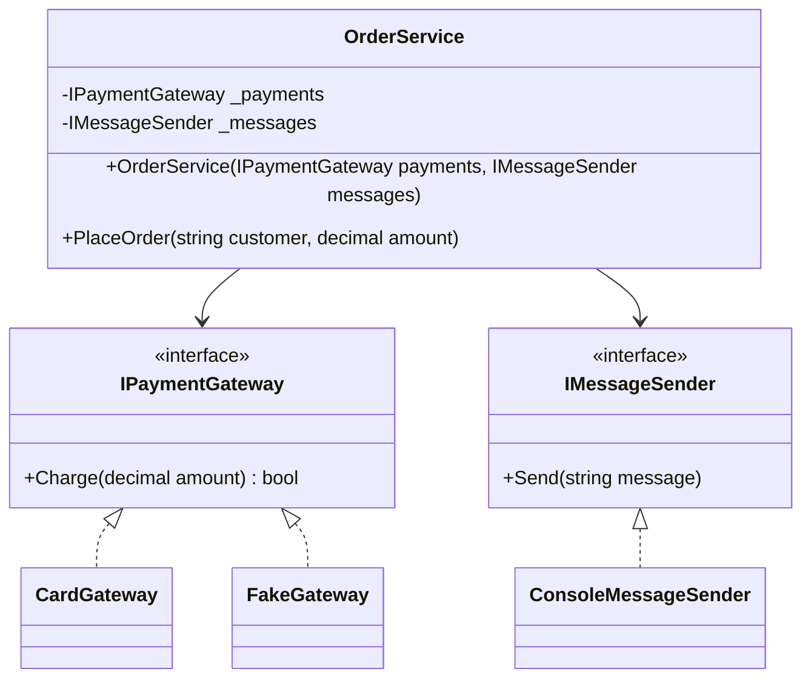
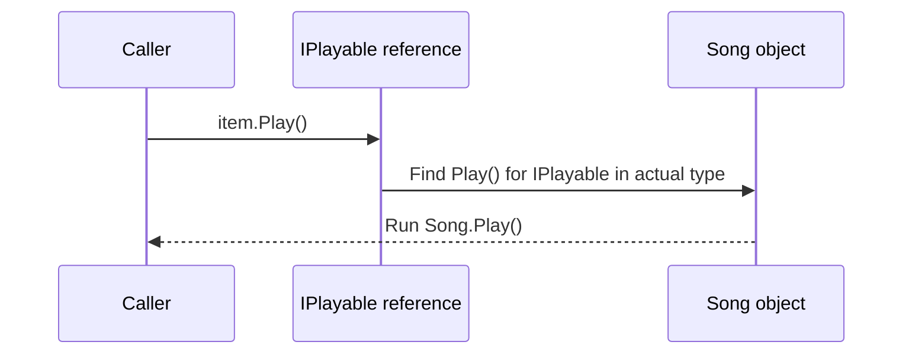
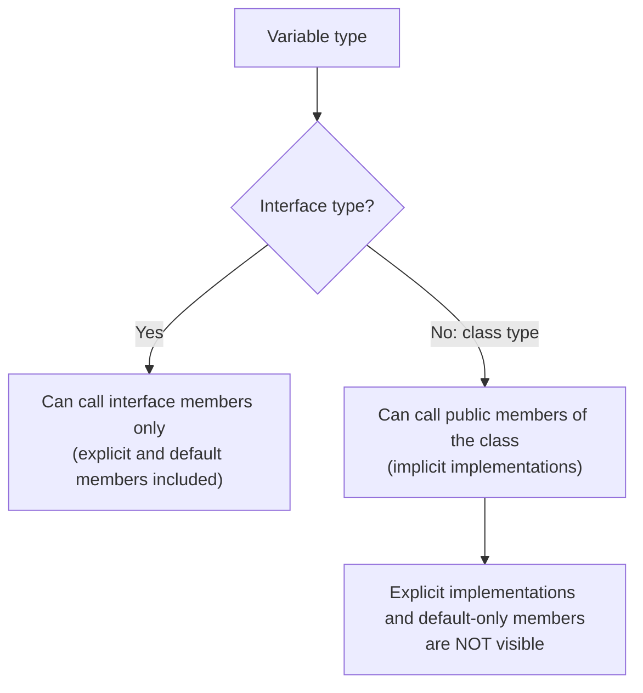
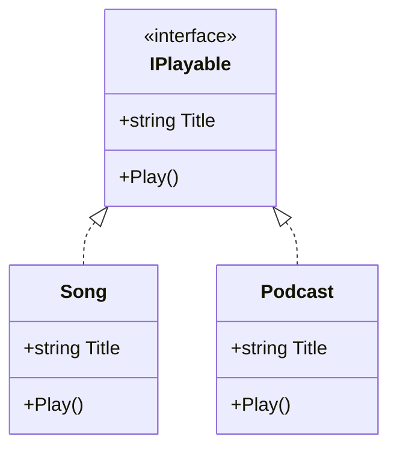
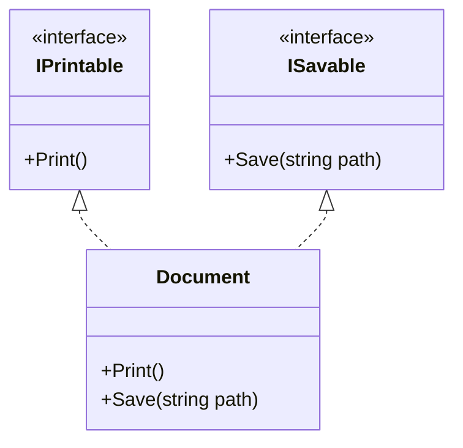
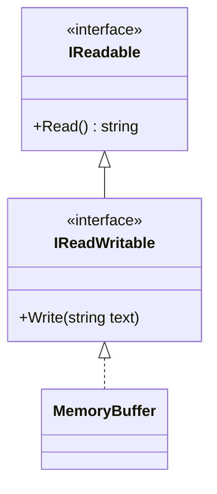

# 12. Interfaces

> Learn how to define pure contracts: interface basics, implementing one or many interfaces, explicit implementation, default interface implementations, interface-based design, and how interfaces enable dependency injection.

**Level:** 🟡 Core OOP
**Prerequisites:** [09. Inheritance](../09-inheritance/README.md), [10. Polymorphism](../10-polymorphism/README.md), [11. Abstraction](../11-abstraction/README.md)

---

## 📑 In This Chapter

1. Interface Basics
2. Implementing Interfaces
3. Multiple Interfaces
4. Interface Inheritance
5. Explicit Interface Implementation
6. Default Interface Implementations
7. Interface-Based Design
8. Dependency Injection Relationship
9. Common .NET Interfaces
10. Real-World Example
11. Interview Questions

---

## 🎯 Learning Objectives

By the end of this chapter you will be able to:

- Declare an interface and implement it in classes and structs.
- Implement multiple interfaces and combine them with a base class.
- Use **explicit interface implementation** to resolve conflicts and hide members.
- Explain what **default interface implementations** are and when (not) to use them.
- Design code around interfaces ("program to an interface").
- Explain how interfaces support **Dependency Injection** and the difference between **Dependency Inversion** and **Dependency Injection**.

---

## 📖 Concept

An **interface** is a **contract**: it declares **what** a type can do, without saying **how**. Any type that implements the interface promises to provide those members.

```csharp
public interface IPlayable
{
    string Title { get; }       // property
    void Play();                // method
}
```

| Fact | Detail |
|---|---|
| **Naming** | Convention: `I` prefix (`IPlayable`, `IDisposable`) |
| **Members** | Methods, properties, indexers, events (and, in modern C#, static members and default implementations) |
| **Access** | Members are `public` by default |
| **State** | **No instance fields** and **no constructors** |
| **Instantiation** | Cannot be instantiated; you create objects of types that implement it |
| **Relationship** | Models **"can do"** / **"behaves like"** (capability), rather than "is a" |

### Interface Basics

```csharp
public interface IShape
{
    string Name { get; }
    double Area();
}
```

Members written without a body are **implicitly abstract**: every implementing class must provide them.

You can use an interface as a **variable, parameter or return type**:

```csharp
IShape shape = new Circle(2);        // reference of the interface type
double area = shape.Area();          // dynamic dispatch to Circle.Area()
```

### Implementing Interfaces

A class lists the interface after the colon and provides **public** implementations of every member.

```csharp
public class Song : IPlayable
{
    public string Title { get; }

    public Song(string title) => Title = title;

    public void Play() => Console.WriteLine($"Playing song: {Title}");
}

public class Podcast : IPlayable
{
    public string Title { get; }

    public Podcast(string title) => Title = title;

    public void Play() => Console.WriteLine($"Playing podcast: {Title}");
}

IPlayable[] items = { new Song("Intro"), new Podcast("OOP Basics") };

foreach (var item in items)
    item.Play();
```

**Output**

```text
Playing song: Intro
Playing podcast: OOP Basics
```

Notes:

- Implementing members must be **`public`** (for normal/implicit implementation), otherwise error **CS0737**.
- A **property** in the interface (`string Title { get; }`) can be implemented with extra accessors (`{ get; set; }`).
- **Structs** can implement interfaces too (see [20. Boxing & Unboxing](../20-boxing-unboxing/README.md) for the boxing cost when used through an interface).
- Use `is`/`as` or pattern matching to check whether an object supports an interface (see [21. Type Casting](../21-type-casting/README.md)):

```csharp
if (item is IPlayable playable)
    playable.Play();
```

### Multiple Interfaces

A class can inherit from **one** base class but implement **any number** of interfaces.

```csharp
public interface IPrintable { void Print(); }
public interface ISavable   { void Save(string path); }

public class Document : IPrintable, ISavable
{
    public void Print() => Console.WriteLine("Printing document...");
    public void Save(string path) => Console.WriteLine($"Saving to {path}");
}

// One base class + several interfaces
public class Report : Document, IDisposable
{
    public void Dispose() => Console.WriteLine("Report disposed.");
}
```

This is C#'s answer to multiple inheritance: you can combine many **capabilities** without the diamond problem of multiple **implementation** inheritance (see [09. Inheritance](../09-inheritance/README.md)).

### Interface Inheritance

An interface can extend one or more other interfaces. Implementers must satisfy **all** of them.

```csharp
public interface IReadable { string Read(); }
public interface IReadWritable : IReadable { void Write(string text); }

public class MemoryBuffer : IReadWritable
{
    private string _content = "";

    public string Read() => _content;
    public void Write(string text) => _content = text;
}
```

### Explicit Interface Implementation

With **explicit implementation** you write `InterfaceName.Member` and **omit the access modifier**. The member is **only reachable through an interface reference**.

```csharp
public interface IFlyer  { string Move(); }
public interface ISwimmer { string Move(); }          // same member name!

public class Duck : IFlyer, ISwimmer
{
    string IFlyer.Move()   => "flies";                // explicit
    string ISwimmer.Move() => "swims";                // explicit
}

var duck = new Duck();
// duck.Move();                                       // ❌ not visible on Duck

Console.WriteLine(((IFlyer)duck).Move());             // flies
ISwimmer swimmer = duck;
Console.WriteLine(swimmer.Move());                    // swims
```

Use explicit implementation to:

| Purpose | Example |
|---|---|
| **Resolve name conflicts** | Two interfaces declare the same member name (above) |
| **Provide different behavior per interface** | `IFlyer.Move()` vs `ISwimmer.Move()` |
| **Hide members from the class's public API** | Interface members that make little sense on the concrete type (for example, arrays implement `IList<T>.Add` explicitly and it throws) |

Use it **sparingly**: hidden members surprise people who explore the class through IntelliSense.

### Default Interface Implementations

Since **C# 8**, an interface member can have a **body**. Implementing types do **not** have to provide it.

```csharp
public interface INotifier
{
    void Send(string message);                                  // required

    void SendUrgent(string message) => Send($"URGENT: {message}");   // default implementation
}

public class EmailNotifier : INotifier
{
    public void Send(string message) => Console.WriteLine($"Email: {message}");
    // SendUrgent not implemented: the default is used
}

INotifier notifier = new EmailNotifier();
notifier.SendUrgent("Server down");

// new EmailNotifier().SendUrgent("x");     // ❌ not accessible through the class type
```

**Output**

```text
Email: URGENT: Server down
```

Key points:

- Default members are reachable **through the interface type**, not through the implementing class's type (unless the class declares its own member).
- A class **can override** the default by implementing the member itself.
- Main purpose: **evolve a published interface** by adding a member without breaking every existing implementer.
- They are **not** a replacement for abstract classes or a way to share state: interfaces still have **no instance fields**.
- If two unrelated interfaces provide conflicting defaults for the same member, the implementing class must resolve the ambiguity itself.
- Requires a runtime that supports it (.NET Core 3.0+ / .NET 5+; not .NET Framework).

> Modern C# also allows **static members** in interfaces and **`static abstract`** members (C# 11, the basis of generic math). These are advanced features beyond the scope of this chapter.

### Interface-Based Design

**Program to an interface, not to an implementation.** Write your logic against interfaces so you can swap implementations without changing the logic.

```csharp
// ❌ Tied to a concrete class
public class ReportService
{
    private readonly EmailSender _sender = new EmailSender();
}

// ✅ Depends on a contract
public class ReportService
{
    private readonly IMessageSender _sender;
    public ReportService(IMessageSender sender) => _sender = sender;
}
```

Good interface design:

| Guideline | Why |
|---|---|
| **Small and focused** (role interfaces) | Implementers are not forced to provide unused members (Interface Segregation, [24. SOLID Principles](../24-solid-principles/README.md)) |
| **Named for a capability or role** (`IPayable`, `IComparable<T>`, `IMessageSender`) | Communicates intent |
| **Stable** | Changing a published interface breaks every implementer |
| **Free of implementation details** | Avoid leaking technology-specific types or concepts |
| **Created for a reason** | A real need for substitution, testing or multiple implementations |

### Dependency Injection Relationship

Two terms are often confused:

```text
Dependency Inversion  = Design Principle   (what to depend on: abstractions)
Dependency Injection  = Technique          (how dependencies are supplied: from outside)
```

- **Dependency Inversion Principle (DIP):** high-level code should not depend on low-level details; **both should depend on abstractions** (interfaces).
- **Dependency Injection (DI):** instead of a class creating its own dependencies with `new`, they are **passed in**, usually through the **constructor**.

Interfaces are the glue: the class declares *"I need something that can send messages"* (`IMessageSender`), and whoever creates the class decides which implementation to provide.

```csharp
public class OrderService
{
    private readonly IMessageSender _messages;                 // depends on an abstraction

    public OrderService(IMessageSender messages)               // dependency injected
        => _messages = messages;
}

var service = new OrderService(new EmailSender());             // choose the implementation outside
```

- You can apply DI **by hand**, as above, with no framework.
- **DI containers** (for example `Microsoft.Extensions.DependencyInjection`) automate the wiring by registering "interface → implementation" mappings. They are a convenience, not a requirement.
- You can use a DI container and still violate DIP (by injecting concrete classes), and you can follow DIP without a container.

The full discussion is in [24. SOLID Principles](../24-solid-principles/README.md).

### Common .NET Interfaces

| Interface | Meaning | Typical use |
|---|---|---|
| `IDisposable` | "I hold resources that must be released" | `using` statements ([23. Garbage Collection](../23-garbage-collection/README.md)) |
| `IComparable<T>` | "I can be ordered relative to another `T`" | Sorting |
| `IEquatable<T>` | "I can compare myself to another `T` for equality" | Value equality ([19. System.Object](../19-object-class/README.md)) |
| `IEnumerable<T>` | "I can be iterated" | `foreach` |
| `IFormattable` | "I can format myself with a format string" | `ToString("F2")` |

---

## 🤔 Why It Matters

- **Decoupling:** callers depend on a small contract, not on concrete classes.
- **Substitutability:** swap implementations (real, fake, alternative) without changing callers.
- **Testability:** inject a fake implementation in unit tests.
- **Flexible composition:** one class can fulfill several roles.
- **Cross-hierarchy polymorphism:** unrelated classes can be treated uniformly (`Song` and `Podcast` are both `IPlayable`).
- **Foundation of DI and SOLID:** Dependency Inversion, Interface Segregation and Open/Closed all rely on interfaces.

---

## 🧩 Syntax

```csharp
public interface IBase
{
    void Hello();
}

public interface IExample : IBase                       // interface inheritance
{
    string Name { get; }                                // property
    void DoWork(int amount);                            // method
    event EventHandler Changed;                         // event
    string this[int index] { get; }                     // indexer

    void Log(string text) => Console.WriteLine(text);   // default implementation (C# 8+)
}

public class Example : IExample
{
    public string Name => "Example";                    // implicit (public) implementation
    public void DoWork(int amount) { }
    public event EventHandler? Changed;
    public string this[int index] => "item " + index;

    void IBase.Hello() => Console.WriteLine("Hi");      // explicit implementation (no modifier)
}

IExample e = new Example();                             // interface-typed reference
```

---

## 💻 Basic Example

```csharp
public interface IPlayable
{
    string Title { get; }
    void Play();
}

public class Song : IPlayable
{
    public string Title { get; }

    public Song(string title) => Title = title;

    public void Play() => Console.WriteLine($"Playing song: {Title}");
}

public class Podcast : IPlayable
{
    public string Title { get; }

    public Podcast(string title) => Title = title;

    public void Play() => Console.WriteLine($"Playing podcast: {Title}");
}

public static class Player
{
    public static void PlayAll(IEnumerable<IPlayable> items)
    {
        foreach (var item in items)
            item.Play();
    }
}

Player.PlayAll(new IPlayable[] { new Song("Intro"), new Podcast("OOP Basics") });
```

**Output**

```text
Playing song: Intro
Playing podcast: OOP Basics
```

`Player` knows nothing about `Song` or `Podcast`. Adding a `Video : IPlayable` later needs **no change** to `Player`.

---

## 🌍 Real-World Example

An `OrderService` that receives its collaborators through **constructor injection**, so the same service works with a real gateway or a fake one in tests.

```csharp
public interface IPaymentGateway
{
    bool Charge(decimal amount);
}

public interface IMessageSender
{
    void Send(string message);
}

public class OrderService
{
    private readonly IPaymentGateway _payments;
    private readonly IMessageSender _messages;

    public OrderService(IPaymentGateway payments, IMessageSender messages)
    {
        ArgumentNullException.ThrowIfNull(payments);
        ArgumentNullException.ThrowIfNull(messages);

        _payments = payments;
        _messages = messages;
    }

    public void PlaceOrder(string customer, decimal amount)
    {
        if (_payments.Charge(amount))
            _messages.Send($"Order confirmed for {customer}: {amount:F2}");
        else
            _messages.Send($"Payment failed for {customer}");
    }
}

// Production-style implementations
public class CardGateway : IPaymentGateway
{
    public bool Charge(decimal amount)
    {
        Console.WriteLine($"Charging card: {amount:F2}");
        return true;
    }
}

public class ConsoleMessageSender : IMessageSender
{
    public void Send(string message) => Console.WriteLine(message);
}

// A fake for tests: controllable and has no real side effects
public class FakeGateway : IPaymentGateway
{
    private readonly bool _result;

    public FakeGateway(bool result) => _result = result;

    public bool Charge(decimal amount) => _result;
}

var service = new OrderService(new CardGateway(), new ConsoleMessageSender());
service.PlaceOrder("Nadia", 49.90m);

var failingService = new OrderService(new FakeGateway(false), new ConsoleMessageSender());
failingService.PlaceOrder("Sam", 10m);
```

**Output**

```text
Charging card: 49.90
Order confirmed for Nadia: 49.90
Payment failed for Sam
```

`OrderService` never uses `new` for its dependencies and never names a concrete gateway. The caller (the "composition root") chooses implementations. This is **Dependency Injection** applied **by hand**, guided by the **Dependency Inversion Principle**.



---

## 🧠 How It Works

### Interface dispatch

When you call a method through an interface reference, the CLR finds the **implementation in the object's actual type** at run time, just like a virtual call.

```csharp
IPlayable item = new Song("Intro");
item.Play();                      // runtime picks Song.Play()
```



### Which members can you call?



```csharp
var duck = new Duck();
// duck.Move();                         // ❌ explicit implementation: not on the class type
((IFlyer)duck).Move();                  // ✅ through the interface
```

### Interface vs implicit vs explicit implementation

| | Implicit | Explicit |
|---|---|---|
| **Syntax** | `public void Play()` | `void IPlayable.Play()` |
| **Access modifier** | `public` required | Not allowed |
| **Visible on class type** | ✅ | ❌ (interface reference only) |
| **Visible on interface type** | ✅ | ✅ |
| **Use for** | Normal case | Conflicts, hiding, per-interface behavior |

### Structs and boxing

A struct that implements an interface is **boxed** when you store it in an interface variable. For performance-sensitive code this matters; see [20. Boxing & Unboxing](../20-boxing-unboxing/README.md).

### Why default implementations do not give you multiple inheritance of state

Interfaces still cannot declare instance fields, so a default implementation can only use other interface members. There is no shared state, so the **diamond problem of state** does not arise.

---

## 📊 Diagram







*(Larger diagrams live in [`/diagrams`](../diagrams).)*

---

## ⚔️ Important Comparisons

### Interface vs abstract class (overview)

| Aspect | Interface | Abstract class |
|---|---|---|
| **Instance fields / state** | ❌ | ✅ |
| **Constructors** | ❌ | ✅ |
| **Implementation** | Only default members (C# 8+) | ✅ Full |
| **Number allowed per class** | **Many** | **One** base class |
| **Access modifiers on members** | Public by default (modern C# allows more) | Any |
| **Models** | Capability ("can do") | Shared base ("is a" + shared code) |
| **Adding a member later** | Safe only via default implementation | Safe with a `virtual` member |

Detailed guidance is in [15. Abstract Class vs Interface](../15-abstract-class-vs-interface/README.md).

### Dependency Inversion vs Dependency Injection

| Aspect | Dependency **Inversion** (DIP) | Dependency **Injection** (DI) |
|---|---|---|
| **What it is** | A **design principle** (the "D" in SOLID) | A **technique/pattern** |
| **Says** | Depend on **abstractions**, not concretions | **Supply** dependencies from outside |
| **Concerned with** | Direction of dependencies | How objects get their collaborators |
| **Needs an interface** | Yes (an abstraction) | Typically, yes |
| **Needs a container** | No | No (containers are optional helpers) |
| **Forms** | n/a | Constructor, method, property injection |

### Implicit vs explicit implementation

| | Implicit | Explicit |
|---|---|---|
| **Callable on the class type** | ✅ | ❌ |
| **Resolves same-name conflicts** | ❌ (one shared method) | ✅ |
| **Recommended default** | ✅ | Only when needed |

---

## ⚠️ Common Mistakes

1. ❌ **Implementing an interface member without `public`.** Error CS0737. Fix: make the implementation `public` (or use explicit implementation).
2. ❌ **Expecting a default interface member to be callable on the class type.** `new EmailNotifier().SendUrgent()` does not compile. Fix: call it through the interface type, or implement it in the class.
3. ❌ **"Fat" interfaces** with many unrelated members. Implementers are forced to write empty or `throw new NotImplementedException()` methods. Fix: split into small, role-focused interfaces.
4. ❌ **An interface for every class "just in case".** A one-implementation interface with no testing or substitution need adds noise. Fix: introduce an interface when a real need exists.
5. ❌ **Changing a published interface.** Adding a required member breaks every implementer. Fix: add a new interface (for example `IFooV2`) or use a default implementation.
6. ❌ **Creating dependencies with `new` inside a class** that is meant to use an interface. The abstraction is defeated. Fix: inject the dependency through the constructor.
7. ❌ **Casting an interface back to its concrete type** (`(CardGateway)gateway`). It breaks the abstraction. Fix: add the needed member to the interface, or rethink the design.
8. ❌ **Leaking implementation details in interface members** (SQL strings, file paths, `HttpResponse`). Fix: design the contract around the domain.
9. ❌ **Overusing explicit implementation.** Hidden members confuse users. Fix: use implicit implementation by default.
10. ❌ **Confusing DI containers with the Dependency Inversion Principle.** Injecting concrete classes via a container still violates DIP. Fix: inject abstractions.
11. ❌ **Putting state expectations in an interface contract** (for example, assuming an implementer stores something). Interfaces cannot declare instance fields. Fix: use an abstract class if you need shared state.
12. ❌ **Using a struct through an interface in hot paths** without realizing it boxes. Fix: use generics with constraints, or avoid the interface variable.
13. ❌ **Forgetting the `I` prefix convention.** Not an error, but it makes interfaces harder to recognize. Fix: follow .NET naming conventions.

---

## ✅ Best Practices

- Keep interfaces **small and cohesive** (one role or capability).
- **Name by capability or role**: `IPayable`, `IMessageSender`, `IComparable<T>`.
- **Program to interfaces** at architectural boundaries (data access, external services, clocks, file systems).
- Use **constructor injection** with `readonly` fields and null checks.
- Compose objects in **one place** (the composition root), not scattered `new` calls.
- Use **implicit** implementation by default; **explicit** only to resolve conflicts or hide members.
- Use **default interface implementations** to evolve interfaces, not to build base-class-like hierarchies.
- Use an **abstract class** when implementers need shared state or constructor logic.
- Make **generic interfaces** (`IRepository<T>`) when type safety matters.
- **Document the contract**: valid inputs, expected exceptions, ordering and threading guarantees.
- Keep implementations **substitutable** (Liskov Substitution): no surprises compared to the contract.
- Prefer **composition of small interfaces** over a large inheritance hierarchy.

---

## 🎯 Interview Questions

**Q1. What is an interface in C#?**

A contract that declares members (methods, properties, events, indexers) that implementing types must provide. It specifies what a type can do without prescribing how, and cannot hold instance state or constructors.

**Q2. Can an interface have fields or constructors?**

No instance fields and no constructors. (Modern C# allows static members in interfaces, but not instance state.)

**Q3. Can a class implement multiple interfaces?**

Yes. A class can implement any number of interfaces, while inheriting from only one base class.

**Q4. Why does C# allow multiple interfaces but not multiple class inheritance?**

Interfaces define contracts without instance state, so they avoid the ambiguity (the diamond problem) that arises when inheriting implementation and state from multiple classes.

**Q5. What is explicit interface implementation and when do you use it?**

Implementing a member as `InterfaceName.Member` without an access modifier, so it is only accessible through an interface reference. It is used to resolve name conflicts between interfaces, give different behavior per interface, or hide members from the class's public API.

**Q6. What are default interface implementations?**

A C# 8 feature that lets an interface member include a body. Implementing types need not provide it, and it is reachable through the interface type. It mainly enables adding members to published interfaces without breaking existing implementers.

**Q7. Can you call a default interface member on the class instance directly?**

Not unless the class itself declares that member. The default is accessible through an interface-typed reference.

**Q8. What is the difference between an interface and an abstract class?**

An abstract class can hold state, have constructors and full implementations, but a class can inherit only one. An interface is a pure contract (plus optional default members), and a class can implement many. See [15. Abstract Class vs Interface](../15-abstract-class-vs-interface/README.md).

**Q9. Can an interface inherit from another interface?**

Yes, and from several. A class implementing the derived interface must implement all members from the whole chain.

**Q10. What is the difference between Dependency Inversion and Dependency Injection?**

Dependency Inversion is a design principle: high-level and low-level code should depend on abstractions. Dependency Injection is a technique: dependencies are provided to a class from outside, typically through its constructor. DI is one way to achieve DIP, and neither requires a DI container.

**Q11. How do interfaces help with unit testing?**

Code that depends on an interface can receive a fake or mock implementation in tests, avoiding real databases, networks or clocks, which makes tests fast and deterministic.

**Q12. What is the Interface Segregation Principle?**

Clients should not be forced to depend on members they do not use. Prefer several small, specific interfaces over one large one.

**Q13. What happens when a struct is assigned to an interface variable?**

It is boxed: the value is copied into a heap-allocated object, which has a performance cost and copy semantics that can surprise you.

**Q14. Must interface implementations be `public`?**

For implicit implementations, yes. Explicit implementations have no access modifier and are reachable only via the interface.

**Q15. Name some commonly used .NET interfaces.**

`IDisposable`, `IEnumerable<T>`, `IComparable<T>`, `IEquatable<T>`, `IFormattable`, `IList<T>`.

---

## 📝 Practice Problems

| # | Problem | Difficulty | Solution |
|:-:|---|:-:|:-:|
| 1 | Create an `IShape` interface with `Area()` and implement it in `Circle` and `Rectangle`. Put them in an `IShape[]` and print each area. | 🟢 | [View →](../solutions/12-interfaces/) |
| 2 | Create `IPlayable` and implement it in `Song`, `Podcast` and `Video`. Write a method that plays any `IEnumerable<IPlayable>`. | 🟢 | [View →](../solutions/12-interfaces/) |
| 3 | Make a `Document` class implement both `IPrintable` and `ISavable`. | 🟢 | [View →](../solutions/12-interfaces/) |
| 4 | Create `IReadable` and `IReadWritable : IReadable`, and implement them in a `MemoryBuffer`. | 🟡 | [View →](../solutions/12-interfaces/) |
| 5 | Implement two interfaces that both declare `Move()` using explicit implementation. Show how to call each. | 🟡 | [View →](../solutions/12-interfaces/) |
| 6 | Add a default interface method `SendUrgent` to `INotifier`. Show that it is not callable on the class type. | 🟡 | [View →](../solutions/12-interfaces/) |
| 7 | Implement `IComparable<Student>` so a list of students sorts by grade. | 🟡 | [View →](../solutions/12-interfaces/) |
| 8 | Implement `IDisposable` on a class and use it in a `using` statement. | 🟡 | [View →](../solutions/12-interfaces/) |
| 9 | Refactor a class that creates `new EmailSender()` internally to use constructor injection with `IMessageSender`. Add a fake for testing. | 🟠 | [View →](../solutions/12-interfaces/) |
| 10 | Take a "fat" `IWorker` interface (`Work`, `Eat`, `Sleep`, `Code`) and split it into focused interfaces so `Robot` is not forced to implement `Eat`. | 🟠 | [View →](../solutions/12-interfaces/) |
| 11 | Build an `IClock` interface with a real and a fixed implementation, and inject it into a class that depends on the current time. | 🟠 | [View →](../solutions/12-interfaces/) |

Starter files: [`/exercises/12-interfaces`](../exercises/12-interfaces/)

---

## 🔑 Key Takeaways

- An **interface** is a contract of **what** a type can do; it has no instance state or constructors.
- A class has **one** base class but may implement **many** interfaces.
- Implicit implementations are `public`; **explicit** implementations (`IFoo.Method()`) are reachable only through the interface and resolve name conflicts.
- **Default interface implementations** (C# 8+) let you evolve interfaces without breaking implementers; they are visible through the interface type.
- **Program to interfaces**: small, role-focused, well-named, and created for a real need.
- Interfaces enable **polymorphism across unrelated types**, **testing with fakes**, and **flexible composition**.
- **Dependency Inversion = design principle; Dependency Injection = technique.** Interfaces are the abstractions that connect them, and a DI container is optional.

---

[⬅ Previous: Abstraction](../11-abstraction/README.md)
&nbsp;&nbsp;•&nbsp;&nbsp;
[🏠 Main README](../README.md)
&nbsp;&nbsp;•&nbsp;&nbsp;
[Next: Static Members ➡](../13-static-members/README.md)