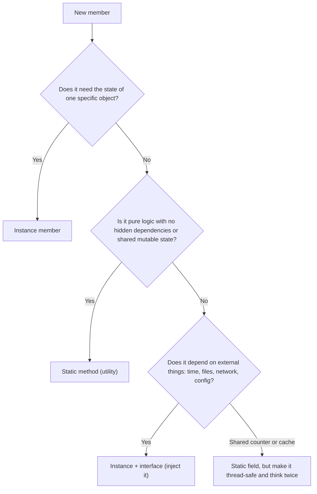
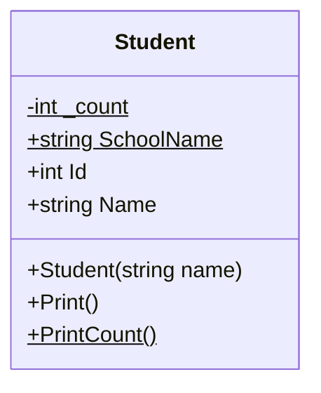
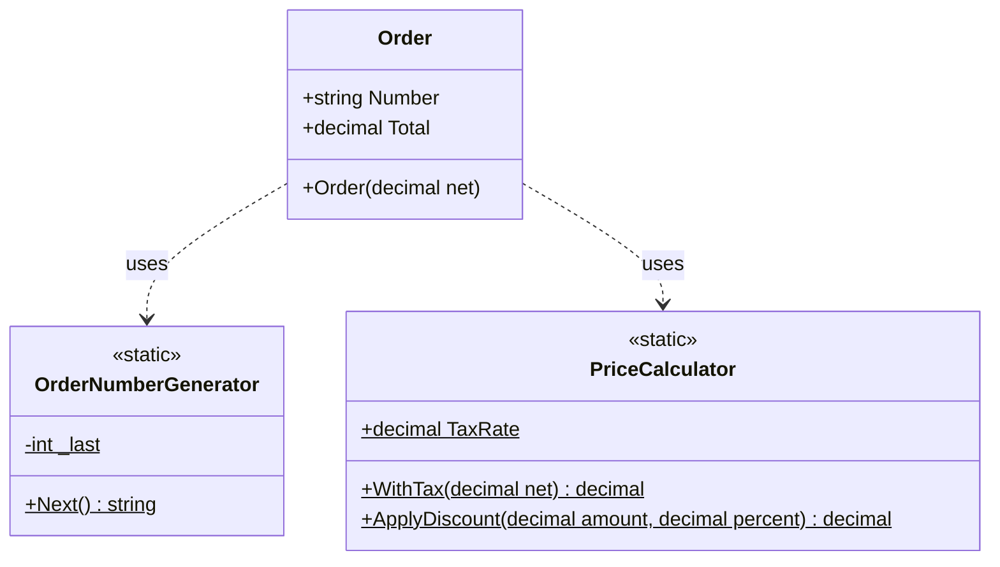
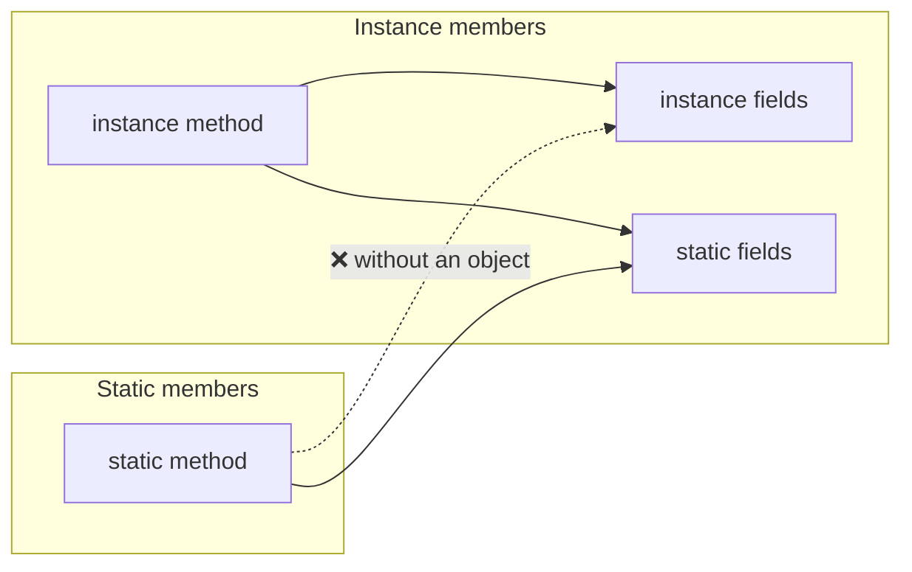

# 13. Static Members

> Learn what belongs to a type instead of an object: static fields, methods, properties, constructors and classes, how they differ from instance members, and when static is a good (or bad) design choice.

**Level:** 🟠 Intermediate
**Prerequisites:** [04. Fields](../04-fields/README.md), [06. Methods](../06-methods/README.md), [07. Constructors](../07-constructors/README.md)

---

## 📑 In This Chapter

1. What Does `static` Mean?
2. Static Fields
3. Static Methods
4. Static Properties
5. Static Constructors
6. Static Classes
7. Static vs Instance Members
8. Static Members and Inheritance
9. Thread Safety and Lifetime
10. Real-World Example
11. Interview Questions

---

## 🎯 Learning Objectives

By the end of this chapter you will be able to:

- Explain that a `static` member belongs to the **type**, not to any object.
- Declare and use static fields, methods, properties, constructors and classes.
- State exactly which members a static method can and cannot access.
- Choose between a static class, a singleton and a normal instance class.
- Recognize the risks of **shared mutable static state** (testing, threading, memory).
- Apply best practices for static utilities and counters.

---

## 📖 Concept

A **static member** belongs to the **type itself**. There is **one copy** shared by everyone, and you reach it through the **type name**, not through an object.

```csharp
public class Counter
{
    public static int Total;        // belongs to Counter (one copy)
    public int Value;               // belongs to each Counter object

    public static void Reset() => Total = 0;
}

Counter.Total = 5;                  // via the type name
Counter.Reset();
```

| | Instance member | Static member |
|---|---|---|
| **Belongs to** | Each object | The type |
| **Copies** | One per object | One per type (per closed generic type) |
| **Accessed with** | `objectName.Member` | `TypeName.Member` |
| **Needs an object** | ✅ | ❌ |
| **Has `this`** | ✅ | ❌ |

### Static Fields

A **static field** stores data **shared by all instances** (and usable without any instance).

```csharp
public class Visitor
{
    public static int TotalVisitors;          // shared
    public string Name { get; }               // per object

    public Visitor(string name)
    {
        Name = name;
        TotalVisitors++;                      // every new object updates the shared counter
    }
}

var a = new Visitor("Ana");
var b = new Visitor("Ben");

Console.WriteLine(Visitor.TotalVisitors);     // 2
// Console.WriteLine(a.TotalVisitors);        // ❌ CS0176: use the type name, not an instance
```

Facts:

- Initialized **once**, before first use of the type (see [Static Constructors](#static-constructors)).
- In a **generic** type, each closed type has its own copy: `Box<int>` and `Box<string>` do not share static fields.
- Combine with `readonly` or `const` for shared fixed values (see [04. Fields](../04-fields/README.md)).

### Static Methods

A **static method** is called on the type and has **no `this`**.

```csharp
public class Demo
{
    private int _instanceValue = 1;
    private static int _staticValue = 2;

    public static void StaticMethod()
    {
        Console.WriteLine(_staticValue);          // ✅ static member
        // Console.WriteLine(_instanceValue);     // ❌ CS0120: an object reference is required
    }

    public void InstanceMethod()
    {
        Console.WriteLine(_staticValue);          // ✅ instance methods can use static members
        Console.WriteLine(_instanceValue);        // ✅
    }
}
```

**The access rule:**

```text
Instance member  ──can use──►  instance members AND static members
Static member    ──can use──►  static members only (unless it is given an object to work with)
```

A static method **can** use instance members if you pass it an object:

```csharp
public static void Describe(Demo demo) { /* demo._instanceValue accessible here, inside the class */ }
```

Typical uses: utility functions (`Math.Max`), factory methods (`Account.Open(...)`), `Parse`/`TryParse` methods, extension methods (see [06. Methods](../06-methods/README.md)).

### Static Properties

A property can be `static`, usually exposing a static field or a computed shared value.

```csharp
public class AppInfo
{
    private static int _instancesCreated;

    public static string Name { get; } = "Handbook";                 // static auto-property
    public static int InstancesCreated => _instancesCreated;         // static computed property
    public static DateTime Now => DateTime.UtcNow;                   // computed on each read

    public AppInfo() => _instancesCreated++;
}
```

The framework uses them widely: `DateTime.Now`, `Environment.NewLine`, `String.Empty`.

### Static Constructors

Initializes **static state**, **once**, automatically. (Covered in depth in [07. Constructors](../07-constructors/README.md).)

```csharp
public class Config
{
    public static readonly string Environment;

    static Config()                                   // no modifier, no parameters
    {
        Environment = "Development";
    }
}
```

| Rule | Detail |
|---|---|
| Access modifier / parameters | None allowed |
| Count | At most one per class |
| Runs | Once, before the first instance is created or the first static member is accessed |
| If it throws | `TypeInitializationException`, and the type is unusable |

### Static Classes

A **static class** contains **only static members**. It cannot be instantiated or inherited.

```csharp
public static class TemperatureConverter
{
    public const double AbsoluteZeroCelsius = -273.15;

    public static double CelsiusToFahrenheit(double c) => c * 9 / 5 + 32;
    public static double FahrenheitToCelsius(double f) => (f - 32) * 5 / 9;
}

double f = TemperatureConverter.CelsiusToFahrenheit(100);   // 212
// var t = new TemperatureConverter();                      // ❌ cannot instantiate a static class
```

Rules:

- All members must be `static` (instance members are a compile error).
- No instance constructors; a static constructor is allowed.
- Implicitly `sealed` and `abstract` in compiled form, so it cannot be inherited.
- Cannot implement interfaces or derive from any class other than `object`.
- Perfect for **stateless utilities** and for hosting **extension methods**.

Familiar examples: `Math`, `Console`, `File`, `Path`, `Convert`.

**`using static`** imports a static class's members so you can call them without the type name:

```csharp
using static System.Math;

double r = Sqrt(16) + Max(3, 7);       // instead of Math.Sqrt / Math.Max
```

### Static vs Instance Members

A quick decision guide:



| Aspect | Static | Instance |
|---|---|---|
| **State** | Shared by the whole type | Private to the object |
| **Memory lifetime** | For the life of the process (effectively) | Until the object is unreachable |
| **Polymorphism** | ❌ Cannot be `virtual`/`override`/`abstract` | ✅ |
| **Implements interfaces** | ❌ (a static class cannot) | ✅ |
| **Replaceable in tests** | Hard | Easy (inject a fake) |
| **Thread safety** | Your responsibility (shared) | Usually per object |

### Static Members and Inheritance

Static members are **not polymorphic**. They cannot be `virtual`, `abstract` or `override`.

```csharp
public class Base    { public static string Who() => "Base"; }
public class Derived : Base { }

Console.WriteLine(Derived.Who());      // Base  (accessible through Derived, but it is Base's member)
```

- They are accessible through derived type names, but there is **one** member, owned by the base.
- A derived class may declare its own static member with `new`, which only hides (never overrides) the base one.
- (Modern C# also supports `static abstract`/`static virtual` members **in interfaces**, the basis of generic math. That is an advanced topic outside this chapter.)

### Thread Safety and Lifetime

Static state is **shared across the whole application**, including all threads.

```csharp
// ❌ Race condition: two threads can read the same value and both write back count + 1
private static int _count;
public static void Increment() => _count++;

// ✅ Atomic update
public static void Increment() => Interlocked.Increment(ref _count);
```

For shared collections use thread-safe types (`ConcurrentDictionary<TKey,TValue>`) or protect access with `lock`.

**Lifetime:** static fields live as long as the application (loaded type). Anything a static field **references stays reachable**, so it cannot be garbage-collected. Unbounded static caches, static event subscriptions and static lists that only grow are classic **memory leaks** (see [23. Garbage Collection](../23-garbage-collection/README.md)).

---

## 🤔 Why It Matters

- **Utilities without objects:** `Math.Max(a, b)` needs no `Math` instance.
- **Shared data and counters:** IDs, instance counts, configuration read once.
- **Factories and parsing:** `int.Parse`, `Account.Open(...)`.
- **Extension methods** require static classes.
- **But also a risk:** static state is global state. It makes code harder to test, reason about and run concurrently. Knowing when **not** to use static is as important as knowing the syntax.

---

## 🧩 Syntax

```csharp
public class Sample
{
    public static int Counter;                            // static field
    public static readonly string Version = "1.0";        // static readonly field
    public const int MaxItems = 10;                       // const (implicitly static)

    public static string Name { get; set; } = "Sample";   // static property

    static Sample()                                       // static constructor
    {
        Counter = 0;
    }

    public static void Reset() => Counter = 0;            // static method

    public int Value { get; set; }                        // instance property
    public void Show() => Console.WriteLine($"{Value} / {Counter}");   // instance method using static
}

public static class Helpers                               // static class
{
    public static int Double(int x) => x * 2;
}

Sample.Reset();                                           // call via the type name
int d = Helpers.Double(21);
```

---

## 💻 Basic Example

```csharp
public class Student
{
    private static int _count;                                  // shared counter

    public static string SchoolName { get; set; } = "Greenfield High";   // shared setting

    public int Id { get; }
    public string Name { get; }

    public Student(string name)
    {
        _count++;
        Id = _count;
        Name = name;
    }

    public void Print() => Console.WriteLine($"#{Id} {Name} ({SchoolName})");

    public static void PrintCount() => Console.WriteLine($"Total students: {_count}");
}

Student.SchoolName = "Riverdale High";      // change shared state before any object exists

var ana = new Student("Ana");
var ben = new Student("Ben");

ana.Print();
ben.Print();
Student.PrintCount();
```

**Output**

```text
#1 Ana (Riverdale High)
#2 Ben (Riverdale High)
Total students: 2
```

`Id` and `Name` belong to each student. `_count` and `SchoolName` belong to the `Student` type and are shared.

---

## 🌍 Real-World Example

A thread-safe static ID generator, a stateless static utility class, and an `Order` that uses both.

```csharp
using System.Threading;

public static class OrderNumberGenerator                   // static class with shared state
{
    private static int _last = 1000;

    public static string Next() => $"ORD-{Interlocked.Increment(ref _last)}";   // thread-safe
}

public static class PriceCalculator                        // stateless utility: ideal for static
{
    public const decimal TaxRate = 0.15m;

    public static decimal WithTax(decimal net) => net * (1 + TaxRate);

    public static decimal ApplyDiscount(decimal amount, decimal percent)
        => amount * (1 - percent / 100m);
}

public class Order
{
    public string Number { get; } = OrderNumberGenerator.Next();
    public decimal Total { get; }

    public Order(decimal net) => Total = PriceCalculator.WithTax(net);
}

var first = new Order(100m);
var second = new Order(200m);

Console.WriteLine($"{first.Number}: {first.Total:F2}");
Console.WriteLine($"{second.Number}: {second.Total:F2}");
Console.WriteLine($"After 10% discount: {PriceCalculator.ApplyDiscount(second.Total, 10):F2}");
```

**Output**

```text
ORD-1001: 115.00
ORD-1002: 230.00
After 10% discount: 207.00
```

`PriceCalculator` is a good static class: it has **no state**, **no dependencies** and gives the **same output for the same input**. `OrderNumberGenerator` is acceptable because it uses an atomic operation, but note that anything depending on it is harder to test because the counter is global.

---

## 🧠 How It Works

### Where static members live

```text
 Type: Student                          (one set, shared)
 ┌───────────────────────────────────┐
 │ static  _count      = 2           │
 │ static  SchoolName  = "Riverdale" │
 │ static method  PrintCount()       │
 └───────────────────────────────────┘

 Object ana              Object ben              (one set per object)
 ┌─────────────────┐     ┌─────────────────┐
 │ Id   = 1        │     │ Id   = 2        │
 │ Name = "Ana"    │     │ Name = "Ben"    │
 └─────────────────┘     └─────────────────┘
```

The runtime stores static fields **once per type**. Instance fields are stored **inside each object**.

### Why a static method cannot touch instance members

An instance method receives a hidden `this` argument (the object). A static method does not. With no object, there is no "which `_instanceValue`?", so the compiler rejects the access (error **CS0120**).

### Static initialization

- Static field initializers and the static constructor run **once**, before the type is first used.
- They run in **textual order** within a class.
- With an explicit static constructor, the runtime runs it precisely before the first instance creation or first static member access.
- If initialization throws, you get a `TypeInitializationException`, and the type cannot be used for the rest of the process.

### Static state and testing

```csharp
// ❌ Hard to test: depends on the real clock through a static member
public class Invoice
{
    public bool IsOverdue(DateTime dueDate) => DateTime.UtcNow > dueDate;
}

// ✅ Testable: the clock is an injected abstraction (see 12. Interfaces)
public interface IClock { DateTime UtcNow { get; } }

public class Invoice
{
    private readonly IClock _clock;
    public Invoice(IClock clock) => _clock = clock;

    public bool IsOverdue(DateTime dueDate) => _clock.UtcNow > dueDate;
}
```

Anything involving **time, randomness, files, network or configuration** is usually better behind an instance and an interface than behind a static call.

### Static class vs singleton

| Aspect | Static class | Singleton (instance + private constructor) |
|---|---|---|
| **Instances** | None | Exactly one |
| **Can implement interfaces** | ❌ | ✅ |
| **Can be passed as a parameter** | ❌ | ✅ |
| **Can be replaced by a fake** | ❌ | ✅ (behind an interface) |
| **Lazy / controlled initialization** | Limited | ✅ |
| **Can hold state** | Yes (global) | Yes (but still global) |
| **Best for** | Stateless helpers | A truly single shared service, ideally injected |

---

## 📊 Diagram







*(Larger diagrams live in [`/diagrams`](../diagrams).)*

---

## ⚔️ Important Comparisons

### `static` vs `const` vs `static readonly` vs instance field

| | `const` | `static readonly` | `static` (mutable) | Instance field |
|---|:-:|:-:|:-:|:-:|
| **Shared by all objects** | ✅ | ✅ | ✅ | ❌ |
| **Can change after init** | ❌ | ❌ | ✅ | ✅ |
| **Value known at compile time** | ✅ | ❌ | ❌ | ❌ |
| **Any type** | ❌ | ✅ | ✅ | ✅ |
| **Risk** | Baked into callers | Low | **Global mutable state** | Low |

### Static method vs instance method vs extension method

| Aspect | Static | Instance | Extension |
|---|---|---|---|
| **Declared in** | Any class | Any class | A static class |
| **Call syntax** | `Type.Method()` | `obj.Method()` | `obj.Method()` |
| **Uses object state** | Only if passed in | ✅ | Only through public members |
| **Overridable** | ❌ | ✅ (`virtual`) | ❌ |
| **Testable via substitution** | Hard | Easy | Hard |

### Static class vs normal class

| Aspect | Static class | Normal class |
|---|---|---|
| **Instantiable** | ❌ | ✅ |
| **Inheritable** | ❌ | ✅ (unless `sealed`) |
| **Instance members** | ❌ | ✅ |
| **Interfaces** | ❌ | ✅ |
| **Use for** | Stateless utilities, extension methods | Everything with identity and state |

---

## ⚠️ Common Mistakes

1. ❌ **Accessing a static member through an instance** (`obj.Total`). Error CS0176. Fix: use `TypeName.Total`.
2. ❌ **Using instance members inside a static method.** Error CS0120. Fix: pass the object in, or make the method an instance method.
3. ❌ **Mutable shared static state** used as a global variable. It couples unrelated code and is hard to test. Fix: use instances and inject dependencies.
4. ❌ **Non-atomic static counters** (`_count++`) in multithreaded code. A race condition loses updates. Fix: `Interlocked`, `lock`, or a thread-safe collection.
5. ❌ **Static classes for things with dependencies** (database, clock, email). They cannot be replaced in tests. Fix: instance class + interface + constructor injection.
6. ❌ **Unbounded static caches or static event subscriptions.** Referenced objects never get collected (memory leak). Fix: bound the cache, unsubscribe, or use weak references.
7. ❌ **Throwing in a static constructor.** The type becomes unusable (`TypeInitializationException`). Fix: keep static initialization simple and safe.
8. ❌ **Making everything static "for convenience."** The code becomes procedural, with hidden dependencies. Fix: use instances where state or behavior varies.
9. ❌ **Expecting `static` members to be polymorphic.** They cannot be `virtual` or `override`. Fix: use instance members with `virtual`/`override`, or interfaces.
10. ❌ **Expecting a shared static in a generic class.** `Box<int>` and `Box<string>` have separate statics. Fix: move shared state to a non-generic class.
11. ❌ **A `static readonly` collection that is mutable.** `static readonly List<string>` can still be modified. Fix: expose an immutable or read-only view.
12. ❌ **Depending on static initialization order** between fields or across types. Fix: avoid order-sensitive initialization, or use `Lazy<T>`.

---

## ✅ Best Practices

- Use `static` for **stateless, side-effect-free utilities** (math, formatting, conversions).
- **Avoid mutable static state**; if unavoidable, make it **thread-safe** and as private as possible.
- Keep static classes **small and cohesive**: `PriceCalculator`, not `Utils` or `Helpers` with everything inside.
- Put **extension methods** in clearly named static classes.
- Use **static factory methods** with a private constructor when creation needs a name or validation (see [07. Constructors](../07-constructors/README.md)).
- For anything involving **time, I/O, randomness or configuration**, use an **interface and inject it** (see [12. Interfaces](../12-interfaces/README.md)).
- Prefer a **`static readonly`** field over `const` for values that may change between releases (see [04. Fields](../04-fields/README.md)).
- Use **`Interlocked`**, `lock` or concurrent collections for shared updates.
- **Do not hide dependencies** inside static methods.
- Use `using static` sparingly, where it improves readability (`Math` functions).
- Name static members clearly so it is obvious they are shared (`TotalVisitors`, `Instance`, `Default`).

---

## 🎯 Interview Questions

**Q1. What is a static member?**

A member that belongs to the type itself rather than to any object. There is one shared copy, and it is accessed through the type name.

**Q2. What is the difference between static and instance members?**

Instance members belong to each object and need an object to be used. Static members belong to the type, exist once, and are used through the type name without creating an object.

**Q3. Can a static method access instance members?**

Not directly, because it has no `this`. It can access instance members only through an object that is passed to it or created inside it.

**Q4. Can an instance method access static members?**

Yes. Instance methods can use both instance and static members of the same type.

**Q5. When is a static constructor called?**

Automatically, exactly once, before the first instance of the type is created or any static member is accessed. It has no parameters and no access modifier.

**Q6. What is a static class?**

A class declared `static` that contains only static members. It cannot be instantiated, inherited, or implement interfaces. It is used for stateless utilities and extension methods.

**Q7. What is the difference between a static class and a singleton?**

A static class has no instances and cannot implement interfaces or be passed around. A singleton is a normal class restricted to one instance, so it can implement interfaces, be injected and be replaced in tests.

**Q8. Can static members be `virtual`, `abstract` or `override`?**

No, not in classes. Static members are not polymorphic. (Static abstract/virtual members exist only in interfaces, for features like generic math.)

**Q9. Are static fields shared between generic type instantiations?**

No. Each closed generic type, such as `Box<int>` and `Box<string>`, has its own set of static fields.

**Q10. Are static fields thread-safe?**

No. They are shared across all threads, so concurrent reads and writes need synchronization (for example `Interlocked`, `lock`, or thread-safe collections).

**Q11. Why can static members cause memory leaks?**

Static fields live for the lifetime of the application, so any object they reference remains reachable and cannot be garbage-collected. Growing static caches, lists or event subscriptions are common causes.

**Q12. Why are static methods harder to unit test?**

They cannot be replaced with fakes through normal substitution, and if they depend on global state or external resources (time, files, network), tests become slow or non-deterministic.

**Q13. What is `using static`?**

A directive that imports the static members of a type so they can be called without the type name, for example `using static System.Math;` lets you write `Sqrt(16)`.

**Q14. Can a static class have a constructor?**

It cannot have an instance constructor, but it can have a static constructor.

**Q15. Can you access a static member through an instance variable?**

No. The compiler reports error CS0176. Use the type name instead.

---

## 📝 Practice Problems

| # | Problem | Difficulty | Solution |
|:-:|---|:-:|:-:|
| 1 | Add a static counter to a `Product` class that tracks how many products were created. Print it with a static method. | 🟢 | [View →](../solutions/13-static-members/) |
| 2 | Create a static class `MathHelper` with `Square`, `Cube` and `IsPrime`. | 🟢 | [View →](../solutions/13-static-members/) |
| 3 | Reproduce errors CS0120 and CS0176 on purpose and fix both. | 🟢 | [View →](../solutions/13-static-members/) |
| 4 | Create a `TemperatureConverter` static class and use `using static` to call it without the type name. | 🟡 | [View →](../solutions/13-static-members/) |
| 5 | Build a `Ticket` class that assigns sequential IDs with a static field. Make the counter thread-safe with `Interlocked`. | 🟡 | [View →](../solutions/13-static-members/) |
| 6 | Add a static constructor that prints a message. Prove it runs once, even after creating many objects. | 🟡 | [View →](../solutions/13-static-members/) |
| 7 | Show that `Box<int>` and `Box<string>` have separate static fields. | 🟡 | [View →](../solutions/13-static-members/) |
| 8 | Write a `static class StringExtensions` with `Truncate` and `WordCount` extension methods. | 🟡 | [View →](../solutions/13-static-members/) |
| 9 | Refactor a class that calls `DateTime.UtcNow` directly into one that takes an `IClock`. Write a fixed-time fake. | 🟠 | [View →](../solutions/13-static-members/) |
| 10 | Demonstrate a race condition with `_count++` across many threads, then fix it and compare results. | 🟠 | [View →](../solutions/13-static-members/) |
| 11 | Implement a simple logger as (a) a static class and (b) a singleton behind `ILogger`. Compare how each can be tested. | 🟠 | [View →](../solutions/13-static-members/) |

Starter files: [`/exercises/13-static-members`](../exercises/13-static-members/)

---

## 🔑 Key Takeaways

- **Static members belong to the type**: one shared copy, used through the type name.
- **Instance → static access is allowed; static → instance access needs an object.**
- **Static classes** hold only static members and are ideal for **stateless utilities** and extension methods.
- A **static constructor** runs once, automatically, to initialize static state.
- Static members are **not polymorphic** and cannot be mocked easily.
- **Mutable static state is global state**: risky for testing, threading and memory.
- Use **`Interlocked`**, `lock` or concurrent collections for shared static updates.
- For time, I/O or configuration, prefer an **interface plus injection** over static calls.

---

[⬅ Previous: Interfaces](../12-interfaces/README.md)
&nbsp;&nbsp;•&nbsp;&nbsp;
[🏠 Main README](../README.md)
&nbsp;&nbsp;•&nbsp;&nbsp;
[Next: Sealed Members ➡](../14-sealed-members/README.md)