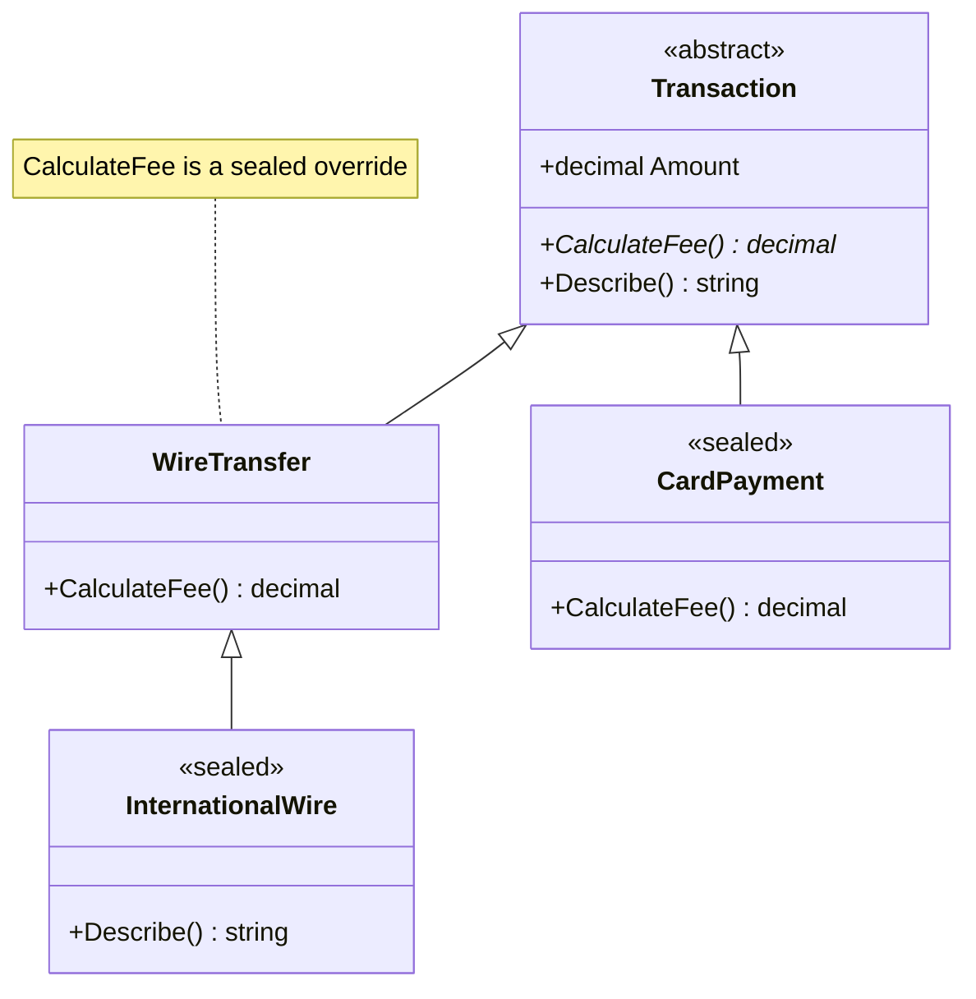
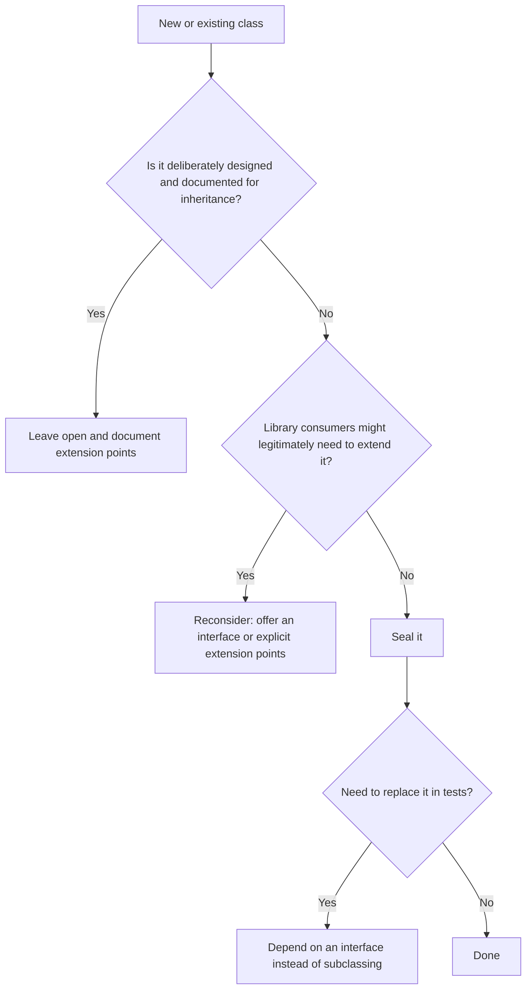
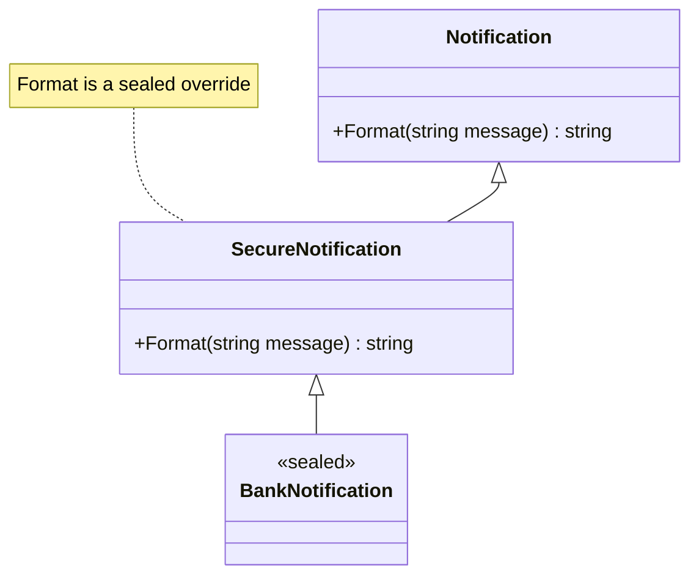
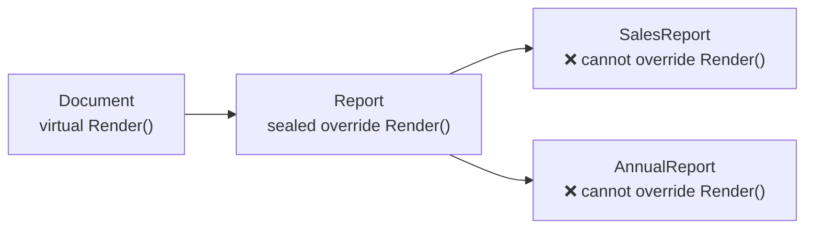

# 14. Sealed Members

> Learn how to close a class or an override to further extension: `sealed` classes, `sealed override` members, and when sealing is a good design decision.

**Level:** 🟠 Intermediate
**Prerequisites:** [09. Inheritance](../09-inheritance/README.md), [10. Polymorphism](../10-polymorphism/README.md), [11. Abstraction](../11-abstraction/README.md)

---

## 📑 In This Chapter

1. What Does `sealed` Mean?
2. Sealed Classes
3. Sealed Overrides
4. What Can and Cannot Be Sealed
5. When Sealing Is Useful
6. When Not to Seal
7. Sealing and Versioning
8. Real-World Example
9. Interview Questions

---

## 🎯 Learning Objectives

By the end of this chapter you will be able to:

- Explain what `sealed` prevents and what it does not.
- Declare **sealed classes** and **sealed overrides**.
- Recognize which members and types are already implicitly sealed.
- Decide when sealing improves design, safety or performance.
- Explain why sealing a type later is a **breaking change** but unsealing is not.
- Design for testability when a class is sealed.

---

## 📖 Concept

`sealed` is a way of saying **"this is the final version"**. It **stops inheritance** (for a class) or **stops further overriding** (for an override member).

```csharp
public sealed class Circle { }                       // nobody can derive from Circle

public class Report : Document
{
    public sealed override string Render() => "...";  // nobody can override Render again
}
```

| Applied to | Effect |
|---|---|
| **Class** | The class cannot be used as a base class |
| **Override member** | Derived classes cannot override that member again |

Think of inheritance as a door that is open by default in C#. `sealed` locks it.

### Sealed Classes

A **sealed class** can be instantiated and used normally, but **cannot be inherited**.

```csharp
public sealed class Configuration
{
    public string Environment { get; init; } = "Production";
}

// public class TestConfiguration : Configuration { }
// ❌ CS0509: cannot derive from sealed type 'Configuration'
```

You already use sealed types constantly:

| Sealed type | Note |
|---|---|
| `string` | You cannot write `class MyString : string` |
| `System.Text.StringBuilder` | Sealed class |
| All **structs** | Implicitly sealed (they cannot be inherited) |
| All **static classes** | Implicitly sealed |
| `sealed record` | Records can be sealed to prevent derived records |

A sealed class can still:

- inherit from another class (`public sealed class Square : Rectangle`),
- implement any number of interfaces,
- have constructors, fields, properties and methods like any other class.

> ⚠️ Declaring **new `virtual` or `protected` members** inside a sealed class is pointless (nobody can override or inherit them), so the compiler warns you.

### Sealed Overrides

A **`sealed override`** replaces a virtual member **and** closes it, so classes further down the hierarchy cannot override it again.

```csharp
public class Notification
{
    public virtual string Format(string message) => message;
}

public class SecureNotification : Notification
{
    public sealed override string Format(string message)       // override + seal
        => $"[ENCRYPTED] {message}";
}

public sealed class BankNotification : SecureNotification { }  // sealed class: end of the line

Notification n = new BankNotification();
Console.WriteLine(n.Format("Balance low"));
```

**Output**

```text
[ENCRYPTED] Balance low
```

If another class tries to override the sealed member:

```csharp
public class CustomNotification : SecureNotification
{
    // public override string Format(string message) => message;
    // ❌ CS0239: cannot override inherited member because it is sealed
}
```

Rules:

- `sealed` can be applied to a **member only together with `override`**. Writing `public sealed void Foo()` on a non-override member is error **CS0238**.
- Works for **methods, properties, indexers and events**.
- The member keeps taking part in polymorphism: calls through base references still dispatch to the sealed override. It just cannot be replaced **again**.
- Sealing an override does **not** stop a derived class from **hiding** the name with `new`. Hiding creates an unrelated member and is not polymorphic (see [09. Inheritance](../09-inheritance/README.md)).

### What Can and Cannot Be Sealed

| Target | Can be `sealed`? | Notes |
|---|:-:|---|
| Class | ✅ | Prevents inheritance |
| `override` method/property/indexer/event | ✅ | Prevents further overriding |
| Non-virtual method | ❌ | Already cannot be overridden (error CS0238) |
| `virtual` or `abstract` member | ❌ | Contradicts its purpose; seal the **override** instead |
| Interface | ❌ | An interface exists to be implemented |
| Struct | n/a | Already implicitly sealed |
| Static class | n/a | Already implicitly sealed |
| `abstract` class | ❌ | `abstract` requires inheritance; `sealed` forbids it |

### When Sealing Is Useful

| Reason | Explanation |
|---|---|
| **Not designed for inheritance** | Most classes are not. If you did not plan how subclasses should interact with your internals, do not invite them |
| **Protect invariants and security** | A subclass could weaken validation, bypass checks or change sensitive behavior (see [08. Encapsulation](../08-encapsulation/README.md)) |
| **Avoid the fragile base class problem** | Without subclasses, you can change the class's internals freely |
| **Lock a critical step** | `sealed override` keeps a rule (a regulated fee, an audit step, a security check) identical in all subtypes |
| **Simpler reasoning** | A sealed type has exactly one implementation; there are no hidden overrides to consider |
| **Performance (sometimes)** | When the compiler or JIT knows the exact type, virtual calls can become direct calls (and may be inlined) and type checks (`is`, casts) get cheaper |
| **Leaf of a hierarchy** | The concrete, final classes of a hierarchy are natural candidates |

> 📝 The performance gain is real in some code paths but usually modest. Do not seal **only** for speed; seal because the class is not meant to be extended, and treat speed as a bonus.

**Guideline (design for inheritance, or prohibit it):**

```text
Is this class explicitly designed and documented to be extended?
        ├── Yes → leave it open (and document the extension points)
        └── No  → seal it
```

### When Not to Seal

| Situation | Why |
|---|---|
| **Framework or library base classes** meant to be extended | Consumers need to derive from them |
| **Template Method steps** you intentionally expose | Subclasses are supposed to override them (see [11. Abstraction](../11-abstraction/README.md)) |
| **Classes you must substitute in tests** by subclassing | Sealed types cannot be subclassed by mocking tools that rely on inheritance. Prefer depending on an **interface** instead (see [12. Interfaces](../12-interfaces/README.md)) |
| **Hierarchies you know will grow** | Sealing the base blocks the growth you planned |

### Sealing and Versioning

Sealing is a **one-way door**:

| Change in a released library | Breaking for consumers? |
|---|:-:|
| **Unseal** a sealed class | ❌ No: existing code keeps working |
| **Seal** a previously open class | ✅ **Yes**: any consumer class that derives from it stops compiling |
| **Seal an override** that was previously overridable | ✅ **Yes** |
| **Add `virtual`** to a method of a sealed class | n/a (pointless) |

Because of this, **sealing early is the safe default**: you can always open a class later, but you can never safely close one that others already extend.

---

## 🤔 Why It Matters

- **Safer designs:** closed types cannot be subverted by subclasses.
- **Easier maintenance:** fewer ways your code can be extended means fewer ways it can break.
- **Clear intent:** `sealed` tells readers that inheritance was **not** part of the design.
- **Locked-down rules:** `sealed override` guarantees a critical behavior stays the same everywhere below it in the hierarchy.
- **Possible performance gains** through devirtualization and cheaper type checks.
- **Versioning safety:** start sealed, open later if needed.

---

## 🧩 Syntax

```csharp
public sealed class Final                              // sealed class
{
    public void Work() { }
}

public class Base
{
    public virtual void Step() { }
    public virtual string Name => "Base";
}

public class Middle : Base
{
    public sealed override void Step() { }             // sealed override (method)
    public sealed override string Name => "Middle";    // sealed override (property)
}

public sealed class Leaf : Middle { }                  // sealed class inheriting a sealed override

public sealed record Point(int X, int Y);              // sealed record

// ❌ public class Bad : Final { }                     // CS0509: cannot derive from sealed type
// ❌ public class Bad2 : Middle { public override void Step() { } }   // CS0239: member is sealed
// ❌ public sealed void Oops() { }                    // CS0238: not an override
```

---

## 💻 Basic Example

```csharp
public class Notification
{
    public virtual string Format(string message) => message;
}

public class SecureNotification : Notification
{
    public sealed override string Format(string message)
        => $"[ENCRYPTED] {message}";
}

public sealed class BankNotification : SecureNotification { }

Notification plain = new Notification();
Notification secure = new BankNotification();

Console.WriteLine(plain.Format("Hello"));
Console.WriteLine(secure.Format("Balance low"));
```

**Output**

```text
Hello
[ENCRYPTED] Balance low
```

The call through a `Notification` variable still uses **dynamic dispatch**. The sealed override simply guarantees that nothing below `SecureNotification` can change what happens.

---

## 🌍 Real-World Example

A transaction hierarchy where the **fee rule of wire transfers is regulated** and must never be changed by subclasses, while a harmless description can still be customized.

```csharp
public abstract class Transaction
{
    public decimal Amount { get; }

    protected Transaction(decimal amount) => Amount = amount;

    public abstract decimal CalculateFee();

    public virtual string Describe()
        => $"{GetType().Name} {Amount:F2} (fee {CalculateFee():F2})";
}

public class WireTransfer : Transaction
{
    public WireTransfer(decimal amount) : base(amount) { }

    // Regulated flat fee: no subclass may change it
    public sealed override decimal CalculateFee() => 25m;
}

public sealed class InternationalWire : WireTransfer         // final class in this branch
{
    public InternationalWire(decimal amount) : base(amount) { }

    public override string Describe()                        // allowed: Describe is not sealed
        => base.Describe() + " [international]";

    // public override decimal CalculateFee() => 30m;        // ❌ CS0239: CalculateFee is sealed
}

public sealed class CardPayment : Transaction
{
    public CardPayment(decimal amount) : base(amount) { }

    public override decimal CalculateFee() => Amount * 0.02m;
}

Transaction[] transactions =
{
    new WireTransfer(1000m),
    new InternationalWire(2000m),
    new CardPayment(100m)
};

foreach (var transaction in transactions)
    Console.WriteLine(transaction.Describe());
```

**Output**

```text
WireTransfer 1000.00 (fee 25.00)
InternationalWire 2000.00 (fee 25.00) [international]
CardPayment 100.00 (fee 2.00)
```

- `WireTransfer.CalculateFee` is **sealed**: the compliance rule cannot be bypassed anywhere below it.
- `InternationalWire` is a **sealed class**: it is the end of its branch.
- `Describe` stays overridable, so customization is still possible where it is safe.
- `CardPayment` is a sealed leaf: it was never designed for inheritance.



---

## 🧠 How It Works

### What the compiler enforces

| Situation | Result |
|---|---|
| Deriving from a sealed class | Error **CS0509** |
| Overriding a sealed member | Error **CS0239** |
| `sealed` on a member that is not an `override` | Error **CS0238** |
| New `virtual`/`protected` member inside a sealed class | Compiler **warning** (the member can never be used as intended) |

At the metadata level, a sealed class is marked as final so the runtime also refuses to load a type that derives from it.

### Sealed overrides still dispatch dynamically

```csharp
Transaction t = new InternationalWire(500m);
t.CalculateFee();       // runs WireTransfer.CalculateFee through dynamic dispatch → 25
```

The member is simply **frozen** at the point where it was sealed.

### Why sealing can help performance

```csharp
public sealed class FastCounter : BaseCounter
{
    public override int Next() => 1;
}

FastCounter c = new FastCounter();
c.Next();     // exact type known → the JIT can call the method directly and may inline it
```

If the variable's type is **not sealed**, the JIT must assume a subclass might override the method, so it keeps the virtual call (unless it can prove the exact type some other way). The .NET libraries themselves seal many internal types for this reason. The effect depends on the code and the runtime, so **measure before relying on it**.

### Sealing does not block hiding

```csharp
public class B : A
{
    public sealed override string Render() => "B";
}

public class C : B
{
    public new string Render() => "C hides";      // legal: creates a NEW member
}

B viaBase = new C();
Console.WriteLine(viaBase.Render());              // B   (hiding is not polymorphic)

C viaC = new C();
Console.WriteLine(viaC.Render());                 // C hides
```

`sealed` prevents **overriding**, not **name hiding**. Avoid hiding anyway (see [09. Inheritance](../09-inheritance/README.md)).

### Sealed classes and testing

Tools that create test doubles by **subclassing** cannot mock a sealed class. Keep code testable by depending on an **interface** and sealing the implementation:

```csharp
public interface IPriceService { decimal GetPrice(string sku); }

public sealed class PriceService : IPriceService          // sealed: not meant to be extended
{
    public decimal GetPrice(string sku) => 9.99m;
}

public class Checkout
{
    private readonly IPriceService _prices;               // depends on the abstraction
    public Checkout(IPriceService prices) => _prices = prices;
}
```

Tests inject a fake `IPriceService`; `PriceService` can stay sealed.

### Should I seal it?



---

## 📊 Diagram





*(Larger diagrams live in [`/diagrams`](../diagrams).)*

---

## ⚔️ Important Comparisons

### `sealed` vs `abstract`

| Aspect | `sealed` | `abstract` |
|---|---|---|
| **Meaning** | Cannot be inherited / overridden further | Must be inherited / overridden |
| **Instantiable** | ✅ (class) | ❌ |
| **Can combine on one class** | ❌ | ❌ |
| **Intent** | "Final" | "Incomplete, to be completed" |

### Ways to prevent inheritance

| Technique | Prevents inheritance? | Notes |
|---|:-:|---|
| `sealed` class | ✅ | Clear, explicit, enforced everywhere |
| `static` class | ✅ | Also prevents instantiation; no instance members |
| Struct | ✅ | Value type semantics |
| Only `private` constructors | Partly | No outside subclass can call a constructor, but **nested** classes still can. Used for closed hierarchies |
| Documentation only ("do not inherit") | ❌ | Not enforced |

### `sealed override` vs non-virtual

| Aspect | Non-virtual method | `sealed override` |
|---|---|---|
| **Overridable below** | ❌ | ❌ |
| **Overrides a base virtual member** | ❌ | ✅ |
| **Polymorphic through base references** | ❌ | ✅ (up to the point it is sealed) |
| **Use when** | The method was never meant to vary | A hierarchy varies above a certain level and must be fixed below it |

### Seal vs leave open

| | Seal | Leave open |
|---|---|---|
| **Safety** | High | Depends on documented contract |
| **Flexibility for consumers** | Low | High |
| **Cost of change later** | Unsealing is free | Sealing later breaks consumers |
| **Mocking by subclass** | ❌ | ✅ |
| **Default recommendation** | ✅ for most classes | Only for designed extension points |

---

## ⚠️ Common Mistakes

1. ❌ **Sealing a member that is not an override.** Error CS0238. Fix: seal only `override` members.
2. ❌ **Deriving from a sealed class** (for example trying to extend `string`). Error CS0509. Fix: use composition or an extension method.
3. ❌ **Overriding a sealed member.** Error CS0239. Fix: do not override it, or remove the `sealed` modifier if extension is truly needed.
4. ❌ **Declaring `virtual` or `protected` members in a sealed class.** They can never be used as intended. Fix: make them `private`/`public` as appropriate.
5. ❌ **Combining `abstract` and `sealed`.** Contradictory. Fix: choose one.
6. ❌ **Sealing framework or library extension points** consumers are expected to derive from. Fix: leave designed extension points open and document them.
7. ❌ **Sealing a class you need to mock by subclassing**, then fighting your tests. Fix: depend on an interface.
8. ❌ **Sealing a released class that others already derive from.** Their code stops compiling. Fix: seal **before** release, or accept a breaking change.
9. ❌ **Thinking `sealed` means immutable or thread-safe.** It only prevents inheritance/overriding. Fix: use `readonly`, get-only/`init` members and proper synchronization for those goals.
10. ❌ **Assuming a sealed override cannot be hidden.** A derived class can still hide it with `new`. Fix: avoid hiding; review code for it.
11. ❌ **Sealing purely for speed without measuring.** The gain is often small. Fix: seal for design reasons; treat speed as a bonus and benchmark critical paths.
12. ❌ **Sealing everything blindly, including types that should be extensible.** Fix: ask whether extension is part of the intended design.

---

## ✅ Best Practices

- **Seal classes by default** unless inheritance is part of the documented design.
- Use **`sealed override`** to lock critical rules (security checks, regulated calculations, audit steps).
- Seal **leaf classes** of a hierarchy.
- Keep **designed extension points** (template steps, framework base classes) open and documented.
- Pair sealed implementations with **interfaces** so they stay testable (see [12. Interfaces](../12-interfaces/README.md)).
- Prefer **composition** over inheritance when someone wants to "extend" a sealed class.
- Seal **before** a library release: unsealing later is safe, sealing later is breaking.
- Consider the .NET analyzer rule for sealing internal types (CA1852) for application code.
- Use `sealed record` for records that are not meant to be derived.
- Do not declare `virtual`/`protected` members in sealed classes.

---

## 🎯 Interview Questions

**Q1. What does the `sealed` keyword do on a class?**

It prevents the class from being used as a base class. The class can still be instantiated and can itself inherit from another class and implement interfaces.

**Q2. What is a sealed override?**

An override marked `sealed override`. It replaces a base virtual member and prevents any further derived class from overriding that member again.

**Q3. Can you seal a method that is not an override?**

No. `sealed` on a member is only valid together with `override`. Applying it to a non-override member causes error CS0238.

**Q4. Can a sealed class inherit from another class?**

Yes. `sealed` only stops other classes from inheriting from it. It can have a base class and implement interfaces.

**Q5. Can a class be both `abstract` and `sealed`?**

No. An abstract class must be inherited to be useful, while a sealed class cannot be inherited.

**Q6. Which types are implicitly sealed?**

Structs and static classes. `string` is an example of an explicitly sealed class in the base class library.

**Q7. Why would you seal a class?**

To prevent misuse through inheritance, protect invariants and security-sensitive behavior, avoid the fragile base class problem, make the type easier to reason about, and possibly enable performance optimizations such as devirtualization.

**Q8. Does `sealed` improve performance?**

It can. When the exact type is known to be sealed, the JIT can turn virtual calls into direct calls (and potentially inline them), and type checks and casts can be cheaper. The gain is often modest, so measure before relying on it.

**Q9. Does sealing an override prevent a derived class from hiding the member?**

No. A derived class can still declare a member with the same name using `new`, which hides rather than overrides it. This is not polymorphic and is best avoided.

**Q10. Is sealing a class a breaking change?**

Yes for a released library: any consumer class that derives from it will stop compiling. Unsealing a sealed class is not a breaking change.

**Q11. How do you test code that depends on a sealed class?**

Depend on an interface that the sealed class implements, and inject a fake implementation in tests. Subclass-based mocking cannot work with sealed classes.

**Q12. Can interfaces be sealed?**

No. An interface exists to be implemented, so sealing it makes no sense.

**Q13. What is the difference between a static class and a sealed class?**

A static class cannot be instantiated and contains only static members; it is implicitly sealed. A sealed class can be instantiated and have instance members, but cannot be inherited.

**Q14. When should you not seal a class?**

When the class is a deliberately designed extension point, such as a framework base class or a template with overridable steps, or when consumers legitimately need to derive from it.

---

## 📝 Practice Problems

| # | Problem | Difficulty | Solution |
|:-:|---|:-:|:-:|
| 1 | Create a `sealed` class `Configuration`, then try to inherit from it and read compiler error CS0509. | 🟢 | [View →](../solutions/14-sealed-members/) |
| 2 | Create `Base` with a `virtual` method, `Middle` with a `sealed override`, and a third class that tries to override it. Read error CS0239. | 🟢 | [View →](../solutions/14-sealed-members/) |
| 3 | Try to write `public sealed void Foo()` on a non-override method and explain error CS0238. | 🟢 | [View →](../solutions/14-sealed-members/) |
| 4 | Build the `Transaction` hierarchy from this chapter. Add a `CryptoTransfer` branch and decide which classes and members to seal. | 🟡 | [View →](../solutions/14-sealed-members/) |
| 5 | Demonstrate that a sealed override still dispatches dynamically when called through a base reference. | 🟡 | [View →](../solutions/14-sealed-members/) |
| 6 | Show that a derived class can hide a sealed override with `new`, and print the results through base and derived variables. | 🟡 | [View →](../solutions/14-sealed-members/) |
| 7 | Create a sealed `PriceService` implementing `IPriceService`. Write a test double for `IPriceService` and inject it into `Checkout`. | 🟡 | [View →](../solutions/14-sealed-members/) |
| 8 | Declare a `sealed record Point(int X, int Y)` and try to derive from it. Explain the result. | 🟡 | [View →](../solutions/14-sealed-members/) |
| 9 | Given a list of classes, decide which should be sealed, which should stay open, and justify each decision. | 🟠 | [View →](../solutions/14-sealed-members/) |
| 10 | Write a micro-benchmark comparing a virtual call on an unsealed class and on a sealed class. Discuss whether the result justifies sealing. | 🟠 | [View →](../solutions/14-sealed-members/) |
| 11 | Explain, with an example, why sealing a released class is a breaking change but unsealing is not. | 🟠 | [View →](../solutions/14-sealed-members/) |

Starter files: [`/exercises/14-sealed-members`](../exercises/14-sealed-members/)

---

## 🔑 Key Takeaways

- **`sealed` class** → cannot be inherited. **`sealed override`** → cannot be overridden again.
- `sealed` on a member requires `override`; abstract, virtual and non-override members cannot be sealed.
- Structs and static classes are **already sealed**.
- Sealing **protects invariants**, avoids the fragile base class problem and **can** help performance.
- Sealing **does not** make a type immutable and does not block **hiding** with `new`.
- **Seal by default** unless a class is deliberately designed and documented for extension.
- **Sealing later is a breaking change; unsealing is not**, so seal early.
- Keep sealed classes testable by **depending on interfaces**.

---

[⬅ Previous: Static Members](../13-static-members/README.md)
&nbsp;&nbsp;•&nbsp;&nbsp;
[🏠 Main README](../README.md)
&nbsp;&nbsp;•&nbsp;&nbsp;
[Next: Abstract Class vs Interface ➡](../15-abstract-class-vs-interface/README.md)