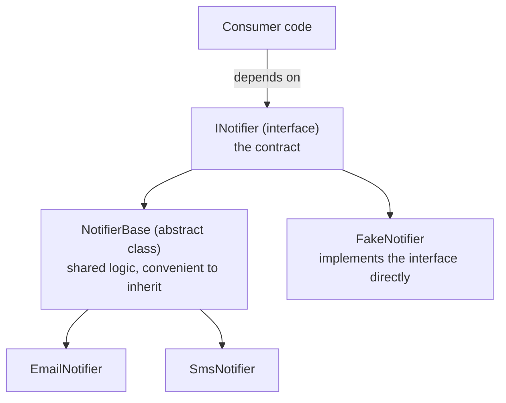
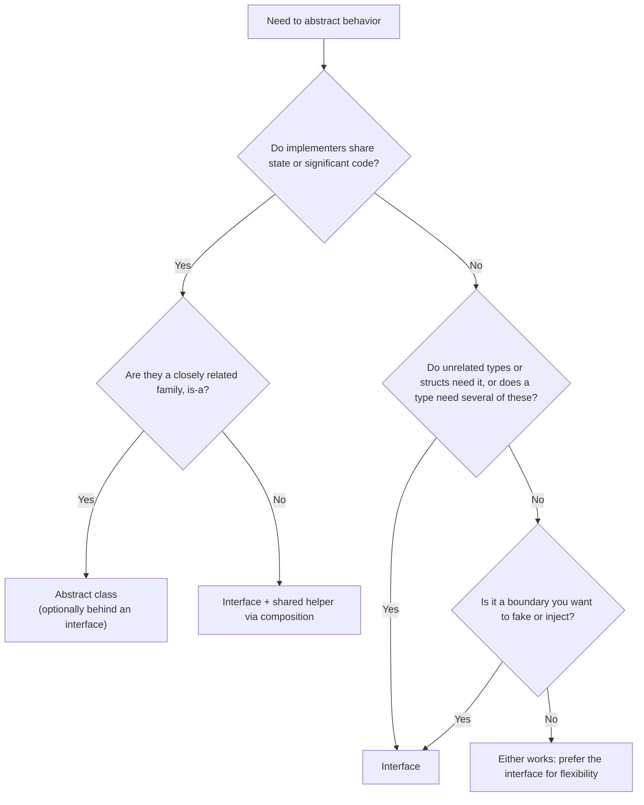
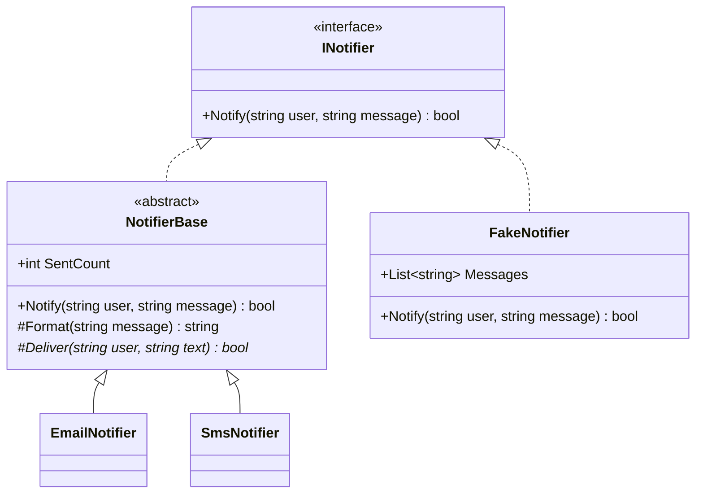
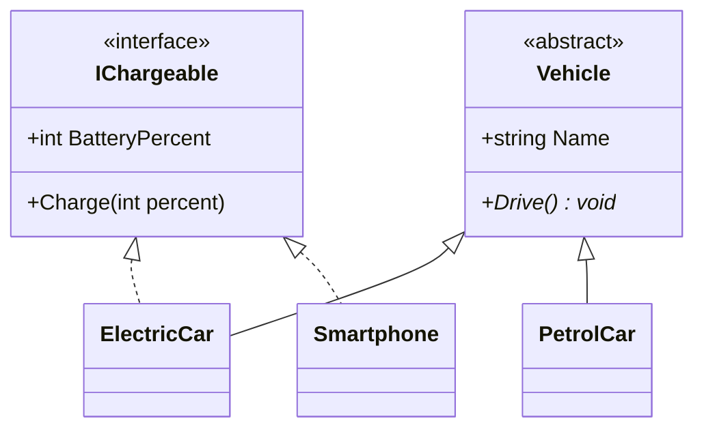

# 15. Abstract Class vs Interface

> Learn how to choose between an abstract class and an interface, and how to combine them: a detailed comparison, decision rules, the interface + abstract base class pattern, and real-world design examples.

**Level:** 🟠 Intermediate
**Prerequisites:** [09. Inheritance](../09-inheritance/README.md), [11. Abstraction](../11-abstraction/README.md), [12. Interfaces](../12-interfaces/README.md)

---

## 📑 In This Chapter

1. The Core Difference
2. Detailed Comparison
3. When to Use an Abstract Class
4. When to Use an Interface
5. Combining Abstract Classes and Interfaces
6. Versioning and Evolution
7. Decision Guide
8. Real-World Design Examples
9. Interview Questions

---

## 🎯 Learning Objectives

By the end of this chapter you will be able to:

- State the conceptual difference: **shared base (is-a + code)** vs **capability contract (can-do)**.
- Compare abstract classes and interfaces across state, constructors, implementation, inheritance, versioning and testing.
- Choose the right tool for a given design problem.
- Combine both: an interface as the public contract plus an abstract class as a reusable skeleton.
- Explain how default interface implementations change (and do not change) the comparison.
- Avoid common design mistakes such as exposing a base class where an interface belongs.

---

## 📖 Concept

Both an abstract class and an interface define **what implementers must provide**, and both enable **polymorphism**. They answer **different design questions**:

| | Abstract class | Interface |
|---|---|---|
| **Models** | A **family of related types** that share identity, state and code | A **capability or contract** that any type may offer |
| **Relationship** | **is-a** (a `Dog` is an `Animal`) | **can-do** / **behaves-like** (a `Dog` is `IComparable`, `ISerializable`...) |
| **Core idea** | "Here is a **partial implementation**; finish it" | "Here is a **promise**; fulfil it" |

```csharp
// Abstract class: shared state + shared code + required steps
public abstract class Animal
{
    public string Name { get; }
    protected Animal(string name) => Name = name;

    public abstract string Speak();
    public void Introduce() => Console.WriteLine($"{Name} says {Speak()}");
}

// Interface: a pure capability that unrelated types can offer
public interface IChargeable
{
    int BatteryPercent { get; }
    void Charge(int percent);
}
```

A class can inherit from **only one** base class, but can implement **many** interfaces. That single fact shapes most design decisions.

### Detailed Comparison

| Aspect | Abstract class | Interface |
|---|---|---|
| **Keyword** | `abstract class` | `interface` |
| **Instantiable** | ❌ | ❌ |
| **Instance fields (state)** | ✅ | ❌ |
| **Constructors** | ✅ | ❌ |
| **Members with implementation** | ✅ Any kind | Only **default interface implementations** (C# 8+, modern runtimes) |
| **Abstract members** | ✅ (`abstract`) | ✅ (members without a body are implicitly abstract) |
| **`virtual` / `override`** | ✅ | Default members can be overridden by implementers |
| **Member accessibility** | Any (`public`, `protected`, `private`, ...) | Public by default; modern C# allows more (for example `private` helpers for default members) |
| **Static members** | ✅ | ✅ (modern C#; including `static abstract` members in C# 11) |
| **Properties, indexers, events** | ✅ | ✅ |
| **Base types** | **One** class (and any number of interfaces) | **Any number** of interfaces |
| **A class can use** | **One** per class | **Many** per class |
| **Structs can use it** | ❌ (structs cannot inherit classes) | ✅ (structs can implement interfaces; boxing applies) |
| **Protected members (for subclasses)** | ✅ | Limited |
| **Adding a member later** | Safe if `virtual` with a body; breaking if `abstract` | Breaking unless it has a default implementation |
| **Testing / substitution** | Possible (subclass), but constructors and state can get in the way | Easiest (any class can fake it) |
| **Typical naming** | Noun (`Shape`, `Stream`) or `...Base` | `I` + capability/role (`IDisposable`, `IShape`) |

> 📝 Default interface implementations narrow the gap but do **not** remove it. Interfaces still **cannot hold instance state** and still allow **multiple** implementation per class, while an abstract class gives you **state, constructors and a protected surface for subclasses**.

---

## 🤔 Why It Matters

- **Wrong choice = rigid design.** Choosing an abstract class for a pure capability forces consumers into your inheritance hierarchy. Choosing an interface for something that needs shared state forces every implementer to duplicate code.
- **Public API impact.** An abstract class in your public API uses up the consumer's **one** base-class slot. An interface does not.
- **Evolution.** The two behave differently when you add members later (see [Versioning and Evolution](#versioning-and-evolution)).
- **Testability.** Dependencies expressed as interfaces are the easiest to replace with fakes.
- **It is a classic interview topic**, and, more importantly, a daily design decision.

---

## 🧩 Syntax

```csharp
// --- Interface: contract ---
public interface IShape
{
    string Name { get; }
    double Area();
}

// --- Abstract class: partial implementation of the contract ---
public abstract class ShapeBase : IShape          // implements the interface...
{
    public string Name => GetType().Name;         // shared implementation
    public abstract double Area();                // ...and leaves the rest to subclasses
}

// --- Concrete class: inherits the skeleton ---
public sealed class Circle : ShapeBase
{
    private readonly double _radius;
    public Circle(double radius) => _radius = radius;
    public override double Area() => Math.PI * _radius * _radius;
}

// --- Another class: implements the interface directly, no base class ---
public sealed class FixedShape : IShape
{
    public string Name => "Fixed";
    public double Area() => 1.0;
}

// --- One base class + several interfaces ---
public class Report : ShapeBase, IDisposable, IComparable<Report>
{
    public override double Area() => 0;
    public void Dispose() { }
    public int CompareTo(Report? other) => 0;
}
```

---

## 🧠 How It Works

### When to Use an Abstract Class

Choose an abstract class when:

| Situation | Why an abstract class fits |
|---|---|
| **Closely related types** share a common identity | `Circle`, `Rectangle` and `Triangle` are all genuinely `Shape`s |
| They share **state** (fields) | Interfaces cannot hold instance state |
| They share **implementation** | Write common code once instead of in every implementer |
| You need **constructors** or **protected** helpers | Base logic can use constructor parameters and protected members |
| You want to define a **fixed algorithm with variable steps** | Template Method: a non-virtual public method calling abstract/virtual steps (see [11. Abstraction](../11-abstraction/README.md)) |
| You want to **add behavior later without breaking subclasses** | A new `virtual` member with a default body is non-breaking |

Real examples in .NET: `Stream` (with `FileStream`, `MemoryStream`), `TextWriter`, `Enum`.

### When to Use an Interface

Choose an interface when:

| Situation | Why an interface fits |
|---|---|
| **Unrelated types** need the same capability | `ElectricCar` and `Smartphone` are both `IChargeable`; they share no base |
| A type needs **multiple capabilities** | Implement as many interfaces as needed |
| You are defining a **boundary** (data access, email, clock, payment gateway) | Callers depend on the contract; implementations can be swapped |
| You need **testability** and **dependency injection** | Fakes are trivial to write |
| **Structs** must participate | Only interfaces work for value types |
| There is **no shared state or code** | An abstract class would be empty ceremony |
| You want to **minimize coupling** | Consumers depend on a small contract, not a hierarchy |

Real examples in .NET: `IDisposable`, `IComparable<T>`, `IEnumerable<T>`, `IEquatable<T>`.

### Combining Abstract Classes and Interfaces

The most powerful design uses **both**: an **interface** as the **public contract**, plus an **abstract base class** that offers a **ready-made skeleton** for the common case. This is sometimes called a *skeletal implementation*.



Benefits:

- Consumers depend on the **interface**, not the base class.
- Implementers who want convenience **inherit the base class** and write only the variable parts.
- Implementers with special needs (already have a base class, or a test fake) **implement the interface directly**.

Three common combinations:

```csharp
// 1) Abstract class implements an interface and maps members to abstract ones
public abstract class ShapeBase : IShape
{
    public string Name => GetType().Name;
    public abstract double Area();                   // satisfies IShape.Area
}

// 2) Class inherits a base class AND implements extra capabilities
public class ElectricCar : Vehicle, IChargeable { /* ... */ }

// 3) Interface + skeletal base + direct implementers (see the real-world example below)
```

### Versioning and Evolution

What happens when you add something **after release**?

| Change | Abstract class | Interface |
|---|:-:|:-:|
| Add an **`abstract`** member / a member without a body | ❌ Breaks every subclass | ❌ Breaks every implementer |
| Add a **`virtual`** member with a default body | ✅ Safe | n/a |
| Add a **default interface member** (C# 8+) | n/a | ✅ Safe (on runtimes that support it) |
| Add a new **non-virtual** member | ✅ Safe | n/a |
| Add a **new interface** (for example `IShapeV2`) | ✅ Safe | ✅ Safe |

Rule of thumb: an **abstract class evolves more naturally** (add virtual members), while **interfaces should be small and stable**; evolve them by adding **new** interfaces or default members.

### Decision Guide



Quick scenario table:

| Scenario | Choose |
|---|---|
| `Circle`, `Rectangle`, `Triangle` with common `Name`, `Describe()` and abstract `Area()` | Abstract class |
| `IPaymentGateway` implemented by Stripe, PayPal and a test fake | Interface |
| `Dog` and `Robot` both need `IWalkable`, but share no base | Interface |
| A framework hook with a fixed workflow and optional steps | Abstract class (Template Method) |
| A value type must be sortable | Interface (`IComparable<T>`) |
| Many implementers repeat the same validation/logging | Interface + abstract skeletal base |
| A published contract you must extend in version 2 | Abstract class (`virtual`) or interface with default member |

---

## 💻 Basic Example

The same idea expressed both ways, to feel the difference.

```csharp
// Abstract class: shared state and code
public abstract class Animal
{
    public string Name { get; }

    protected Animal(string name) => Name = name;

    public abstract string Speak();

    public void Introduce() => Console.WriteLine($"{Name} says {Speak()}");
}

public class Dog : Animal
{
    public Dog(string name) : base(name) { }
    public override string Speak() => "Woof";
}

// Interface: capability, no state, no shared code
public interface ISpeaker
{
    string Speak();
}

public class Parrot : ISpeaker
{
    public string Speak() => "Hello!";
}

public class Radio : ISpeaker              // unrelated to Parrot: only the capability is shared
{
    public string Speak() => "...and now the news.";
}

new Dog("Rex").Introduce();

ISpeaker[] speakers = { new Parrot(), new Radio() };
foreach (var speaker in speakers)
    Console.WriteLine(speaker.Speak());
```

**Output**

```text
Rex says Woof
Hello!
...and now the news.
```

`Dog` benefits from the abstract class (`Name`, `Introduce()`). `Parrot` and `Radio` have nothing in common except being able to speak, which is exactly what an interface expresses.

---

## 🌍 Real-World Example

**Interface + abstract skeletal base class**: a notification system where callers depend on `INotifier`, most implementations share validation and counting logic through `NotifierBase`, and a test fake implements the interface directly.

```csharp
// 1) The contract: what consumers depend on
public interface INotifier
{
    bool Notify(string user, string message);
}

// 2) The skeleton: shared code and state, with variable steps left to subclasses
public abstract class NotifierBase : INotifier
{
    public int SentCount { get; private set; }

    public bool Notify(string user, string message)             // template method (non-virtual)
    {
        if (string.IsNullOrWhiteSpace(user))
            return false;                                        // shared validation

        bool delivered = Deliver(user, Format(message));
        if (delivered)
            SentCount++;                                         // shared state (impossible in an interface)

        return delivered;
    }

    protected virtual string Format(string message) => message;  // optional step
    protected abstract bool Deliver(string user, string text);   // required step
}

// 3) Implementations that reuse the skeleton
public class EmailNotifier : NotifierBase
{
    protected override string Format(string message) => $"Subject: Alert | {message}";

    protected override bool Deliver(string user, string text)
    {
        Console.WriteLine($"Email to {user}: {text}");
        return true;
    }
}

public class SmsNotifier : NotifierBase
{
    protected override bool Deliver(string user, string text)
    {
        Console.WriteLine($"SMS to {user}: {text}");
        return true;
    }
}

// 4) An implementation that skips the skeleton and implements the interface directly
public class FakeNotifier : INotifier
{
    public List<string> Messages { get; } = new();

    public bool Notify(string user, string message)
    {
        Messages.Add($"{user}: {message}");
        return true;
    }
}

var email = new EmailNotifier();
INotifier notifier = email;                       // consumers see only the interface

notifier.Notify("sam", "Server down");
notifier.Notify("", "ignored");                   // rejected by the shared validation
notifier.Notify("maya", "Disk full");

Console.WriteLine($"Emails sent: {email.SentCount}");
```

**Output**

```text
Email to sam: Subject: Alert | Server down
Email to maya: Subject: Alert | Disk full
Emails sent: 2
```

What each part contributes:

| Part | Role |
|---|---|
| `INotifier` | Stable contract; consumers and DI depend on this |
| `NotifierBase` | Removes duplication: validation, counting, workflow order |
| `EmailNotifier`, `SmsNotifier` | Only the parts that differ |
| `FakeNotifier` | Proves the interface stays independent of the base class |

### Capabilities across unrelated types

An abstract class for the **family**, an interface for the **cross-cutting capability**.

```csharp
public interface IChargeable
{
    int BatteryPercent { get; }
    void Charge(int percent);
}

public abstract class Vehicle
{
    public string Name { get; }
    protected Vehicle(string name) => Name = name;
    public abstract void Drive();
}

public class ElectricCar : Vehicle, IChargeable               // family + capability
{
    public int BatteryPercent { get; private set; }

    public ElectricCar(string name, int battery) : base(name) => BatteryPercent = battery;

    public override void Drive() => Console.WriteLine($"{Name} drives silently");

    public void Charge(int percent) => BatteryPercent = Math.Min(100, BatteryPercent + percent);
}

public class Smartphone : IChargeable                         // unrelated to Vehicle
{
    public int BatteryPercent { get; private set; }

    public Smartphone(int battery) => BatteryPercent = battery;

    public void Charge(int percent) => BatteryPercent = Math.Min(100, BatteryPercent + percent);
}

IChargeable[] chargeables = { new ElectricCar("Leaf", 50), new Smartphone(10) };

foreach (var item in chargeables)
{
    item.Charge(20);
    Console.WriteLine($"{item.GetType().Name}: {item.BatteryPercent}%");
}
```

**Output**

```text
ElectricCar: 70%
Smartphone: 30%
```

`ElectricCar` uses its single base-class slot for `Vehicle` and still gains `IChargeable`. `Smartphone` shares only the capability. Neither could be modeled with an abstract class alone.

---

## 📊 Diagram





*(Larger diagrams live in [`/diagrams`](../diagrams).)*

---

## ⚔️ Important Comparisons

### At a glance

| Question | Abstract class | Interface |
|---|---|---|
| Can it hold **state**? | ✅ | ❌ |
| Can a class use **several**? | ❌ (one) | ✅ |
| Can **structs** use it? | ❌ | ✅ |
| Has **constructors**? | ✅ | ❌ |
| Shares **code** easily? | ✅ | Limited (default members) |
| Best for **boundaries and DI**? | Sometimes | ✅ |
| Best for **template workflows**? | ✅ | ❌ |

### Interface + abstract base vs only one of them

| Design | Pros | Cons |
|---|---|---|
| **Interface only** | Maximum flexibility, easy to fake | Implementers may duplicate code |
| **Abstract class only** | Shared code and state | Consumers locked into the hierarchy; harder to fake; uses the single base-class slot |
| **Interface + abstract skeleton** | Flexible contract **and** convenient reuse | Two types to maintain (worth it only when several implementers share code) |

### Default interface methods vs abstract class members

| Aspect | Default interface method | Abstract class concrete/virtual method |
|---|---|---|
| **Reachable via class-typed variable** | ❌ (only via the interface type unless the class implements it) | ✅ |
| **Can use instance state** | ❌ (no fields) | ✅ |
| **Primary purpose** | Evolve published interfaces | Share implementation |
| **Multiple per class** | ✅ | ❌ (single base) |

---

## ⚠️ Common Mistakes

1. ❌ **Using an abstract class for a pure capability** (`abstract class Flyable`). It consumes the single base-class slot. Fix: use an interface.
2. ❌ **An abstract class with only abstract members and no state.** It is an interface in disguise. Fix: use an interface.
3. ❌ **Using an interface when implementers must share state or logic.** Every implementer copies the same code. Fix: add an abstract skeletal base class.
4. ❌ **Exposing the abstract base class as the dependency type** (`void Process(NotifierBase n)`). It forces consumers into your hierarchy. Fix: depend on the **interface**.
5. ❌ **Using inheritance for unrelated types** just to share a method. Fix: interface plus composition.
6. ❌ **"Fat" interfaces** with many members. Implementers throw `NotImplementedException`. Fix: split into small role interfaces ([24. SOLID Principles](../24-solid-principles/README.md)).
7. ❌ **Adding an abstract member to a released abstract class** or a member to a released interface. It breaks all derived types. Fix: add a `virtual` member, a default interface member, or a new interface.
8. ❌ **Treating default interface methods as a replacement for abstract classes.** They cannot hold state and are not visible through class-typed variables. Fix: use them for evolution only.
9. ❌ **Making template methods `virtual`.** Subclasses can then break the fixed workflow. Fix: keep the public method non-virtual; make steps `protected`.
10. ❌ **Creating both an interface and an abstract base for every class "just in case".** It is over-engineering. Fix: add the skeletal base only when several implementers actually share code.
11. ❌ **Assuming an interface is always better.** For a tightly related family with shared state, an abstract class is simpler. Fix: decide using the state/code/relationship questions.
12. ❌ **Public constructors on abstract classes.** They suggest instantiation is possible. Fix: make them `protected`.
13. ❌ **Casting an interface to its base class** to reach extra members. It breaks the abstraction. Fix: add what is needed to the interface, or rethink the design.

---

## ✅ Best Practices

- Ask three questions: **Is it is-a or can-do? Do implementers share state or code? Do unrelated types or structs need it?**
- **Default to an interface** at architectural boundaries and for capabilities.
- Use an **abstract class** for tightly related families that share state, constructors or a fixed workflow.
- When several implementers share logic, put an **interface at the front** and an **abstract skeletal class behind it**.
- Have consumers **depend on the interface**, not the base class.
- Keep **interfaces small and stable**; evolve them with new interfaces or default members.
- Keep **abstract class constructors `protected`**, template methods **non-virtual**, and steps **`protected`**.
- Prefer **composition** when you only want to reuse code and there is no genuine is-a relationship ([09. Inheritance](../09-inheritance/README.md)).
- Make concrete leaves **`sealed`** ([14. Sealed Members](../14-sealed-members/README.md)).
- **Document the contract** (inputs, outputs, exceptions, thread safety) for whichever you choose.

---

## 🎯 Interview Questions

**Q1. What is the difference between an abstract class and an interface?**

An abstract class is a partial base class that can hold state, constructors and implemented members, and a class can inherit only one. An interface is a contract of members to implement, cannot hold instance state or constructors, and a class can implement many. Abstract classes model is-a families with shared code; interfaces model can-do capabilities.

**Q2. Can an abstract class have a constructor? Can an interface?**

An abstract class can (it runs when a derived object is created). An interface cannot have constructors.

**Q3. Can an interface contain implemented methods?**

Since C# 8, yes: default interface implementations. They are reachable through the interface type, cannot use instance state, and exist mainly to evolve interfaces without breaking implementers.

**Q4. Can a class inherit from multiple abstract classes?**

No. C# allows only one base class. A class can implement multiple interfaces.

**Q5. When would you choose an abstract class over an interface?**

When related types share state or implementation, when you need constructors or protected members, when you want a fixed algorithm with overridable steps (Template Method), or when you want to add behavior later through `virtual` members without breaking subclasses.

**Q6. When would you choose an interface over an abstract class?**

When unrelated types need the same capability, when a type needs several capabilities, when value types must participate, when defining a boundary for dependency injection and testing, or when there is no shared state or code.

**Q7. Can an abstract class implement an interface?**

Yes. It can implement some members and map the rest to abstract members, forcing concrete subclasses to implement them.

**Q8. How can you combine an abstract class and an interface?**

Define the contract as an interface, provide an abstract class that implements it and contains shared logic, and let implementers either inherit the abstract class or implement the interface directly. Consumers depend on the interface.

**Q9. How do the two differ when you add a new member after release?**

Adding an abstract member to either breaks existing derived types or implementers. An abstract class can safely gain a `virtual` member with a body; an interface can safely gain a default implementation (C# 8+) or you can add a new interface.

**Q10. Which one is easier to mock in unit tests?**

An interface. Any class can implement it as a fake. Abstract classes can be subclassed for tests, but constructors and state make that harder.

**Q11. Can structs implement interfaces? Can they inherit abstract classes?**

Structs can implement interfaces (with boxing when used through an interface variable), but cannot inherit from classes, abstract or otherwise.

**Q12. Do default interface methods make abstract classes obsolete?**

No. Interfaces still cannot hold instance state or constructors, and default members are not visible through class-typed variables. Abstract classes remain the right tool for shared state and structured base behavior.

**Q13. Why should consumers depend on an interface rather than an abstract base class?**

An interface does not consume the implementer's single base-class slot, keeps consumers decoupled from the hierarchy, and allows simple fakes in tests.

**Q14. What is a skeletal implementation?**

An abstract class that implements an interface and provides the common code, so most implementers only supply the variable parts. Implementers that cannot or do not want to inherit it can still implement the interface directly.

---

## 📝 Practice Problems

| # | Problem | Difficulty | Solution |
|:-:|---|:-:|:-:|
| 1 | List three scenarios where you would choose an abstract class and three where you would choose an interface. Justify each. | 🟢 | [View →](../solutions/15-abstract-class-vs-interface/) |
| 2 | Model `Animal` (abstract class with `Name`, abstract `Speak()`) and `ISwimmer`/`IFlyer` interfaces. Create `Duck`, `Dog` and `Fish`. | 🟢 | [View →](../solutions/15-abstract-class-vs-interface/) |
| 3 | Implement `IChargeable` on `ElectricCar : Vehicle` and `Smartphone`. Write a method that charges any `IChargeable`. | 🟢 | [View →](../solutions/15-abstract-class-vs-interface/) |
| 4 | Create an abstract `ShapeBase : IShape` that implements `Name` and leaves `Area()` abstract. Add two shapes. | 🟡 | [View →](../solutions/15-abstract-class-vs-interface/) |
| 5 | Build the `INotifier` + `NotifierBase` design from this chapter, then add a `PushNotifier` and a `FakeNotifier`. | 🟡 | [View →](../solutions/15-abstract-class-vs-interface/) |
| 6 | Refactor an abstract class that has only abstract members and no state into an interface. Explain the benefits. | 🟡 | [View →](../solutions/15-abstract-class-vs-interface/) |
| 7 | Show why adding an abstract member to a released abstract class breaks subclasses, then fix it with a `virtual` member. | 🟡 | [View →](../solutions/15-abstract-class-vs-interface/) |
| 8 | Show why adding a member to a released interface breaks implementers, then fix it with a default interface method. Show the call limitation through a class-typed variable. | 🟡 | [View →](../solutions/15-abstract-class-vs-interface/) |
| 9 | Design a payment system with `IPaymentGateway`, a `PaymentGatewayBase` skeleton (logging, retry, validation) and two real gateways plus a test fake. | 🟠 | [View →](../solutions/15-abstract-class-vs-interface/) |
| 10 | Given a "fat" abstract class `Worker` with `Work`, `Eat`, `Sleep`, redesign it with small interfaces and a thin base class. | 🟠 | [View →](../solutions/15-abstract-class-vs-interface/) |
| 11 | A class already inherits from `Component` and needs reusable logging behavior. Explain why an abstract base class cannot help and propose an interface-plus-composition solution. | 🟠 | [View →](../solutions/15-abstract-class-vs-interface/) |

Starter files: [`/exercises/15-abstract-class-vs-interface`](../exercises/15-abstract-class-vs-interface/)

---

## 🔑 Key Takeaways

- **Abstract class = shared base** (is-a, state, constructors, shared code, one per class). **Interface = capability contract** (can-do, no instance state, many per class).
- Choose by asking: **related family or unrelated capability? shared state/code? structs or multiple roles involved? a boundary to fake?**
- **Combine** them: an **interface** as the public contract and an **abstract skeletal class** for reuse; consumers depend on the interface.
- **Versioning differs:** abstract classes evolve with `virtual` members; interfaces stay small and evolve with new interfaces or default members.
- **Default interface methods** do not replace abstract classes (no state, not visible through class types).
- Keep **template methods non-virtual**, **constructors protected**, and expose **interfaces, not base classes**, at your boundaries.
- When in doubt, **start with an interface** and add an abstract base only when implementers truly share code.

---

[⬅ Previous: Sealed Members](../14-sealed-members/README.md)
&nbsp;&nbsp;•&nbsp;&nbsp;
[🏠 Main README](../README.md)
&nbsp;&nbsp;•&nbsp;&nbsp;
[Next: Access Modifiers ➡](../16-access-modifiers/README.md)