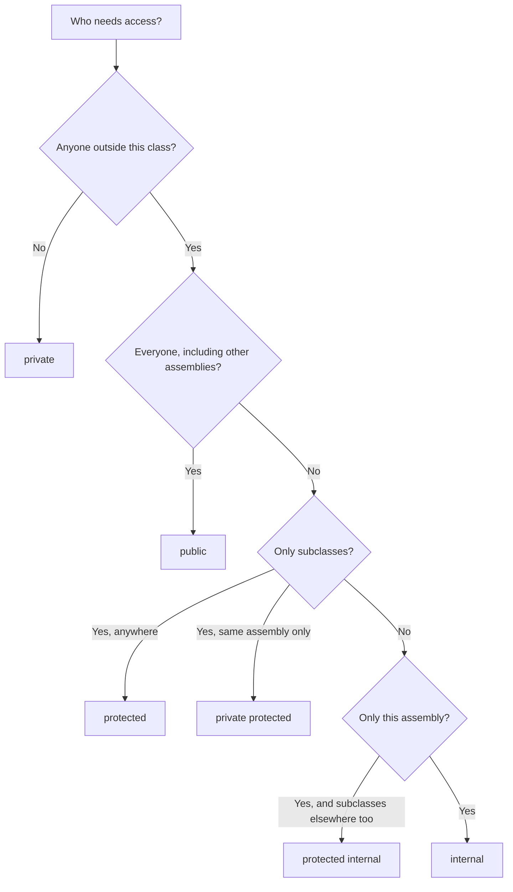
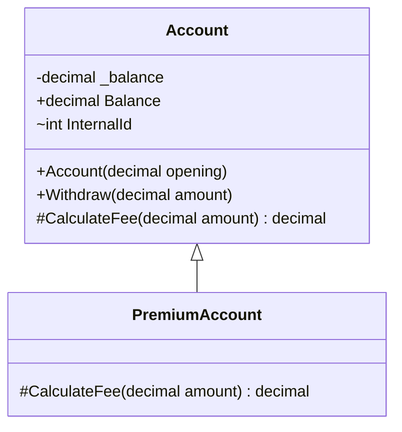
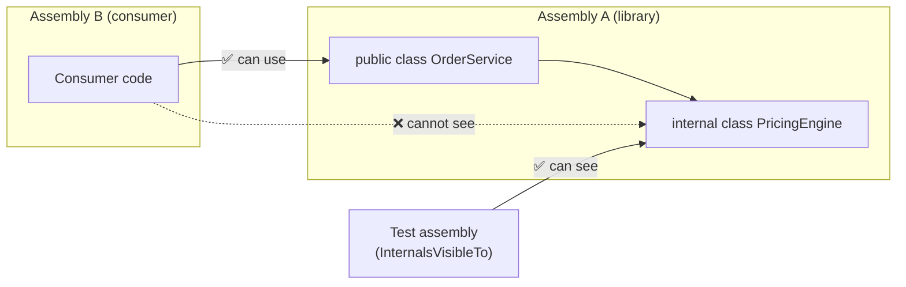

# 16. Access Modifiers

> Learn how C# controls who can see and use your types and members: `public`, `private`, `protected`, `internal`, `protected internal`, `private protected`, and the accessibility rules behind them.

**Level:** 🟠 Intermediate
**Prerequisites:** [02. Classes](../02-classes/README.md), [08. Encapsulation](../08-encapsulation/README.md), [09. Inheritance](../09-inheritance/README.md)

---

## 📑 In This Chapter

1. What Are Access Modifiers?
2. `public`
3. `private`
4. `protected`
5. `internal`
6. `protected internal`
7. `private protected`
8. Accessibility Matrix
9. Default Accessibility
10. Accessibility Rules
11. Real-World Example
12. Interview Questions

---

## 🎯 Learning Objectives

By the end of this chapter you will be able to:

- Explain what each of the six access modifiers allows.
- Read the **accessibility matrix** and predict whether a given access compiles.
- State the **default accessibility** of types and members.
- Distinguish `protected internal` (OR) from `private protected` (AND).
- Apply the accessibility **consistency rules** (base types, parameters, return types, overrides).
- Choose the **narrowest** modifier that works, and expose internals to test projects safely.

---

## 📖 Concept

An **access modifier** controls **where in your code** a type or member can be used. It is the compiler-enforced tool behind encapsulation (see [08. Encapsulation](../08-encapsulation/README.md)).

```csharp
public class Account
{
    public string Owner { get; }              // visible everywhere
    private decimal _balance;                 // visible only inside Account
    protected string Notes = "";              // Account and derived classes
    internal int InternalId;                  // anywhere in the same assembly
}
```

Two terms you need:

| Term | Meaning |
|---|---|
| **Assembly** | The compiled unit: one project's output (`.dll` or `.exe`) |
| **Derived class** | A class that inherits from the declaring class (see [09. Inheritance](../09-inheritance/README.md)) |

### The Six Modifiers

| Modifier | Accessible from | In one sentence |
|---|---|---|
| `public` | Any code, any assembly | Open to everyone |
| `private` | The declaring type only | Hidden from everyone else |
| `protected` | The declaring class and its **derived classes** (any assembly) | Open to the family |
| `internal` | Any code in the **same assembly** | Open inside the project |
| `protected internal` | **Same assembly** **OR** derived classes (any assembly) | Project **or** family |
| `private protected` | Derived classes **in the same assembly** (and the declaring class) | Project **and** family |

### `public`

Visible to **all code** that can reference the type's assembly. Use it only for the deliberate public API.

```csharp
public class Calculator
{
    public int Add(int a, int b) => a + b;     // anyone can call this
}
```

### `private`

Visible **only inside the declaring type** (including types nested within it). The default for class members.

```csharp
public class Counter
{
    private int _count;                        // hidden state

    public void Increment() => _count++;       // controlled access
    public int Value => _count;
}

// new Counter()._count;                       // ❌ CS0122: inaccessible due to its protection level
```

### `protected`

Visible to the declaring class and **classes derived from it**, **even in other assemblies**. Not visible to unrelated code.

```csharp
public class Animal
{
    protected string Sound = "...";            // for subclasses

    public void Speak() => Console.WriteLine(Sound);
}

public class Dog : Animal
{
    public Dog() => Sound = "Woof";            // ✅ derived class can use it
}

// new Dog().Sound = "x";                      // ❌ outside code cannot
```

> ⚠️ A `protected` member is a **promise to every subclass**, including ones you have never seen. Treat it as part of your public contract.

### `internal`

Visible to any code in the **same assembly**, invisible to other assemblies. The usual choice for **implementation details of a library**.

```csharp
internal class PricingEngine                   // not part of the library's public API
{
    internal decimal ApplyTax(decimal net) => net * 1.15m;
}
```

### `protected internal`

**Union** of `protected` and `internal`: accessible from **anywhere in the same assembly**, **and** from **derived classes in other assemblies**.

```csharp
public class Base
{
    protected internal void Hook() { }         // same assembly: any code
                                               // other assembly: only derived classes
}
```

### `private protected`

**Intersection** of `private` and `protected` rules (C# 7.2+): accessible **only from derived classes that are in the same assembly** (and from the declaring class).

```csharp
public class Base
{
    private protected void InternalExtensionPoint() { }   // derived classes in THIS assembly only
}
```

Easy memory aid:

```text
protected internal  =  protected  OR   internal    (wider)
private protected   =  protected  AND  internal    (narrower)
```

### Accessibility Matrix

Where can each modifier be used **from**? (✅ allowed, ❌ not allowed)

| Accessing code | `public` | `protected internal` | `internal` | `protected` | `private protected` | `private` |
|---|:-:|:-:|:-:|:-:|:-:|:-:|
| **Same class** | ✅ | ✅ | ✅ | ✅ | ✅ | ✅ |
| **Derived class, same assembly** | ✅ | ✅ | ✅ | ✅ | ✅ | ❌ |
| **Non-derived class, same assembly** | ✅ | ✅ | ✅ | ❌ | ❌ | ❌ |
| **Derived class, different assembly** | ✅ | ✅ | ❌ | ✅ | ❌ | ❌ |
| **Non-derived class, different assembly** | ✅ | ❌ | ❌ | ❌ | ❌ | ❌ |



### Default Accessibility

When you write **no modifier**, C# applies a default. Know them well:

| Declaration | Default |
|---|---|
| Top-level class, struct, interface, enum, delegate | `internal` |
| Members of a class or struct (fields, methods, properties, nested types, constructors) | `private` |
| Nested types | `private` |
| Members of an interface | `public` |
| Enum members | `public` (always) |
| Property/indexer accessors | Same as the property |
| Compiler-generated default constructor | `public` (or `protected` for an `abstract` class) |

> 📝 **C# 11** also added the **`file`** modifier for types: a `file`-scoped type is visible only inside the **same source file**. It is useful for helpers and generated code.

### Accessibility Rules

**1. A derived class cannot be more accessible than its base class.**

```csharp
internal class BaseHelper { }

// public class Derived : BaseHelper { }      // ❌ CS0060: base class is less accessible
internal class Derived : BaseHelper { }       // ✅
```

**2. A member's signature types must be at least as accessible as the member.**

```csharp
internal class Helper { }

public class Service
{
    // public Helper Create() => new Helper();      // ❌ CS0050: return type less accessible
    internal Helper Create() => new Helper();       // ✅
}
```

The same rule applies to parameter types (CS0051) and field/property types.

**3. An `override` must keep the same accessibility** as the member it overrides (error CS0507 otherwise). One exception: overriding a `protected internal` member **from another assembly** uses `protected`.

**4. Implicit interface implementations must be `public`** (explicit implementations have no modifier). See [12. Interfaces](../12-interfaces/README.md).

**5. A nested type can see its outer type's private members; the reverse is not true.**

```csharp
public class Outer
{
    private int _secret = 42;

    public class Inner
    {
        public int Peek(Outer outer) => outer._secret;   // ✅ nested type can read Outer's private member
    }

    // int x = new Inner()._hidden;                      // ❌ Outer cannot read Inner's private members
}
```

**6. `protected` access goes through the derived type, not the base type.**

```csharp
public class Animal
{
    protected string Secret = "x";
}

public class Dog : Animal
{
    public void Test(Animal other, Dog dog)
    {
        Console.WriteLine(Secret);          // ✅ this.Secret
        Console.WriteLine(dog.Secret);      // ✅ qualifier is Dog
        // Console.WriteLine(other.Secret); // ❌ CS1540: qualifier must be Dog or derived
    }
}
```

A `Dog` may use **its own** inherited protected members, but not poke into an arbitrary `Animal` (it might be a `Cat`).

**7. Accessors can be more restrictive than the property** (one accessor only):

```csharp
public int Balance { get; private set; }
```

See [05. Properties](../05-properties/README.md).

**8. Other restrictions:** structs cannot declare `protected` members (they cannot be inherited), static classes cannot have `protected` members, and namespace-level types can only be `public` or `internal`.

---

## 🤔 Why It Matters

- **Encapsulation is enforced by the compiler** through accessibility.
- **Small public surface = easier maintenance.** Every `public` member is a promise you must keep.
- **Safe refactoring:** private and internal code can change freely.
- **Library design:** `internal` hides implementation details while `public` defines the supported API.
- **Inheritance contracts:** `protected` defines exactly what subclasses can rely on.
- **Fewer bugs:** code that cannot be reached cannot be misused.

---

## 🧩 Syntax

```csharp
public class Example                       // type accessibility
{
    public int A;                          // everyone
    private int _b;                        // this type only
    protected int C;                       // this type + subclasses (any assembly)
    internal int D;                        // same assembly
    protected internal int E;              // same assembly OR subclasses anywhere
    private protected int F;               // subclasses in the same assembly only
    int G;                                 // no modifier → private

    public int Balance { get; private set; }                 // restricted accessor

    public class PublicNested { }                            // nested type with its own modifier
    private class PrivateNested { }
}

internal class Helper { }                  // explicit internal (also the default for top-level types)
file class OnlyInThisFile { }              // C# 11+: visible only in this source file
```

---

## 💻 Basic Example

```csharp
public class Account
{
    private decimal _balance;                                   // private: hidden state

    public decimal Balance => _balance;                         // public: read-only view

    public Account(decimal opening) => _balance = opening;

    public void Withdraw(decimal amount)                        // public: part of the API
    {
        _balance -= amount + CalculateFee(amount);
    }

    protected virtual decimal CalculateFee(decimal amount)      // protected: extension point
        => 1.50m;
}

public class PremiumAccount : Account
{
    public PremiumAccount(decimal opening) : base(opening) { }

    protected override decimal CalculateFee(decimal amount)     // ✅ protected is visible here
        => 0m;

    // public void Cheat() => _balance = 1_000_000m;            // ❌ CS0122: _balance is private
}

var standard = new Account(500m);
standard.Withdraw(100m);
Console.WriteLine($"Standard: {standard.Balance:F2}");

var premium = new PremiumAccount(500m);
premium.Withdraw(100m);
Console.WriteLine($"Premium: {premium.Balance:F2}");

// standard.CalculateFee(10m);                                  // ❌ CS0122: protected, not visible here
```

**Output**

```text
Standard: 398.50
Premium: 400.00
```

Each modifier plays a role: `private` protects the state, `public` exposes the API, and `protected` opens exactly one extension point to subclasses.

---

## 🌍 Real-World Example

A small library, **`Shop.Core`**, that exposes a deliberate public API and hides its implementation with `internal`, while still letting its **test project** reach the internals.

**Library project: `Shop.Core`**

```csharp
// OrderService.cs
public class OrderService                                        // public: the library's API
{
    private readonly PricingEngine _pricing = new();             // private: implementation detail

    public decimal GetTotal(decimal net) => _pricing.ApplyTax(net);
}

// PricingEngine.cs
internal class PricingEngine                                     // internal: not exposed to consumers
{
    internal decimal ApplyTax(decimal net) => net * 1.15m;
}
```

**Let the test project see the internals** (preferred over making things `public` just for tests). In the library's `.csproj`:

```xml
<ItemGroup>
  <InternalsVisibleTo Include="Shop.Tests" />
</ItemGroup>
```

Or, in code, in any file of the library:

```csharp
using System.Runtime.CompilerServices;

[assembly: InternalsVisibleTo("Shop.Tests")]
```

**Consumer application (a different assembly)**

```csharp
var service = new OrderService();
Console.WriteLine($"{service.GetTotal(100m):F2}");

// var engine = new PricingEngine();     // ❌ CS0122: PricingEngine is inaccessible (internal)
```

**Output**

```text
115.00
```

**Test project: `Shop.Tests`** (can see internals thanks to `InternalsVisibleTo`)

```csharp
var engine = new PricingEngine();                                // ✅ allowed in the test assembly
Console.WriteLine(engine.ApplyTax(200m) == 230m);                // True
```

Consumers see **only** `OrderService.GetTotal`. You can rewrite `PricingEngine` completely without breaking anyone, because it was never public.

---

## 🧠 How It Works

### Accessibility is checked at compile time

The compiler computes each member's **accessibility domain** (the region of code allowed to use it) and rejects any use outside that region with error **CS0122** ("inaccessible due to its protection level").

### Accessibility vs security

`private` is a **design boundary**, not a security mechanism. Reflection and other runtime tools can read private members. Do not rely on modifiers to protect secrets (see [08. Encapsulation](../08-encapsulation/README.md)).

### Narrowing and widening over time

| Change | Effect on existing callers |
|---|---|
| Make a member **more accessible** (`private` → `internal` → `public`) | Non-breaking |
| Make a member **less accessible** | **Breaking** for any code that used it |

That is why the guideline is: **start narrow, widen only when needed**.

### Choosing for each kind of member

| Member | Typical choice |
|---|---|
| Fields | `private` (see [04. Fields](../04-fields/README.md)) |
| Properties | `public` getter, restricted setter (`private set` / `init`) |
| Methods that form the API | `public` |
| Helper methods | `private` |
| Template-method steps / extension points | `protected` (or `private protected` inside one assembly) |
| Library implementation classes | `internal` |
| Constructors of abstract classes | `protected` |
| Singleton / factory-controlled constructors | `private` |

---

## 📊 Diagram



*Legend: `+` public · `-` private · `#` protected · `~` internal*



*(Larger diagrams live in [`/diagrams`](../diagrams).)*

---

## ⚔️ Important Comparisons

### `protected internal` vs `private protected`

| Aspect | `protected internal` | `private protected` |
|---|---|---|
| **Rule** | protected **OR** internal | protected **AND** internal |
| **Same assembly, non-derived class** | ✅ | ❌ |
| **Same assembly, derived class** | ✅ | ✅ |
| **Other assembly, derived class** | ✅ | ❌ |
| **Other assembly, non-derived class** | ❌ | ❌ |
| **Introduced in** | C# 1.0 | C# 7.2 |
| **Use when** | Subclasses anywhere **and** internal code need access | Only in-assembly subclasses should extend it |

### `internal` vs `public` in a library

| Aspect | `internal` | `public` |
|---|---|---|
| **Visible to consumers** | ❌ | ✅ |
| **Changing it later** | Free (no external callers) | Potentially breaking |
| **Use for** | Implementation details | The supported API |
| **Tests** | Via `InternalsVisibleTo` | Directly |

### `private` vs `protected`

| Aspect | `private` | `protected` |
|---|---|---|
| **Subclasses can use it** | ❌ | ✅ |
| **Coupling to subclasses** | None | Subclasses depend on it (part of your contract) |
| **Default** | ✅ | Only for deliberate extension points |

### Default accessibility quick reference

| Element | Default |
|---|---|
| Top-level type | `internal` |
| Class/struct member | `private` |
| Nested type | `private` |
| Interface member | `public` |
| Enum member | `public` |

---

## ⚠️ Common Mistakes

1. ❌ **Making everything `public`.** Every public member is a long-term promise. Fix: start `private`, widen only when needed.
2. ❌ **Using `protected` as a "semi-public" shortcut.** It exposes the member to every subclass forever. Fix: make it `private` and add a deliberate protected extension point if needed.
3. ❌ **Accessing a protected member through a base-type reference** (`other.Secret` where `other` is an `Animal`). Error CS1540. Fix: access it through `this` or a derived-type reference.
4. ❌ **Confusing `protected internal` with `private protected`.** One is OR (wider), the other is AND (narrower). Fix: use the matrix.
5. ❌ **Inconsistent accessibility**: a `public` method returning an `internal` type (CS0050), or a `public` class deriving from an `internal` one (CS0060). Fix: align the accessibility or narrow the member.
6. ❌ **Changing accessibility in an override** (`protected` → `public`). Error CS0507. Fix: keep the same accessibility.
7. ❌ **Leaving an interface implementation non-public.** Error CS0737. Fix: make it `public` or use explicit implementation.
8. ❌ **Making members `public` just so tests can reach them.** Fix: use `internal` plus `InternalsVisibleTo`.
9. ❌ **Public fields.** They bypass validation. Fix: private fields with properties/methods ([08. Encapsulation](../08-encapsulation/README.md)).
10. ❌ **Relying on `private` for security.** Reflection can bypass it. Fix: use real security measures for sensitive data.
11. ❌ **Leaking internal implementation types through public signatures.** Blocked by the compiler or forces you to make them public. Fix: expose an interface or a public type instead.
12. ❌ **Forgetting that top-level types default to `internal`.** A "missing" class in another project is often just not `public`. Fix: add `public` deliberately.
13. ❌ **Narrowing accessibility after release.** Consumers that used the member break. Fix: decide carefully before releasing.

---

## ✅ Best Practices

- Use the **narrowest accessibility** that works: `private` first, then widen.
- Keep **fields `private`** and the **public surface small**.
- Treat every **`public`** and **`protected`** member as a **long-term contract**.
- Use **`internal`** for library implementation details; use **`InternalsVisibleTo`** for test projects.
- Use **`private protected`** when only same-assembly subclasses should extend a member.
- Make **abstract class constructors `protected`**; make **factory-controlled constructors `private`**.
- Use **`private set`** or **`init`** instead of public setters.
- Be explicit: write the modifier even when it matches the default, for readability in public API code.
- Combine with **`sealed`** to control extension ([14. Sealed Members](../14-sealed-members/README.md)).
- **Review the public surface** of a library before each release.
- Do not rely on modifiers for **security**.

---

## 🎯 Interview Questions

**Q1. What are access modifiers in C#?**

Keywords that control the visibility of types and members. C# has `public`, `private`, `protected`, `internal`, `protected internal` and `private protected` (plus `file` for types, since C# 11).

**Q2. What is the default accessibility of a class member? Of a top-level class?**

Class members default to `private`. A top-level class defaults to `internal`.

**Q3. What is the difference between `private` and `protected`?**

`private` members are accessible only inside the declaring type. `protected` members are also accessible in classes derived from the declaring class, including in other assemblies.

**Q4. What does `internal` mean?**

The type or member is accessible from any code in the same assembly but not from other assemblies.

**Q5. What is the difference between `protected internal` and `private protected`?**

`protected internal` means protected **or** internal: same assembly, or derived classes anywhere. `private protected` means protected **and** internal: only derived classes within the same assembly.

**Q6. What is the default accessibility of interface members and enum members?**

Both are `public`.

**Q7. Can a public method return an internal type?**

No. The compiler reports inconsistent accessibility (CS0050): a member's signature types must be at least as accessible as the member itself.

**Q8. Can a public class inherit from an internal class?**

No. A derived class cannot be more accessible than its base class (CS0060).

**Q9. Why can't you access a protected member through a base-class reference?**

A `protected` member is accessible through `this` or a reference of the derived type (or a type derived from it), not through an arbitrary base-type reference, because that object might be a different subclass. The compiler reports CS1540.

**Q10. Can an override change the accessibility of the overridden member?**

No. It must have the same accessibility (CS0507). The one exception is overriding a `protected internal` member from a different assembly, which is declared `protected`.

**Q11. Can a nested class access the private members of its outer class?**

Yes, through an instance of the outer class. The outer class cannot access the nested class's private members.

**Q12. What is `InternalsVisibleTo`?**

An assembly attribute (or project item) that makes a library's `internal` members visible to a named assembly, typically a test project, without making them `public`.

**Q13. Are access modifiers a security feature?**

No. They are enforced by the compiler as a design boundary. Reflection and other runtime mechanisms can access private members.

**Q14. Can a struct have `protected` members?**

No. Structs cannot be inherited, so `protected` members make no sense and are rejected.

**Q15. What does the `file` modifier do?**

Introduced in C# 11, it restricts a type to the source file in which it is declared.

---

## 📝 Practice Problems

| # | Problem | Difficulty | Solution |
|:-:|---|:-:|:-:|
| 1 | Create a class with one field for each of the six modifiers. For each, write down from which code locations it can be accessed. | 🟢 | [View →](../solutions/16-access-modifiers/) |
| 2 | Write a class with a `private` field and a `public` method that changes it. Try to access the field from outside and read error CS0122. | 🟢 | [View →](../solutions/16-access-modifiers/) |
| 3 | Create `Animal` with a `protected` field and a `Dog` subclass that uses it. Show that outside code cannot. | 🟢 | [View →](../solutions/16-access-modifiers/) |
| 4 | Reproduce error CS1540 by accessing a protected member through a base-type reference, then fix it. | 🟡 | [View →](../solutions/16-access-modifiers/) |
| 5 | Reproduce errors CS0050 and CS0060, then fix each by aligning accessibility. | 🟡 | [View →](../solutions/16-access-modifiers/) |
| 6 | Create two projects. In project A add `internal`, `protected internal` and `private protected` members. From project B, test which are accessible from a derived class and from a non-derived class. | 🟡 | [View →](../solutions/16-access-modifiers/) |
| 7 | Add `InternalsVisibleTo` for a test project and write a test that calls an `internal` method. | 🟡 | [View →](../solutions/16-access-modifiers/) |
| 8 | Redesign a class with all-public fields into a properly encapsulated class using `private` fields, `private set` and `protected` extension points. | 🟡 | [View →](../solutions/16-access-modifiers/) |
| 9 | Build a nested class that reads its outer class's private field, and show that the reverse is not allowed. | 🟡 | [View →](../solutions/16-access-modifiers/) |
| 10 | Review the public surface of a given library class. Decide which members should be `internal`, `protected` or `private`, and explain each decision. | 🟠 | [View →](../solutions/16-access-modifiers/) |
| 11 | Explain why narrowing a member's accessibility is a breaking change but widening is not, with a concrete consumer example. | 🟠 | [View →](../solutions/16-access-modifiers/) |

Starter files: [`/exercises/16-access-modifiers`](../exercises/16-access-modifiers/)

---

## 🔑 Key Takeaways

- **Six modifiers:** `public`, `private`, `protected`, `internal`, `protected internal` (OR), `private protected` (AND).
- **Defaults:** top-level types `internal`; members and nested types `private`; interface and enum members `public`.
- **Start with `private`** and widen only when there is a reason.
- `protected` is a **contract with every subclass**; use it sparingly and deliberately.
- `internal` hides **implementation details** in a library; use **`InternalsVisibleTo`** for tests.
- **Consistency rules:** derived types, member signatures and overrides cannot expose more than their parts allow.
- **Protected access** goes through `this` or a derived-type reference, never a base-type reference.
- Accessibility is a **compile-time design boundary**, not security.
- **Widening is safe; narrowing breaks callers**, so choose carefully before releasing.

---

[⬅ Previous: Abstract Class vs Interface](../15-abstract-class-vs-interface/README.md)
&nbsp;&nbsp;•&nbsp;&nbsp;
[🏠 Main README](../README.md)
&nbsp;&nbsp;•&nbsp;&nbsp;
[Next: `this` Keyword ➡](../17-this-keyword/README.md)