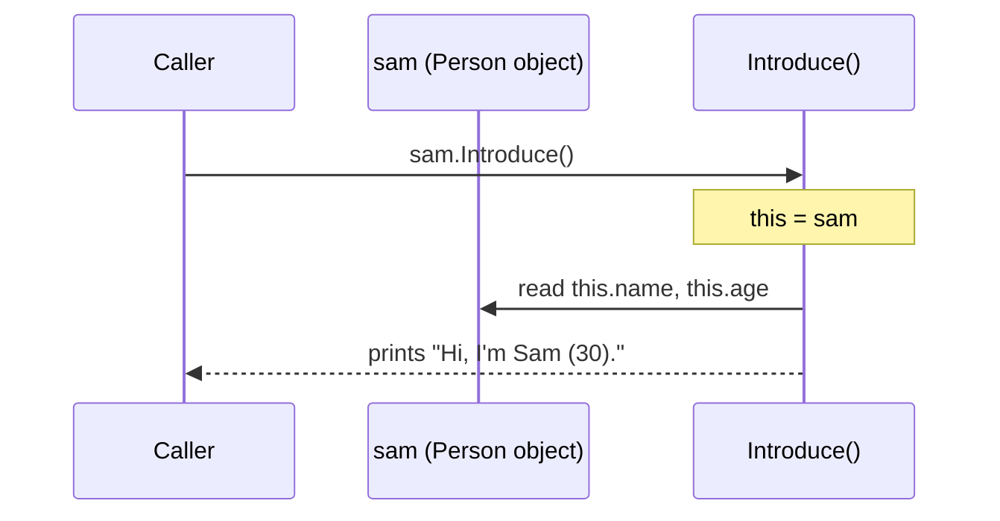
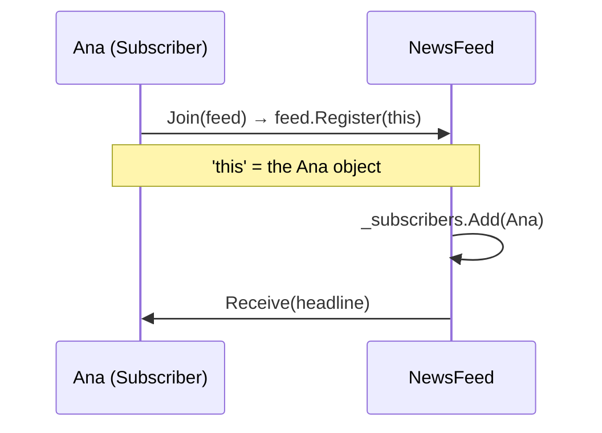
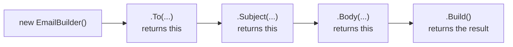
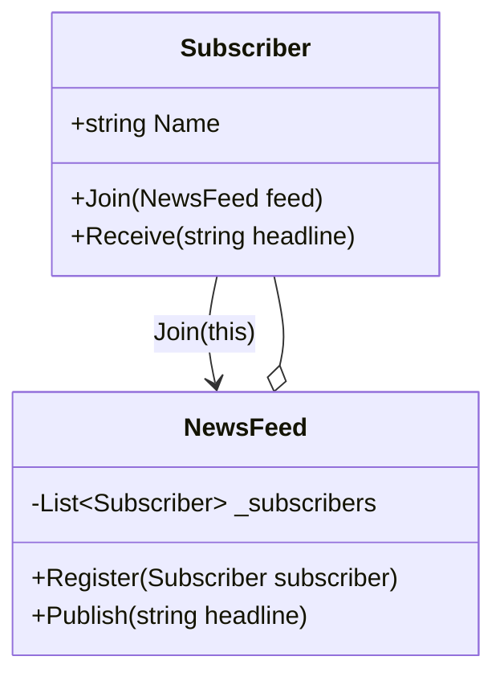
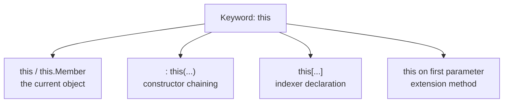

# 17. `this` Keyword

> Learn how an object refers to itself: the current instance, resolving naming conflicts, constructor chaining, passing the current object, fluent APIs, and indexers.

**Level:** 🟠 Intermediate
**Prerequisites:** [02. Classes](../02-classes/README.md), [06. Methods](../06-methods/README.md), [07. Constructors](../07-constructors/README.md)

---

## 📑 In This Chapter

1. What is `this`?
2. Referring to the Current Object
3. Resolving Naming Conflicts
4. Constructor Chaining with `this(...)`
5. Passing the Current Object
6. Fluent APIs (Returning `this`)
7. Indexers (`this[...]`)
8. The Other Meaning: Extension Methods
9. Real-World Example
10. Interview Questions

---

## 🎯 Learning Objectives

By the end of this chapter you will be able to:

- Explain that `this` is a reference to the **current instance**.
- Use `this` to resolve conflicts between fields and parameters.
- Chain constructors with `: this(...)`.
- Pass the current object to other code and return it to build **fluent APIs**.
- Declare **indexers** with `this[...]`.
- Tell the four different uses of the word `this` apart.
- Avoid pitfalls such as leaking `this` from a constructor.

---

## 📖 Concept

Inside an **instance** member (instance method, constructor, property accessor), the keyword **`this`** refers to **the object the member is currently running on**.

```csharp
public class Counter
{
    private int _count;

    public void Increment()
    {
        this._count++;          // 'this' = the Counter this method was called on
    }
}

var a = new Counter();
var b = new Counter();
a.Increment();                  // inside Increment, this == a
b.Increment();                  // inside Increment, this == b
```

Every instance method receives a hidden argument, the object it was called on, and `this` is how your code names it (see [13. Static Members](../13-static-members/README.md): static methods have no `this`).

| Where `this` is available | Where it is **not** |
|---|---|
| Instance methods | `static` methods and static properties (error CS0026) |
| Constructors | Field initializers (error CS0236) |
| Instance property/indexer accessors | Static classes |

### Referring to the Current Object

When you write a bare member name inside an instance method, C# treats it as `this.` + the name. The `this.` prefix is **optional** in that case.

```csharp
public class Person
{
    private string _name = "";

    public void Rename(string newName)
    {
        _name = newName;            // same as this._name = newName;
    }

    public bool HasSameNameAs(Person other)
        => this._name == other._name;     // 'this' vs 'other': two different objects
}
```

`this` becomes essential when you must **distinguish between objects** or **hand out the current object** (see below).

### Resolving Naming Conflicts

A **parameter or local variable with the same name as a field shadows the field**. Use `this.` to reach the field.

```csharp
public class Person
{
    private string name;
    private int age;

    public Person(string name, int age)
    {
        // name = name;         // ⚠️ CS1717: assigns the parameter to itself; the field stays unchanged
        this.name = name;       // ✅ field = parameter
        this.age = age;
    }
}
```

Most teams avoid the problem with the **`_camelCase` convention** for private fields (`_name = name;`), so `this.` is not needed. Both styles are valid; stay consistent.

### Constructor Chaining with `this(...)`

`: this(...)` makes one constructor **call another constructor of the same class** first. This keeps initialization logic in one place (see [07. Constructors](../07-constructors/README.md)).

```csharp
public class Person
{
    private readonly string name;
    private readonly int age;

    public Person(string name, int age)               // the master constructor
    {
        this.name = name;
        this.age = age;
    }

    public Person(string name) : this(name, 0) { }    // chains to the master
    public Person() : this("Unknown", 0) { }          // chains to the master

    public void Introduce() => Console.WriteLine($"Hi, I'm {this.name} ({this.age}).");
    public bool IsOlderThan(Person other) => this.age > other.age;
}

var sam = new Person("Sam", 30);
var maya = new Person("Maya", 25);

sam.Introduce();
maya.Introduce();
Console.WriteLine(sam.IsOlderThan(maya));
```

**Output**

```text
Hi, I'm Sam (30).
Hi, I'm Maya (25).
True
```

Inside `IsOlderThan`, `this.age` is the object the method was called on (`sam`) and `other.age` is the argument (`maya`).

### Passing the Current Object

Sometimes an object needs to **give itself** to another object, for example to register for notifications.

```csharp
public class Subscriber
{
    public string Name { get; }

    public Subscriber(string name) => Name = name;

    public void Join(NewsFeed feed) => feed.Register(this);     // hands itself to the feed

    public void Receive(string headline) => Console.WriteLine($"{Name} got: {headline}");
}

public class NewsFeed
{
    private readonly List<Subscriber> _subscribers = new();

    public void Register(Subscriber subscriber) => _subscribers.Add(subscriber);

    public void Publish(string headline)
    {
        foreach (var subscriber in _subscribers)
            subscriber.Receive(headline);
    }
}

var feed = new NewsFeed();

new Subscriber("Ana").Join(feed);
new Subscriber("Ben").Join(feed);

feed.Publish("OOP chapter 17 released");
```

**Output**

```text
Ana got: OOP chapter 17 released
Ben got: OOP chapter 17 released
```

`Join` does not know which subscriber it is running for; it just passes `this`.

> ⚠️ **Do not leak `this` from a constructor.** Passing `this` to other code before the constructor finishes exposes a **partially built object**:
>
> ```csharp
> public Widget(EventHub hub)
> {
>     hub.Register(this);      // ❌ other code may use this object before the next line runs
>     Name = "ready";
> }
> ```
>
> Register after construction (for example in a factory method or an explicit `Start()` method).

### Fluent APIs (Returning `this`)

A method that **returns `this`** lets callers **chain calls** in one expression. This is the basis of the **Builder** pattern and many "fluent" APIs.

```csharp
public class EmailBuilder
{
    private string _to = "";
    private string _subject = "";
    private string _body = "";

    public EmailBuilder To(string to)           { _to = to;           return this; }
    public EmailBuilder Subject(string subject) { _subject = subject; return this; }
    public EmailBuilder Body(string body)       { _body = body;       return this; }

    public string Build()
    {
        if (string.IsNullOrWhiteSpace(_to))
            throw new InvalidOperationException("Recipient is required.");

        return $"To: {_to}\nSubject: {_subject}\n\n{_body}";
    }
}

string email = new EmailBuilder()
    .To("sam@example.com")
    .Subject("Hello")
    .Body("Welcome!")
    .Build();

Console.WriteLine(email);
```

**Output**

```text
To: sam@example.com
Subject: Hello

Welcome!
```

Each call returns the **same builder object**, so the next call continues on it.

### Indexers (`this[...]`)

An **indexer** lets objects be used with array-style syntax (`obj[index]`). It is declared with `this` and parameters in square brackets.

```csharp
public class Playlist
{
    private readonly List<string> _songs = new();

    public void Add(string song) => _songs.Add(song);

    // Indexer by position
    public string this[int index]
    {
        get => _songs[index];                                // throws if the index is invalid
        set
        {
            ArgumentException.ThrowIfNullOrWhiteSpace(value);
            _songs[index] = value;
        }
    }

    // Overloaded indexer by title (returns the position, or -1 if missing)
    public int this[string title] => _songs.IndexOf(title);
}

var playlist = new Playlist();
playlist.Add("Intro");
playlist.Add("Deep Work");

Console.WriteLine(playlist[1]);               // Deep Work
playlist[0] = "Warm-up";
Console.WriteLine(playlist[0]);               // Warm-up
Console.WriteLine(playlist["Deep Work"]);     // 1
```

**Output**

```text
Deep Work
Warm-up
1
```

Indexer facts:

| Fact | Detail |
|---|---|
| **Syntax** | `public Type this[ParameterList] { get; set; }` |
| **Overloading** | Allowed by parameter types and counts (`this[int]`, `this[string]`) |
| **Multiple parameters** | Allowed: `public double this[int row, int col]` |
| **Read-only** | Provide only `get` (or an expression body `=> ...`) |
| **`static`** | Not allowed |
| **Interfaces** | An interface can declare an indexer |
| **Null-safe access** | `obj?[i]` works on nullable references |

```csharp
public class Matrix
{
    private readonly double[,] _data;

    public Matrix(int rows, int columns) => _data = new double[rows, columns];

    public double this[int row, int column]            // two-dimensional indexer
    {
        get => _data[row, column];
        set => _data[row, column] = value;
    }
}
```

Use indexers when an object **logically represents a collection or lookup** (a playlist, a matrix, a configuration by key). Do not use them for unrelated operations.

### The Other Meaning: Extension Methods

The word `this` also appears in the **first parameter of an extension method**. That is a different feature:

```csharp
public static class StringExtensions
{
    public static string Truncate(this string text, int max)    // 'this' marks the extended type
        => text.Length <= max ? text : text[..max] + "...";
}

Console.WriteLine("Hello, world".Truncate(5));    // Hello...
```

See [06. Methods](../06-methods/README.md).

### The Four Meanings of `this`

| Form | Meaning | Example |
|---|---|---|
| `this` / `this.Member` | The **current instance** | `this._count++`, `feed.Register(this)` |
| `: this(...)` | **Call another constructor** of the same class | `public Person() : this("Unknown", 0)` |
| `this[...]` in a member declaration | Declares an **indexer** | `public string this[int i] { get; set; }` |
| `this` on the first parameter | Marks an **extension method** | `static string Trim(this string s)` |

---

## 🤔 Why It Matters

- **Clarity:** `this.name = name` removes ambiguity between a field and a parameter.
- **Object identity:** `this` lets an object compare itself to others and hand itself to collaborators.
- **Less duplication:** `: this(...)` centralizes initialization.
- **Readable APIs:** returning `this` enables fluent builders; indexers make collection-like types natural to use.
- **Understanding the model:** knowing that every instance member receives `this` clarifies why static members cannot use instance state.

---

## 🧩 Syntax

```csharp
public class Sample
{
    private int value;
    private readonly List<string> _items = new();

    public Sample(int value)                        // resolve conflict: parameter vs field
    {
        this.value = value;
    }

    public Sample() : this(0) { }                   // constructor chaining

    public Sample SetValue(int value)               // fluent: return the current object
    {
        this.value = value;
        return this;
    }

    public void Register(Registry registry)         // pass the current object
        => registry.Add(this);

    public string this[int index]                   // indexer
    {
        get => _items[index];
        set => _items[index] = value;
    }

    public bool Equals(Sample other)                // compare the current object with another
        => this.value == other.value;
}

public static class Extensions
{
    public static int Twice(this int n) => n * 2;   // 'this' in an extension method (different feature)
}
```

---

## 💻 Basic Example

```csharp
public class Person
{
    private readonly string name;
    private readonly int age;

    public Person(string name, int age)
    {
        this.name = name;                // 'this.name' is the field, 'name' is the parameter
        this.age = age;
    }

    public Person(string name) : this(name, 0) { }

    public void Introduce() => Console.WriteLine($"Hi, I'm {this.name} ({this.age}).");

    public bool IsOlderThan(Person other) => this.age > other.age;
}

var sam = new Person("Sam", 30);
var maya = new Person("Maya", 25);
var baby = new Person("Alex");

sam.Introduce();
maya.Introduce();
baby.Introduce();
Console.WriteLine(sam.IsOlderThan(maya));
```

**Output**

```text
Hi, I'm Sam (30).
Hi, I'm Maya (25).
Hi, I'm Alex (0).
True
```

---

## 🌍 Real-World Example

A **fluent query builder** that uses `this` to chain calls, with a **validated** result. Each method changes the builder and returns it.

```csharp
public class ReportQuery
{
    private string _table = "";
    private readonly List<string> _filters = new();
    private int _limit = 100;

    public ReportQuery From(string table)
    {
        _table = table;
        return this;
    }

    public ReportQuery Where(string condition)
    {
        _filters.Add(condition);
        return this;
    }

    public ReportQuery Limit(int limit)
    {
        if (limit <= 0)
            throw new ArgumentOutOfRangeException(nameof(limit));

        _limit = limit;
        return this;
    }

    public string Build()
    {
        if (string.IsNullOrWhiteSpace(_table))
            throw new InvalidOperationException("A table is required.");

        string where = _filters.Count == 0
            ? ""
            : " WHERE " + string.Join(" AND ", _filters);

        return $"SELECT * FROM {_table}{where} LIMIT {_limit}";
    }
}

string query = new ReportQuery()
    .From("orders")
    .Where("status = 'shipped'")
    .Where("total > 100")
    .Limit(10)
    .Build();

Console.WriteLine(query);
```

**Output**

```text
SELECT * FROM orders WHERE status = 'shipped' AND total > 100 LIMIT 10
```

Reading top to bottom, the code explains itself. Notice that the class is **mutable**: calling `Where` changes the same object. If callers might reuse a builder, either document that or return **new instances** instead (see the comparison below).

---

## 🧠 How It Works

### `this` is a hidden parameter

```csharp
sam.Introduce();
// is conceptually:  Person.Introduce(this: sam);
```

The compiler passes the object as a hidden first argument. Inside the method, `this` is that argument. In a **class**, `this` is a **read-only reference** (you cannot assign to it). In a **struct**, `this` behaves like a `ref` to the instance.



### Name lookup and shadowing

When the compiler sees a simple name like `name`, it looks for the **closest declaration** first: local variable, then parameter, then member. That is why a parameter hides a field of the same name, and why `this.name` is needed to reach the field.

```csharp
public void SetName(string name)
{
    this.name = name;      // field = parameter
    name = "x";            // changes only the parameter
}
```

### Passing `this`: what the receiver gets



The `NewsFeed` now holds a **reference to the same object**, not a copy. Anything it does to the subscriber affects the original.

### Lambdas and `this`

A lambda that uses an instance member **captures `this`**, so it keeps the whole object alive for as long as the lambda is reachable (for example, an event handler registered on a long-lived publisher).

```csharp
public class Window
{
    private string _title = "Main";

    public void Hook(Button button)
        => button.Clicked += () => Console.WriteLine(_title);   // captures 'this' (uses _title)
}
```

This is a classic cause of memory leaks. Unsubscribe when done (see [23. Garbage Collection](../23-garbage-collection/README.md)).

### Fluent API patterns



| Style | How | When |
|---|---|---|
| **Mutable fluent** (this chapter) | Each method changes the object and returns `this` | Builders used once |
| **Immutable fluent** | Each method returns a **new** object with the change | Value-like objects; safe to share and reuse |

```csharp
// Immutable fluent: the original is never changed
public class Money
{
    public decimal Amount { get; }
    public Money(decimal amount) => Amount = amount;

    public Money Add(decimal value)      => new Money(Amount + value);
    public Money Multiply(decimal factor) => new Money(Amount * factor);
}

var total = new Money(10m).Add(5m).Multiply(2m);    // 30
```

**Inheritance caveat:** if a base class method returns `this` typed as the **base class**, a derived class loses its own methods in the chain. Solving that needs a generic "self type" technique, an advanced topic. When in doubt, keep fluent builders in a single non-inherited (preferably `sealed`) class.

---

## 📊 Diagram





*(Larger diagrams live in [`/diagrams`](../diagrams).)*

---

## ⚔️ Important Comparisons

### `this` vs `base`

| Aspect | `this` | `base` |
|---|---|---|
| **Refers to** | The current object (as its own type) | The base-class part of the current object |
| **Use for** | Own members, conflicts, passing/returning self | Calling the base constructor or base implementation |
| **Constructor chaining** | `: this(...)` same class | `: base(...)` base class |
| **Chapter** | This chapter | [18. `base` Keyword](../18-base-keyword/README.md) |

### Explicit `this.` vs implicit

| Aspect | `this.name` | `name` |
|---|---|---|
| **Needed when** | A parameter/local shadows the field; returning/passing self | Otherwise optional |
| **Readability** | Explicit, slightly noisy | Clean (works well with `_field` naming) |
| **Convention** | Style choice; keep the team consistent | Common with `_camelCase` fields |

### Mutable vs immutable fluent APIs

| Aspect | Mutable (`return this`) | Immutable (`return new ...`) |
|---|---|---|
| **Objects created** | One | One per step |
| **Safe to reuse after a call** | ❌ State is shared | ✅ |
| **Thread-safe** | ❌ | ✅ |
| **Typical use** | Builders | Value-like types (`Money`, options) |

### Indexer vs method

| Aspect | Indexer `obj[key]` | Method `obj.Get(key)` |
|---|---|---|
| **Feels like** | Collection/lookup access | An operation |
| **Name** | None (uses `[]`) | Descriptive |
| **Use when** | The object **is** a collection or map | The action needs a verb or has side effects |

---

## ⚠️ Common Mistakes

1. ❌ **Writing `name = name;`.** It assigns the parameter to itself (warning CS1717) and the field is never set. Fix: `this.name = name;` or use `_name` for fields.
2. ❌ **Using `this` in a static member.** Error CS0026: static members have no current object. Fix: make the member an instance member or pass the object in.
3. ❌ **Using `this` in a field initializer.** Error CS0236: the object is not available yet. Fix: assign in the constructor.
4. ❌ **Leaking `this` from a constructor.** Other code receives a partially built object. Fix: register or publish after construction.
5. ❌ **Reusing a mutable fluent builder** after `Build()` and getting unexpected leftover state. Fix: create a new builder each time, or reset state in `Build()`.
6. ❌ **Fluent methods in a base class that return the base type.** Derived-specific methods disappear from the chain. Fix: use composition or a generic self type; or avoid inheritance for builders.
7. ❌ **Assuming a fluent method returns a new object** when it returns `this`. Two variables then refer to the same builder. Fix: document the behavior; use immutable fluent if you need copies.
8. ❌ **Over-qualifying everything with `this.`.** It adds noise. Fix: use it only when needed or when your team's style requires it.
9. ❌ **Confusing the extension-method `this`** with the instance `this`. Fix: remember the four meanings.
10. ❌ **Indexers without bounds or key validation.** Invalid input throws confusing exceptions. Fix: validate and give clear errors.
11. ❌ **Using an indexer where a method fits better.** `report["Generate"]` is not readable. Fix: use indexers only for collection-like access.
12. ❌ **Capturing `this` in long-lived callbacks** (events, timers). The object cannot be collected. Fix: unsubscribe, or avoid capturing instance state.
13. ❌ **Trying to assign to `this` in a class.** Not allowed. Fix: create a new object or modify members.

---

## ✅ Best Practices

- Use **`this.`** when you **must** disambiguate, or when your team's style guide requires it; otherwise prefer a clean `_camelCase` field convention.
- **Chain constructors** with `: this(...)` so initialization lives in **one master constructor**.
- Return **`this`** only for deliberate **fluent builders**, and document whether the object is mutable.
- Prefer **immutable fluent** designs for value-like types.
- **Never pass `this` out of a constructor**; wait until the object is complete.
- Keep **fluent builders `sealed`** and single-use.
- Validate **indexer arguments** and throw clear exceptions.
- Use **indexers only for collection-like access**; use methods for operations.
- Be careful when a lambda uses instance members: it **captures `this`**.
- Use **extension methods** for adding helpers to existing types; do not confuse them with instance `this`.
- Keep `this` usage **consistent across the codebase** (configure `.editorconfig` rules if needed).

---

## 🎯 Interview Questions

**Q1. What is the `this` keyword?**

A reference to the current instance of the class or struct on which an instance member is executing. It is available in instance methods, constructors and property/indexer accessors, but not in static members.

**Q2. When do you need to use `this` explicitly?**

When a parameter or local variable has the same name as a field and you want the field, when you pass the current object to another method, when you return the current object (fluent APIs), when chaining constructors with `: this(...)`, and when declaring indexers.

**Q3. Can `this` be used in a static method?**

No. Static members belong to the type and have no current object, so the compiler reports an error (CS0026).

**Q4. What does `: this(...)` do in a constructor declaration?**

It calls another constructor of the same class before the current constructor body runs, so initialization logic can be shared.

**Q5. What is an indexer?**

A member that lets an object be accessed like an array using `obj[index]`. It is declared with `this[parameters]` and has `get` and/or `set` accessors. It can be overloaded and can take several parameters, but cannot be static.

**Q6. How do you implement a fluent interface?**

Each method performs its work and returns `this` (or a new instance for immutable designs), so calls can be chained, as in `builder.To(...).Subject(...).Build()`.

**Q7. What is the difference between `this` and `base`?**

`this` refers to the current object (its own members), while `base` refers to the base-class portion, used to call the base constructor or access base implementations.

**Q8. What happens if you write `name = name;` inside a constructor where `name` is both a field and a parameter?**

The parameter is assigned to itself, so the field is left unchanged. The compiler warns (CS1717). Use `this.name = name;` or a differently named field.

**Q9. Is `this` a reference or a value?**

In a class, `this` is a read-only reference to the object. In a struct, `this` is a `ref` to the instance, so members can modify the struct's own fields.

**Q10. Why is passing `this` from a constructor risky?**

Other code receives an object that is not fully initialized, and in inheritance scenarios a derived constructor may not have run yet. Register or publish `this` only after construction completes.

**Q11. Does the `this` in an extension method mean the same thing?**

No. In an extension method it marks the first parameter as the type being extended; it is not the instance `this`.

**Q12. Can you use `this` in a field initializer?**

No. The instance is not available during field initialization (error CS0236). Assign such values in the constructor.

**Q13. How can a lambda cause a memory leak related to `this`?**

If the lambda uses instance members, it captures `this`. If the lambda is attached to a long-lived object (an event on a static or long-lived publisher), the captured object stays reachable and cannot be collected until the handler is removed.

**Q14. Can an indexer be overloaded?**

Yes, by parameter types or count, for example `this[int index]` and `this[string name]`.

---

## 📝 Practice Problems

| # | Problem | Difficulty | Solution |
|:-:|---|:-:|:-:|
| 1 | Create a `Student` class where constructor parameters have the same names as fields. Fix the `name = name;` bug using `this`. | 🟢 | [View →](../solutions/17-this-keyword/) |
| 2 | Add two overloaded constructors that chain to a master constructor with `: this(...)`. | 🟢 | [View →](../solutions/17-this-keyword/) |
| 3 | Write `IsOlderThan(Person other)` and `IsSameAs(Person other)` methods that compare `this` with the argument. | 🟢 | [View →](../solutions/17-this-keyword/) |
| 4 | Reproduce errors CS0026 (`this` in a static method) and CS0236 (`this` in a field initializer) and fix both. | 🟡 | [View →](../solutions/17-this-keyword/) |
| 5 | Build `Subscriber` and `NewsFeed` where subscribers register with `feed.Register(this)`. | 🟡 | [View →](../solutions/17-this-keyword/) |
| 6 | Build a fluent `PizzaBuilder` (`Size`, `AddTopping`, `Build`) and prove it works in a single chained expression. | 🟡 | [View →](../solutions/17-this-keyword/) |
| 7 | Create a `Playlist` with an `int` indexer and a `string` indexer. Add validation for bad indexes. | 🟡 | [View →](../solutions/17-this-keyword/) |
| 8 | Create a `Matrix` class with a two-parameter indexer and a method that fills it. | 🟡 | [View →](../solutions/17-this-keyword/) |
| 9 | Convert a mutable fluent `Money` class into an immutable fluent one. Show how reuse differs. | 🟠 | [View →](../solutions/17-this-keyword/) |
| 10 | Show the danger of `hub.Register(this)` in a constructor, then fix it with a factory method. | 🟠 | [View →](../solutions/17-this-keyword/) |
| 11 | Demonstrate a leak caused by a lambda capturing `this` on a long-lived event, then fix it by unsubscribing. | 🟠 | [View →](../solutions/17-this-keyword/) |

Starter files: [`/exercises/17-this-keyword`](../exercises/17-this-keyword/)

---

## 🔑 Key Takeaways

- **`this` is the current instance**: a hidden argument of every instance member; not available in static members or field initializers.
- Use **`this.field = field`** to resolve naming conflicts (or adopt `_camelCase` for private fields).
- **`: this(...)`** chains constructors so initialization lives in one place.
- Pass **`this`** to hand the current object to collaborators, but **never from a constructor**.
- **Returning `this`** creates fluent APIs and builders; prefer immutable fluent designs for value-like types.
- **`this[...]`** declares indexers (overloadable, multi-parameter, not static) for collection-like objects.
- The word **`this`** has **four meanings**: current instance, constructor chaining, indexer, extension-method marker.
- Lambdas that use instance members **capture `this`**, which can keep objects alive.

---

[⬅ Previous: Access Modifiers](../16-access-modifiers/README.md)
&nbsp;&nbsp;•&nbsp;&nbsp;
[🏠 Main README](../README.md)
&nbsp;&nbsp;•&nbsp;&nbsp;
[Next: `base` Keyword ➡](../18-base-keyword/README.md)