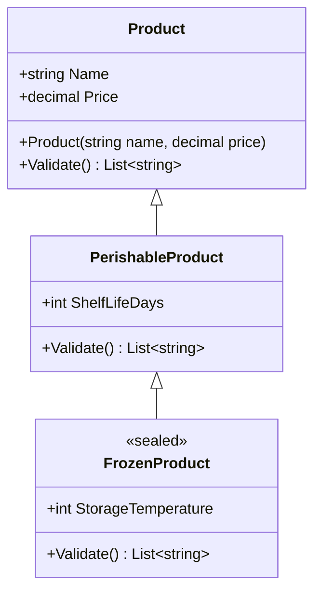
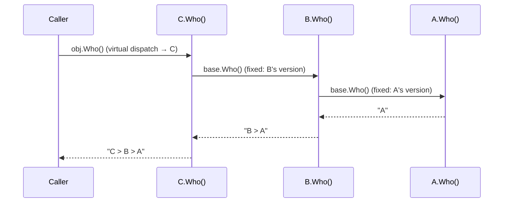
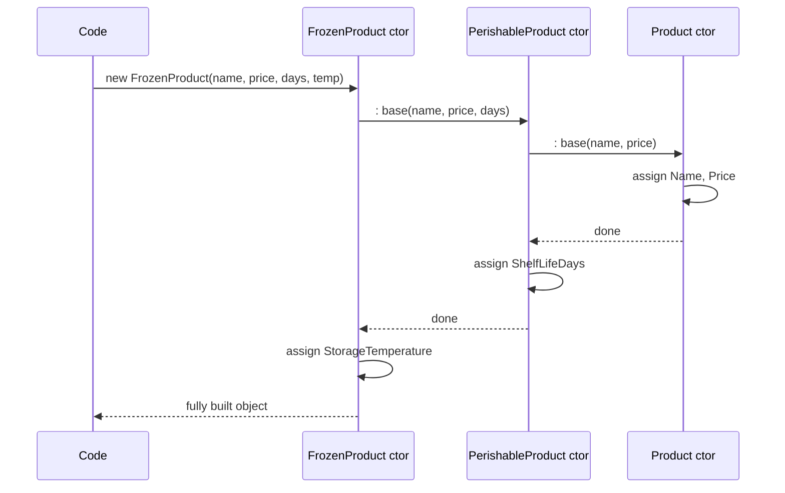
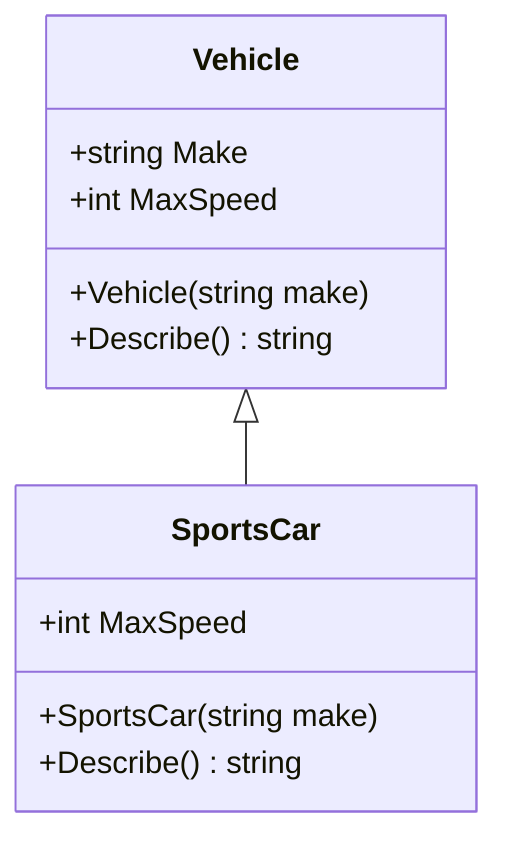
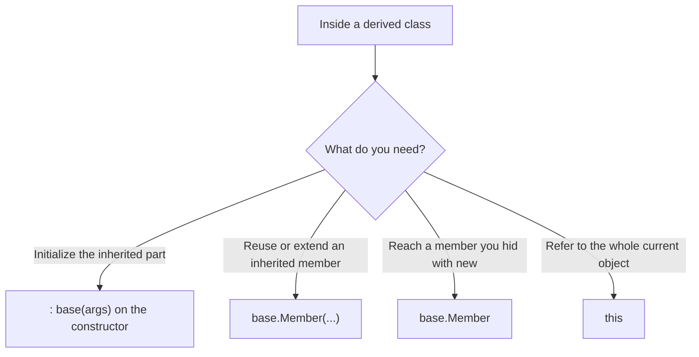

# 18. `base` Keyword

> Learn how a derived class reaches its base class: calling base constructors, reusing base methods, accessing base members, and building inheritance chains where each level adds to the one above.

**Level:** 🟠 Intermediate
**Prerequisites:** [07. Constructors](../07-constructors/README.md), [09. Inheritance](../09-inheritance/README.md), [10. Polymorphism](../10-polymorphism/README.md)

---

## 📑 In This Chapter

1. What is `base`?
2. Base Constructor
3. Base Method
4. Base Member Access
5. Rules and Limitations
6. Inheritance Examples
7. Real-World Example
8. Interview Questions

---

## 🎯 Learning Objectives

By the end of this chapter you will be able to:

- Explain what `base` refers to and where it can be used.
- Call a specific base constructor with `: base(...)`.
- Extend (not replace) base behavior with `base.Method()`.
- Access base properties, indexers and hidden members through `base`.
- Explain why `base.Method()` is **not** a virtual call.
- Avoid classic mistakes: infinite recursion, forgotten base calls, and wrong call order.

---

## 📖 Concept

Inside a **derived class**, the keyword **`base`** gives access to the **members of its immediate base class**. It is the counterpart of `this` (see [17. `this` Keyword](../17-this-keyword/README.md)).

```csharp
public class Vehicle
{
    public string Make { get; }

    public Vehicle(string make) => Make = make;

    public virtual string Describe() => $"Vehicle: {Make}";
}

public class Car : Vehicle
{
    public Car(string make) : base(make) { }                           // 1) base constructor

    public override string Describe() => base.Describe() + " (car)";   // 2) base method
}
```

Three uses of `base`:

| Use | Syntax | Purpose |
|---|---|---|
| **Call a base constructor** | `: base(args)` after the constructor signature | Initialize the inherited part of the object |
| **Call a base method / property / indexer** | `base.Member` | Reuse or extend the base implementation |
| **Reach a hidden or overridden member** | `base.Member` | Get the version the derived class replaced or hid |

### Base Constructor

Every constructor of a derived class **must call a constructor of its base class**. If you write nothing, the compiler inserts **`: base()`** (the parameterless base constructor).

```csharp
public class Vehicle
{
    public string Make { get; }
    public Vehicle(string make) => Make = make;        // no parameterless constructor exists
}

public class Car : Vehicle
{
    // public Car() { }                                // ❌ CS7036: no argument for 'make'
    public Car(string make) : base(make) { }           // ✅ pass the argument up
}
```

Key rules:

| Rule | Detail |
|---|---|
| **Implicit call** | If omitted, `: base()` is added automatically |
| **Required** | If the base has no accessible parameterless constructor, you **must** call `: base(...)` explicitly (error CS7036 otherwise) |
| **Runs first** | The base constructor body runs **before** the derived constructor body (see execution order in [07. Constructors](../07-constructors/README.md)) |
| **Arguments** | Can use the derived constructor's **parameters**, constants and **static** members, but **not** instance members (`this` is not available yet) |
| **Choose which one** | Overloads let you pick: `: base(make)` vs `: base(make, year)` |
| **Accessibility** | The base constructor must be accessible (`public`, `protected`, `internal`...). A `private` base constructor cannot be called |

```csharp
public class Car : Vehicle
{
    public int Doors { get; }

    public Car(string make, int doors) : base(Normalize(make))   // static helper in the argument is fine
    {
        Doors = doors;
    }

    private static string Normalize(string make) => make.Trim().ToUpperInvariant();
}
```

`base(...)` and `this(...)` cannot be used together on the same constructor: pick one. A constructor that chains with `: this(...)` reaches the base constructor through the constructor it chains to.

### Base Method

`base.Method()` calls the **base class's implementation** of a method. It is how an override **extends** the base behavior instead of **replacing** it.

```csharp
public class Vehicle
{
    public string Make { get; }
    public virtual int MaxSpeed => 120;

    public Vehicle(string make) => Make = make;

    public virtual string Describe() => $"{Make}, max {MaxSpeed} km/h";
}

public class SportsCar : Vehicle
{
    public SportsCar(string make) : base(make) { }

    public override int MaxSpeed => base.MaxSpeed + 130;          // reuse and adjust the base value

    public override string Describe() => base.Describe() + " [sports]";   // run base, then add to it
}

Console.WriteLine(new Vehicle("Toyota").Describe());
Console.WriteLine(new SportsCar("Ferrari").Describe());
```

**Output**

```text
Toyota, max 120 km/h
Ferrari, max 250 km/h [sports]
```

Notice something subtle: `base.Describe()` runs `Vehicle.Describe`, but inside it, `MaxSpeed` is a **virtual** call, so it uses `SportsCar.MaxSpeed` (250). Only the call **through `base.`** is fixed to the base implementation.

Where you call `base.Method()` matters:

```csharp
public override void Save()
{
    // 1) BEFORE: base work first, then yours (typical for "setup/validate")
    base.Save();
    AuditLog();
}

public override void Close()
{
    // 2) AFTER: your cleanup first, then the base (typical for "teardown")
    ReleaseMyResources();
    base.Close();
}

public override string Render()
{
    // 3) AROUND: wrap the base result
    return "[" + base.Render() + "]";
}
```

### Base Member Access

`base` also reaches **properties, indexers and (accessible) fields** of the base class, including ones the derived class **hid** with `new`.

```csharp
public class A
{
    public string Label { get; set; } = "A";
    public string Name() => "A.Name";
}

public class B : A
{
    public new string Label { get; set; } = "B";                    // hides A.Label
    public new string Name() => "B.Name -> " + base.Name();         // hides and still uses A's version

    public string ShowBoth() => $"{this.Label} / {base.Label}";     // B's Label / A's Label
}

var b = new B();
Console.WriteLine(b.Name());        // B.Name -> A.Name
Console.WriteLine(b.ShowBoth());    // B / A
```

Indexers work too:

```csharp
public class Playlist
{
    protected readonly List<string> Songs = new();
    public virtual string this[int index] => Songs[index];
}

public class UpperPlaylist : Playlist
{
    public override string this[int index] => base[index].ToUpperInvariant();   // base indexer
}
```

You can only reach members that are **accessible** (see [16. Access Modifiers](../16-access-modifiers/README.md)): `public`, `protected`, `internal` (same assembly), etc. A base `private` member is not reachable through `base`.

### Rules and Limitations

| Rule | Detail |
|---|---|
| **Only in instance members** | `base` is not available in `static` members (error CS1511) |
| **Immediate base only** | `base` always means the **direct** parent. There is **no** `base.base` to jump to a grandparent |
| **Not a standalone value** | You cannot write `var x = base;` or pass `base` as an argument (error CS0175). Use `(Vehicle)this` if you need a base-typed reference |
| **`base.M()` is non-virtual** | It calls exactly the base implementation, even if `M` is `virtual` and overridden further down |
| **Needs something to call** | `base.M()` on an `abstract` base member is an error (nothing to run) |
| **Accessibility applies** | Only accessible base members can be used |

---

## 🤔 Why It Matters

- **Correct initialization:** the base part of an object must be initialized by the base class's own constructor.
- **Reuse without copying:** `base.Method()` lets a derived class add behavior on top of existing, tested logic.
- **Open/Closed in practice:** extend behavior in subclasses without rewriting base code (see [24. SOLID Principles](../24-solid-principles/README.md)).
- **Stays correct as the base evolves:** if the base class improves, derived classes that call `base` benefit automatically.
- **Prevents subtle bugs:** many frameworks rely on overrides calling `base` (disposal, lifecycle hooks, property change notifications).

---

## 🧩 Syntax

```csharp
public class Base
{
    public Base() { }
    public Base(string name) { }

    public virtual string Describe() => "Base";
    public virtual int Size => 10;
    public virtual string this[int i] => "item " + i;
}

public class Derived : Base
{
    // Base constructor calls
    public Derived() : base() { }                      // explicit parameterless
    public Derived(string name) : base(name) { }       // pass arguments up

    // Base method, property and indexer
    public override string Describe() => base.Describe() + " + Derived";
    public override int Size => base.Size * 2;
    public override string this[int i] => base[i].ToUpperInvariant();

    // Reach a member hidden with 'new'
    public new string ToString() => "Derived/" + base.ToString();
}
```

---

## 💻 Basic Example

```csharp
public class Vehicle
{
    public string Make { get; }
    public virtual int MaxSpeed => 120;

    public Vehicle(string make) => Make = make;

    public virtual string Describe() => $"{Make}, max {MaxSpeed} km/h";
}

public class SportsCar : Vehicle
{
    public SportsCar(string make) : base(make) { }                       // base constructor

    public override int MaxSpeed => base.MaxSpeed + 130;                 // base property

    public override string Describe() => base.Describe() + " [sports]";  // base method
}

Vehicle[] fleet =
{
    new Vehicle("Toyota"),
    new SportsCar("Ferrari")
};

foreach (var vehicle in fleet)
    Console.WriteLine(vehicle.Describe());
```

**Output**

```text
Toyota, max 120 km/h
Ferrari, max 250 km/h [sports]
```

`SportsCar` writes only what is **different**. Everything else comes from `Vehicle` through `base`.

---

## 🌍 Real-World Example

A product validation chain where **every level of the hierarchy adds its own rules** and calls `base.Validate()` first, so the rules of all ancestors still apply.

```csharp
public class Product
{
    public string Name { get; }
    public decimal Price { get; }

    public Product(string name, decimal price)
    {
        Name = name;
        Price = price;
    }

    public virtual List<string> Validate()
    {
        var errors = new List<string>();

        if (string.IsNullOrWhiteSpace(Name))
            errors.Add("Name is required.");

        if (Price <= 0)
            errors.Add("Price must be positive.");

        return errors;
    }
}

public class PerishableProduct : Product
{
    public int ShelfLifeDays { get; }

    public PerishableProduct(string name, decimal price, int shelfLifeDays)
        : base(name, price)                                       // pass shared data up
    {
        ShelfLifeDays = shelfLifeDays;
    }

    public override List<string> Validate()
    {
        var errors = base.Validate();                             // reuse the Product rules first

        if (ShelfLifeDays <= 0)
            errors.Add("Shelf life must be positive.");

        return errors;
    }
}

public sealed class FrozenProduct : PerishableProduct
{
    public int StorageTemperature { get; }

    public FrozenProduct(string name, decimal price, int shelfLifeDays, int storageTemperature)
        : base(name, price, shelfLifeDays)
    {
        StorageTemperature = storageTemperature;
    }

    public override List<string> Validate()
    {
        var errors = base.Validate();                             // Perishable rules (which include Product rules)

        if (StorageTemperature > -18)
            errors.Add("Frozen products must be stored at -18 or colder.");

        return errors;
    }
}

var item = new FrozenProduct("", -5m, 0, -5);

foreach (var error in item.Validate())
    Console.WriteLine(error);
```

**Output**

```text
Name is required.
Price must be positive.
Shelf life must be positive.
Frozen products must be stored at -18 or colder.
```

Each class knows **only its own rules**. The chain `FrozenProduct → PerishableProduct → Product` is walked through `base` at every level, and the constructors pass shared data up the same way.



---

## 🧠 How It Works

### `base.Method()` is a direct (non-virtual) call

An ordinary call such as `obj.Describe()` on a virtual method is **dispatched at run time** to the object's actual type. A call through `base.` is **bound at compile time** to the base class's implementation.

```csharp
public class A { public virtual string Who() => "A"; }
public class B : A { public override string Who() => "B > " + base.Who(); }
public class C : B { public override string Who() => "C > " + base.Who(); }

A obj = new C();
Console.WriteLine(obj.Who());       // C > B > A
```



At each level, `base` means **the immediate parent**, so the chain unwinds one level at a time.

### Constructor chain with `base(...)`



Constructor **bodies** run from the top of the hierarchy down (base first). Field initializers and the exact order are covered in [07. Constructors](../07-constructors/README.md).

### Why "no `base.base`"

`base` always means the direct parent. Reaching a grandparent's implementation while skipping the parent would bypass the parent's rules and break its invariants, so the language does not allow it. If you need it, rethink the design (for example extract shared logic into a `protected` helper in the grandparent).

### Overriding without calling `base` is a decision, not an accident

| Intent | What to do |
|---|---|
| **Extend** the base behavior | Call `base.Method()` (before, after, or around your code) |
| **Replace** it entirely | Do not call `base`, and make sure the base's essential work is not lost |

---

## 📊 Diagram





*(Larger diagrams live in [`/diagrams`](../diagrams).)*

---

## ⚔️ Important Comparisons

### `base` vs `this`

| Aspect | `base` | `this` |
|---|---|---|
| **Refers to** | The base-class part of the current object (immediate parent) | The current object as its own type |
| **Dispatch** | Call is **non-virtual** (fixed to the base implementation) | Normal call: **virtual** members dispatch to the actual type |
| **Can be passed as a value** | ❌ | ✅ |
| **Constructor form** | `: base(...)` | `: this(...)` |
| **Available in static members** | ❌ | ❌ |
| **Chapter** | This chapter | [17. `this` Keyword](../17-this-keyword/README.md) |

### Extending vs replacing in an override

| Aspect | Extend (`base.Method()` + more) | Replace (no `base` call) |
|---|---|---|
| **Keeps base logic** | ✅ | ❌ |
| **Benefits from base improvements** | ✅ | ❌ |
| **Risk** | Wrong call order | Losing essential base work |
| **Typical use** | Validation, rendering, lifecycle hooks | Completely different algorithm |

### Explicit `base(...)` vs implicit

| Aspect | Explicit `: base(args)` | Implicit `: base()` |
|---|---|---|
| **Needed when** | Base has no accessible parameterless constructor, or you want a specific overload | Base has an accessible parameterless constructor |
| **Passes data up** | ✅ | ❌ |

---

## ⚠️ Common Mistakes

1. ❌ **Forgetting `: base(...)` when the base has no parameterless constructor.** Error CS7036. Fix: call the right base constructor explicitly.
2. ❌ **Infinite recursion** by calling the method itself instead of `base`:
   ```csharp
   public override string Describe() => Describe() + " [sports]";        // ❌ calls itself forever
   public override string Describe() => base.Describe() + " [sports]";   // ✅
   ```
   Fix: use `base.` to reach the parent's version.
3. ❌ **Expecting `base.Method()` to dispatch virtually.** It always calls the parent's implementation. Fix: call through `this`/an ordinary reference when you want virtual dispatch.
4. ❌ **Overriding without calling `base` when the base does essential work** (disposal, lifecycle hooks, change notifications, cache invalidation). Fix: call `base` unless you are deliberately replacing and have replicated what matters.
5. ❌ **Calling `base` at the wrong point.** Validation before vs after, setup before vs teardown after. Fix: setup → base first; teardown → yours first, then base.
6. ❌ **Trying to use `base` in a static member.** Error CS1511. Fix: make the member an instance member.
7. ❌ **Using `base` as a value** (`var parent = base;` or `Process(base)`). Error CS0175. Fix: use `(Vehicle)this` if you need a base-typed reference.
8. ❌ **Trying `base.base.Method()`.** Not valid. Fix: add a `protected` helper in the grandparent, or redesign.
9. ❌ **Using instance members in `base(...)` arguments** (`: base(this.Name)` or `: base(_field)`). The object is not constructed yet. Fix: use constructor parameters, constants or static helpers.
10. ❌ **Calling a `private` base constructor or member.** Not accessible. Fix: make it `protected`/`internal` deliberately, or redesign.
11. ❌ **Calling virtual methods from the base constructor.** The override may run before the derived constructor body ([07. Constructors](../07-constructors/README.md)). Fix: avoid, or use a separate initialization step.
12. ❌ **Calling `base.Method()` for an `abstract` member.** There is no implementation to call. Fix: implement your own logic.
13. ❌ **Relying on `base` to fix a weak design.** If you override everything and fight the base class, inheritance is the wrong tool. Fix: prefer composition ([09. Inheritance](../09-inheritance/README.md)).

---

## ✅ Best Practices

- **Pass shared data up** through `: base(...)` and keep derived constructors small.
- **Extend, don't duplicate:** call `base.Method()` and add only what is different.
- **Order matters:** do setup work after/before `base` deliberately, and document why.
- Always call **`base`** in overrides of members whose base implementation does essential work (disposal, lifecycle hooks, notifications).
- Keep **`: base(...)` arguments simple** (parameters, constants, static helpers).
- Avoid deep chains of `base` calls; **keep hierarchies shallow** ([09. Inheritance](../09-inheritance/README.md)).
- Use a **`protected` helper** in the base class if derived classes need shared logic, instead of reaching for hidden members.
- Make leaf classes **`sealed`** ([14. Sealed Members](../14-sealed-members/README.md)).
- Do **not** use `new` hiding plus `base` to work around a missing `virtual`; fix the base class design.
- Prefer **composition** when you are overriding most members.

---

## 🎯 Interview Questions

**Q1. What is the `base` keyword?**

A keyword that lets a derived class access members of its immediate base class. It is used to call base constructors (`: base(...)`), to call base implementations of methods, properties and indexers (`base.Member`), and to reach members hidden by the derived class.

**Q2. How do you call a specific base class constructor?**

Add `: base(arguments)` after the derived constructor's parameter list, choosing the base overload that matches the arguments.

**Q3. What happens if you do not call a base constructor explicitly?**

The compiler inserts a call to the base class's parameterless constructor. If there is no accessible parameterless constructor, you get a compile error (CS7036).

**Q4. In what order do constructors run?**

The base constructor body runs before the derived constructor body, going up the hierarchy and then back down. (Field initializers run before the base constructor, from the most derived class up.)

**Q5. What is the difference between `this` and `base`?**

`this` refers to the current object as its own type and can be passed around; `base` refers to the base-class part and is used to access the parent's constructor and members. Calls through `base.` are non-virtual, and `base` cannot be used as a standalone value.

**Q6. Is `base.Method()` a virtual call?**

No. It is bound to the base class's implementation and does not dispatch to further-derived overrides.

**Q7. Can you use `base` in a static method?**

No. `base` needs an instance. The compiler reports an error (CS1511).

**Q8. Can you call a grandparent's method directly with `base.base`?**

No. `base` always refers to the immediate parent. Reaching past it would bypass the parent's rules.

**Q9. Can you pass `base` as an argument or assign it to a variable?**

No (error CS0175). If you need a base-typed reference, use a cast: `(BaseType)this`.

**Q10. When should an override call `base`?**

When the base implementation does work that must still happen, or when the override is meant to extend rather than replace behavior, such as validation, rendering, lifecycle hooks and disposal.

**Q11. What causes infinite recursion in an override?**

Calling the method itself (`Describe()`) instead of `base.Describe()`. The call dispatches virtually back into the same override.

**Q12. Can `base` access private members of the parent?**

No. Only accessible members (public, protected, internal within the same assembly, and so on) can be reached.

**Q13. Can you use `base.Method()` on an abstract method?**

No. An abstract method has no implementation to call, so the compiler rejects it.

**Q14. Can you use `this(...)` and `base(...)` on the same constructor?**

No. A constructor initializer is either `this(...)` or `base(...)`. A constructor that chains with `this(...)` reaches the base constructor through the constructor it chains to.

---

## 📝 Practice Problems

| # | Problem | Difficulty | Solution |
|:-:|---|:-:|:-:|
| 1 | Create `Person` with a `name` constructor and `Student : Person` that passes `name` up with `: base(name)` and adds a `school`. | 🟢 | [View →](../solutions/18-base-keyword/) |
| 2 | Reproduce error CS7036 by omitting `: base(...)`, then fix it. | 🟢 | [View →](../solutions/18-base-keyword/) |
| 3 | Create `Animal.Speak()` (virtual) and `Dog.Speak()` that calls `base.Speak()` and then adds its own line. | 🟢 | [View →](../solutions/18-base-keyword/) |
| 4 | Create the `A → B → C` `Who()` chain from this chapter and print `C > B > A`. | 🟡 | [View →](../solutions/18-base-keyword/) |
| 5 | Cause infinite recursion by calling `Describe()` inside its own override, then fix it with `base`. | 🟡 | [View →](../solutions/18-base-keyword/) |
| 6 | Build the `Product → PerishableProduct → FrozenProduct` validation chain and test it with valid and invalid items. | 🟡 | [View →](../solutions/18-base-keyword/) |
| 7 | Use `base` to access a base property that you hid with `new`, and print both values. | 🟡 | [View →](../solutions/18-base-keyword/) |
| 8 | Override an indexer in a derived `Playlist` and call `base[index]`. | 🟡 | [View →](../solutions/18-base-keyword/) |
| 9 | Show with an example why `base.Method()` does not dispatch virtually (use a three-level hierarchy). | 🟠 | [View →](../solutions/18-base-keyword/) |
| 10 | Write a `Resource` base class with `Dispose(bool)` and a derived class that overrides it. Show what leaks if the override forgets `base.Dispose(disposing)`. | 🟠 | [View →](../solutions/18-base-keyword/) |
| 11 | Replace a "skip the parent" attempt (`base.base`) with a `protected` helper method in the grandparent. | 🟠 | [View →](../solutions/18-base-keyword/) |

Starter files: [`/exercises/18-base-keyword`](../exercises/18-base-keyword/)

---

## 🔑 Key Takeaways

- **`base`** refers to the **immediate parent** of the current class, from inside instance members.
- **`: base(...)`** picks the base constructor; if omitted, `: base()` is added, and it is an **error** if the base has no accessible parameterless one.
- **`base.Method()`** reuses the parent's implementation, and it is a **non-virtual** call.
- Use `base` to **extend** behavior, and call it **before, after or around** your own code on purpose.
- You **cannot** use `base` in static members, as a standalone value, or as `base.base`.
- Calling the method itself instead of `base.Method()` causes **infinite recursion**.
- Constructor bodies run **base first**, then derived; **`base(...)` arguments cannot use instance members**.
- If you are replacing almost everything and avoiding `base`, consider **composition** instead of inheritance.

---

[⬅ Previous: `this` Keyword](../17-this-keyword/README.md)
&nbsp;&nbsp;•&nbsp;&nbsp;
[🏠 Main README](../README.md)
&nbsp;&nbsp;•&nbsp;&nbsp;
[Next: `System.Object` ➡](../19-object-class/README.md)