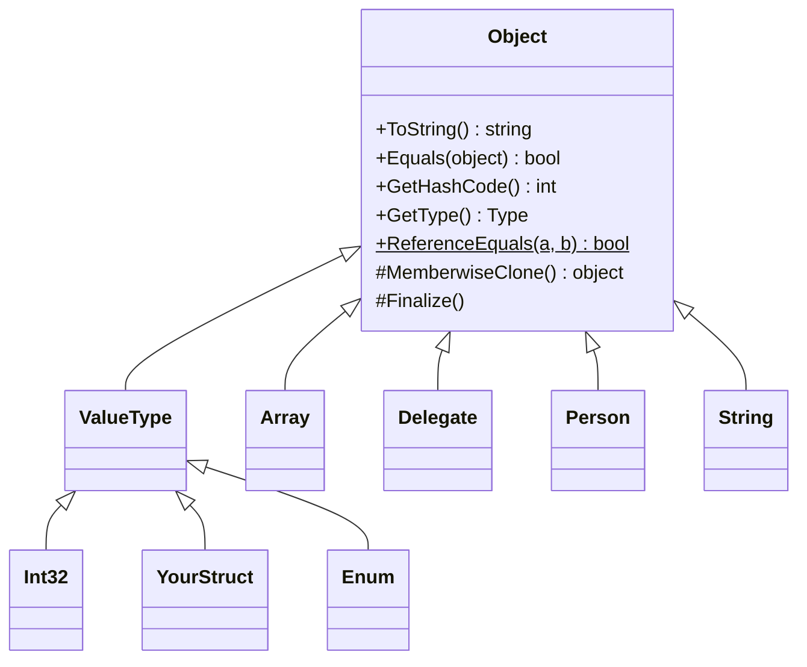
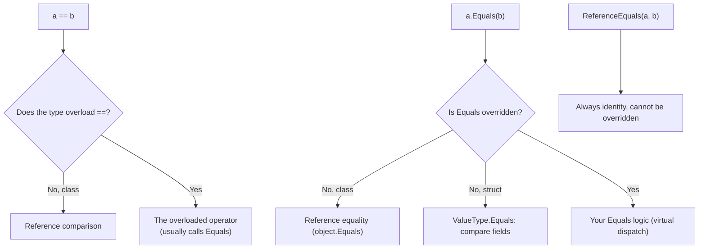
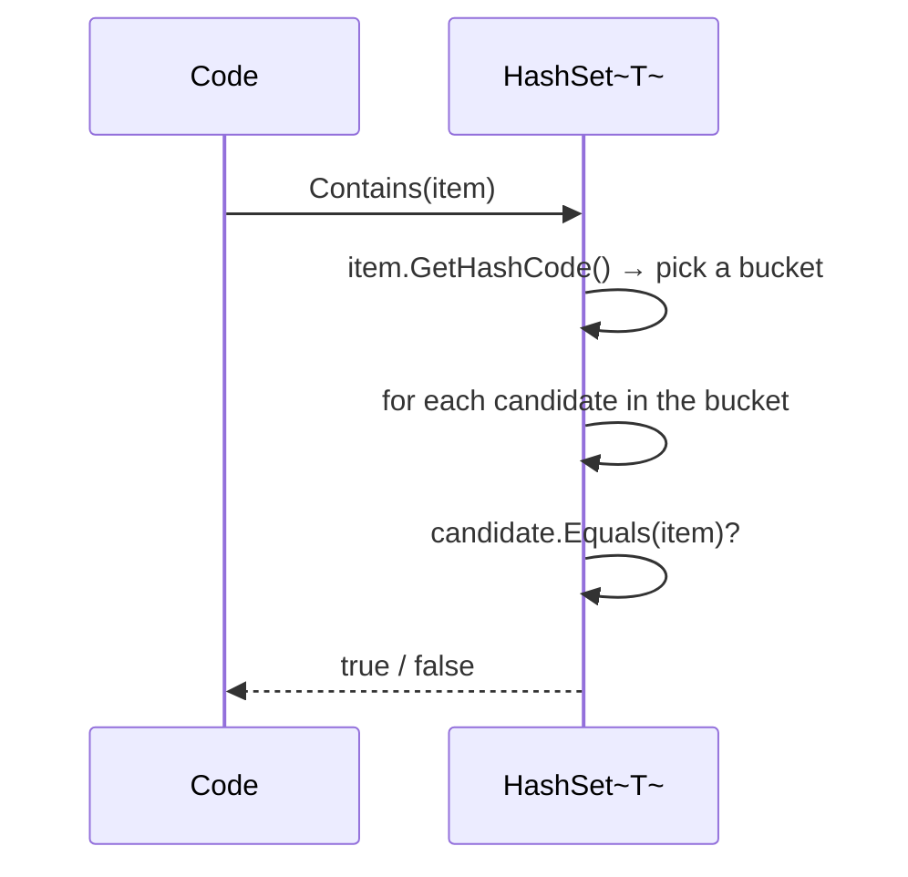
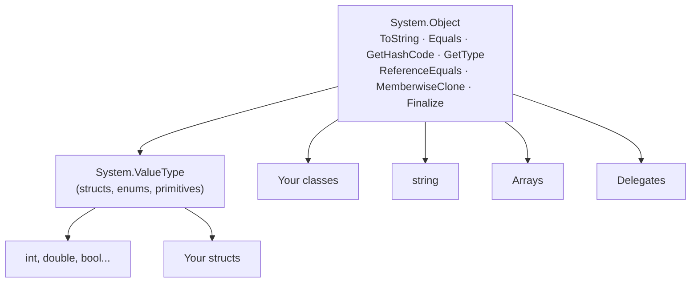
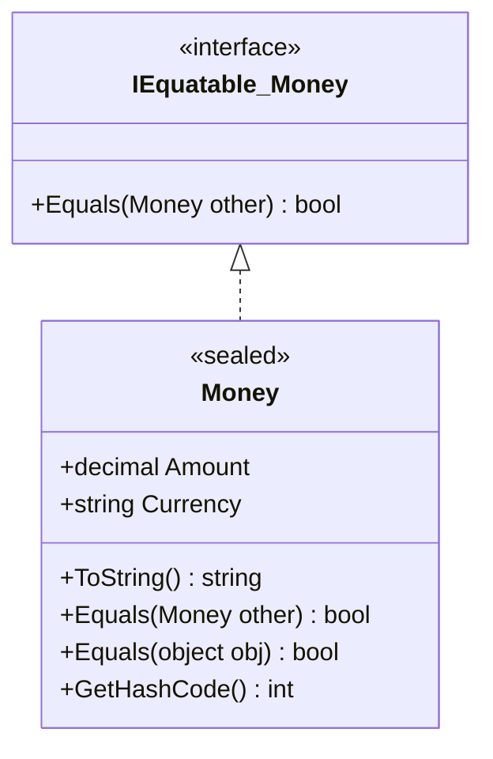

# 19. `System.Object`

> Learn the root of the .NET type system: what every type inherits from `object`, and how `ToString()`, `Equals()`, `ReferenceEquals()`, `GetHashCode()` and `GetType()` work, when to override them, and how to keep them consistent.

**Level:** 🔵 Advanced
**Prerequisites:** [03. Objects](../03-objects/README.md), [09. Inheritance](../09-inheritance/README.md), [10. Polymorphism](../10-polymorphism/README.md)

---

## 📑 In This Chapter

1. The Root Object Type
2. `ToString()`
3. `Equals()`
4. `ReferenceEquals()`
5. `GetHashCode()`
6. `GetType()`
7. `MemberwiseClone()` and `Finalize()`
8. Equality Done Right
9. Real-World Example
10. Interview Questions

---

## 🎯 Learning Objectives

By the end of this chapter you will be able to:

- Explain that **every type** in .NET derives from `System.Object`.
- Describe the default behavior of `ToString()`, `Equals()`, `GetHashCode()`, `GetType()` and `ReferenceEquals()`.
- Override `ToString()` correctly to produce useful output.
- Implement **value equality** with `Equals`, `GetHashCode` and `IEquatable<T>`, following the equality contract.
- Tell **reference equality**, **value equality** and **exact type checks** apart.
- Avoid classic bugs: overriding `Equals` without `GetHashCode`, mutable hash keys, and shallow copies.

---

## 📖 Concept

**`System.Object`** (C# keyword **`object`**) is the **ultimate base class of every type** in .NET: classes, structs, enums, delegates, arrays, and (through their implementing types) interfaces. When you write a class without a base class, the compiler treats it as if you had written `: object`.

```csharp
public class Person { }                 // means: public class Person : object { }
```



Because of this, **every object** has the same small set of members, and a variable of type `object` can hold **any** value:

```csharp
object a = 42;                 // value type (boxed, see 20. Boxing & Unboxing)
object b = "hello";
object c = new Person();
object d = new int[] { 1, 2 };
```

### The members of `object`

| Member | Kind | Purpose | Overridable? |
|---|---|---|:-:|
| `ToString()` | public instance | Text representation | ✅ `virtual` |
| `Equals(object)` | public instance | Equality of this object with another | ✅ `virtual` |
| `GetHashCode()` | public instance | Integer hash used by hash-based collections | ✅ `virtual` |
| `GetType()` | public instance | The exact run-time `Type` | ❌ |
| `Equals(object, object)` | public **static** | Null-safe equality helper | ❌ |
| `ReferenceEquals(object, object)` | public **static** | Reference identity check | ❌ |
| `MemberwiseClone()` | **protected** | Shallow copy of the object | ❌ |
| `Finalize()` | **protected** | Finalizer (cleanup before GC); written as `~ClassName()` | ✅ (via finalizer syntax) |

Three of them are **virtual**, so they take part in polymorphism (see [10. Polymorphism](../10-polymorphism/README.md)).

### `ToString()`

Returns a **string representation** of the object. It is called automatically by string interpolation, `Console.WriteLine`, `string.Format`, `string.Concat` and the debugger.

**Default:** the type's **full name** (namespace + name).

```csharp
public class Person
{
    public string Name { get; }
    public int Age { get; }

    public Person(string name, int age) { Name = name; Age = age; }
}

var p = new Person("Sam", 30);
Console.WriteLine(p);            // Person   (or MyApp.Person if declared in a namespace)
```

That is rarely useful, so **override it**:

```csharp
public class Person
{
    public string Name { get; }
    public int Age { get; }

    public Person(string name, int age) { Name = name; Age = age; }

    public override string ToString() => $"{Name} ({Age})";
}

var p = new Person("Sam", 30);
Console.WriteLine(p);            // Sam (30)
Console.WriteLine($"Hello, {p}");// Hello, Sam (30)
```

What built-in types return:

| Value | `ToString()` result |
|---|---|
| `42` | `"42"` |
| `"hi"` | `"hi"` (itself) |
| `true` | `"True"` |
| `new int[3]` | `"System.Int32[]"` (the default type name) |
| `new List<int>()` | ``"System.Collections.Generic.List`1[System.Int32]"`` (the default type name) |
| `null` reference | calling `.ToString()` throws `NullReferenceException` |

Guidelines:

- Return a **short, readable** summary, never `null`, and **never throw**.
- It is for **display and diagnostics**, not for parsing, business logic or serialization.
- Be aware of **culture**: numbers and dates format according to the current culture. For control, implement `IFormattable` or pass a format/culture explicitly.

### `Equals()`

`Equals(object? obj)` answers: **"is this object equal to that one?"**

**Default behavior depends on the kind of type:**

| Type | Default `Equals` |
|---|---|
| **Class** | **Reference equality**: true only if both variables refer to the **same object** |
| **Struct** | `ValueType.Equals`: compares **fields** (correct but potentially slow and boxing) |
| **`string`**, **`record`**, many framework types | **Overridden** to compare by value |

```csharp
var p1 = new Person("Sam", 30);
var p2 = new Person("Sam", 30);
var p3 = p1;

Console.WriteLine(p1.Equals(p2));   // False  (different objects, default reference equality)
Console.WriteLine(p1.Equals(p3));   // True   (same object)
```

There is also a **static, null-safe** version:

```csharp
object.Equals(null, null);          // True
object.Equals(p1, null);            // False  (no exception)
object.Equals(p1, p2);              // calls p1.Equals(p2) when p1 is not null
```

**The equality contract**: any `Equals` override must be:

| Property | Meaning |
|---|---|
| **Reflexive** | `x.Equals(x)` is `true` |
| **Symmetric** | `x.Equals(y)` equals `y.Equals(x)` |
| **Transitive** | if `x` equals `y` and `y` equals `z`, then `x` equals `z` |
| **Consistent** | repeated calls give the same result unless the objects change |
| **Null-safe** | `x.Equals(null)` is `false` (never throws) |

### `ReferenceEquals()`

`object.ReferenceEquals(a, b)` is `true` **only if both refer to the exact same object** (or both are `null`). It **cannot be overridden**, so it always means *identity*.

```csharp
var a = new Person("Sam", 30);
var b = new Person("Sam", 30);
var c = a;

Console.WriteLine(ReferenceEquals(a, b));     // False
Console.WriteLine(ReferenceEquals(a, c));     // True
Console.WriteLine(ReferenceEquals(null, null)); // True
```

Watch out for value types: each conversion to `object` creates a **new box**, so identity checks are meaningless.

```csharp
Console.WriteLine(ReferenceEquals(1, 1));     // False  (two separate boxes)
```

### `GetHashCode()`

Returns an **`int` hash code** used by hash-based collections (`Dictionary<TKey,TValue>`, `HashSet<T>`) to find objects quickly.

**Default:** for classes, derived from **object identity**; for structs, derived from the **fields** (an implementation detail). Do not depend on either.

**The hash code contract:**

| Rule | Meaning |
|---|---|
| **Equal objects ⇒ equal hash codes** | If `a.Equals(b)` then `a.GetHashCode() == b.GetHashCode()` |
| **Different objects may collide** | Same hash code does **not** mean equal |
| **Stable while in use** | The hash code of an object stored in a hash collection must not change |
| **Fast and well distributed** | Computed cheaply, spread across the `int` range |
| **Not persistent** | Do not store or compare hash codes across runs or machines (for example, string hashes are randomized per process in modern .NET) |

> ⚠️ **If you override `Equals`, you must override `GetHashCode`.** The compiler warns (CS0659) if you forget.

Use `HashCode.Combine` to build a good hash from several fields:

```csharp
public override int GetHashCode() => HashCode.Combine(Name, Age);
```

### `GetType()`

Returns the **exact run-time `System.Type`** of the object. It is **not virtual**, so it cannot lie.

```csharp
public class Animal { }
public class Dog : Animal { }

Animal a = new Dog();

Console.WriteLine(a.GetType().Name);               // Dog     (run-time type)
Console.WriteLine(typeof(Animal).Name);            // Animal  (compile-time type name)
Console.WriteLine(a is Animal);                    // True    (Dog IS an Animal)
Console.WriteLine(a.GetType() == typeof(Animal));  // False   (exact type is Dog)
Console.WriteLine(a.GetType().BaseType?.Name);     // Animal
```

| Check | Meaning |
|---|---|
| `x is Animal` | `x` is an `Animal` **or any derived type** |
| `x.GetType() == typeof(Animal)` | `x` is **exactly** an `Animal` |
| `typeof(Animal)` | The `Type` for a type known at compile time |
| `x.GetType()` | The `Type` of the object at run time |

### `MemberwiseClone()` and `Finalize()`

- **`MemberwiseClone()`** (protected) creates a **shallow copy**: value fields are copied, but reference fields point to the **same** objects as the original.

```csharp
public class Settings
{
    public string Theme { get; set; } = "Light";
    public List<string> Tags { get; } = new();

    public Settings ShallowCopy() => (Settings)MemberwiseClone();
}

var s1 = new Settings();
s1.Tags.Add("a");

var s2 = s1.ShallowCopy();
s2.Theme = "Dark";
s2.Tags.Add("b");

Console.WriteLine(s1.Theme);         // Light  (copied value, independent)
Console.WriteLine(s1.Tags.Count);    // 2      (the list is shared!)
```

For a **deep copy**, create new nested objects yourself (see the copy-constructor pattern in [07. Constructors](../07-constructors/README.md)). Avoid `ICloneable`: it does not say whether the copy is shallow or deep.

- **`Finalize()`** is the finalizer hook (`~ClassName()` syntax). It is covered in [23. Garbage Collection](../23-garbage-collection/README.md).

### Equality Done Right

**Step 1:** decide the **kind of equality** your type needs.

| Your type | Equality you want | What to do |
|---|---|---|
| **Entity** with identity (`Customer`, `Order`) | Same object, or same `Id` | Keep default, or compare a stable `Id` |
| **Value-like** (`Money`, `Point`, `EmailAddress`) | Same data means equal | Override `Equals` + `GetHashCode`, implement `IEquatable<T>` |
| **Simple data holder** | Same data means equal | Use a `record` ([22. Record vs Class](../22-record-vs-class/README.md)) |

**Step 2:** implement the **full set together**:

| Member | Why |
|---|---|
| `Equals(T? other)` via `IEquatable<T>` | Fast, type-safe, no boxing for structs |
| `override Equals(object? obj)` | Works with older APIs and non-generic code; delegates to the typed version |
| `override GetHashCode()` | Consistent with `Equals` |
| `operator ==` / `!=` (optional) | Natural syntax; must agree with `Equals` |
| `override ToString()` | Helpful diagnostics |

**Step 3:** prefer **`sealed`** classes for value-like types, so you avoid the subclass equality problems (symmetry across inheritance).

**What collections use:** `List<T>.Contains`, `Dictionary`, `HashSet<T>` and friends use `EqualityComparer<T>.Default`, which prefers `IEquatable<T>.Equals` and falls back to `object.Equals`, plus `GetHashCode` for hashing.

---

## 🤔 Why It Matters

- **Universal contract:** any value can be printed, compared, hashed and inspected, which makes generic code (collections, frameworks, logging, debuggers) possible.
- **Correct collections:** dictionaries, sets and `Contains` rely on `Equals` and `GetHashCode`. Wrong implementations silently produce lost entries and duplicates.
- **Readable diagnostics:** a good `ToString()` makes logs and debugger views useful.
- **Understanding `==` vs `Equals` vs `ReferenceEquals`** removes a whole family of subtle bugs.
- **Foundation for later topics:** boxing, casting, records and garbage collection all build on `object`.

---

## 🧩 Syntax

```csharp
public sealed class Money : IEquatable<Money>
{
    public decimal Amount { get; }
    public string Currency { get; }

    public Money(decimal amount, string currency)
    {
        ArgumentException.ThrowIfNullOrWhiteSpace(currency);
        Amount = amount;
        Currency = currency.ToUpperInvariant();
    }

    // ToString: readable text
    public override string ToString() => $"{Amount:F2} {Currency}";

    // IEquatable<T>: typed, fast equality
    public bool Equals(Money? other)
        => other is not null && Amount == other.Amount && Currency == other.Currency;

    // object.Equals: delegate to the typed version
    public override bool Equals(object? obj) => Equals(obj as Money);

    // GetHashCode: must agree with Equals
    public override int GetHashCode() => HashCode.Combine(Amount, Currency);

    // Optional operators: must agree with Equals
    public static bool operator ==(Money? left, Money? right)
        => left is null ? right is null : left.Equals(right);

    public static bool operator !=(Money? left, Money? right) => !(left == right);
}
```

---

## 💻 Basic Example

```csharp
public class Person
{
    public string Name { get; }
    public int Age { get; }

    public Person(string name, int age)
    {
        Name = name;
        Age = age;
    }
}

var p1 = new Person("Sam", 30);
var p2 = new Person("Sam", 30);

Console.WriteLine(p1.ToString());              // default: the type name
Console.WriteLine(p1.Equals(p2));              // default: reference equality
Console.WriteLine(ReferenceEquals(p1, p1));    // same object
Console.WriteLine(p1.GetType().Name);          // run-time type
```

**Output**

```text
Person
False
True
Person
```

Out of the box, a class gives you only the type name and identity-based equality. That is why overriding these members matters.

---

## 🌍 Real-World Example

A value-like `Money` type with correct equality, hashing and display, used in a `HashSet<T>`.

```csharp
public sealed class Money : IEquatable<Money>
{
    public decimal Amount { get; }
    public string Currency { get; }

    public Money(decimal amount, string currency)
    {
        ArgumentException.ThrowIfNullOrWhiteSpace(currency);
        Amount = amount;
        Currency = currency.ToUpperInvariant();
    }

    public override string ToString() => $"{Amount:F2} {Currency}";

    public bool Equals(Money? other)
        => other is not null && Amount == other.Amount && Currency == other.Currency;

    public override bool Equals(object? obj) => Equals(obj as Money);

    public override int GetHashCode() => HashCode.Combine(Amount, Currency);

    public static bool operator ==(Money? left, Money? right)
        => left is null ? right is null : left.Equals(right);

    public static bool operator !=(Money? left, Money? right) => !(left == right);
}

var a = new Money(10m, "usd");
var b = new Money(10m, "USD");
var c = new Money(5m, "USD");

Console.WriteLine(a);                                         // ToString
Console.WriteLine(a == b);                                    // value equality
Console.WriteLine(a.Equals(c));
Console.WriteLine(a.GetHashCode() == b.GetHashCode());        // equal objects, equal hashes

var set = new HashSet<Money> { a, b, c };
Console.WriteLine(set.Count);                                 // a and b are the same value
```

**Output**

```text
10.00 USD
True
False
True
2
```

(The `:F2` formatting uses the current culture, so the decimal separator may differ on your machine.)

### The classic bug: `Equals` without `GetHashCode`

```csharp
public class BrokenKey
{
    public int Id { get; }
    public BrokenKey(int id) => Id = id;

    public override bool Equals(object? obj) => obj is BrokenKey k && k.Id == Id;
    // GetHashCode NOT overridden → warning CS0659
}

var set = new HashSet<BrokenKey> { new BrokenKey(1) };
Console.WriteLine(set.Contains(new BrokenKey(1)));     // False in practice
```

Equal keys got **different identity-based hash codes**, so the set looks in the wrong bucket and never even calls `Equals`.

### The mutable-key bug

```csharp
public class User
{
    public string Name { get; set; } = "";
    public override bool Equals(object? obj) => obj is User u && u.Name == Name;
    public override int GetHashCode() => Name.GetHashCode();     // depends on a MUTABLE property
}

var user = new User { Name = "Sam" };
var set = new HashSet<User> { user };

user.Name = "Samuel";                                // hash code changes while the object is in the set
Console.WriteLine(set.Contains(user));               // False: the object is now "lost" in the set
```

Base hash codes on **immutable** data (like an `Id`), or make the type immutable.

---

## 🧠 How It Works

### Which equality runs?



### How a hash-based collection uses the two methods



This is why the contract matters: **equal objects must land in the same bucket** (same hash code), and `Equals` then confirms the match.

### Strings are special

```csharp
string s1 = "hello";
string s2 = new string("hello".ToCharArray());

Console.WriteLine(s1 == s2);                       // True   (== is overloaded: value comparison)
Console.WriteLine(s1.Equals(s2));                  // True
Console.WriteLine(ReferenceEquals(s1, s2));        // False  (different objects)
Console.WriteLine((object)s1 == (object)s2);       // False  (object == compares references)
```

`string` overrides `Equals` and overloads `==` for value comparison, and string literals may be **interned** (shared), which can make `ReferenceEquals` return `true` for literals but not for runtime-created strings. Do not rely on it.

### Value types and `object`

Calling `Equals`, `GetHashCode` or `ToString` on a struct that does not override them uses `ValueType`'s implementations, which compare fields in a general (slower) way. For custom structs, **implement `IEquatable<T>` and override `Equals`/`GetHashCode`**, and be aware that converting a struct to `object` **boxes** it (see [20. Boxing & Unboxing](../20-boxing-unboxing/README.md)).

### Equality in inheritance hierarchies

```csharp
public class Point
{
    public int X { get; }
    public int Y { get; }
    public Point(int x, int y) { X = x; Y = y; }

    public override bool Equals(object? obj)
        => obj is Point p && p.X == X && p.Y == Y;
    public override int GetHashCode() => HashCode.Combine(X, Y);
}

public class ColorPoint : Point
{
    public string Color { get; }
    public ColorPoint(int x, int y, string color) : base(x, y) => Color = color;

    public override bool Equals(object? obj)
        => obj is ColorPoint cp && base.Equals(cp) && cp.Color == Color;
}

var p  = new Point(1, 2);
var cp = new ColorPoint(1, 2, "Red");

Console.WriteLine(p.Equals(cp));    // True
Console.WriteLine(cp.Equals(p));    // False  ⚠️ violates symmetry
```

Equality across inheritance easily breaks the **symmetry** rule. The simplest fixes: make value-like types **`sealed`**, or compare **exact types** (`GetType() == obj.GetType()`), or avoid inheritance for value-like types.

---

## 📊 Diagram





*(Larger diagrams live in [`/diagrams`](../diagrams).)*

---

## ⚔️ Important Comparisons

### `==` vs `Equals` vs `ReferenceEquals`

| | `a == b` | `a.Equals(b)` | `ReferenceEquals(a, b)` |
|---|---|---|---|
| **Default for classes** | Reference comparison | Reference comparison | Reference comparison |
| **Can be customized** | ✅ (operator overload) | ✅ (override) | ❌ |
| **Throws on null `a`** | No (operators handle null) | ✅ `NullReferenceException` | No |
| **Dispatch** | **Compile time** (by static types) | **Run time** (virtual) | n/a |
| **For `string`** | Value comparison | Value comparison | Reference comparison |
| **Use for** | Natural value comparisons when overloaded | Value equality | True identity checks |

### `is`, `GetType()` and `typeof`

| Expression | Returns | Notes |
|---|---|---|
| `x is T` | `true` if `x` is `T` or derived (and not null) | Respects inheritance |
| `x.GetType() == typeof(T)` | `true` only for the **exact** type | Ignores inheritance |
| `typeof(T)` | `Type` of `T` | Known at compile time |
| `x.GetType()` | `Type` of the object | Run-time type, cannot be overridden |

### Reference vs value equality for your own types

| | Reference equality (default) | Value equality (override) |
|---|---|---|
| **Two objects, same data** | Not equal | Equal |
| **Needs `GetHashCode`** | Default is fine | **Must** be overridden consistently |
| **Good for** | Entities with identity | Value objects (`Money`, `Point`) |
| **Cost** | None | Code to write (or use a `record`) |

### Shallow vs deep copy

| | `MemberwiseClone` (shallow) | Deep copy |
|---|---|---|
| **Value fields** | Copied | Copied |
| **Reference fields** | Same objects shared | New objects created |
| **Independence** | Partial | Full |

---

## ⚠️ Common Mistakes

1. ❌ **Overriding `Equals` without `GetHashCode`.** Hash-based lookups silently fail. Fix: always override both (compiler warning CS0659).
2. ❌ **Basing `GetHashCode` on mutable fields** of an object stored in a hash collection. The object is lost after mutation. Fix: use immutable data (like an `Id`) or make the type immutable.
3. ❌ **Using `==` on objects and expecting value equality** when `==` is not overloaded. Fix: use `Equals`, overload `==`, or use a `record`.
4. ❌ **Calling `Equals` on a possibly-null reference.** `NullReferenceException`. Fix: `object.Equals(a, b)`, `a?.Equals(b)`, or pattern matching.
5. ❌ **Using `ReferenceEquals` on value types or strings** and being surprised. Boxing creates new objects; strings may be interned. Fix: use it only for true identity checks on reference types.
6. ❌ **Throwing or returning `null` from `ToString()`.** It is called by loggers, debuggers and string formatting. Fix: always return a non-null string and never throw.
7. ❌ **Using `ToString()` for parsing, serialization or business logic.** The format may change, and it is culture-sensitive. Fix: use explicit formatting, serialization APIs or dedicated properties.
8. ❌ **`Equals` that ignores the type check or null.** Crashes or wrong answers. Fix: use `obj is T other` / `obj as T` and handle `null`.
9. ❌ **Asymmetric equality across inheritance** (`p.Equals(cp)` true but `cp.Equals(p)` false). Fix: seal value-like types or compare exact types.
10. ❌ **Overriding `==` without `Equals`/`GetHashCode`** (or vice versa). Inconsistent behavior. Fix: implement them together and keep them in agreement.
11. ❌ **Relying on the default `GetHashCode` being unique or stable.** It is neither unique nor stable across runs. Fix: do not persist hash codes or use them as IDs.
12. ❌ **Forgetting `IEquatable<T>` on structs.** Equality boxes and uses the slow general path. Fix: implement `IEquatable<T>` and override `Equals`/`GetHashCode`.
13. ❌ **Assuming `MemberwiseClone` gives an independent copy.** Nested objects are shared. Fix: write a proper deep copy.
14. ❌ **Confusing `is` with `GetType() == typeof(...)`.** One includes derived types, the other does not. Fix: choose deliberately.

---

## ✅ Best Practices

- **Override `ToString()`** on types you print or log; keep it short, non-null and non-throwing.
- For value-like types, implement **`IEquatable<T>` + override `Equals(object)` + `GetHashCode()`** together, and **seal** the class.
- Build hash codes with **`HashCode.Combine`** from **immutable** fields.
- Prefer **immutable** value objects so hash codes never change.
- Use a **`record`** when you just need value equality for a data holder ([22. Record vs Class](../22-record-vs-class/README.md)).
- Keep `==`, `!=`, `Equals` and `GetHashCode` **consistent** with each other.
- Use **`ReferenceEquals`** (or `is null`) when you truly mean identity or null checks.
- Use **`object.Equals(a, b)`** when either side may be `null`.
- Do not use `ToString()` for **parsing or serialization**; do not persist **hash codes**.
- Choose `is`/pattern matching for **hierarchy checks** and `GetType()` for **exact type** checks.
- Avoid `ICloneable`; write explicit **copy constructors** or clear `Copy`/`Clone` methods that state shallow or deep semantics.
- Do not call `Equals`/`GetHashCode` assumptions into **inheritance hierarchies** without thinking through symmetry.

---

## 🎯 Interview Questions

**Q1. What is `System.Object`?**

The root of the .NET type hierarchy. Every type, including value types, enums, delegates and arrays, derives from it directly or indirectly. It provides `ToString()`, `Equals()`, `GetHashCode()`, `GetType()`, `ReferenceEquals()`, `MemberwiseClone()` and `Finalize()`.

**Q2. What is the difference between `object` and `System.Object`?**

None. `object` is the C# keyword alias for `System.Object`.

**Q3. What does the default `ToString()` return?**

The full name of the type (namespace plus type name). Types such as `int`, `string` and `DateTime` override it, and you should override it for your own types.

**Q4. What is the default behavior of `Equals` for classes and for structs?**

For classes it is reference equality (same object). For structs, `ValueType.Equals` compares the fields of the two values.

**Q5. What is the difference between `==`, `Equals` and `ReferenceEquals`?**

`==` is an operator resolved at compile time that defaults to reference comparison for classes unless overloaded (strings overload it for value comparison). `Equals` is virtual and can be overridden for value equality. `ReferenceEquals` always compares identity and cannot be overridden.

**Q6. Why must you override `GetHashCode` when you override `Equals`?**

Hash-based collections use the hash code to choose a bucket and then call `Equals`. If equal objects have different hash codes, they end up in different buckets, and lookups fail. The contract is: equal objects must return equal hash codes.

**Q7. Can two different objects have the same hash code?**

Yes. Hash collisions are allowed. Equal hash codes do not imply equal objects; `Equals` makes the final decision.

**Q8. What problems occur if `GetHashCode` depends on mutable fields?**

If a field changes while the object is stored in a `Dictionary` or `HashSet`, its hash code changes, and the collection can no longer find the object. Use immutable data or make the type immutable.

**Q9. What are the rules (contract) for `Equals`?**

It must be reflexive, symmetric, transitive, consistent, and `x.Equals(null)` must return `false` without throwing.

**Q10. What does `GetType()` return and can it be overridden?**

The exact run-time `Type` of the object. It is not virtual and cannot be overridden.

**Q11. What is the difference between `x is T` and `x.GetType() == typeof(T)`?**

`x is T` is true for `T` and any derived type (when not null). `GetType() == typeof(T)` is true only if the object's exact type is `T`.

**Q12. What does `MemberwiseClone` do?**

It creates a shallow copy of the object: value-type fields are copied, while reference-type fields continue to refer to the same objects as the original.

**Q13. Why implement `IEquatable<T>`?**

It provides a type-safe `Equals(T)` that avoids casting and, for structs, avoids boxing. Collections prefer it through `EqualityComparer<T>.Default`.

**Q14. Why does `ReferenceEquals(1, 1)` return `false`?**

Each `1` is boxed into a separate `object`, so there are two distinct references.

**Q15. What happens if you call `ToString()` on a null reference?**

A `NullReferenceException`. Use `?.ToString()` or string interpolation, which handles null safely.

**Q16. Which equality does `string` use?**

Value equality. `string` overrides `Equals` and overloads `==` to compare contents, though `ReferenceEquals` on two strings compares identity.

---

## 📝 Practice Problems

| # | Problem | Difficulty | Solution |
|:-:|---|:-:|:-:|
| 1 | Create a `Person` class, print an instance without overriding `ToString()`, then override it to print `Name (Age)`. | 🟢 | [View →](../solutions/19-object-class/) |
| 2 | Compare two `Person` objects with `==`, `Equals` and `ReferenceEquals` before overriding anything. Explain each result. | 🟢 | [View →](../solutions/19-object-class/) |
| 3 | Print `GetType().Name` and `GetType().BaseType` for several objects (an `int`, a `string`, a custom class). | 🟢 | [View →](../solutions/19-object-class/) |
| 4 | Implement value equality for a `Point` class (`Equals` and `GetHashCode`) and verify it with a `HashSet<Point>`. | 🟡 | [View →](../solutions/19-object-class/) |
| 5 | Reproduce the `BrokenKey` bug (override `Equals` only), then fix it. | 🟡 | [View →](../solutions/19-object-class/) |
| 6 | Reproduce the mutable-key bug with a `User` stored in a `HashSet`, then fix it using an immutable `Id`. | 🟡 | [View →](../solutions/19-object-class/) |
| 7 | Build the `Money` class from this chapter with `IEquatable<Money>`, `==`/`!=` and `ToString()`. Write tests for equal, unequal and `null` cases. | 🟡 | [View →](../solutions/19-object-class/) |
| 8 | Show the difference between `is Animal` and `GetType() == typeof(Animal)` using a `Dog`. | 🟡 | [View →](../solutions/19-object-class/) |
| 9 | Create a `Settings` class with a list property, copy it with `MemberwiseClone`, and demonstrate the shared list. Then write a deep copy. | 🟠 | [View →](../solutions/19-object-class/) |
| 10 | Reproduce the `Point`/`ColorPoint` symmetry violation and fix it two ways. | 🟠 | [View →](../solutions/19-object-class/) |
| 11 | Write an equatable `struct` with `IEquatable<T>`, `Equals(object)` and `GetHashCode()`. Explain what boxing would happen without `IEquatable<T>`. | 🟠 | [View →](../solutions/19-object-class/) |

Starter files: [`/exercises/19-object-class`](../exercises/19-object-class/)

---

## 🔑 Key Takeaways

- **Every type derives from `System.Object`**, so every value can be printed, compared, hashed and inspected.
- **`ToString()`** defaults to the type name; override it for readable output, and never use it for parsing.
- **`Equals`** defaults to **reference equality** for classes and **field comparison** for structs; override it for **value equality**.
- **Override `Equals` and `GetHashCode` together**, from **immutable** data, and implement **`IEquatable<T>`**.
- **`ReferenceEquals`** is always identity; **`GetType()`** is always the exact run-time type; neither can be overridden.
- **`is`** respects inheritance; **`GetType() == typeof(T)`** is an exact-type check.
- **`MemberwiseClone`** makes a **shallow** copy; build deep copies explicitly.
- Prefer **sealed, immutable value types** (or **records**) when value equality matters.

---

[⬅ Previous: `base` Keyword](../18-base-keyword/README.md)
&nbsp;&nbsp;•&nbsp;&nbsp;
[🏠 Main README](../README.md)
&nbsp;&nbsp;•&nbsp;&nbsp;
[Next: Boxing & Unboxing ➡](../20-boxing-unboxing/README.md)