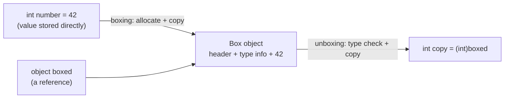
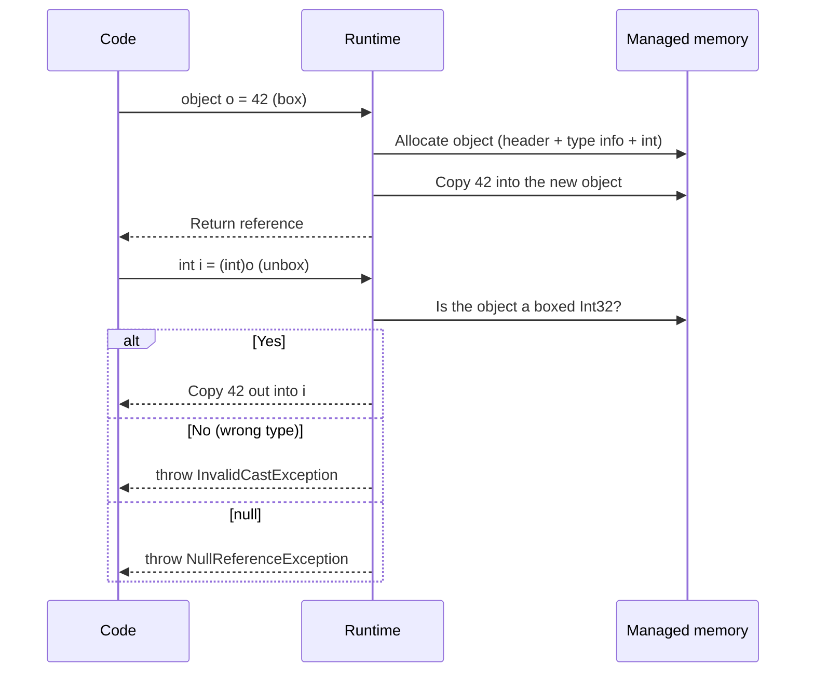
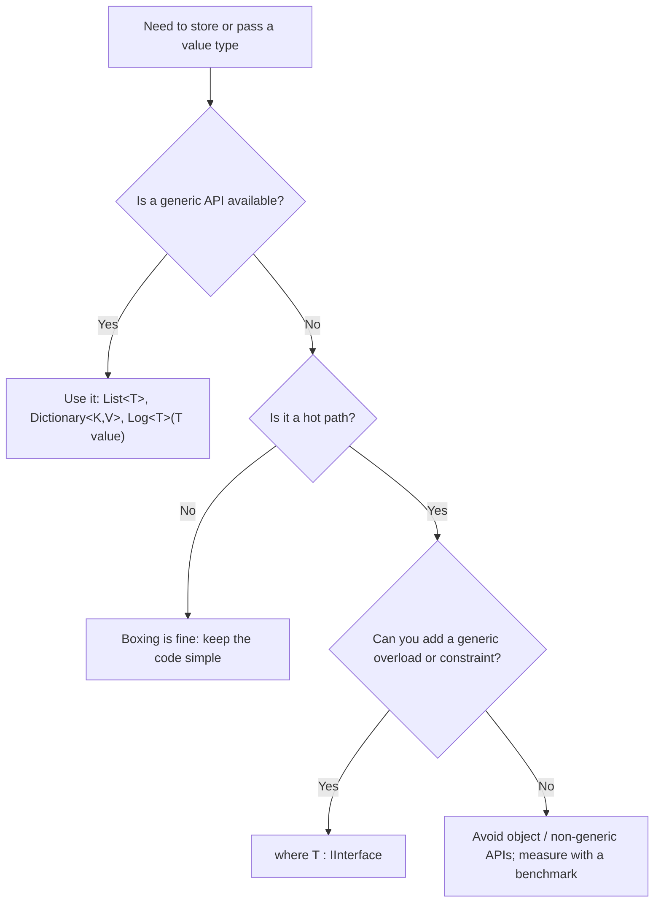
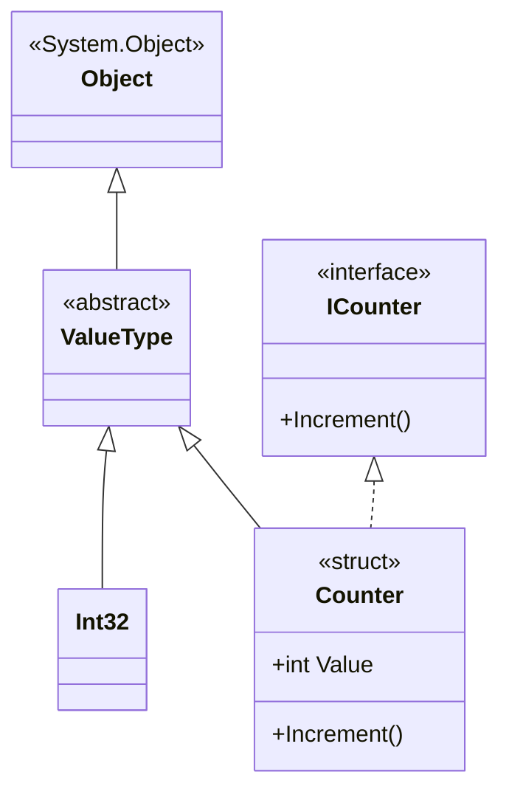
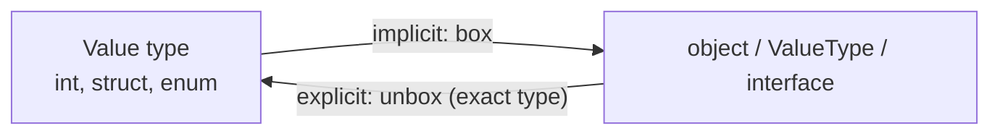

# 20. Boxing & Unboxing

> Learn how value types become objects and back: value types vs reference types, boxing, unboxing, what happens in memory, where boxing hides in everyday code, and how to avoid its performance cost.

**Level:** 🔵 Advanced
**Prerequisites:** [03. Objects](../03-objects/README.md), [12. Interfaces](../12-interfaces/README.md), [19. `System.Object`](../19-object-class/README.md)

---

## 📑 In This Chapter

1. Value Types and Reference Types
2. Boxing
3. Unboxing
4. Memory Behavior
5. Where Boxing Hides
6. Performance Considerations
7. Avoiding Boxing
8. Real-World Example
9. Interview Questions

---

## 🎯 Learning Objectives

By the end of this chapter you will be able to:

- Distinguish **value types** from **reference types** by their **semantics** (copy vs reference).
- Explain what **boxing** and **unboxing** are and when each happens.
- Predict boxing/unboxing results, including the `InvalidCastException` and `NullReferenceException` cases.
- Describe what the runtime allocates and copies, without relying on the "stack vs heap" oversimplification.
- Spot hidden boxing in collections, interfaces, `object` parameters and formatting APIs.
- Avoid boxing with **generics**, generic constraints and immutable structs.

---

## 📖 Concept

### Value Types and Reference Types

C# has two broad kinds of types:

| | **Value types** | **Reference types** |
|---|---|---|
| **Declared with** | `struct`, `enum`, built-ins (`int`, `double`, `bool`, `char`, `decimal`), `DateTime`, `Guid`, tuples, `Nullable<T>` | `class`, `interface`, `delegate`, arrays, `string`, `record` (class) |
| **Variable holds** | **The value itself** | **A reference** to an object (or `null`) |
| **Assignment `b = a`** | **Copies the value** | **Copies the reference** (both point to one object) |
| **Default value** | All zero bits (`0`, `false`) | `null` |
| **Base type** | `System.ValueType` (enums: `System.Enum`) | `System.Object` or another class |
| **Can be `null`** | Only as `Nullable<T>` (`int?`) | Yes |

```csharp
int a = 10;
int b = a;          // copies the value
b = 20;
Console.WriteLine(a);   // 10   (independent)

var p1 = new Person();
var p2 = p1;        // copies the reference
p2.Name = "Sam";
Console.WriteLine(p1.Name);   // Sam  (same object)
```

> ⚠️ **Avoid the common oversimplification** "value types live on the stack and reference types live on the heap". It is not a rule of the language.
> - A value-type **local variable** may live on the stack or in a CPU register.
> - A value-type **field of a class** lives **inside that class's heap object**.
> - The elements of an `int[]` are stored **inline in the array object**, which is on the heap.
> - A reference-type **variable** (the reference itself) can be on the stack, while the **object** is allocated in managed memory.
>
> Think in **semantics** (copy vs reference). Where bytes physically live is a runtime detail.

### Boxing

**Boxing** converts a **value type** into a **reference type**: `object`, `System.ValueType`, or an **interface** the value type implements.

```csharp
int number = 42;
object boxed = number;          // boxing: implicit
```

What the runtime does:

1. **Allocates** a new object in managed memory, large enough for the value plus the object header and type information.
2. **Copies** the value into that object.
3. **Returns a reference** to the new object.

The **box is an independent copy**. Changing the original variable later does not change the box.

```csharp
int number = 42;
object boxed = number;          // box holds a copy of 42

number = 99;                    // change the original

Console.WriteLine($"Original: {number}");
Console.WriteLine($"Boxed:    {boxed}");
```

**Output**

```text
Original: 99
Boxed:    42
```

Boxing is **implicit**: no cast is needed. It also happens when converting to an interface:

```csharp
IComparable comparable = 42;            // boxes the int
ValueType valueType = 42;               // boxes the int
Enum day = DayOfWeek.Monday;            // boxes the enum value
```

### Unboxing

**Unboxing** extracts the value type back from the object. It is an **explicit cast** and requires the box to contain **exactly that value type**.

```csharp
object boxed = 42;
int unboxed = (int)boxed;               // unboxing: type check, then copy the value out
Console.WriteLine(unboxed);             // 42
```

What the runtime does:

1. **Checks** that the object is a box of the **exact** target type (otherwise it throws).
2. **Copies** the value out of the box into your variable. (No allocation.)

**What can go wrong:**

| Code | Result |
|---|---|
| `object o = 42; long l = (long)o;` | ❌ **`InvalidCastException`**: the box contains an `int`, not a `long` |
| `object o = 42; long l = (int)o;` | ✅ Unbox as `int` first, then the `int → long` conversion is applied |
| `object o = null; int i = (int)o;` | ❌ **`NullReferenceException`**: nothing to unbox |
| `object o = "hi"; int i = (int)o;` | ❌ **`InvalidCastException`** |
| `object o = 42; int? i = (int?)o;` | ✅ Works: `i` is `42` |
| `object o = null; int? i = (int?)o;` | ✅ `null` |

The **safe** way to unbox is a type pattern, which tests and unboxes in one step:

```csharp
object o = 42;

if (o is int number)
    Console.WriteLine($"It is an int: {number}");
else
    Console.WriteLine("Not an int");
```

**Output**

```text
It is an int: 42
```

(More on `is`, `as` and pattern matching in [21. Type Casting](../21-type-casting/README.md).)

### Nullable value types and boxing

`Nullable<T>` has a special rule: boxing a **nullable** boxes the **underlying value**, or produces **`null`** if it has no value.

```csharp
int? value = 5;
object o1 = value;                          // boxes an int, NOT a Nullable<int>
Console.WriteLine(o1.GetType().Name);       // Int32

int? none = null;
object o2 = none;                           // null reference: nothing is boxed
Console.WriteLine(o2 is null);              // True

int? back = (int?)o1;                       // unboxing into a nullable works: 5
```

**Output**

```text
Int32
True
```

### Memory Behavior

```text
 Before boxing                      After:  object boxed = number;

 number ┌──────┐                    number ┌──────┐
        │  42  │                           │  42  │          (original, unchanged)
        └──────┘                           └──────┘
                                                │ copy
                                                ▼
                                    boxed ──►  ┌────────────────────────────────┐
                                    (reference)│ object header │ type info │ 42 │   a new object
                                               └────────────────────────────────┘   in managed memory
```



Key facts about a box:

- It is a **real heap-allocated object** (managed by the garbage collector).
- It has its **own copy** of the value: **no link** to the original variable.
- On a 64-bit runtime, a boxed `int` takes **roughly 24 bytes** (object header, type pointer, the 4-byte value, padding) instead of 4 bytes.
- Every boxing operation creates a **new** object. Boxing the same variable twice gives two different boxes.
- At the IL level the instructions are `box` and `unbox.any`.

### Where Boxing Hides

You do not always type `object` to cause boxing:

| Situation | Why it boxes |
|---|---|
| `object o = 5;` | Direct conversion to `object` |
| `IComparable c = 5;`, `IFormattable f = 3.14;` | Conversion to an interface implemented by the struct |
| **Non-generic collections** (`ArrayList`, `Hashtable`, `Queue`, `Stack`) | They store `object`, so every value type is boxed on `Add` and unboxed on read |
| **`object` parameters / `params object[]`** | `string.Format("{0}", 5)`, `Console.WriteLine("{0}", 5)`, `Log(object value)` |
| **Struct passed as an interface-typed parameter** | `void Process(IShape s)` called with a struct |
| **Calling `GetType()` on a value type** | `GetType` is non-virtual and defined on `object`, so the value is boxed (the JIT may optimize it away) |
| **Calling `object`'s virtual methods on a struct that does not override them** | `ToString()`, `Equals(object)`, `GetHashCode()` can box |
| **Default struct equality** | `ValueType.Equals(object)` takes an `object`, so the argument is boxed |
| **Dictionary or list of `object`** | `Dictionary<string, object>`, `List<object>` |
| **Using a struct as a `lock` target** | `lock` needs a reference type; a boxed value is a **new object every time**, so it never synchronizes (the compiler rejects `lock(intVariable)`) |

> 📝 **String interpolation** (`$"{number}"`) in modern .NET (C# 10+) uses an interpolated-string handler that avoids boxing for most value types, so it is usually fine. The older `string.Format("{0}", number)` overloads take `object` and **do** box.

### Performance Considerations

Boxing costs:

| Cost | Explanation |
|---|---|
| **Allocation** | Each box allocates a new heap object |
| **Copying** | The value is copied in, and copied out when unboxing |
| **GC pressure** | Many short-lived boxes make the garbage collector run more often (see [23. Garbage Collection](../23-garbage-collection/README.md)) |
| **Type checks** | Unboxing performs a runtime type check |
| **Cache locality** | `int[]` is one contiguous block; `object[]` of boxed ints is an array of references to separate objects |

When it matters: **hot paths** (loops with millions of iterations, game loops, numeric code, high-throughput services). In code that runs occasionally, boxing is usually negligible, so **measure before optimizing**. Tools: `BenchmarkDotNet` with the `MemoryDiagnoser`, a profiler, `GC.GetAllocatedBytesForCurrentThread()`, an IL viewer (look for `box`/`unbox.any`), and Roslyn/ReSharper analyzers that flag hidden allocations.

### Avoiding Boxing

**1. Use generics** (the main solution)

```csharp
// ❌ Boxes every int
ArrayList old = new ArrayList();
old.Add(1);
int x = (int)old[0];

// ✅ No boxing: the ints are stored inline
List<int> modern = new List<int>();
modern.Add(1);
int y = modern[0];
```

**2. Use a generic constraint instead of an interface-typed parameter**

```csharp
// ❌ Each int argument is boxed to IComparable
static int CompareBoxed(IComparable a, IComparable b) => a.CompareTo(b);

// ✅ The JIT generates a version for int: no boxing
static int CompareGeneric<T>(T a, T b) where T : IComparable<T> => a.CompareTo(b);

Console.WriteLine(CompareBoxed(1, 2));      // -1 (boxes)
Console.WriteLine(CompareGeneric(1, 2));    // -1 (does not box)
```

**3. Prefer generic APIs** (`List<T>`, `Dictionary<TKey,TValue>`, `IEnumerable<T>`, `IEquatable<T>`) over `object`-based ones.

**4. Do not use `object` as a catch-all parameter type** when a generic method `Log<T>(T value)` would do.

**5. Make structs immutable and implement `IEquatable<T>`** to avoid boxing in equality (see [19. `System.Object`](../19-object-class/README.md)), and prefer `readonly struct`.

**6. Override `ToString()`, `Equals` and `GetHashCode` on your structs.**

---

## 🤔 Why It Matters

- **Unified type system:** boxing is what lets an `int` be passed where an `object` is expected, so everything can derive from `System.Object`.
- **Hidden cost:** boxing looks like a harmless assignment but allocates memory. In hot code it can dominate runtime and trigger frequent garbage collections.
- **Correctness traps:** `InvalidCastException` and `NullReferenceException` on unboxing, and bugs from mutable structs inside boxes.
- **Why generics exist:** `List<int>` was introduced largely to remove boxing and casting from collections.
- **Interview classic:** boxing and unboxing questions are asked constantly because they test your understanding of value vs reference semantics.

---

## 🧩 Syntax

```csharp
// Boxing (implicit)
int number = 42;
object boxed = number;                 // to object
IComparable asInterface = number;      // to an implemented interface
ValueType asValueType = number;        // to System.ValueType

// Unboxing (explicit cast, exact type)
int unboxed = (int)boxed;

// Safe unboxing with patterns
if (boxed is int n) { /* use n */ }
int? maybe = boxed as int?;            // 'as' works with nullable value types

// Wrong unbox
// long bad = (long)boxed;             // InvalidCastException
long ok = (int)boxed;                  // unbox as int, then convert

// Nullable boxing
int? nullable = 5;
object fromNullable = nullable;        // boxes an int (or null if no value)
```

---

## 💻 Basic Example

```csharp
int number = 42;

object boxed = number;                  // boxing: copy into a new object
number = 99;                            // changing the original does not affect the box

Console.WriteLine($"Original: {number}");
Console.WriteLine($"Boxed:    {boxed}");

int unboxed = (int)boxed;               // unboxing: type check + copy out
Console.WriteLine($"Unboxed:  {unboxed}");

try
{
    long wrong = (long)boxed;           // box holds an int, not a long
}
catch (InvalidCastException)
{
    Console.WriteLine("Cannot unbox an int as a long.");
}

long correct = (int)boxed;              // unbox as int, then widen
Console.WriteLine($"Correct:  {correct}");
```

**Output**

```text
Original: 99
Boxed:    42
Unboxed:  42
Cannot unbox an int as a long.
Correct:  42
```

---

## 🌍 Real-World Example

Collecting sensor readings with a **legacy non-generic collection** vs a **generic collection**, plus the classic **mutable struct inside a box** bug.

### 1) `ArrayList` vs `List<double>`

```csharp
using System.Collections;

// ❌ Legacy, non-generic: boxes on Add, unboxes on read, and is not type-safe
ArrayList legacy = new ArrayList();
legacy.Add(21.5);                        // boxing
legacy.Add(23.0);                        // boxing
legacy.Add(19.5);                        // boxing
// legacy.Add("hot");                    // compiles! but would crash later at the unboxing cast below

double legacyTotal = 0;
foreach (object item in legacy)
    legacyTotal += (double)item;         // unboxing on every element

// ✅ Generic: no boxing, no casts, type-checked at compile time
var readings = new List<double> { 21.5, 23.0, 19.5 };

double total = 0;
foreach (double reading in readings)
    total += reading;

Console.WriteLine($"Average (ArrayList):   {legacyTotal / legacy.Count:F2}");
Console.WriteLine($"Average (List<double>): {total / readings.Count:F2}");
```

**Output**

```text
Average (ArrayList):   21.33
Average (List<double>): 21.33
```

Same results, very different costs: the legacy version allocates a box per element and can fail at run time if a non-`double` sneaks in.

You can measure the allocation difference yourself:

```csharp
long before = GC.GetAllocatedBytesForCurrentThread();

var boxedList = new ArrayList();
for (int i = 0; i < 1_000; i++)
    boxedList.Add(i);                    // 1,000 boxes plus array growth

long boxedBytes = GC.GetAllocatedBytesForCurrentThread() - before;

before = GC.GetAllocatedBytesForCurrentThread();

var intList = new List<int>();
for (int i = 0; i < 1_000; i++)
    intList.Add(i);                      // just the growing int array

long intBytes = GC.GetAllocatedBytesForCurrentThread() - before;

Console.WriteLine($"ArrayList: {boxedBytes:N0} bytes");
Console.WriteLine($"List<int>: {intBytes:N0} bytes");
```

The `ArrayList` figure is several times larger. Exact numbers depend on your runtime and are only illustrative, so run it yourself rather than relying on a quoted value.

### 2) A mutable struct through an interface: the box is a copy

```csharp
public interface ICounter
{
    void Increment();
}

public struct Counter : ICounter
{
    public int Value;
    public void Increment() => Value++;
}

Counter original = new Counter();

ICounter boxed = original;               // boxing: the box holds a COPY of 'original'
boxed.Increment();                       // modifies the copy inside the box

Console.WriteLine(original.Value);       // 0  (the original was never touched)
Console.WriteLine(((Counter)boxed).Value);   // 1 (unboxing copies the box's value out)
```

**Output**

```text
0
1
```

Many bugs come from forgetting that **the box is separate from the variable**. This is one of the main reasons the guideline is: **make structs immutable**.

---

## 🧠 How It Works

### Boxing and unboxing step by step



### Boxed values compared

```csharp
object a = 5;
object b = 5;

Console.WriteLine(a == b);                     // False: == on object compares references (two boxes)
Console.WriteLine(a.Equals(b));                // True:  Int32.Equals compares the values
Console.WriteLine(ReferenceEquals(a, b));      // False: two separate box objects
```

**Output**

```text
False
True
False
```

(See [19. `System.Object`](../19-object-class/README.md) for `==`, `Equals` and `ReferenceEquals`.)

### Why interface calls can box

An interface variable is a **reference**. Storing a struct in it requires an object, so the struct is boxed. Calls then go to the box.

```csharp
struct Point : IFormattable { /* ... */ }

IFormattable f = new Point();      // boxes
```

Generic code with a **constraint** (`where T : IFormattable`) does **not** need the interface-typed variable, so the JIT can call the struct's method directly without a box.

### Arrays and layout

```text
 int[]    →  [ 1 ][ 2 ][ 3 ][ 4 ]                    one object, values stored inline

 object[] →  [ ref ][ ref ][ ref ][ ref ]            one array of references...
                │      │      │      │
                ▼      ▼      ▼      ▼
              [box 1][box 2][box 3][box 4]            ...plus one separate box per element
```

### Decision guide



---

## 📊 Diagram





*(Larger diagrams live in [`/diagrams`](../diagrams).)*

---

## ⚔️ Important Comparisons

### Boxing vs unboxing

| Aspect | Boxing | Unboxing |
|---|---|---|
| **Direction** | Value type → `object`/interface | `object`/interface → value type |
| **Syntax** | **Implicit** | **Explicit** cast (or pattern) |
| **Allocation** | ✅ New heap object | ❌ None |
| **Copy** | Value copied **into** the box | Value copied **out of** the box |
| **Can throw** | No | ✅ `InvalidCastException`, `NullReferenceException` |
| **Type requirement** | Any value type | **Exact** original type (or its nullable form) |

### Value types vs reference types

| Aspect | Value type | Reference type |
|---|---|---|
| **Assignment** | Copies the value | Copies the reference |
| **Equality default** | Compare fields | Reference identity |
| **Can inherit** | No (structs); can implement interfaces | Yes (classes) |
| **GC cost** | Inline: no separate object (unless boxed) | One object per instance |
| **Best for** | Small, immutable, value-like data | Entities with identity and behavior |

### Non-generic vs generic collections

| Aspect | `ArrayList` / `Hashtable` | `List<T>` / `Dictionary<K,V>` |
|---|---|---|
| **Stores** | `object` | `T` |
| **Boxing of value types** | ✅ Every element | ❌ |
| **Type safety** | Run time (casts can fail) | Compile time |
| **Performance** | Slower, more GC | Faster |
| **Use today** | ❌ Legacy only | ✅ Always |

### Interface-typed parameter vs generic constraint

| Aspect | `void M(IComparable x)` | `void M<T>(T x) where T : IComparable<T>` |
|---|---|---|
| **Struct arguments boxed** | ✅ | ❌ |
| **Type safety** | Weaker (any `IComparable`) | Stronger (`T` with `T`) |
| **Needs generics** | No | Yes |

---

## ⚠️ Common Mistakes

1. ❌ **Unboxing to the wrong type.** `(long)boxedInt` throws `InvalidCastException`. Fix: unbox as the exact type (`(long)(int)o`), or use `is int i`.
2. ❌ **Unboxing `null`.** `(int)nullObject` throws `NullReferenceException`. Fix: check for `null`, or unbox to a nullable (`(int?)o`).
3. ❌ **Assuming a box is linked to the original.** It is an independent copy. Fix: remember changes to either side are invisible to the other.
4. ❌ **Mutable structs used through interfaces.** You mutate a copy in a box and "lose" the change. Fix: make structs immutable (`readonly struct`).
5. ❌ **Using `ArrayList`, `Hashtable` and other non-generic collections** for value types. Fix: use `List<T>` and `Dictionary<TKey,TValue>`.
6. ❌ **Accepting `object` parameters** (`Log(object value)`, `params object[]`) in hot code. Every value type argument is boxed. Fix: use generics (`Log<T>(T value)`) or specific overloads.
7. ❌ **Comparing boxed values with `==`.** Compares references, so two boxed `5`s are "different". Fix: use `Equals`, or unbox first.
8. ❌ **Using `ReferenceEquals` or `lock` on value types.** Every conversion creates a new box, so nothing matches and a lock never blocks. Fix: use a dedicated `private readonly object _lock = new();`.
9. ❌ **Struct passed as an interface-typed parameter** in a loop. Boxes every call. Fix: use a generic constraint (`where T : IShape`).
10. ❌ **Relying on "value types live on the stack."** It is not a guarantee and misleads reasoning about fields, arrays and boxes. Fix: reason with copy vs reference semantics.
11. ❌ **Forgetting nullable rules.** Boxing a `Nullable<int>` yields a boxed `int` or `null`, never a boxed `Nullable<int>`. Fix: use `(int?)o` when unboxing.
12. ❌ **Premature optimization.** Removing boxing from cold code adds complexity for no gain. Fix: profile first, optimize hot paths.
13. ❌ **Forgetting `IEquatable<T>` on structs.** Equality calls `Equals(object)` and boxes the argument. Fix: implement `IEquatable<T>` ([19. `System.Object`](../19-object-class/README.md)).

---

## ✅ Best Practices

- **Prefer generics** (`List<T>`, `Dictionary<TKey,TValue>`, `IEnumerable<T>`) over `object`-based APIs.
- **Never use** `ArrayList`, `Hashtable`, `Queue`, `Stack` (non-generic) in new code.
- Use **generic methods with constraints** (`where T : IComparable<T>`) instead of interface-typed parameters for structs.
- Avoid **`object` parameters** in performance-sensitive APIs; provide **generic or specific overloads**.
- Make **structs immutable** (`readonly struct`) and implement **`IEquatable<T>`**; override `ToString`, `Equals`, `GetHashCode`.
- Use **`is T value`** pattern matching for safe unboxing.
- Use a **dedicated `object` instance** for `lock`, never a value type.
- **Measure** (BenchmarkDotNet `MemoryDiagnoser`, profilers, IL inspection) before optimizing.
- Use value types for **small, short-lived, value-like data**; use classes for objects with identity.
- Explain behavior in terms of **semantics** (copy vs reference), not stack/heap folklore.

---

## 🎯 Interview Questions

**Q1. What is boxing?**

Converting a value type to `object`, `System.ValueType` or an interface it implements. The runtime allocates a new object in managed memory and copies the value into it.

**Q2. What is unboxing?**

Extracting the value type from a boxed object with an explicit cast. The runtime checks that the object is a box of that exact type and copies the value out.

**Q3. Is boxing implicit or explicit? What about unboxing?**

Boxing is implicit (no cast needed). Unboxing requires an explicit cast (or a type pattern such as `o is int i`).

**Q4. What exceptions can unboxing throw?**

`InvalidCastException` if the object is not a box of the target type, and `NullReferenceException` if the object is `null` and the target is a non-nullable value type.

**Q5. Why does `object o = 42; long l = (long)o;` throw?**

The box contains an `int`. Unboxing requires the exact type. Use `(long)(int)o`, which unboxes as `int` and then converts to `long`.

**Q6. Why is boxing a performance concern?**

Each boxing allocates a new heap object and copies the value, which increases memory use and garbage collection work. Unboxing adds a type check and copy. In hot paths this adds up.

**Q7. How can you avoid boxing?**

Use generics (`List<T>` instead of `ArrayList`), generic constraints instead of interface-typed parameters, avoid `object` parameters and non-generic APIs, and implement `IEquatable<T>` on structs.

**Q8. What is the difference between a value type and a reference type?**

A value-type variable holds the value itself, and assignment copies it. A reference-type variable holds a reference to an object, and assignment copies the reference. Where the bytes physically live is a runtime detail.

**Q9. Do value types always live on the stack?**

No. A value-type local may live on the stack or in a register, but a struct field of a class lives inside that class's heap object, and array elements are stored inline in the array. A boxed value is a heap object.

**Q10. What happens when you box a `Nullable<int>`?**

If it has a value, the underlying `int` is boxed (not a `Nullable<int>`). If it has no value, the result is a `null` reference. Unboxing to `int?` handles both.

**Q11. Is a boxed value linked to the original variable?**

No. The box holds an independent copy. Changing the original does not change the box, and vice versa.

**Q12. Why can mutable structs be dangerous with interfaces?**

Assigning a struct to an interface variable boxes a copy. Calling a mutating method through the interface changes the copy in the box, not the original variable, causing "lost update" bugs.

**Q13. Does `int[]` box its elements? Does `object[]` containing ints?**

`int[]` stores values inline and does not box. An `object[]` holding ints stores references to separate boxes, one per element.

**Q14. Why does `object a = 5, b = 5; a == b` give `false`?**

`==` on `object` compares references, and each boxing creates a separate object. `a.Equals(b)` returns `true`, because `Int32.Equals` compares values.

**Q15. Why shouldn't you `lock` on a value type?**

Converting the value to `object` for `lock` boxes it into a new object each time, so threads would lock on different objects and never block each other. The compiler rejects `lock` on a value-type variable. Use a private `readonly object`.

**Q16. Does string interpolation box value types?**

Modern .NET uses an interpolated-string handler that avoids boxing for most value types. Older APIs such as `string.Format("{0}", value)` take `object` and do box.

---

## 📝 Practice Problems

| # | Problem | Difficulty | Solution |
|:-:|---|:-:|:-:|
| 1 | Box an `int`, change the original, and print both to prove the box is a copy. | 🟢 | [View →](../solutions/20-boxing-unboxing/) |
| 2 | Unbox a boxed `int` correctly, then cause `InvalidCastException` by unboxing it as `long`. Fix it. | 🟢 | [View →](../solutions/20-boxing-unboxing/) |
| 3 | Cause `NullReferenceException` by unboxing `null`, then fix it with a nullable unbox and with `is int`. | 🟢 | [View →](../solutions/20-boxing-unboxing/) |
| 4 | Show what `object o = (int?)5;` and `object o = (int?)null;` contain, and print `GetType()` safely. | 🟡 | [View →](../solutions/20-boxing-unboxing/) |
| 5 | Compare `ArrayList` and `List<int>` by measuring allocated bytes for 100,000 items. Explain the difference. | 🟡 | [View →](../solutions/20-boxing-unboxing/) |
| 6 | Reproduce the mutable-struct-through-interface bug and fix it by making the struct a `readonly struct` with a method that returns a new instance. | 🟡 | [View →](../solutions/20-boxing-unboxing/) |
| 7 | Write `CompareBoxed(IComparable, IComparable)` and `CompareGeneric<T>(T, T) where T : IComparable<T>`. Explain where boxing occurs. | 🟡 | [View →](../solutions/20-boxing-unboxing/) |
| 8 | Show the results of `==`, `Equals` and `ReferenceEquals` for two boxed `5`s and explain each. | 🟡 | [View →](../solutions/20-boxing-unboxing/) |
| 9 | Replace a `Log(object value)` method with a generic overload and explain which calls no longer box. | 🟠 | [View →](../solutions/20-boxing-unboxing/) |
| 10 | Write a `struct Money : IEquatable<Money>` and prove that `Equals(Money)` avoids the boxing that `Equals(object)` causes (reason about it or measure it). | 🟠 | [View →](../solutions/20-boxing-unboxing/) |
| 11 | Write a short benchmark (BenchmarkDotNet with `MemoryDiagnoser`) that compares boxing and non-boxing versions of a loop, and report allocations. | 🟠 | [View →](../solutions/20-boxing-unboxing/) |

Starter files: [`/exercises/20-boxing-unboxing`](../exercises/20-boxing-unboxing/)

---

## 🔑 Key Takeaways

- **Value types** copy their value on assignment; **reference types** copy the reference. Reason with these semantics, not with "stack vs heap".
- **Boxing** (implicit) allocates an object and copies the value in; **unboxing** (explicit) checks the exact type and copies the value out.
- A **box is an independent copy** of the value.
- Unboxing needs the **exact** type: wrong type → `InvalidCastException`, `null` → `NullReferenceException`.
- Boxing a **nullable** yields a boxed underlying value or `null`.
- Boxing **hides** in non-generic collections, `object` parameters, interface-typed variables and `string.Format`.
- It costs **allocation, copying and GC pressure**, which matters in **hot paths**: measure before optimizing.
- **Generics** (and generic constraints) are the primary way to avoid boxing; make structs **immutable** and implement **`IEquatable<T>`**.

---

[⬅ Previous: `System.Object`](../19-object-class/README.md)
&nbsp;&nbsp;•&nbsp;&nbsp;
[🏠 Main README](../README.md)
&nbsp;&nbsp;•&nbsp;&nbsp;
[Next: Type Casting ➡](../21-type-casting/README.md)