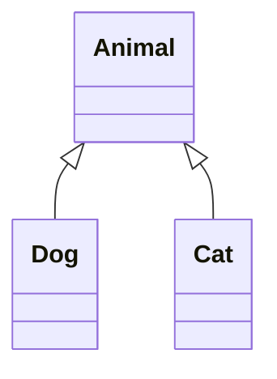
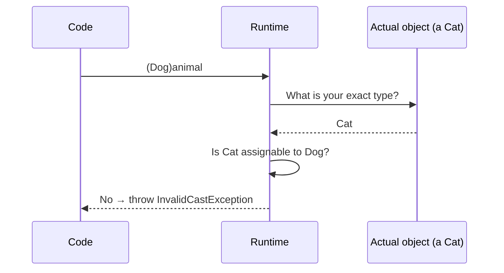
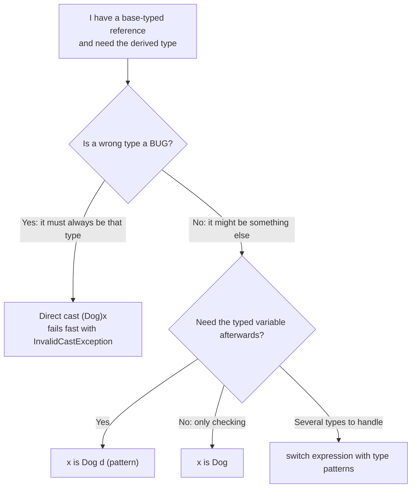
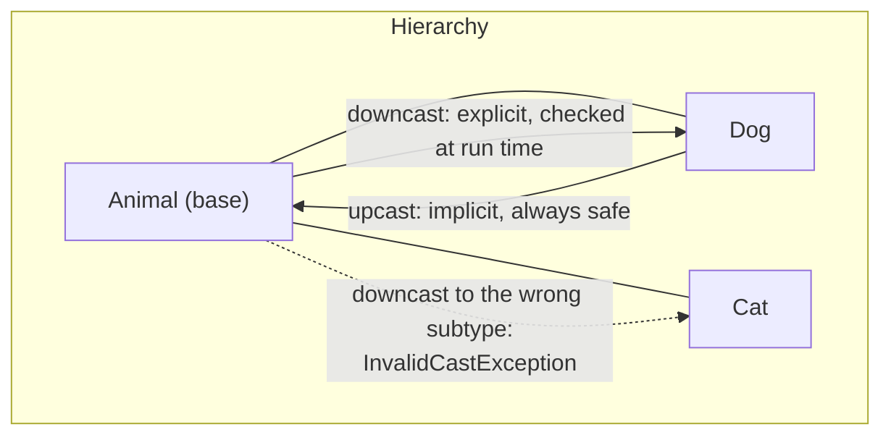
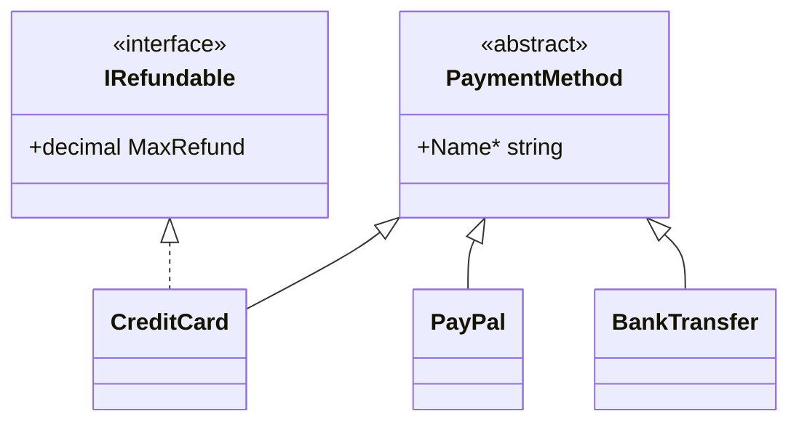

# 21. Type Casting

> Learn how to move between types safely: upcasting, downcasting, explicit casts, the `is` and `as` operators, pattern matching, and user-defined conversions.

**Level:** 🔵 Advanced
**Prerequisites:** [09. Inheritance](../09-inheritance/README.md), [10. Polymorphism](../10-polymorphism/README.md), [19. `System.Object`](../19-object-class/README.md), [20. Boxing & Unboxing](../20-boxing-unboxing/README.md)

---

## 📑 In This Chapter

1. What is Type Casting?
2. Upcasting
3. Downcasting
4. Explicit Casting
5. The `is` Operator
6. The `as` Operator
7. Pattern Matching
8. Numeric and User-Defined Conversions
9. Cast vs Convert vs Parse
10. Real-World Example
11. Interview Questions

---

## 🎯 Learning Objectives

By the end of this chapter you will be able to:

- Explain what a cast does (and does **not** do) to an object.
- Perform **upcasts** (safe, implicit) and **downcasts** (checked, explicit).
- Choose between a direct cast, `is`, `as` and pattern matching.
- Use **type patterns**, **declaration patterns** and **switch expressions** for type-based logic.
- Write user-defined `implicit` and `explicit` conversions responsibly.
- Distinguish casting from `Convert` and `Parse`.
- Recognize when casting signals a design problem and polymorphism would be better.

---

## 📖 Concept

**Type casting** (type conversion) means treating a value or reference as a **different type**.

A crucial point for **reference types**: a cast **does not change the object**. It only changes **how your code views it** (which members the compiler lets you use). The object keeps its real, run-time type.

```csharp
Dog dog = new Dog("Rex");
Animal animal = dog;                          // same object, viewed as Animal
Console.WriteLine(ReferenceEquals(dog, animal));   // True
```

There are three compile-time views of the same story:

| Kind | Checked | Syntax | Failure |
|---|---|---|---|
| **Implicit conversion** | Compile time, always safe | `Animal a = dog;` | Cannot fail |
| **Explicit cast** | Run time | `(Dog)animal` | `InvalidCastException` |
| **Safe test/cast** | Run time | `animal is Dog d` / `animal as Dog` | Returns `false` / `null` |

### The Example Hierarchy

```csharp
public class Animal
{
    public string Name { get; }

    public Animal(string name) => Name = name;

    public virtual string Speak() => "...";
}

public class Dog : Animal
{
    public Dog(string name) : base(name) { }

    public override string Speak() => "Woof";

    public void Fetch() => Console.WriteLine($"{Name} fetches!");
}

public class Cat : Animal
{
    public Cat(string name) : base(name) { }

    public override string Speak() => "Meow";

    public void Purr() => Console.WriteLine($"{Name} purrs.");
}
```



### Upcasting

**Upcasting** converts a **derived type to a base type** (or to an interface it implements). It is **always safe**, so it is **implicit**: no cast syntax is needed.

```csharp
Dog dog = new Dog("Rex");

Animal animal = dog;                 // upcast
object anything = dog;               // upcast all the way to object

Console.WriteLine(animal.Speak());   // Woof   (virtual dispatch still uses the real Dog)
// animal.Fetch();                   // ❌ The Animal view has no Fetch()
```

What changes: only the **compile-time view**. What stays: the **object** and its **overridden behavior**. This is how polymorphism works (see [10. Polymorphism](../10-polymorphism/README.md)).

You upcast constantly without noticing: passing a `Dog` to a method that takes an `Animal`, putting `Dog`s in a `List<Animal>`, returning a `Dog` from a method declared to return `Animal`.

### Downcasting

**Downcasting** converts a **base type to a derived type**. It is **not always safe**: the actual object may be a different subtype. So it is **explicit** and **checked at run time**.

```csharp
Animal animal = new Dog("Rex");

Dog dog = (Dog)animal;               // ✅ the object really is a Dog
dog.Fetch();                         // Rex fetches!

Animal other = new Cat("Tom");

try
{
    Dog bad = (Dog)other;            // ❌ the object is a Cat
}
catch (InvalidCastException)
{
    Console.WriteLine("Tom is not a Dog.");
}
```

Rules:

- The compiler allows a downcast only between **related types** (same hierarchy, or an interface the type could implement). Unrelated types are a compile error (**CS0030**): `(string)dog`.
- At run time the CLR checks the **actual object type**. If it is not compatible, it throws **`InvalidCastException`**.
- Casting `null` to a reference type succeeds and yields `null`.

### Explicit Casting

The cast operator `(T)expression` is used for **three different kinds of conversion**. Know which one you are doing:

| Kind | Example | What happens |
|---|---|---|
| **Reference (hierarchy) cast** | `(Dog)animal` | Run-time type check; same object, different view |
| **Unboxing** | `(int)boxedObject` | Run-time **exact-type** check, then copy ([20. Boxing & Unboxing](../20-boxing-unboxing/README.md)) |
| **Numeric / user-defined conversion** | `(int)3.7`, `(Celsius)21.5` | A **real conversion** that produces a **new value** |

### The `is` Operator

`is` **tests** whether an object is compatible with a type. It returns `true`/`false` and **never throws**. A `null` is never "is" anything.

```csharp
Animal animal = new Dog("Rex");

Console.WriteLine(animal is Dog);        // True
Console.WriteLine(animal is Cat);        // False
Console.WriteLine(animal is Animal);     // True   (a Dog IS an Animal)
Console.WriteLine(animal is object);     // True

Animal? nothing = null;
Console.WriteLine(nothing is Animal);    // False  (null matches no type)
```

Modern C# lets `is` **test and cast in one step** with a **declaration pattern**:

```csharp
if (animal is Dog dog)                   // test + downcast + new variable
{
    dog.Fetch();                         // 'dog' is definitely assigned here
}

if (animal is not Dog)                   // negation
{
    Console.WriteLine("Not a dog");
}

if (animal is not Dog theDog)            // guard clause: early exit...
    return;

theDog.Fetch();                          // ...then 'theDog' is available (definitely assigned)
```

`is` also works for interfaces, nullability and constants:

```csharp
if (animal is IDisposable disposable)    // capability check
    disposable.Dispose();

if (animal is null) { }                  // null check (preferred over == null when == may be overloaded)
```

### The `as` Operator

`as` attempts the conversion and returns **`null` if it fails** instead of throwing.

```csharp
Animal animal = new Cat("Tom");

Dog? dog = animal as Dog;                // null: Tom is not a Dog

if (dog is not null)
    dog.Fetch();
else
    Console.WriteLine("Not a dog");
```

Rules and caveats:

| Rule | Detail |
|---|---|
| **Allowed targets** | **Reference types** and **nullable value types** (`obj as int?`) |
| **Not allowed** | Non-nullable value types (`obj as int` is error **CS0077**) |
| **Conversions applied** | Only reference/boxing/unboxing-style conversions, **not** user-defined conversions |
| **Result may be `null`** | You **must** check it before use |
| **Danger** | `as` + forgotten null check turns a clear `InvalidCastException` into a confusing `NullReferenceException` later |

### Pattern Matching

**Pattern matching** lets you test a value's **type and shape** and extract data in one expression. The most useful patterns for OOP:

| Pattern | Example | Meaning |
|---|---|---|
| **Type / declaration** | `shape is Circle c` | Is it a `Circle`? If so, name it `c` |
| **Negated** | `shape is not Circle` | Is it not a `Circle`? |
| **Null** | `shape is null` | Is it null? |
| **Property** | `card is { ExpiryYear: < 2026 }` | Type is compatible and a property matches |
| **Relational / logical** | `n is > 0 and < 10` | Numeric ranges with `and`, `or`, `not` |
| **Discard** | `_` | Match anything (default arm) |

The most common place is a **`switch` expression**:

```csharp
public abstract class Shape { }
public class Circle : Shape { public double Radius { get; init; } }
public class Rectangle : Shape { public double Width { get; init; } public double Height { get; init; } }

static double Area(Shape shape) => shape switch
{
    Circle c            => Math.PI * c.Radius * c.Radius,
    Rectangle r         => r.Width * r.Height,
    null                => throw new ArgumentNullException(nameof(shape)),
    _                   => throw new NotSupportedException($"Unknown shape: {shape.GetType().Name}")
};

Console.WriteLine(Area(new Rectangle { Width = 3, Height = 4 }));   // 12
```

Compiler help:

- **Order matters**: put **more specific types before general ones**. A later arm already handled by an earlier one is error **CS8120** ("unreachable").
- A switch expression that is **not exhaustive** produces warning **CS8509**; add a `_` arm or handle all cases.

> ⚖️ **Pattern matching vs polymorphism.** If you control the types, add a **virtual method** (`shape.Area()`), see [10. Polymorphism](../10-polymorphism/README.md). Use type patterns when you **cannot modify the types** (framework or third-party classes), when the set of types is **closed and small**, or when handling **different shapes of input** (parsing, messages, events).

### Numeric and User-Defined Conversions

**Numeric conversions** really change the value:

```csharp
int small = 300;

long widened = small;                   // implicit widening: no data loss
double ratio = small;                   // implicit

double price = 9.99;
int truncated = (int)price;             // explicit narrowing: fraction is TRUNCATED
Console.WriteLine(truncated);           // 9

int big = 300;
byte wrapped = (byte)big;               // unchecked (default): value wraps around
Console.WriteLine(wrapped);             // 44   (300 mod 256)

try
{
    byte safe = checked((byte)big);     // checked: overflow throws
}
catch (OverflowException)
{
    Console.WriteLine("Overflow detected.");
}
```

**Output**

```text
9
44
Overflow detected.
```

**User-defined conversions** let your type convert to or from other types. Use `implicit` only when the conversion is **always safe and lossless**; use `explicit` otherwise.

```csharp
public readonly struct Celsius
{
    public double Degrees { get; }

    public Celsius(double degrees) => Degrees = degrees;

    public static implicit operator double(Celsius c) => c.Degrees;      // safe: Celsius → double
    public static explicit operator Celsius(double d) => new Celsius(d); // explicit: double → Celsius

    public override string ToString() => $"{Degrees:F1} C";
}

Celsius temperature = (Celsius)21.5;        // explicit
double raw = temperature;                   // implicit

Console.WriteLine(temperature);
Console.WriteLine(raw + 1);
```

**Output**

```text
21.5 C
22.5
```

Rules: conversion operators are `static`, one side must be the declaring type, and you **cannot** define conversions to or from a base class or interface of the declaring type (those already exist as built-in reference conversions).

### Cast vs Convert vs Parse

These are **different tools**:

| Tool | Purpose | Example |
|---|---|---|
| **Cast** `(T)x` | Reinterpret a type relationship, or a numeric/user-defined conversion | `(Dog)animal`, `(int)3.7` |
| **`Convert.ToXxx`** | Convert between many base types (including from `string`) | `Convert.ToInt32("42")` |
| **`int.Parse` / `int.TryParse`** | Parse text into a number | `int.TryParse(text, out var n)` |
| **`is` / `as` / patterns** | Safe type tests and casts | `x is Dog d` |

```csharp
// int n = (int)"42";                  // ❌ compile error: a string is not an int
int n1 = int.Parse("42");              // ✅ throws FormatException on bad input
bool ok = int.TryParse("abc", out int n2);   // ✅ no exception: ok is false
```

---

## 🤔 Why It Matters

- **Polymorphism gives you the base view**; sometimes you need the **specific view** to use derived-only members.
- **Heterogeneous collections** (`List<Animal>`, messages, events) require type checks.
- **Capability checks** (`is IDisposable`, `is IRefundable`) let code adapt to what an object can do.
- **Wrong casts crash programs**: `InvalidCastException` and `NullReferenceException` are common bugs.
- **Excessive casting is a design smell**: it often means a missing virtual method or interface.
- **Pattern matching** makes type-based logic concise, safe and readable.

---

## 🧩 Syntax

```csharp
// Upcast (implicit, always safe)
Animal animal = new Dog("Rex");
object any = animal;

// Downcast (explicit, checked at run time; may throw InvalidCastException)
Dog dog1 = (Dog)animal;

// is: test (never throws)
bool isDog = animal is Dog;

// is + declaration pattern: test and cast in one step
if (animal is Dog dog2) dog2.Fetch();

// is not + guard clause
if (animal is not Dog dog3) return;
dog3.Fetch();

// as: cast or null (reference and nullable value types only)
Dog? dog4 = animal as Dog;
int? maybeInt = any as int?;

// switch expression with type patterns
string Describe(Animal a) => a switch
{
    Dog d => $"{d.Name} the dog",
    Cat c => $"{c.Name} the cat",
    null  => "nobody",
    _     => "some animal"
};

// Numeric and user-defined
int truncated = (int)9.99;
Celsius temp = (Celsius)21.5;
```

---

## 💻 Basic Example

```csharp
Dog dog = new Dog("Rex");
Animal animal = dog;                                   // upcast: implicit

Console.WriteLine(animal.Speak());                     // Woof
Console.WriteLine(ReferenceEquals(dog, animal));       // True: one object, two views

Dog sameDog = (Dog)animal;                             // downcast: explicit, checked
sameDog.Fetch();

Animal other = new Cat("Tom");

try
{
    Dog wrong = (Dog)other;                            // compiles, fails at run time
}
catch (InvalidCastException)
{
    Console.WriteLine("Tom is not a Dog.");
}

if (other is Cat cat)                                  // the safe way
    cat.Purr();
```

**Output**

```text
Woof
True
Rex fetches!
Tom is not a Dog.
Tom purrs.
```

---

## 🌍 Real-World Example

Processing a mixed list of payment methods, using a **`switch` expression** with type and property patterns, plus an **interface capability check** with `is`.

```csharp
public abstract class PaymentMethod
{
    public abstract string Name { get; }
}

public interface IRefundable
{
    decimal MaxRefund { get; }
}

public class CreditCard : PaymentMethod, IRefundable
{
    public string LastFour { get; }
    public int ExpiryYear { get; }

    public CreditCard(string lastFour, int expiryYear)
    {
        LastFour = lastFour;
        ExpiryYear = expiryYear;
    }

    public override string Name => "Credit Card";
    public decimal MaxRefund => 500m;
}

public class PayPal : PaymentMethod
{
    public string Email { get; }

    public PayPal(string email) => Email = email;

    public override string Name => "PayPal";
}

public class BankTransfer : PaymentMethod
{
    public override string Name => "Bank Transfer";
}

static string Describe(PaymentMethod? method, int currentYear) => method switch
{
    CreditCard card when card.ExpiryYear < currentYear => $"{card.Name}: expired",   // type + condition
    CreditCard card                                    => $"{card.Name}: ending {card.LastFour}",
    PayPal paypal                                      => $"{paypal.Name}: {paypal.Email}",
    null                                               => "No payment method",
    PaymentMethod other                                => other.Name                  // everything else
};

PaymentMethod?[] methods =
{
    new CreditCard("4242", 2024),
    new CreditCard("1111", 2030),
    new PayPal("sam@example.com"),
    new BankTransfer(),
    null
};

foreach (var method in methods)
{
    Console.WriteLine(Describe(method, 2026));

    if (method is IRefundable refundable)                       // capability check
        Console.WriteLine($"  refundable up to {refundable.MaxRefund:F2}");
}
```

**Output**

```text
Credit Card: expired
  refundable up to 500.00
Credit Card: ending 1111
  refundable up to 500.00
PayPal: sam@example.com
Bank Transfer
No payment method
```

What this shows:

- **Order of arms:** the `when` arm for expired cards comes **before** the general `CreditCard` arm.
- **`null` is handled explicitly**, and `is IRefundable` is simply `false` for `null`.
- **Capabilities via interface** (`IRefundable`) scale better than `if (x is CreditCard || x is ...)` chains.
- If `PaymentMethod` were **your own code** and every method needed a description, a virtual `Describe()` would be even better. The switch is the right tool here because it combines **type, state and external data** (`currentYear`).

---

## 🧠 How It Works

### What the runtime checks on a downcast



With `is`/`as` the same check is performed, but the result is `false`/`null` instead of an exception.

### Which operator should I use?



### Casting does not change behavior of overridden members

```csharp
Animal animal = new Dog("Rex");
Console.WriteLine(animal.Speak());          // Woof   (virtual: run-time type decides)
Console.WriteLine(((Animal)animal).Speak());// Woof   (still a Dog underneath)
```

For **hidden** (`new`) or **non-virtual** members, the **compile-time type** decides, so a cast changes which member runs (see [09. Inheritance](../09-inheritance/README.md)).

### Array covariance: an upcast with a trap

Arrays of reference types are **covariant** in C#: an `string[]` can be treated as an `object[]`. That is an upcast, but writing to it is checked at run time:

```csharp
object[] objects = new string[2];           // allowed: upcast of the array

try
{
    objects[0] = 42;                        // compiles, fails at run time
}
catch (ArrayTypeMismatchException)
{
    Console.WriteLine("Array covariance check failed.");
}
```

**Output**

```text
Array covariance check failed.
```

Prefer generic collections (`List<T>`), whose assignments are checked at **compile time**.

### `is` vs `GetType()`

```csharp
Animal animal = new Dog("Rex");

Console.WriteLine(animal is Animal);                  // True  (includes derived types)
Console.WriteLine(animal.GetType() == typeof(Animal));// False (exact type check)
```

Use `is` for "can I treat it as T?", and `GetType()` only when you need the **exact** type (see [19. `System.Object`](../19-object-class/README.md)).

### Casting and generics

Generic code that needs a cast on `T` is often a sign that a constraint or an interface is missing. Prefer `where T : IShape` over `(IShape)value` inside the method.

---

## 📊 Diagram





*(Larger diagrams live in [`/diagrams`](../diagrams).)*

---

## ⚔️ Important Comparisons

### Upcast vs downcast

| Aspect | Upcast | Downcast |
|---|---|---|
| **Direction** | Derived → base/interface | Base/interface → derived |
| **Syntax** | Implicit | Explicit `(T)x` (or `is`/`as`) |
| **Safe** | ✅ Always | ❌ May fail |
| **Checked** | Compile time | Run time |
| **Failure** | Not possible | `InvalidCastException` (cast) / `false` or `null` (`is`/`as`) |
| **Effect on object** | None | None |

### Direct cast vs `as` vs `is` pattern

| Aspect | `(Dog)x` | `x as Dog` | `x is Dog d` |
|---|---|---|---|
| **On failure** | Throws `InvalidCastException` | Returns `null` | Returns `false` |
| **On `null` input** | Returns `null` | Returns `null` | `false` |
| **Works with non-nullable value types** | ✅ (unboxing) | ❌ | ✅ |
| **Gives a typed variable** | ✅ | ✅ (may be null) | ✅ (only when true) |
| **Best when** | Wrong type is a bug (fail fast) | Rarely needed today | **Default choice** for conditional downcasts |

### Cast vs `Convert` vs `Parse`

| | Cast | `Convert.ToXxx` | `Parse` / `TryParse` |
|---|---|---|---|
| **From `string` to number** | ❌ | ✅ | ✅ (best) |
| **Between numeric types** | ✅ | ✅ | ❌ |
| **Reference hierarchy** | ✅ | ❌ | ❌ |
| **Invalid input** | Exception | Exception | `TryParse`: returns `false` |

### Implicit vs explicit user-defined conversion

| | `implicit operator` | `explicit operator` |
|---|---|---|
| **Syntax at use** | None | `(T)x` |
| **Use when** | Always safe, lossless, never throws | May lose data, validate, or throw |
| **Risk** | Surprising hidden conversions | Low |

### Type patterns vs polymorphism

| Aspect | Type patterns (`switch`) | Virtual methods |
|---|---|---|
| **Add a new type** | Update every switch | Add one class |
| **Add a new operation** | Add one switch | Update every class |
| **Works on types you do not own** | ✅ | ❌ |
| **Best for** | Closed sets, external types, mixed input | Open sets of your own types |

---

## ⚠️ Common Mistakes

1. ❌ **Downcasting without checking.** `(Dog)animal` throws if it is a `Cat`. Fix: use `is Dog d`, or only cast when a wrong type is truly a bug.
2. ❌ **Using `as` and not checking for `null`.** The failure shows up later as a confusing `NullReferenceException`. Fix: prefer `is` patterns, or check `null` immediately.
3. ❌ **Using `as` with a non-nullable value type** (`obj as int`). Error CS0077. Fix: use `obj as int?` or `obj is int i`.
4. ❌ **Casting unrelated types** (`(string)dog`). Error CS0030. Fix: convert explicitly (`ToString()`, a mapping method) rather than cast.
5. ❌ **Thinking a cast changes the object.** A reference cast only changes the view. Fix: remember the object keeps its true type and overridden behavior.
6. ❌ **Confusing casting with `Convert`/`Parse`.** `(int)"42"` does not compile. Fix: `int.TryParse` for text.
7. ❌ **Unboxing to the wrong type.** `(long)boxedInt` throws. Fix: unbox to the exact type first ([20. Boxing & Unboxing](../20-boxing-unboxing/README.md)).
8. ❌ **Type-switching where polymorphism fits.** Every new subclass requires editing several `if`/`switch` blocks. Fix: add a virtual method or an interface ([10. Polymorphism](../10-polymorphism/README.md)).
9. ❌ **Wrong arm order in a `switch`.** A general type before a specific one makes the specific arm unreachable (CS8120). Fix: order from most specific to most general.
10. ❌ **Ignoring non-exhaustive switch warnings** (CS8509) or forgetting `null`. Fix: add a `_`/`null` arm.
11. ❌ **Downcasting as a habit.** Constant `(Dog)animal` calls signal an API that exposes too little. Fix: add the needed member to the base type/interface, or redesign.
12. ❌ **Relying on array covariance.** `object[] a = new string[1]; a[0] = 1;` fails at run time. Fix: use `List<T>`.
13. ❌ **`implicit` user-defined conversions that can lose data or throw.** Surprising and hard to debug. Fix: make them `explicit`.
14. ❌ **Overflow surprises in numeric casts.** `(byte)300` silently wraps to 44 in an unchecked context. Fix: use `checked` where overflow matters.
15. ❌ **Using `GetType() == typeof(T)` when `is T` was meant** (or vice versa). Fix: pick the right check deliberately.

---

## ✅ Best Practices

- **Upcast freely; downcast rarely.** Design APIs so callers rarely need the derived type.
- Prefer **polymorphism or interfaces** over casting for behavior that varies by type.
- For conditional downcasts, use **`is Type name`** patterns; they are safe and concise.
- Use a **direct cast** when a wrong type is a **bug** and you want to **fail fast** with a clear exception.
- Avoid **`as` followed by a missed null check**; if you use `as`, check `null` immediately.
- Use **switch expressions** for closed sets of types; order arms **specific → general** and handle `null`.
- Check **capabilities** with interfaces (`is IRefundable`) instead of listing concrete classes.
- Keep **user-defined conversions rare**; make them `implicit` only when they are lossless and never throw.
- Use **`TryParse`** for text and **`checked`** for numeric overflow-sensitive code.
- Prefer **generic collections** over relying on array covariance.
- Treat a growing pile of **casts as a design smell** and revisit the abstractions.

---

## 🎯 Interview Questions

**Q1. What is the difference between upcasting and downcasting?**

Upcasting converts a derived type to a base type (or interface); it is implicit and always safe. Downcasting converts a base type to a derived type; it is explicit and checked at run time, and can throw `InvalidCastException` if the object is not that type.

**Q2. Does casting change the object?**

No. A reference cast only changes the compile-time view of the object. The object keeps its actual type, and its overridden (virtual) members still run.

**Q3. What happens if a downcast fails?**

A direct cast throws `InvalidCastException`. The `is` operator returns `false`, and the `as` operator returns `null`.

**Q4. What is the difference between `is` and `as`?**

`is` tests compatibility and returns a `bool` (and, with a pattern, can also declare a typed variable). `as` performs the conversion and returns `null` on failure. `as` works only with reference types and nullable value types.

**Q5. When would you use a direct cast instead of `as`?**

When a wrong type indicates a bug and you want an immediate, clear `InvalidCastException` (fail fast), rather than a `null` that causes a `NullReferenceException` later.

**Q6. What is a declaration pattern?**

`x is Dog d` tests whether `x` is a `Dog` and, if so, assigns it to a new variable `d` of type `Dog`, which is definitely assigned only where the test succeeded.

**Q7. Why can't you use `as` with `int`?**

`as` returns `null` on failure, and a non-nullable value type cannot be `null` (error CS0077). Use `as int?` or `is int i`.

**Q8. What does `x is null` return for a null reference? And `null is Animal`?**

`x is null` is `true` for a null reference. `null is Animal` is `false`, because null matches no type.

**Q9. What is a switch expression with type patterns?**

A `switch` expression whose arms match on types (`Circle c => ...`) and can include conditions (`when`), property patterns and `null`/discard arms. The compiler warns if it is not exhaustive and errors if an arm is unreachable.

**Q10. Why does arm order matter in a type-pattern switch?**

Arms are tested top to bottom. A general type placed before a specific one makes the specific arm unreachable (CS8120).

**Q11. When should you prefer polymorphism to type patterns?**

When you control the types and new subclasses will be added. A virtual method keeps behavior inside each class so existing code does not need changing. Type patterns suit closed sets, external types and mixed input.

**Q12. What is the difference between a cast and `Convert.ToInt32`?**

A cast changes a type relationship (or applies a numeric/user-defined conversion), while `Convert.ToInt32` converts between many base types, including from `string`. You cannot cast a string to an int.

**Q13. What is the difference between implicit and explicit conversion operators?**

An `implicit` operator is applied automatically and should be safe and lossless. An `explicit` operator requires a cast and is used when the conversion may lose data or throw.

**Q14. What happens with `(byte)300` in C#?**

In an unchecked context (the default) the value wraps around, giving 44. In a `checked` context it throws `OverflowException`. (A constant expression like `(byte)300` is rejected at compile time unless you use `unchecked`.)

**Q15. What is array covariance and why is it risky?**

C# lets you treat an array of a derived type as an array of its base type (`object[] a = new string[2]`). Writing an incompatible element then fails at run time with `ArrayTypeMismatchException`.

**Q16. Why is heavy downcasting considered a design smell?**

It means callers need information the base type or interface does not expose. It is usually better to add the missing behavior to the abstraction or restructure the design.

---

## 📝 Practice Problems

| # | Problem | Difficulty | Solution |
|:-:|---|:-:|:-:|
| 1 | Create `Animal`, `Dog`, `Cat`. Upcast a `Dog` to `Animal`, call `Speak()`, then downcast it back and call `Fetch()`. | 🟢 | [View →](../solutions/21-type-casting/) |
| 2 | Reproduce `InvalidCastException` by downcasting a `Cat` to `Dog`, then fix it with `is Dog d`. | 🟢 | [View →](../solutions/21-type-casting/) |
| 3 | Use `as` to cast and show how a missing null check causes `NullReferenceException`. Rewrite it with an `is` pattern. | 🟢 | [View →](../solutions/21-type-casting/) |
| 4 | Print the results of `is` for a `Dog` against `Dog`, `Animal`, `object`, `Cat` and `null`. | 🟢 | [View →](../solutions/21-type-casting/) |
| 5 | Write `Area(Shape)` using a switch expression with `Circle`, `Rectangle`, `null` and default arms. Then reorder arms to trigger CS8120 and explain it. | 🟡 | [View →](../solutions/21-type-casting/) |
| 6 | Implement the payment-method `Describe` example and add a `Crypto` payment type handled by the discard arm. | 🟡 | [View →](../solutions/21-type-casting/) |
| 7 | Process a `List<object>` containing ints, strings, doubles and nulls with type patterns and print a description for each. | 🟡 | [View →](../solutions/21-type-casting/) |
| 8 | Demonstrate `(int)9.99`, `(byte)300` (unchecked) and `checked((byte)300)` (using variables). Explain each result. | 🟡 | [View →](../solutions/21-type-casting/) |
| 9 | Create a `Celsius` and a `Fahrenheit` struct with explicit conversions between them and an implicit conversion to `double`. | 🟡 | [View →](../solutions/21-type-casting/) |
| 10 | Show array covariance failure with `object[] = new string[]` and fix the design with `List<string>`. | 🟠 | [View →](../solutions/21-type-casting/) |
| 11 | Refactor code that does `if (x is Dog) ... else if (x is Cat) ...` into polymorphic virtual methods. Explain when the original would still be preferable. | 🟠 | [View →](../solutions/21-type-casting/) |
| 12 | Write a helper `static T Require<T>(object? value)` that casts with a clear error message. Discuss when failing fast beats returning null. | 🟠 | [View →](../solutions/21-type-casting/) |

Starter files: [`/exercises/21-type-casting`](../exercises/21-type-casting/)

---

## 🔑 Key Takeaways

- A **cast does not change a reference object**; it changes the **view** the compiler lets you use.
- **Upcast** (derived → base): implicit and always safe. **Downcast** (base → derived): explicit and checked at run time.
- A failed direct cast throws **`InvalidCastException`**; `is` returns **`false`**; `as` returns **`null`**.
- Prefer **`is Type name`** patterns for conditional downcasts; use a direct cast when a wrong type is a **bug**.
- `as` works only with **reference types and nullable value types** and demands a **null check**.
- **Switch expressions with type patterns** handle closed sets of types; order arms **specific → general** and handle `null`.
- **Numeric casts** truncate or wrap; use **`checked`** when overflow matters. **`Convert`/`Parse`** are different from casts.
- **Prefer polymorphism or interfaces** over casting, and treat heavy downcasting as a **design smell**.

---

[⬅ Previous: Boxing & Unboxing](../20-boxing-unboxing/README.md)
&nbsp;&nbsp;•&nbsp;&nbsp;
[🏠 Main README](../README.md)
&nbsp;&nbsp;•&nbsp;&nbsp;
[Next: Record vs Class ➡](../22-record-vs-class/README.md)