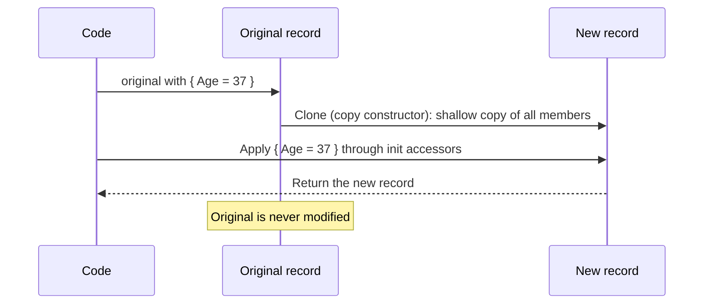
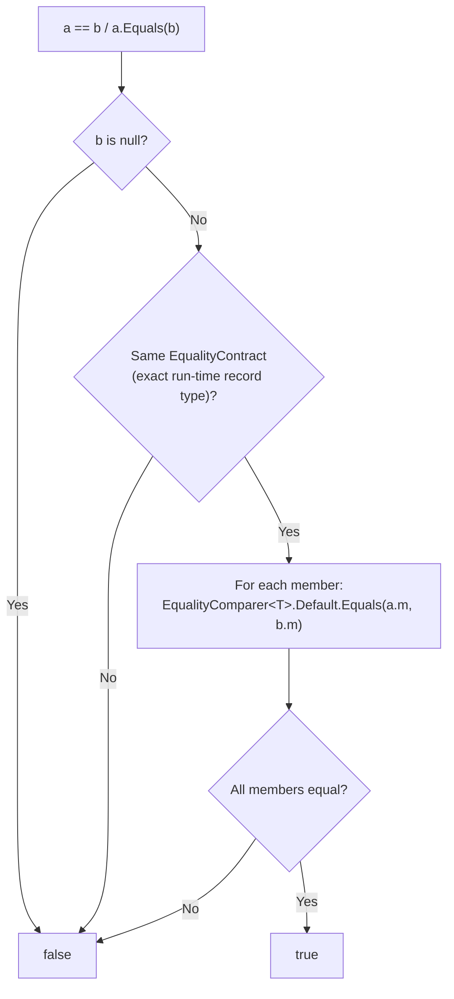
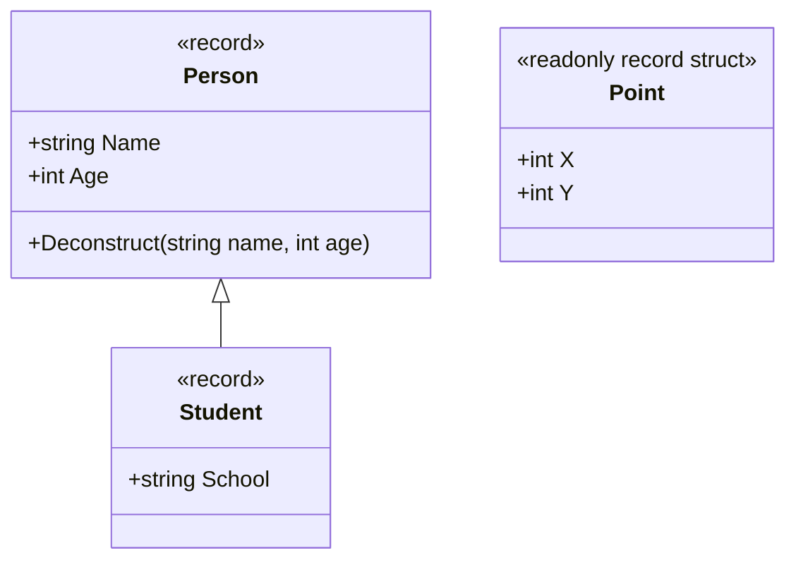
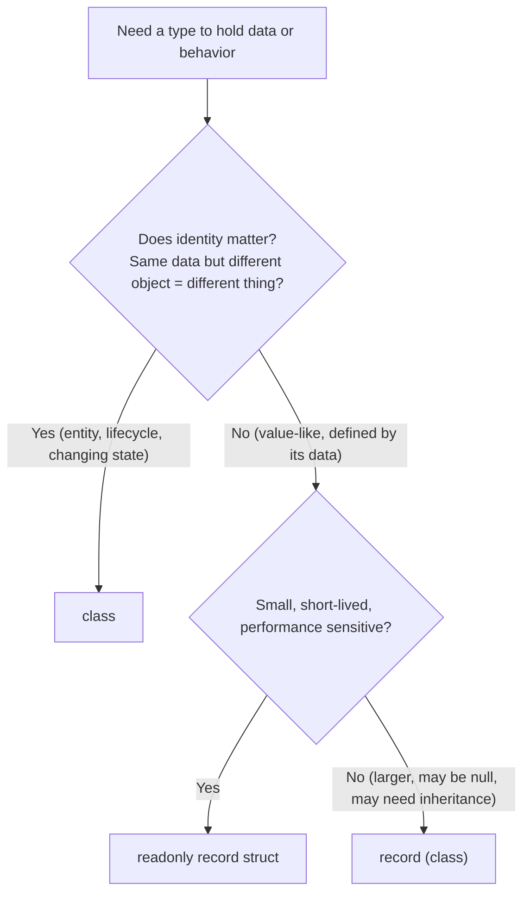

# 22. Record vs Class

> Learn how records differ from classes: what the compiler generates, value-based equality, immutability with `init`, non-destructive mutation with `with`, `record class` vs `record struct`, and when to choose each.

**Level:** 🔵 Advanced
**Prerequisites:** [05. Properties](../05-properties/README.md), [19. `System.Object`](../19-object-class/README.md), [20. Boxing & Unboxing](../20-boxing-unboxing/README.md)

---

## 📑 In This Chapter

1. What is a Record?
2. Positional Records
3. Equality Semantics
4. Immutability
5. The `with` Expression
6. `record class` vs `record struct`
7. Records and Inheritance
8. Class vs Record: Choosing
9. Real-World Example
10. Interview Questions

---

## 🎯 Learning Objectives

By the end of this chapter you will be able to:

- Declare records (positional and nominal) and explain what the compiler generates for them.
- Explain **value-based equality** and its limits (shallow comparison of members).
- Use `init` properties and `with` expressions for **immutable-style** programming.
- Distinguish `record` / `record class`, `record struct` and `readonly record struct`.
- Understand how records behave in inheritance hierarchies.
- Decide between a **class** and a **record** for a given design problem.

---

## 📖 Concept

A **record** is a type designed for **data**: it gives you **value-based equality**, a readable **`ToString()`**, **non-destructive copying** with `with`, and (for positional records) **deconstruction**, all **generated by the compiler**.

```csharp
public record Person(string Name, int Age);          // one line
```

The equivalent class would need a constructor, properties, `Equals`, `GetHashCode`, `==`, `!=`, `ToString` and a copy mechanism written by hand (compare with [19. `System.Object`](../19-object-class/README.md)).

| Feature | Plain **class** | **record** |
|---|---|---|
| **Kind** | Reference type | Reference type (`record`/`record class`) or value type (`record struct`) |
| **Equality** | Reference identity | **Value-based** (members compared) |
| **`ToString()`** | Type name | Type name **plus property values** |
| **`with` expression** | ❌ | ✅ |
| **Deconstruction** | Write it yourself | Generated (positional records) |
| **Typical property style** | Anything | `init`-only (positional records) |

### Records are classes (or structs) underneath

| Keyword | Compiled as | Introduced |
|---|---|---|
| `record` | A **reference type** (class) | C# 9 |
| `record class` | Same as `record`, spelled explicitly | C# 10 |
| `record struct` | A **value type** (struct) | C# 10 |
| `readonly record struct` | An **immutable** value type | C# 10 |

### Positional Records

A **positional record** declares its data in a parameter list. The compiler generates the matching `init`-only properties, a constructor and a `Deconstruct` method.

```csharp
public record PersonRecord(string Name, int Age);

public class PersonClass
{
    public string Name { get; init; } = "";
    public int Age { get; init; }
}

var c1 = new PersonClass { Name = "Ada", Age = 36 };
var c2 = new PersonClass { Name = "Ada", Age = 36 };

var r1 = new PersonRecord("Ada", 36);
var r2 = new PersonRecord("Ada", 36);

Console.WriteLine(c1 == c2);                    // class: compares references
Console.WriteLine(r1 == r2);                    // record: compares values
Console.WriteLine(ReferenceEquals(r1, r2));     // still two different objects

Console.WriteLine(c1);                          // class ToString
Console.WriteLine(r1);                          // record ToString

var older = r1 with { Age = 37 };               // copy with one change
Console.WriteLine(older);
Console.WriteLine(r1);                          // the original is unchanged

var (name, age) = r1;                           // deconstruction
Console.WriteLine($"{name} is {age}");
```

**Output**

```text
False
True
False
PersonClass
PersonRecord { Name = Ada, Age = 36 }
PersonRecord { Name = Ada, Age = 37 }
PersonRecord { Name = Ada, Age = 36 }
Ada is 36
```

### Nominal (non-positional) Records

You can also declare a record with ordinary property syntax. You get the same generated equality, `ToString` and `with` support, plus full control over each property.

```csharp
public record Product
{
    public required string Name { get; init; }
    public decimal Price { get; init; }
}

var pen = new Product { Name = "Pen", Price = 2.50m };
```

### What the compiler generates

For a record **class**, the compiler synthesizes:

| Generated member | Purpose |
|---|---|
| `init`-only properties (positional) | Data members from the parameter list |
| Primary constructor (positional) | Creates the record |
| `Equals(R?)` (`IEquatable<R>`), `Equals(object?)`, `GetHashCode()` | Value-based equality |
| `==` and `!=` operators | Call the equality logic |
| `ToString()` and `PrintMembers` | `TypeName { Prop = value, ... }` |
| `Deconstruct` (positional) | `var (a, b) = record;` |
| Copy constructor + hidden clone method | Powers `with` |
| `EqualityContract` (protected, virtual) | Makes equality aware of the exact run-time type |

You can **override or replace** most of these (for example, a custom `ToString()`).

### Equality Semantics

Record equality compares **the exact run-time type and all instance members**:

```csharp
public record Person(string Name, int Age);

var a = new Person("Ada", 36);
var b = new Person("Ada", 36);
var c = new Person("Ada", 37);

Console.WriteLine(a == b);                  // True   (same type, same values)
Console.WriteLine(a.Equals(b));             // True
Console.WriteLine(a == c);                  // False  (Age differs)
Console.WriteLine(a.GetHashCode() == b.GetHashCode());   // True  (consistent with Equals)
```

How the comparison works:

1. Are both the **same record type** (via `EqualityContract`)?
2. For each member, compare using `EqualityComparer<T>.Default` (so a member's own `Equals` is used).

**Important limit: the comparison is shallow with respect to members.** If a member is a **reference type without value equality** (like `List<T>`), it is compared **by reference**.

```csharp
public record Team(string Name, List<string> Members);

var t1 = new Team("A", new List<string> { "Ann" });
var t2 = new Team("A", new List<string> { "Ann" });

Console.WriteLine(t1 == t2);                // False: two different List objects
```

**Output**

```text
False
```

Ways to handle it: share the same collection instance, use members that **have value equality** (other records, `string`, numbers), or **override `Equals`/`GetHashCode`** to compare the contents.

Nested **records** do work as expected, because each nested record compares by value too.

### Immutability

Positional record properties are **`init`-only**: they can be set only during construction/initialization (see [05. Properties](../05-properties/README.md)).

```csharp
var person = new Person("Ada", 36);
// person.Age = 37;                          // ❌ compile error: init-only property
var next = person with { Age = 37 };         // ✅ create a modified copy instead
```

Be precise about what this guarantees:

| Statement | True? |
|---|:-:|
| Positional record properties can't be reassigned after creation | ✅ |
| Records are **always** immutable | ❌ You can declare `{ get; set; }` properties on a record |
| A record is **deeply** immutable | ❌ A `List<T>` member can still be changed |
| `with` copies are **deep** | ❌ They are **shallow** copies |

For deeper immutability, use immutable member types (`string`, other records, `IReadOnlyList<T>` exposing copies, immutable collections).

### The `with` Expression

`with` creates a **copy** of a record and **applies changes** to the copy (non-destructive mutation). The original stays untouched.

```csharp
var original = new Person("Ada", 36);
var changed  = original with { Age = 37 };            // copy + modify

Console.WriteLine(original);                          // Person { Name = Ada, Age = 36 }
Console.WriteLine(changed);                           // Person { Name = Ada, Age = 37 }
Console.WriteLine(ReferenceEquals(original, changed));// False
```

Facts:

- Works with **records**, all **structs** (C# 10+) and anonymous types, **not** ordinary classes.
- The copy is **shallow** (reference members point to the same objects).
- The changes are applied through the properties' **`init` accessors**, so **validation inside `init` runs again**.
- On a base-typed variable, `with` copies the **actual derived type** (the clone is virtual).

### `record class` vs `record struct`

| Aspect | `record` / `record class` | `record struct` | `readonly record struct` |
|---|---|---|---|
| **Type kind** | Reference | Value | Value |
| **Assignment** | Copies reference | Copies value | Copies value |
| **Positional properties** | `init`-only | **Mutable** (`get; set;`) by default | `init`-only |
| **Allocated per instance** | An object | No separate object | No separate object |
| **Can be `null`** | Yes | No (unless `Nullable<T>`) | No |
| **Inheritance** | From other records | ❌ None | ❌ None |
| **Best for** | Immutable data/DTOs/messages | Small value-like data you want to mutate locally | **Small immutable value types** (points, ids, money) |

```csharp
public readonly record struct Point(int X, int Y);      // immutable value
public record struct MutablePoint(int X, int Y);        // mutable value (note the difference!)

var p = new Point(1, 2);
var q = p with { X = 10 };

Console.WriteLine(p);                                   // Point { X = 1, Y = 2 }
Console.WriteLine(q);                                   // Point { X = 10, Y = 2 }

var m = new MutablePoint(1, 2);
m.X = 5;                                                // allowed: record structs are mutable by default
Console.WriteLine(m);                                   // MutablePoint { X = 5, Y = 2 }
```

> ⚠️ **Easy trap:** a *positional* `record struct` has **settable** properties unless you add `readonly`. Prefer `readonly record struct` for value types.

A record **struct** also generates an efficient `IEquatable<T>` implementation, which avoids the boxing and reflection-style slowness of the default `ValueType.Equals` (see [20. Boxing & Unboxing](../20-boxing-unboxing/README.md)).

### Records and Inheritance

- A record **class** can inherit from **another record** (not from a regular class), and can implement interfaces.
- A regular class **cannot** inherit from a record.
- `record struct`s do **not** support inheritance.
- Equality includes the **run-time type**: a base record and a derived record are **never equal**, even with the same shared values.
- `with` and `ToString` respect the **derived** type.

```csharp
public record Person(string Name);
public record Student(string Name, string School) : Person(Name);

Person p = new Person("Ada");
Person s = new Student("Ada", "MIT");

Console.WriteLine(p == s);                   // False: different run-time types
Console.WriteLine(s);                        // Student { Name = Ada, School = MIT }

Person copy = s with { Name = "Bob" };       // clones the real Student
Console.WriteLine(copy);                     // Student { Name = Bob, School = MIT }
```

**Output**

```text
False
Student { Name = Ada, School = MIT }
Student { Name = Bob, School = MIT }
```

Use `sealed record` for records not meant to be derived, just like `sealed class` ([14. Sealed Members](../14-sealed-members/README.md)).

---

## 🤔 Why It Matters

- **Less boilerplate:** value equality, hashing, `ToString` and copying come for free and are always consistent.
- **Safer sharing:** immutable data can be passed around without defensive copies.
- **Clear intent:** `record` says "this is data defined by its values", `class` says "this is an object with identity and behavior".
- **Better debugging and logging:** the generated `ToString()` shows the contents.
- **Pattern matching and deconstruction** work naturally with records ([21. Type Casting](../21-type-casting/README.md)).
- **Correct equality is hard to write by hand** ([19. `System.Object`](../19-object-class/README.md)); records remove the usual bugs.

---

## 🧩 Syntax

```csharp
// Positional record class (immutable by default)
public record Person(string Name, int Age);

// Explicit record class (same thing)
public record class Customer(int Id, string Name);

// Nominal record with validation in init
public record Product
{
    private readonly decimal _price;

    public required string Name { get; init; }

    public decimal Price
    {
        get => _price;
        init => _price = value >= 0 ? value : throw new ArgumentOutOfRangeException(nameof(value));
    }
}

// Record structs
public readonly record struct Point(int X, int Y);       // immutable value type
public record struct Counter(int Value);                 // mutable value type

// Inheritance (records only)
public record Student(string Name, int Age, string School) : Person(Name, Age);

// Sealed record
public sealed record Money(decimal Amount, string Currency);

// Using records
var person = new Person("Ada", 36);
var older = person with { Age = 37 };                    // non-destructive mutation
var (name, age) = person;                                // deconstruction
bool same = person == new Person("Ada", 36);             // value equality: true
Console.WriteLine(person);                               // Person { Name = Ada, Age = 36 }
```

---

## 💻 Basic Example

```csharp
public record PersonRecord(string Name, int Age);

public class PersonClass
{
    public string Name { get; init; } = "";
    public int Age { get; init; }
}

var c1 = new PersonClass { Name = "Ada", Age = 36 };
var c2 = new PersonClass { Name = "Ada", Age = 36 };

var r1 = new PersonRecord("Ada", 36);
var r2 = new PersonRecord("Ada", 36);

Console.WriteLine($"class  ==: {c1 == c2}");
Console.WriteLine($"record ==: {r1 == r2}");
Console.WriteLine(r1);

var older = r1 with { Age = 37 };
Console.WriteLine(older);
Console.WriteLine(r1);
```

**Output**

```text
class  ==: False
record ==: True
PersonRecord { Name = Ada, Age = 36 }
PersonRecord { Name = Ada, Age = 37 }
PersonRecord { Name = Ada, Age = 36 }
```

Same data, same shape, very different semantics: the class compares **identity**, the record compares **content**.

---

## 🌍 Real-World Example

An immutable customer model with **nested records**, where an address change produces a **new customer** and leaves the old one intact.

```csharp
public record Address(string Street, string City);

public record Customer(int Id, string Name, Address Address);

var customer = new Customer(1, "Nadia", new Address("1 Main St", "Dhaka"));

// Nested non-destructive update: change only the street
var moved = customer with
{
    Address = customer.Address with { Street = "22 Park Rd" }
};

Console.WriteLine(customer);
Console.WriteLine(moved);
Console.WriteLine(customer == moved);
Console.WriteLine(customer.Address == new Address("1 Main St", "Dhaka"));
```

**Output**

```text
Customer { Id = 1, Name = Nadia, Address = Address { Street = 1 Main St, City = Dhaka } }
Customer { Id = 1, Name = Nadia, Address = Address { Street = 22 Park Rd, City = Dhaka } }
False
True
```

Why it works well:

- `Address` is a **value-like** concept, so a record fits perfectly, and `Customer` equality recurses into it **by value** because `Address` is itself a record.
- The old `customer` can safely be kept (for history, undo or logging); nothing mutates it.
- The last line shows value equality: a **different** `Address` object with the same data is equal.

### When an entity should stay a class

```csharp
public class BankAccount                    // identity + changing state + behavior
{
    public string Number { get; }
    public decimal Balance { get; private set; }

    public BankAccount(string number, decimal opening)
    {
        Number = number;
        Balance = opening;
    }

    public void Deposit(decimal amount)
    {
        if (amount <= 0) throw new ArgumentOutOfRangeException(nameof(amount));
        Balance += amount;
    }
}
```

Two accounts with the **same balance** are **not** the same account, and an account's state **changes over time**. That is identity-based, behavior-rich modeling, which is what **classes** are for ([08. Encapsulation](../08-encapsulation/README.md)).

---

## 🧠 How It Works

### What `with` does



Because the changes go through `init` accessors, any **validation logic in `init`** runs for `with` too.

### How record equality is evaluated



Each member is compared with **its own** `Equals`: strings, numbers and nested records compare by value; `List<T>`, arrays and ordinary classes compare **by reference**.

### Mutable members break the value-equality promise

```csharp
public record Bag(List<int> Items);

var bag = new Bag(new List<int> { 1, 2 });
var copy = bag with { };                     // shallow copy: SAME list object

copy.Items.Add(3);

Console.WriteLine(bag.Items.Count);          // 3   (the original sees the change)
```

`init` protects the **property**, not the **object it points to**. Records are only as immutable as their members.

### Records as dictionary keys

```csharp
public record ProductKey(string Sku, string Region);

var prices = new Dictionary<ProductKey, decimal>
{
    [new ProductKey("A1", "EU")] = 9.99m
};

Console.WriteLine(prices[new ProductKey("A1", "EU")]);    // 9.99: a different but equal key finds the value
```

Records make good keys **because** equality and hashing are consistent and based on immutable values (see the mutable-key bug in [19. `System.Object`](../19-object-class/README.md)). A record with **mutable** properties used as a key brings that bug back.

### Records and `ToString()`

The generated `ToString()` prints **every** property. That is useful for logs, but **dangerous for sensitive data** (passwords, tokens, personal data). Override it:

```csharp
public record Login(string User, string Password)
{
    public override string ToString() => $"Login {{ User = {User}, Password = *** }}";
}
```

---

## 📊 Diagram





*(Larger diagrams live in [`/diagrams`](../diagrams).)*

---

## ⚔️ Important Comparisons

### Class vs record class vs struct vs record struct

| Aspect | `class` | `record` (class) | `struct` | `record struct` |
|---|---|---|---|---|
| **Kind** | Reference | Reference | Value | Value |
| **Default equality** | Reference | **Value** (members) | Value (slow reflection-style default) | **Value** (generated, efficient) |
| **`ToString()`** | Type name | Type + members | Type name | Type + members |
| **`with` support** | ❌ | ✅ | ✅ (C# 10) | ✅ |
| **Inheritance** | ✅ | ✅ (records only) | ❌ | ❌ |
| **Default property mutability** | As you write | `init` (positional) | As you write | **Mutable** (positional) unless `readonly` |
| **Can be `null`** | ✅ | ✅ | ❌ | ❌ |
| **Deconstruct** | Manual | Generated (positional) | Manual | Generated (positional) |
| **Typical use** | Entities, services, rich behavior | Immutable data, DTOs, messages, value objects | Tiny hand-tuned values | Small value objects |

### Reference equality vs value equality

| | Class | Record |
|---|---|---|
| **`a == b`** | Same object? | Same type and equal members? |
| **Two objects, same data** | Not equal | Equal |
| **`ReferenceEquals`** | Identity | Identity (still available) |
| **Hash code** | Identity-based | Value-based |

### `with` vs mutation

| Aspect | `person.Age = 37` (mutation) | `person with { Age = 37 }` |
|---|---|---|
| **Original changes** | ✅ | ❌ (new object) |
| **Thread-safe sharing** | ❌ | ✅ |
| **Needs a setter** | ✅ | `init` is enough |
| **Cost** | None | One new object (or struct copy) |

### Choosing: class or record?

| Choose **record** when | Choose **class** when |
|---|---|
| The type is **defined by its data** | The type has **identity** (two equal-looking objects are still distinct) |
| You want **immutability** and safe sharing | State **changes over time** through behavior |
| It is a **DTO, message, event, config, value object** | It has rich **behavior and invariants** (accounts, orders in progress) |
| You need value equality, `with`, deconstruction | You need **reference semantics** or complex lifecycle |
| Data flows between layers or systems | It owns resources or is managed by a framework that tracks identity |

---

## ⚠️ Common Mistakes

1. ❌ **Assuming records are deeply immutable.** `init` protects the property, not the object it references. Fix: use immutable member types (strings, other records, read-only views).
2. ❌ **Expecting value equality for collection members.** `List<T>`/arrays compare by reference, so equal-looking records differ. Fix: share the instance, override `Equals`, or use members with value equality.
3. ❌ **Using records for entities with identity** (`BankAccount`, tracked ORM entities). Two accounts with equal data would be "equal". Fix: use classes.
4. ❌ **Expecting `with` to deep-copy.** The copy is shallow. Fix: use `with` on nested records too (`a with { B = a.B with { ... } }`).
5. ❌ **Mutable record properties used as dictionary/set keys.** The hash code changes after mutation ([19. `System.Object`](../19-object-class/README.md)). Fix: use `init` and immutable members.
6. ❌ **Forgetting that a positional `record struct` is mutable by default.** Fix: use `readonly record struct`.
7. ❌ **Assuming a base record and derived record can be equal.** Equality includes the run-time type. Fix: design with that in mind, or seal records.
8. ❌ **Trying to inherit a record from a class (or the reverse).** Not allowed. Fix: records inherit only from records; use interfaces for shared behavior.
9. ❌ **Leaking secrets through the generated `ToString()`.** Logs expose every property. Fix: override `ToString()` or avoid storing secrets in records that get logged.
10. ❌ **Skipping validation on positional records.** Positional parameters have no built-in checks. Fix: use a nominal record with validating `init` accessors, or an explicit property.
11. ❌ **Using `record` for behavior-heavy types.** Generated equality and `with` may be wrong for objects with lifecycle and invariants. Fix: use a class.
12. ❌ **Using large `record struct`s.** They are copied on every assignment and pass. Fix: keep value types small, or use a `record` class.
13. ❌ **Confusing `==` with `ReferenceEquals` on records.** `==` compares values; identity needs `ReferenceEquals`. Fix: choose consciously.
14. ❌ **Relying on property order in `Deconstruct`.** Positional order matters, and changing it breaks callers. Fix: treat parameter order as part of the public contract.

---

## ✅ Best Practices

- Use **records for data-centric types**: DTOs, messages, events, configuration, value objects.
- Use **classes for entities** with identity, changing state and behavior.
- Prefer **positional records** for short, simple data shapes and **nominal records** when you need validation or many properties.
- Keep records **immutable**: `init`-only properties and immutable member types.
- Use **`readonly record struct`** for small, short-lived value types.
- Update with **`with`** rather than mutating; include nested `with` for nested records.
- **Validate** in `init` accessors or constructors so `with` copies are checked as well.
- Make records **`sealed`** unless inheritance is intended.
- **Override `ToString()`** when a record holds sensitive data.
- Treat **collections inside records** with care (equality and mutability); expose read-only views or immutable collections.
- Do not use **mutable** records as dictionary keys or in hash sets.
- Document that **equality** is value-based (and shallow for members).

---

## 🎯 Interview Questions

**Q1. What is a record in C#?**

A type, introduced in C# 9, designed to model data. The compiler generates value-based equality, `GetHashCode`, `ToString()`, `==`/`!=`, a copy mechanism for `with`, and (for positional records) a constructor, properties and `Deconstruct`.

**Q2. Is a record a class or a struct?**

By default (`record` or `record class`) it is a reference type. With `record struct` (C# 10) it is a value type. `readonly record struct` is an immutable value type.

**Q3. What is the main difference between a record and a class?**

Equality semantics: records compare by value (type and members), classes compare by reference by default. Records also generate `ToString`, deconstruction and `with` support.

**Q4. How does record equality work?**

It checks the exact run-time record type and then compares each instance member using `EqualityComparer<T>.Default`. Members that are reference types without value equality (like `List<T>`) are compared by reference.

**Q5. Are records immutable?**

Positional records use `init`-only properties, so they cannot be reassigned after construction, but records are not automatically immutable: you can declare settable properties, and a record can hold mutable objects (like a `List<T>`).

**Q6. What does the `with` expression do?**

It creates a shallow copy of the record and applies the specified property changes to the copy, leaving the original unchanged. It works for records and structs, but not for ordinary classes.

**Q7. What is the difference between `init` and `set`?**

`set` allows assignment at any time. `init` allows assignment only during object initialization (constructor, object initializer or `with`), after which the property is read-only.

**Q8. What is a positional record?**

A record declared with a parameter list, such as `record Person(string Name, int Age)`. The compiler generates the constructor, init-only properties and a `Deconstruct` method.

**Q9. What is the difference between `record class` and `record struct`?**

A `record class` is a reference type with `init`-only positional properties and supports inheritance from other records. A `record struct` is a value type with mutable positional properties by default (unless `readonly`), no inheritance, and no heap allocation per instance.

**Q10. Can records inherit from classes? Can classes inherit from records?**

No to both. A record class can inherit only from another record (or `object`), and a class cannot derive from a record. Record structs cannot inherit.

**Q11. Can a base record equal a derived record with the same values?**

No. Equality includes the exact run-time type through `EqualityContract`, so a `Person` and a `Student` are never equal.

**Q12. Does `with` perform a deep copy?**

No, it is shallow. Reference-type members in the copy refer to the same objects as the original unless you also replace them (for example with a nested `with`).

**Q13. When should you use a record instead of a class?**

When the type is defined by its data and has no identity of its own: DTOs, messages, events, configuration and value objects. Use a class for entities with identity, changing state and rich behavior.

**Q14. Why can records make good dictionary keys?**

Their equality and hash code are value-based and consistent. This works well as long as the members are immutable; mutable members can change the hash code after insertion.

**Q15. What is a drawback of the generated `ToString()`?**

It prints all properties, which can leak sensitive data into logs. Override `ToString()` for such types.

**Q16. Why prefer `readonly record struct` over `record struct`?**

A positional `record struct` has mutable properties by default, which allows accidental mutation and bugs. `readonly record struct` makes the value immutable.

---

## 📝 Practice Problems

| # | Problem | Difficulty | Solution |
|:-:|---|:-:|:-:|
| 1 | Create a `PersonClass` and a `PersonRecord` with the same data. Compare two instances of each with `==`, `Equals` and `ReferenceEquals`. | 🟢 | [View →](../solutions/22-record-vs-class/) |
| 2 | Create a positional record `Point3D(double X, double Y, double Z)`. Print it, deconstruct it and copy it with `with`. | 🟢 | [View →](../solutions/22-record-vs-class/) |
| 3 | Try to assign to a positional record property and read the compiler error. Fix the code using `with`. | 🟢 | [View →](../solutions/22-record-vs-class/) |
| 4 | Create the `Address`/`Customer` nested records. Update the street through a nested `with` and prove the original is unchanged. | 🟡 | [View →](../solutions/22-record-vs-class/) |
| 5 | Create `record Team(string Name, List<string> Members)`. Show why two equal-looking teams are not equal, and fix it by overriding `Equals`/`GetHashCode`. | 🟡 | [View →](../solutions/22-record-vs-class/) |
| 6 | Create a `record Product` with a validating `init` accessor for `Price`. Show that `with { Price = -1 }` also throws. | 🟡 | [View →](../solutions/22-record-vs-class/) |
| 7 | Compare `record struct Point` and `readonly record struct Point`: demonstrate which one allows `p.X = 5`. | 🟡 | [View →](../solutions/22-record-vs-class/) |
| 8 | Build `Person` and `Student : Person` records. Show `p == s` and `with` on a base-typed variable holding a `Student`. | 🟡 | [View →](../solutions/22-record-vs-class/) |
| 9 | Use a record as a `Dictionary` key and look it up with a separately created equal instance. Then show what breaks if the record has a mutable property that changes. | 🟠 | [View →](../solutions/22-record-vs-class/) |
| 10 | Override `ToString()` on a `Login(User, Password)` record so the password is masked. | 🟠 | [View →](../solutions/22-record-vs-class/) |
| 11 | Given a list of types (`Customer` DTO, `BankAccount`, `OrderPlaced` event, `Money`, `Cart`), decide class vs record vs record struct for each and justify. | 🟠 | [View →](../solutions/22-record-vs-class/) |

Starter files: [`/exercises/22-record-vs-class`](../exercises/22-record-vs-class/)

---

## 🔑 Key Takeaways

- A **record** is a data-oriented type with **compiler-generated value equality, `ToString`, `with` and deconstruction**.
- `record` / `record class` is a **reference type**; `record struct` is a **value type**; prefer **`readonly record struct`** for immutable values.
- Record equality compares the **exact type and all members**, and is **shallow** for members: collections compare **by reference**.
- Positional properties are **`init`-only**, but records are **not automatically deeply immutable**.
- **`with`** makes a **shallow, non-destructive copy** (and re-runs `init` validation).
- Records inherit only from **records**; base and derived records are **never equal**.
- Use **records for data and value objects**, **classes for entities with identity and behavior**.
- Override **`ToString()`** for sensitive data and avoid **mutable** records as hash keys.

---

[⬅ Previous: Type Casting](../21-type-casting/README.md)
&nbsp;&nbsp;•&nbsp;&nbsp;
[🏠 Main README](../README.md)
&nbsp;&nbsp;•&nbsp;&nbsp;
[Next: Garbage Collection ➡](../23-garbage-collection/README.md)