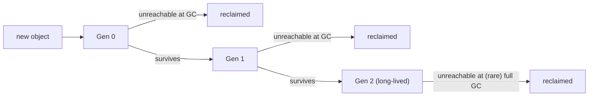
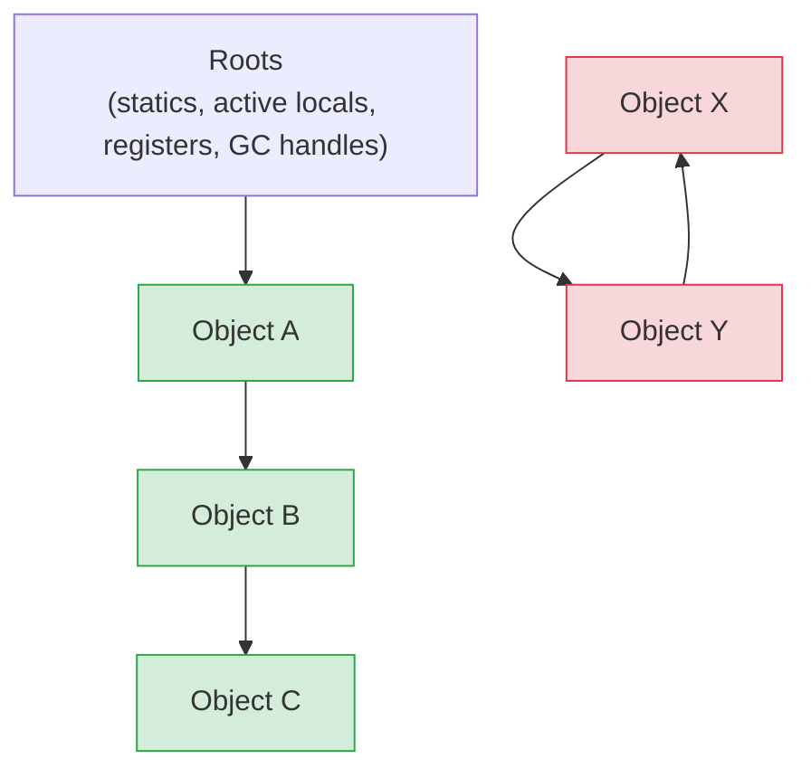
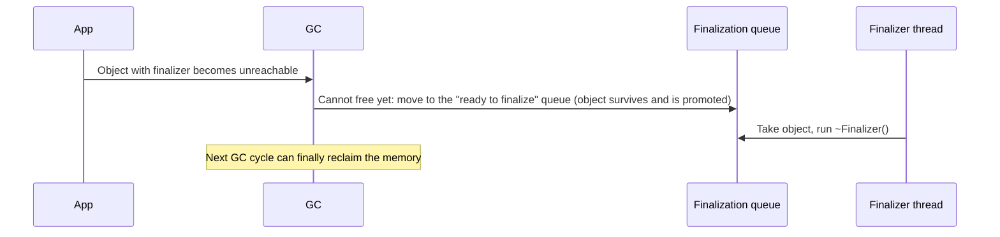
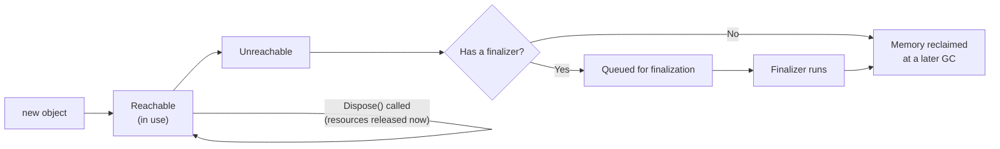
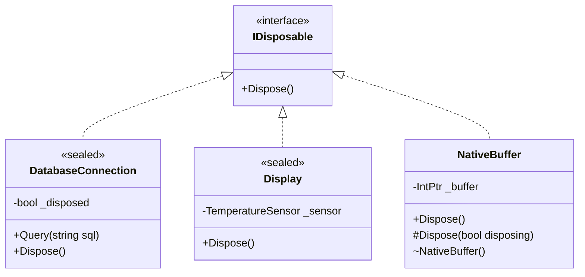

# 23. Garbage Collection

> Learn how .NET manages object lifetime: reachability, the managed heap, GC generations, finalizers, `IDisposable`, `Dispose`, `using`, and the difference between managed memory and unmanaged resources.

**Level:** 🔵 Advanced
**Prerequisites:** [03. Objects](../03-objects/README.md), [07. Constructors](../07-constructors/README.md), [12. Interfaces](../12-interfaces/README.md), [20. Boxing & Unboxing](../20-boxing-unboxing/README.md)

> 📌 **Scope of this chapter:** object lifetime and resource cleanup from an OOP point of view. It is **not** a GC tuning or low-level memory-management course.

---

## 📑 In This Chapter

1. Object Lifetime
2. The Managed Heap
3. GC Generations
4. Managed vs Unmanaged Resources
5. Finalizers
6. `IDisposable` and `Dispose`
7. The `using` Statement
8. The Dispose Pattern
9. Common Leaks in Managed Code
10. Real-World Example
11. Interview Questions

---

## 🎯 Learning Objectives

By the end of this chapter you will be able to:

- Explain when an object becomes **eligible** for garbage collection.
- Describe the **managed heap** and the three **generations** at a conceptual level.
- Distinguish **managed memory** from **unmanaged resources** (files, sockets, handles, connections).
- Explain what **finalizers** are, why they are costly, and why you rarely write them.
- Implement `IDisposable` correctly and use `using` for **deterministic cleanup**.
- Recognize when the **full Dispose pattern** is needed and when it is not.
- Find and fix common "memory leak" causes in managed code (events, statics, caches).

---

## 📖 Concept

### Object Lifetime

In C#, you create objects with `new` but you **never free managed objects yourself**. The **garbage collector (GC)** reclaims their memory automatically.

An object's lifetime is:

```text
 Created (new)  →  Reachable (in use)  →  Unreachable  →  Collected (memory reclaimed)
                                              ▲
                                              └── at some LATER, non-deterministic time
```

| Term | Meaning |
|---|---|
| **Reachable** | Some live **root** can still reach the object through references |
| **Roots** | Static fields, local variables and parameters currently in use, CPU registers, GC handles |
| **Unreachable** | No root can reach it. It is **eligible** for collection |
| **Collected** | The GC reclaimed its memory (at a time **the GC chooses**) |

```csharp
void Demo()
{
    var temp = new Person("Temp");        // object created, reachable through 'temp'
    temp.Introduce();
}   // after the last use, 'temp' no longer keeps the object reachable
    // the object is NOT destroyed immediately: it becomes eligible for collection
```

Important points (building on [03. Objects](../03-objects/README.md)):

- Lifetime is about **reachability**, **not** variable scope. In optimized builds an object can become unreachable **after its last use**, even before the scope ends.
- Collection is **non-deterministic**: you cannot know exactly when it happens.
- The GC is a **tracing** collector, not reference counting: **circular references are not a problem**. Two objects that only reference each other are collected if nothing else reaches them.
- Setting a local variable to `null` to "help the GC" is almost always **unnecessary**.

### The Managed Heap

The runtime allocates objects in a **managed heap**. Allocation is very fast (conceptually, "move a pointer forward"). When memory runs low, the GC runs:

1. **Mark:** starting from the roots, find all reachable objects.
2. **Reclaim:** everything not marked is garbage.
3. **Compact** (usually): move surviving objects together to remove gaps and update references.

You do not control these steps, and you do not need to.

> 📝 Very large objects (about **85,000 bytes** or more, such as big arrays) go to the **Large Object Heap (LOH)**, which is collected less often (together with the oldest generation) and is normally not compacted. Avoid repeatedly allocating huge short-lived arrays.

### GC Generations

Most objects die young (a temporary string, a short-lived list). The GC exploits this by sorting objects into **generations**:

| Generation | Contains | Collected |
|---|---|---|
| **Gen 0** | Newly allocated objects | **Very often**, and very quickly |
| **Gen 1** | Objects that survived one collection (a buffer between short- and long-lived) | Often |
| **Gen 2** | Long-lived objects (caches, singletons, static data) and the LOH | **Rarely**, and it is the most expensive ("full" GC) |

An object that **survives** a collection is **promoted** to the next generation.



You can observe promotion (for learning only; **do not call `GC.Collect()` in real code**):

```csharp
var data = new byte[100];

Console.WriteLine(GC.GetGeneration(data));    // 0  (just allocated)

GC.Collect();                                 // the object is still reachable, so it survives
Console.WriteLine(GC.GetGeneration(data));    // 1

GC.Collect();
Console.WriteLine(GC.GetGeneration(data));    // 2

GC.KeepAlive(data);                           // keep it reachable until here
```

**Output**

```text
0
1
2
```

Why it matters for design: **short-lived objects are cheap**; **objects that live just long enough to be promoted** (survive a collection or two, then die) are the expensive pattern. Avoid keeping references to temporary objects longer than needed.

### Managed vs Unmanaged Resources

The GC manages **memory** for **managed objects**. But programs also use **resources** the GC knows nothing about:

| | **Managed memory** | **Unmanaged / external resources** |
|---|---|---|
| **Examples** | Your objects, strings, arrays, `List<T>` | File handles, sockets, database connections, native memory, OS handles, locks, timers |
| **Who reclaims it** | The **GC**, automatically | **You**, deterministically (`Dispose`) |
| **When** | Some time after unreachable | **As soon as you are done** |
| **Why GC is not enough** | n/a | The GC reacts to **memory pressure**, not to "this file is still locked" or "we are out of connections" |

If you rely on the GC for a file handle, the file may stay **locked** (or the database connection **open**) long after you stopped using it.

.NET types that wrap such resources (`FileStream`, `StreamWriter`, `SqlConnection`, `HttpClient`, `Socket`, `Timer`) implement **`IDisposable`**.

### Finalizers

A **finalizer** (written `~ClassName()`) is a method the runtime calls on an object **after** it becomes unreachable and **before** its memory is reclaimed. It exists as a **last-resort safety net** for unmanaged resources.

```csharp
public class NativeThing
{
    ~NativeThing()                 // compiled into an override of Object.Finalize()
    {
        // release unmanaged resources (last resort)
    }
}
```

What you must know:

| Fact | Consequence |
|---|---|
| Runs on a **dedicated finalizer thread**, at an **unpredictable time** | Never rely on it for timely cleanup |
| **Not guaranteed to run** at all (in modern .NET, finalizers are **not** run at process exit) | Never put essential logic only in a finalizer |
| Objects with finalizers **survive at least one extra GC** (they are queued first) | They live longer and cost more memory and time |
| **Order is not guaranteed** between objects | A finalizer must not touch other managed objects (they may already be finalized) |
| An exception in a finalizer can **crash the process** | Keep it tiny and safe |
| Syntax only for **classes** | Not for structs |

**Rule of thumb: do not write a finalizer.** If you hold an unmanaged handle, wrap it in a **`SafeHandle`** (a framework class that already has a correct finalizer), and let your class just implement `IDisposable`.

### `IDisposable` and `Dispose`

`IDisposable` is the **contract for deterministic cleanup**:

```csharp
public interface IDisposable
{
    void Dispose();
}
```

A type that implements it says: *"I hold resources; call `Dispose()` when you are finished."*

Rules for a good `Dispose`:

| Rule | Why |
|---|---|
| **Idempotent**: calling it twice is safe | Callers and `using` may both call it |
| **Does not throw** | It runs in cleanup paths (`finally`) |
| **Releases everything** the object owns | Including nested `IDisposable` fields |
| After disposal, other members **throw `ObjectDisposedException`** | Detects use-after-dispose bugs |
| **Whoever owns the resource disposes it** | Define ownership clearly |

```csharp
public sealed class DatabaseConnection : IDisposable
{
    private bool _disposed;

    public DatabaseConnection() => Console.WriteLine("Connection opened.");

    public void Query(string sql)
    {
        ObjectDisposedException.ThrowIf(_disposed, this);     // .NET 7+
        Console.WriteLine($"Running: {sql}");
    }

    public void Dispose()
    {
        if (_disposed) return;                                // idempotent
        _disposed = true;
        Console.WriteLine("Connection closed.");
    }
}
```

### The `using` Statement

`using` guarantees that `Dispose()` is called, **even if an exception is thrown**.

```csharp
using (var connection = new DatabaseConnection())
{
    connection.Query("SELECT 1");
}                                           // Dispose() runs here

Console.WriteLine("Done.");
```

**Output**

```text
Connection opened.
Running: SELECT 1
Connection closed.
Done.
```

**`using` declaration** (C# 8+): disposal happens at the end of the **enclosing scope**.

```csharp
void Run()
{
    using var connection = new DatabaseConnection();
    connection.Query("SELECT 1");
    // ... more work ...
}   // connection.Dispose() runs here, when Run() ends
```

What the compiler generates:

```csharp
var connection = new DatabaseConnection();
try
{
    connection.Query("SELECT 1");
}
finally
{
    connection?.Dispose();                  // always runs
}
```

**Cleanup even on failure:**

```csharp
try
{
    using var connection = new DatabaseConnection();
    connection.Query("BAD");
    throw new InvalidOperationException("boom");
}
catch (InvalidOperationException)
{
    Console.WriteLine("Handled");
}
```

**Output**

```text
Connection opened.
Running: BAD
Connection closed.
Handled
```

The connection closed **before** the `catch` block ran. (There is also `await using` for `IAsyncDisposable`, used with asynchronous cleanup.)

### The Dispose Pattern

Which implementation do you need? Decide by **what you own**:

```mermaid
flowchart TD
    A["Does my class own resources?"] --> B{Does it directly hold unmanaged handles or native memory?}
    B -- "Yes" --> C["Prefer wrapping them in SafeHandle,<br/>then follow the next branch"]
    B -- "No" --> D{Does it own IDisposable fields<br/>(streams, connections, timers)?}
    C --> D
    D -- Yes --> E["Implement IDisposable:<br/>Dispose() disposes the fields.<br/>Seal the class. No finalizer."]
    D -- No --> F{Does it subscribe to events of longer-lived objects?}
    F -- Yes --> G["Implement IDisposable to unsubscribe"]
    F -- No --> H["Nothing to do"]
```

**Case 1 (most common): you own other `IDisposable` objects.** Keep it simple.

```csharp
public sealed class ExportSession : IDisposable
{
    private readonly StringWriter _writer = new();
    private readonly MemoryStream _buffer = new();
    private bool _disposed;

    public void Dispose()
    {
        if (_disposed) return;
        _writer.Dispose();
        _buffer.Dispose();
        _disposed = true;
    }
}
```

**Case 2 (rare): you directly own an unmanaged resource, or the class is designed for inheritance.** Use the **full Dispose pattern**:

```csharp
using System.Runtime.InteropServices;

public class NativeBuffer : IDisposable
{
    private IntPtr _buffer;                                   // unmanaged memory
    private readonly MemoryStream _log = new();               // managed IDisposable
    private bool _disposed;

    public NativeBuffer(int size) => _buffer = Marshal.AllocHGlobal(size);

    public void Dispose()
    {
        Dispose(disposing: true);
        GC.SuppressFinalize(this);                            // finalizer no longer needed
    }

    protected virtual void Dispose(bool disposing)
    {
        if (_disposed) return;

        if (disposing)
        {
            _log.Dispose();                                   // managed resources: only on explicit Dispose
        }

        if (_buffer != IntPtr.Zero)                           // unmanaged resources: always
        {
            Marshal.FreeHGlobal(_buffer);
            _buffer = IntPtr.Zero;
        }

        _disposed = true;
    }

    ~NativeBuffer() => Dispose(disposing: false);             // safety net if Dispose was never called
}
```

How the two paths differ:

| Path | Called by | `disposing` | Allowed to touch managed objects? |
|---|---|:-:|:-:|
| `Dispose()` | Your code / `using` | `true` | ✅ |
| Finalizer | The finalizer thread | `false` | ❌ (they may already be finalized) |

> ✅ In real code, prefer holding the native resource inside a **`SafeHandle`** subclass. Then your class is **Case 1** (owns an `IDisposable`), and you do **not** write a finalizer yourself.

### Common Leaks in Managed Code

The GC cannot free what is **still reachable**. In managed code, "memory leaks" are almost always **unintended references**:

| Cause | How it leaks | Fix |
|---|---|---|
| **Event subscriptions** | A long-lived publisher's event list references the subscriber | Unsubscribe (`-=`), often in `Dispose` |
| **Static fields / singletons** | Statics are roots for the whole process lifetime | Avoid holding large/temporary data statically |
| **Unbounded caches and collections** | Items are added, never removed | Add limits/expiry; remove entries |
| **Closures and lambdas** | A lambda capturing `this` keeps the whole object alive (see [17. `this` Keyword](../17-this-keyword/README.md)) | Avoid capturing long-lived callbacks; unsubscribe |
| **Un-disposed resources** | Handles and connections stay open | `using` / `Dispose` |
| **Timers** | A running timer references its callback target | Dispose the timer |

---

## 🤔 Why It Matters

- **Correctness:** forgetting to dispose files, connections or sockets causes locked files, exhausted connection pools and flaky behavior.
- **Performance:** understanding generations explains why short-lived objects are cheap and why long-lived garbage is expensive.
- **Reliability:** leaked event handlers and static references cause slow memory growth that crashes long-running services.
- **Design:** `IDisposable` shapes APIs: it signals **ownership** and **lifetime** responsibilities.
- **Interviews:** GC, finalizers and `Dispose` are asked about constantly.

---

## 🧩 Syntax

```csharp
// IDisposable implementation (simple case)
public sealed class Resource : IDisposable
{
    private readonly Stream _stream = new MemoryStream();
    private bool _disposed;

    public void Use()
    {
        ObjectDisposedException.ThrowIf(_disposed, this);
        // use the resource
    }

    public void Dispose()
    {
        if (_disposed) return;
        _stream.Dispose();
        _disposed = true;
    }
}

// using statement
using (var r1 = new Resource())
{
    r1.Use();
}

// using declaration (C# 8+)
using var r2 = new Resource();

// Finalizer (rarely needed)
// ~ClassName() { ... }

// Explicit GC helpers (for diagnostics and special cases only)
int generation = GC.GetGeneration(r2);
GC.SuppressFinalize(r2);        // used inside Dispose() of types that have a finalizer
GC.KeepAlive(r2);               // keep reachable until this point
```

---

## 💻 Basic Example

```csharp
public sealed class DatabaseConnection : IDisposable
{
    private bool _disposed;

    public DatabaseConnection() => Console.WriteLine("Connection opened.");

    public void Query(string sql)
    {
        ObjectDisposedException.ThrowIf(_disposed, this);
        Console.WriteLine($"Running: {sql}");
    }

    public void Dispose()
    {
        if (_disposed) return;
        _disposed = true;
        Console.WriteLine("Connection closed.");
    }
}

using (var connection = new DatabaseConnection())
{
    connection.Query("SELECT 1");
}

Console.WriteLine("Done.");

var late = new DatabaseConnection();
late.Dispose();
late.Dispose();                                 // safe: Dispose is idempotent

try
{
    late.Query("SELECT 2");                     // use after dispose
}
catch (ObjectDisposedException)
{
    Console.WriteLine("Cannot use a disposed connection.");
}
```

**Output**

```text
Connection opened.
Running: SELECT 1
Connection closed.
Done.
Connection opened.
Connection closed.
Cannot use a disposed connection.
```

The second `Dispose()` does nothing, and the disposed object **refuses further use** with a clear exception.

---

## 🌍 Real-World Example

A **long-lived publisher** with short-lived **subscribers**. Without cleanup, subscribers stay alive (and keep receiving events) because the publisher's event list references them. `IDisposable` makes the unsubscribe step deterministic.

```csharp
public class TemperatureSensor                          // long-lived publisher
{
    public event Action<double>? Reading;

    public void Publish(double value) => Reading?.Invoke(value);
}

public sealed class Display : IDisposable               // short-lived subscriber
{
    private readonly string _name;
    private readonly TemperatureSensor _sensor;
    private bool _disposed;

    public Display(string name, TemperatureSensor sensor)
    {
        _name = name;
        _sensor = sensor;
        _sensor.Reading += OnReading;                   // the SENSOR now references this Display
    }

    private void OnReading(double value)
        => Console.WriteLine($"{_name} got {value:F1}");

    public void Dispose()
    {
        if (_disposed) return;
        _sensor.Reading -= OnReading;                   // break the reference
        _disposed = true;
    }
}

var sensor = new TemperatureSensor();

var display1 = new Display("Display 1", sensor);
using var display2 = new Display("Display 2", sensor);

sensor.Publish(21.5);

display1.Dispose();
Console.WriteLine("-- display 1 disposed --");

sensor.Publish(23.0);
```

**Output**

```text
Display 1 got 21.5
Display 2 got 21.5
-- display 1 disposed --
Display 2 got 23.0
```

Why this matters:

- If `Display` did **not** unsubscribe, the sensor would keep `display1` reachable **forever**, so the GC could **never** collect it, and it would keep reacting to events. In a long-running app, creating many displays this way is a classic **memory leak**.
- `Dispose` gives a **deterministic** place to release the reference.
- `using var display2` guarantees the unsubscribe runs when the enclosing scope ends, even on exceptions.
- No finalizer is needed: there is **no unmanaged resource**, only a reference to clean up.

---

## 🧠 How It Works

### What the GC treats as "alive"



`A`, `B`, `C` are reachable from a root. `X` and `Y` reference each other but **no root reaches them**, so both are garbage. Cycles do not keep objects alive.

### Why finalizable objects cost more



Without `GC.SuppressFinalize(this)` in `Dispose()`, every disposed object still goes through this extra round. That is why the full pattern calls it.

### Three mechanisms, three jobs

| | **Garbage collector** | **Finalizer** | **`Dispose` / `using`** |
|---|---|---|---|
| **Reclaims** | Managed memory | Unmanaged resources (last resort) | Any owned resource (managed or unmanaged) |
| **When** | Non-deterministic | Non-deterministic, maybe never | **Deterministic**: when you call it |
| **Triggered by** | Memory pressure | GC finding an unreachable finalizable object | Your code / `using` |
| **Cost** | Amortized | Extra GC cycle, finalizer thread | Negligible |
| **Use for** | Everything managed | Safety net only | **Primary cleanup mechanism** |

### Ownership: who disposes?

```csharp
public sealed class ReportService : IDisposable
{
    private readonly DatabaseConnection _connection;
    private readonly bool _ownsConnection;

    public ReportService() : this(new DatabaseConnection(), ownsConnection: true) { }

    public ReportService(DatabaseConnection connection, bool ownsConnection = false)
    {
        _connection = connection;
        _ownsConnection = ownsConnection;
    }

    public void Dispose()
    {
        if (_ownsConnection)
            _connection.Dispose();        // dispose only what you created
    }
}
```

The rule: **the code that creates (owns) a disposable object disposes it.** Do not dispose objects handed to you unless the contract says you take ownership. When objects are injected (see [12. Interfaces](../12-interfaces/README.md)), the creator (often the DI container or the composition root) owns them.

### `GC.Collect()`: why you should not

The GC is self-tuning. Forcing collections usually **hurts** performance (it promotes survivors prematurely and interrupts the program). Legitimate uses are rare and specialized. In this chapter it appears only to **demonstrate** generations.

### Value types and `IDisposable`

A struct can implement `IDisposable` (and work with `using`), but remember that casting it to the interface **boxes** it (see [20. Boxing & Unboxing](../20-boxing-unboxing/README.md)). `using` on a struct variable avoids the box.

---

## 📊 Diagram





*(Larger diagrams live in [`/diagrams`](../diagrams).)*

---

## ⚔️ Important Comparisons

### Managed memory vs unmanaged resources

| Aspect | Managed memory | Unmanaged / external resources |
|---|---|---|
| **Reclaimed by** | GC | `Dispose` (and finalizer as a safety net) |
| **Timing** | Non-deterministic | Deterministic |
| **Pressure signal** | Memory usage | None (the GC does not know about handle counts or locks) |
| **Examples** | Objects, strings, arrays | Files, sockets, connections, native memory |

### Finalizer vs `Dispose`

| Aspect | Finalizer (`~Class`) | `Dispose()` |
|---|---|---|
| **Called by** | Runtime (finalizer thread) | Your code or `using` |
| **Timing** | Unpredictable, maybe never | Immediate and predictable |
| **Safe to use other managed objects** | ❌ | ✅ |
| **Performance impact** | Extra GC cycle for the object | None |
| **Should you write it?** | Almost never (use `SafeHandle`) | ✅ Whenever you own resources |

### `using` statement vs `using` declaration

| Aspect | `using (var x = ...) { }` | `using var x = ...;` |
|---|---|---|
| **Dispose happens** | At the end of the block | At the end of the enclosing scope |
| **Extra indentation** | Yes | No |
| **Best for** | A precise, short lifetime | The whole method is the lifetime |

### Simple `Dispose()` vs full Dispose pattern

| Situation | What to implement |
|---|---|
| Only owns other `IDisposable` objects, class is `sealed` | **Simple** `Dispose()` |
| Subscribes to events | **Simple** `Dispose()` that unsubscribes |
| Directly owns unmanaged resources | Wrap them in **`SafeHandle`**, then simple `Dispose()` |
| Class is designed for inheritance and owns resources | **Full pattern** (`Dispose(bool)`, `protected virtual`) |
| Owns raw unmanaged handles with no `SafeHandle` | Full pattern **with finalizer** (rare) |

---

## ⚠️ Common Mistakes

1. ❌ **Not disposing `IDisposable` objects.** Files stay locked, connections leak. Fix: `using` (or `using var`) everywhere you create them.
2. ❌ **Relying on the GC or a finalizer for timely cleanup.** Collection is non-deterministic and finalizers may never run. Fix: `Dispose` deterministically.
3. ❌ **Calling `GC.Collect()` routinely** "to free memory". It hurts performance. Fix: let the GC decide; fix the actual reference problem.
4. ❌ **Writing finalizers unnecessarily.** They add cost and risk. Fix: use `SafeHandle`; implement only `IDisposable`.
5. ❌ **Touching other managed objects inside a finalizer.** They may already be finalized. Fix: only release your own unmanaged resources when `disposing` is `false`.
6. ❌ **Forgetting `GC.SuppressFinalize(this)`** in `Dispose()` of a type that has a finalizer. Fix: always call it.
7. ❌ **A `Dispose` that is not idempotent or that throws.** Fix: guard with a `_disposed` flag and avoid throwing.
8. ❌ **Using an object after disposal** without checks. Fix: throw `ObjectDisposedException` from members.
9. ❌ **Not unsubscribing from events** of longer-lived objects. The subscriber can never be collected. Fix: unsubscribe in `Dispose`.
10. ❌ **Static fields or caches that only grow.** Statics are GC roots for the entire process. Fix: bound caches, remove entries, avoid holding temporary data statically.
11. ❌ **Disposing something you do not own** (a shared or injected object). Others then see a disposed object. Fix: define and honor ownership.
12. ❌ **Failing to dispose fields** in your own `Dispose`. The cleanup chain breaks. Fix: dispose every owned `IDisposable` field.
13. ❌ **Using the full Dispose pattern everywhere.** It is needless complexity for sealed classes with only managed resources. Fix: use the simple version.
14. ❌ **Thinking `obj = null;` frees memory immediately** or that it is needed for locals. Fix: it rarely matters; focus on reachability from long-lived roots.
15. ❌ **Assuming the GC handles files, sockets and connections.** It only manages memory. Fix: treat them as resources needing `Dispose`.

---

## ✅ Best Practices

- **Dispose what you own** with `using` / `using var`; make it a habit.
- Implement **`IDisposable`** when your type owns disposable fields, unmanaged resources, or subscriptions.
- Prefer the **simple** `Dispose()` on **sealed** classes; use the **full pattern** only when inheritance and unmanaged resources require it.
- Wrap unmanaged handles in **`SafeHandle`** instead of writing a finalizer.
- Make **`Dispose` idempotent** and **non-throwing**; make other members throw **`ObjectDisposedException`** afterwards.
- **Unsubscribe** from events of longer-lived objects.
- Keep **static state** small; **bound** caches and collections.
- **Define ownership** clearly in APIs and documentation; do not dispose what you did not create.
- **Do not call `GC.Collect()`** in production code.
- **Limit object lifetime**: do not hold references to temporary objects longer than necessary (avoids promotion to higher generations).
- Use **profilers and diagnostics** (memory snapshots, `dotnet-counters`, allocation profilers) to find real problems instead of guessing.

---

## 🎯 Interview Questions

**Q1. What is garbage collection in .NET?**

Automatic memory management: the runtime tracks which managed objects are still reachable, reclaims the memory of unreachable ones, and typically compacts the heap. Developers do not free managed objects manually.

**Q2. When is an object eligible for garbage collection?**

When it is no longer reachable from any root (static fields, active local variables and parameters, registers, GC handles). Eligibility does not mean immediate collection.

**Q3. Does the GC handle circular references?**

Yes. It is a tracing collector, not reference counting. Objects that reference only each other but are unreachable from any root are collected.

**Q4. What are GC generations and why do they exist?**

Gen 0, Gen 1 and Gen 2 group objects by age. Most objects die young, so collecting the youngest generation frequently is cheap, while the oldest generation is collected rarely because it is expensive. Survivors are promoted to the next generation.

**Q5. What is the Large Object Heap?**

A heap area for very large objects (around 85,000 bytes or more). It is collected together with the oldest generation and is normally not compacted, so repeated large short-lived allocations are costly.

**Q6. What is the difference between managed and unmanaged resources?**

Managed resources are memory for managed objects, reclaimed by the GC. Unmanaged resources (file handles, sockets, database connections, native memory) are not managed by the GC and must be released explicitly, typically with `Dispose`.

**Q7. What is `IDisposable` and why does it exist?**

An interface with a single `Dispose()` method for deterministic release of resources. It exists because the GC is non-deterministic and cannot release non-memory resources promptly.

**Q8. What does the `using` statement do?**

It guarantees that `Dispose()` is called on the object when the block (or enclosing scope, for a `using` declaration) ends, even if an exception occurs. It compiles to a `try`/`finally`.

**Q9. What is a finalizer, and when is it called?**

A method written as `~ClassName()` that the runtime calls on a finalizer thread after the object becomes unreachable, before its memory is reclaimed. It is non-deterministic and not guaranteed to run (for example, not at process exit in modern .NET).

**Q10. Why are finalizers expensive?**

Objects with finalizers cannot be reclaimed in the first GC that finds them unreachable; they are queued, finalized, and only collected in a later cycle, which extends their lifetime and uses the finalizer thread.

**Q11. What does `GC.SuppressFinalize` do?**

It tells the runtime that an object's finalizer need not run (because `Dispose` already cleaned up), avoiding the extra finalization cost.

**Q12. When do you need the full Dispose pattern?**

When a class directly owns unmanaged resources (ideally via `SafeHandle`) or is designed for inheritance and owns resources. For sealed classes that only own other disposable objects, a simple `Dispose()` is enough.

**Q13. Can you have a memory leak in managed code?**

Yes. The GC cannot free objects that are still reachable. Typical causes: event subscriptions that are never removed, static fields, unbounded caches, and long-lived closures or timers.

**Q14. Should you call `GC.Collect()`?**

Almost never. The GC tunes itself, and forcing collections usually hurts performance by promoting survivors prematurely and pausing the application.

**Q15. Who is responsible for disposing an object?**

The owner: the code that creates it or explicitly takes ownership. Objects passed in without an ownership contract should not be disposed by the receiver.

**Q16. What should happen if you use an object after disposing it?**

Its members should throw `ObjectDisposedException` so that the bug is detected immediately.

---

## 📝 Practice Problems

| # | Problem | Difficulty | Solution |
|:-:|---|:-:|:-:|
| 1 | Print `GC.GetGeneration` for a new object, then after one and two `GC.Collect()` calls (keeping the object alive). Explain each value. | 🟢 | [View →](../solutions/23-garbage-collection/) |
| 2 | Implement `IDisposable` on a `DatabaseConnection` class and use it with a `using` block and a `using` declaration. | 🟢 | [View →](../solutions/23-garbage-collection/) |
| 3 | Make `Dispose()` idempotent and make `Query` throw `ObjectDisposedException` after disposal. | 🟢 | [View →](../solutions/23-garbage-collection/) |
| 4 | Write code that throws inside a `using` block and prove that `Dispose` still runs before the `catch`. | 🟡 | [View →](../solutions/23-garbage-collection/) |
| 5 | Write the equivalent `try`/`finally` code that a `using` statement compiles to. | 🟡 | [View →](../solutions/23-garbage-collection/) |
| 6 | Build the `TemperatureSensor`/`Display` example. Remove the unsubscribe from `Dispose` and explain what happens to a "disposed" display. | 🟡 | [View →](../solutions/23-garbage-collection/) |
| 7 | Create an `ExportSession` that owns a `StringWriter` and a `MemoryStream` and disposes both in a simple `Dispose()`. | 🟡 | [View →](../solutions/23-garbage-collection/) |
| 8 | Implement the full Dispose pattern for `NativeBuffer` using `Marshal.AllocHGlobal`. Explain what `disposing` means and when the finalizer runs. | 🟠 | [View →](../solutions/23-garbage-collection/) |
| 9 | Replace the raw `IntPtr` in the previous exercise with a `SafeHandle` subclass and remove the finalizer from your own class. | 🟠 | [View →](../solutions/23-garbage-collection/) |
| 10 | Create a static cache that grows forever, show its memory growth with `GC.GetTotalMemory`, then fix it with a size limit. | 🟠 | [View →](../solutions/23-garbage-collection/) |
| 11 | Write a `ReportService` that can either own or borrow a `DatabaseConnection`, and dispose it only when it owns it. | 🟠 | [View →](../solutions/23-garbage-collection/) |

Starter files: [`/exercises/23-garbage-collection`](../exercises/23-garbage-collection/)

---

## 🔑 Key Takeaways

- The **GC reclaims managed memory automatically**; an object becomes eligible when it is **unreachable from any root**, and collection time is **non-deterministic**.
- **Generations (0, 1, 2)** exploit the fact that most objects die young; survivors are **promoted**. The **LOH** holds very large objects.
- The GC manages **memory only**. **Files, sockets, connections and native memory** are **unmanaged resources** that need **deterministic cleanup**.
- **`IDisposable` + `using`** is the primary cleanup mechanism: idempotent, non-throwing, owner disposes.
- **Finalizers** are a costly last-resort safety net; prefer **`SafeHandle`** and do not write your own unless you must.
- Use the **simple `Dispose()`** for sealed classes that own disposable objects; use the **full pattern** only when needed.
- **Leaks in managed code** are reachable-but-unused objects: event subscriptions, statics, caches, closures, timers.
- **Do not call `GC.Collect()`** in real code; fix references instead.

---

[⬅ Previous: Record vs Class](../22-record-vs-class/README.md)
&nbsp;&nbsp;•&nbsp;&nbsp;
[🏠 Main README](../README.md)
&nbsp;&nbsp;•&nbsp;&nbsp;
[Next: SOLID Principles ➡](../24-solid-principles/README.md)