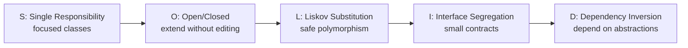
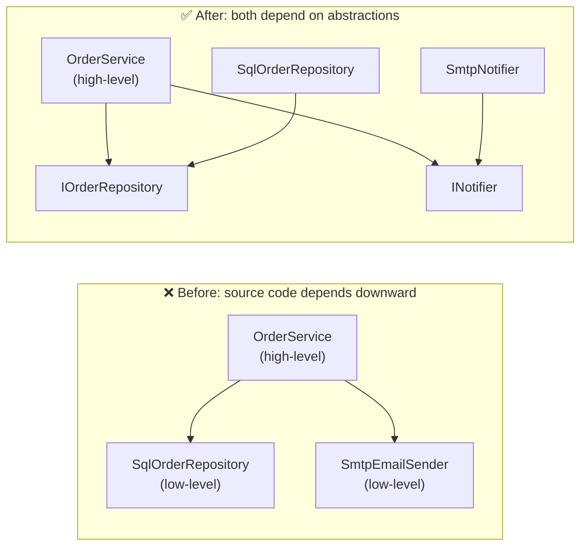
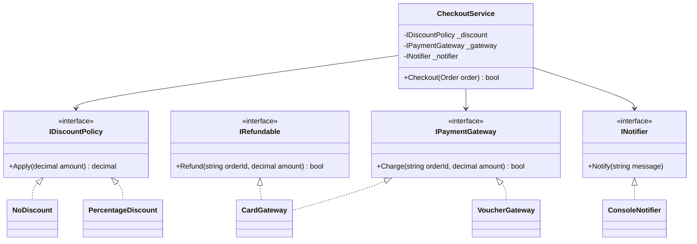
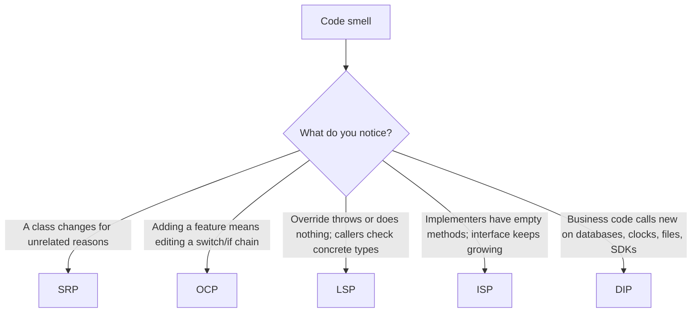
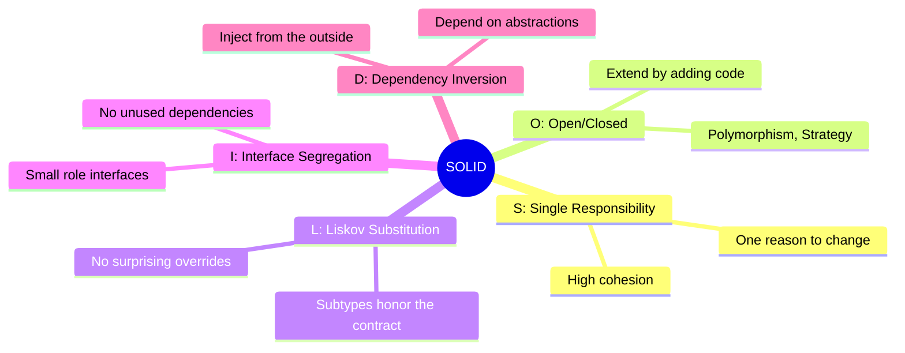

# 24. SOLID Principles

> Learn the five classic principles of object-oriented design: Single Responsibility, Open/Closed, Liskov Substitution, Interface Segregation and Dependency Inversion, and how they turn the OOP features from the earlier chapters into flexible, maintainable designs.

**Level:** 🔴 Design Principles
**Prerequisites:** [08. Encapsulation](../08-encapsulation/README.md), [09. Inheritance](../09-inheritance/README.md), [10. Polymorphism](../10-polymorphism/README.md), [11. Abstraction](../11-abstraction/README.md), [12. Interfaces](../12-interfaces/README.md), [15. Abstract Class vs Interface](../15-abstract-class-vs-interface/README.md)

---

## 📑 In This Chapter

1. What is SOLID?
2. **S**: Single Responsibility Principle (SRP)
3. **O**: Open/Closed Principle (OCP)
4. **L**: Liskov Substitution Principle (LSP)
5. **I**: Interface Segregation Principle (ISP)
6. **D**: Dependency Inversion Principle (DIP)
7. Dependency Inversion vs Dependency Injection
8. How the Principles Work Together
9. Using SOLID Wisely
10. Real-World Example
11. Interview Questions

---

## 🎯 Learning Objectives

By the end of this chapter you will be able to:

- State each SOLID principle precisely and explain the problem it solves.
- Recognize **violations** in real code and apply the standard **refactoring**.
- Connect each principle to OOP features: encapsulation, inheritance, polymorphism, abstraction and interfaces.
- Explain that **Dependency Inversion is a design principle** and **Dependency Injection is a technique**, and how both relate to Inversion of Control.
- Spot warning signs ("smells") that point to a specific principle.
- Apply SOLID **pragmatically**, without over-engineering.

---

## 📖 Concept

**SOLID** is a set of five design principles, popularized by Robert C. Martin, that guide you toward code that is **easy to change, easy to test and hard to break**.

| Letter | Principle | One-sentence idea |
|:-:|---|---|
| **S** | **Single Responsibility** | A class should have **one reason to change** |
| **O** | **Open/Closed** | Open for **extension**, closed for **modification** |
| **L** | **Liskov Substitution** | Subtypes must be **usable wherever the base type is expected** |
| **I** | **Interface Segregation** | Clients should not depend on methods they **do not use** |
| **D** | **Dependency Inversion** | Depend on **abstractions**, not on concrete details |



They are **guidelines, not laws**. They describe the kind of design that tends to survive change.

### How SOLID connects to earlier chapters

| Principle | Builds on |
|---|---|
| **SRP** | [02. Classes](../02-classes/README.md), [08. Encapsulation](../08-encapsulation/README.md) |
| **OCP** | [10. Polymorphism](../10-polymorphism/README.md), [11. Abstraction](../11-abstraction/README.md) |
| **LSP** | [09. Inheritance](../09-inheritance/README.md), [10. Polymorphism](../10-polymorphism/README.md) |
| **ISP** | [12. Interfaces](../12-interfaces/README.md), [15. Abstract Class vs Interface](../15-abstract-class-vs-interface/README.md) |
| **DIP** | [12. Interfaces](../12-interfaces/README.md), [07. Constructors](../07-constructors/README.md) |

---

## 🅢 SRP: Single Responsibility Principle

> **A class should have only one reason to change.** (Martin's refinement: it should be responsible to **one actor**, meaning one source of change requests.)

A "responsibility" is **a reason to change**, not "one method". A class that mixes business rules, database access, formatting and email will change whenever **any** of those concerns changes, and every change risks breaking the others.

### ❌ Violation

```csharp
public class Invoice
{
    public decimal Amount { get; }

    public Invoice(decimal amount) => Amount = amount;

    public decimal CalculateTotal() => Amount * 1.15m;                    // business rule (tax)

    public void SaveToDatabase() { /* SQL code */ }                       // persistence

    public string Print() => $"Invoice total: {CalculateTotal():F2}";     // presentation

    public void SendByEmail(string address) { /* SMTP code */ }           // communication
}
```

Reasons this one class might change: the **tax rules**, the **database schema**, the **print format**, the **email provider**. Four reasons, four stakeholders, one fragile class.

### ✅ Refactoring: one responsibility per class

```csharp
public class Invoice                                    // business rules only
{
    public decimal Amount { get; }

    public Invoice(decimal amount) => Amount = amount;

    public decimal CalculateTotal() => Amount * 1.15m;
}

public class InvoicePrinter                             // presentation only
{
    public string Print(Invoice invoice) => $"Invoice total: {invoice.CalculateTotal():F2}";
}

public class InvoiceRepository                          // persistence only
{
    public void Save(Invoice invoice)
        => Console.WriteLine($"Saved invoice with total {invoice.CalculateTotal():F2}");
}

public class InvoiceEmailer                             // communication only
{
    public void Send(string text, string address)
        => Console.WriteLine($"Sent '{text}' to {address}");
}

var invoice = new Invoice(100m);

string text = new InvoicePrinter().Print(invoice);
Console.WriteLine(text);

new InvoiceRepository().Save(invoice);
new InvoiceEmailer().Send(text, "sam@example.com");
```

**Output**

```text
Invoice total: 115.00
Saved invoice with total 115.00
Sent 'Invoice total: 115.00' to sam@example.com
```

Now a new email provider touches **only** `InvoiceEmailer`; a new print format touches **only** `InvoicePrinter`.

### How to recognize a violation

| Smell | Meaning |
|---|---|
| Class name contains "And", "Manager", "Helper", "Utils", "Processor" with many unrelated methods | Several responsibilities |
| `using` directives from very different domains (SQL, SMTP, UI) in one class | Mixed concerns |
| You change the class for unrelated reasons | More than one reason to change |
| Hard to name the class without "and" | Unclear responsibility |
| Constructor with many dependencies | Likely doing too much |

**Balance:** do not split a class into dozens of tiny ones that always change together. **Cohesion** (things that change together stay together) matters as much as separation.

---

## 🅞 OCP: Open/Closed Principle

> **Software entities should be open for extension but closed for modification.** (From Bertrand Meyer, popularized in its polymorphic form by Robert C. Martin.)

You should be able to **add new behavior** by **adding new code** (a new class), **without editing code that already works**.

### ❌ Violation

```csharp
public class DiscountCalculator
{
    public decimal Calculate(string customerType, decimal amount)
    {
        if (customerType == "Regular") return amount;
        if (customerType == "Silver")  return amount * 0.95m;
        if (customerType == "Gold")    return amount * 0.90m;
        // a new customer type means EDITING this method (and retesting everything)
        throw new NotSupportedException(customerType);
    }
}
```

### ✅ Refactoring: abstraction + polymorphism

```csharp
public interface IDiscountPolicy
{
    decimal Apply(decimal amount);
}

public class RegularDiscount : IDiscountPolicy { public decimal Apply(decimal amount) => amount; }
public class SilverDiscount  : IDiscountPolicy { public decimal Apply(decimal amount) => amount * 0.95m; }
public class GoldDiscount    : IDiscountPolicy { public decimal Apply(decimal amount) => amount * 0.90m; }

// A NEW requirement: only a NEW class, nothing existing is edited
public class VipDiscount     : IDiscountPolicy { public decimal Apply(decimal amount) => amount * 0.80m; }

(string Name, IDiscountPolicy Policy)[] policies =
{
    ("Regular", new RegularDiscount()),
    ("Silver",  new SilverDiscount()),
    ("Gold",    new GoldDiscount()),
    ("VIP",     new VipDiscount())
};

foreach (var (name, policy) in policies)
    Console.WriteLine($"{name}: {policy.Apply(100m):F2}");
```

**Output**

```text
Regular: 100.00
Silver: 95.00
Gold: 90.00
VIP: 80.00
```

The code that **uses** `IDiscountPolicy` never changes when a new policy appears. This is the **Strategy** idea, built from interfaces and polymorphism ([10. Polymorphism](../10-polymorphism/README.md), [12. Interfaces](../12-interfaces/README.md)).

### How to achieve OCP

| Technique | Idea |
|---|---|
| **Interfaces / abstract classes + polymorphism** | Code against the abstraction; add implementations |
| **Strategy** | Swap algorithms behind an interface |
| **Decorator** | Wrap an object to add behavior without changing it |
| **Template Method** | Fixed skeleton, extensible steps ([11. Abstraction](../11-abstraction/README.md)) |
| **Composition + dependency injection** | Assemble behavior from parts |

### How to recognize a violation

| Smell | Meaning |
|---|---|
| Long `if/else if` or `switch` on a **type code or string** | Each new case edits this code |
| The same `switch` repeated in several places | A missing abstraction |
| Adding a feature forces edits in many existing classes ("shotgun surgery") | Closed to extension |

**Balance:** you cannot predict every change. Apply OCP **where change actually repeats** ("fool me once, shame on you; fool me twice..."). Do not build extension points for imaginary futures.

---

## 🅛 LSP: Liskov Substitution Principle

> **Objects of a subtype must be usable wherever the base type is expected, without breaking the correctness of the program.** (Barbara Liskov)

Inheritance means **is-a**. LSP says it must be a **behavioral** is-a: a derived class must honor the **contract** of its base class, not merely compile against it.

### The contract rules

| Rule | Meaning for a subclass |
|---|---|
| **Preconditions cannot be strengthened** | It may not demand more than the base class demanded |
| **Postconditions cannot be weakened** | It must deliver at least what the base class promised |
| **Invariants must be preserved** | It may not break the base class's guarantees |
| **No surprising new exceptions** | It should not throw where the base class did not |
| **History constraint** | It must not change state in ways the base class forbids |

### ❌ Classic violation: `Square : Rectangle`

```csharp
public class Rectangle
{
    public virtual double Width { get; set; }
    public virtual double Height { get; set; }
    public double Area => Width * Height;
}

public class Square : Rectangle
{
    public override double Width
    {
        get => base.Width;
        set { base.Width = value; base.Height = value; }     // keeps it square...
    }

    public override double Height
    {
        get => base.Height;
        set { base.Width = value; base.Height = value; }
    }
}

static void Resize(Rectangle rectangle)
{
    rectangle.Width = 5;
    rectangle.Height = 4;
    Console.WriteLine(rectangle.Area);          // a caller reasonably expects 20
}

Resize(new Rectangle());
Resize(new Square());
```

**Output**

```text
20
16
```

Mathematically a square **is a** rectangle, but **behaviorally** it breaks the contract "width and height are independent". Code written against `Rectangle` now gives wrong results with a `Square`.

### ✅ Fix: model what is really common

```csharp
public interface IShape
{
    double Area { get; }
}

public record Rectangle(double Width, double Height) : IShape
{
    public double Area => Width * Height;
}

public record Square(double Side) : IShape
{
    public double Area => Side * Side;
}

IShape[] shapes = { new Rectangle(5, 4), new Square(4) };

foreach (var shape in shapes)
    Console.WriteLine($"{shape.GetType().Name}: {shape.Area:F2}");
```

**Output**

```text
Rectangle: 20.00
Square: 16.00
```

Immutable shapes behind a small abstraction remove the contradictory `set` behavior (records: see [22. Record vs Class](../22-record-vs-class/README.md)).

### Another common violation: `NotSupportedException` overrides

```csharp
// ❌ Penguin is-a Bird, but cannot honor Fly()
public class Bird
{
    public virtual string Fly() => "flies";
}

public class Penguin : Bird
{
    public override string Fly() => throw new NotSupportedException();   // breaks callers of Bird.Fly()
}

// ✅ Separate the capability from the base type
public abstract class Bird2
{
    public abstract string Name { get; }
}

public interface IFlyer
{
    string Fly();
}

public class Sparrow : Bird2, IFlyer
{
    public override string Name => "Sparrow";
    public string Fly() => "Sparrow flies";
}

public class Penguin2 : Bird2
{
    public override string Name => "Penguin";
}

static void Launch(IFlyer flyer) => Console.WriteLine(flyer.Fly());   // only accepts things that can fly
```

### How to recognize a violation

| Smell | Meaning |
|---|---|
| Overrides that throw `NotImplementedException` / `NotSupportedException` | The subtype cannot honor the contract |
| Empty or "do nothing" overrides that callers depend on | Contract silently broken |
| Client code checks the concrete type (`if (x is Square)`) before using a base-typed reference | The abstraction is not substitutable |
| Derived class adds stricter validation than the base | Strengthened preconditions |
| Subclass changes the meaning of a method (`Save()` that deletes) | Broken postconditions |

**Fixes:** redesign the hierarchy, use **capability interfaces**, prefer **composition**, or make types **immutable**.

---

## 🅘 ISP: Interface Segregation Principle

> **Clients should not be forced to depend on methods they do not use.** Prefer several small, role-specific interfaces over one large, general-purpose interface.

### ❌ Violation: a "fat" interface

```csharp
public interface IMultiFunctionDevice
{
    void Print(string document);
    void Scan(string document);
    void Fax(string document);
}

public class SimplePrinter : IMultiFunctionDevice
{
    public void Print(string document) => Console.WriteLine($"SimplePrinter printing: {document}");
    public void Scan(string document) => throw new NotSupportedException();   // forced to implement
    public void Fax(string document)  => throw new NotSupportedException();   // forced to implement
}
```

`SimplePrinter` is forced to carry methods it cannot support (and those throws also violate LSP).

### ✅ Refactoring: role interfaces

```csharp
public interface IPrinter { void Print(string document); }
public interface IScanner { void Scan(string document); }
public interface IFax     { void Fax(string document); }

public class SimplePrinter : IPrinter
{
    public void Print(string document) => Console.WriteLine($"SimplePrinter printing: {document}");
}

public class OfficeMachine : IPrinter, IScanner, IFax
{
    public void Print(string document) => Console.WriteLine($"OfficeMachine printing: {document}");
    public void Scan(string document)  => Console.WriteLine($"OfficeMachine scanning: {document}");
    public void Fax(string document)   => Console.WriteLine($"OfficeMachine faxing: {document}");
}

static void PrintReport(IPrinter printer) => printer.Print("Report");     // needs only IPrinter

PrintReport(new SimplePrinter());
PrintReport(new OfficeMachine());
new OfficeMachine().Scan("Report");
```

**Output**

```text
SimplePrinter printing: Report
OfficeMachine printing: Report
OfficeMachine scanning: Report
```

`PrintReport` depends only on `IPrinter`, so it works with **any** printer and is not affected when `IScanner` changes.

If many clients need a combination, **compose** it: `public interface IMultiFunctionPrinter : IPrinter, IScanner { }`.

### How to recognize a violation

| Smell | Meaning |
|---|---|
| Implementers with empty methods or `throw new NotImplementedException()` | Interface too broad |
| An interface that grows every time a new client appears | Mixed roles |
| A class depends on an interface but uses only one or two members | Too much dependency |
| Tests need large fakes with many unused members | Fat interface |

**ISP and the rest:** small interfaces make **LSP** easier (fewer promises to break), **DIP** cleaner (abstractions fit their clients) and **mocking** trivial. (See [12. Interfaces](../12-interfaces/README.md).)

---

## 🅓 DIP: Dependency Inversion Principle

> 1. **High-level modules should not depend on low-level modules. Both should depend on abstractions.**
> 2. **Abstractions should not depend on details. Details should depend on abstractions.**

- **High-level module:** your business rules and workflows (`OrderService`).
- **Low-level module:** the details (SQL access, SMTP email, file system, a third-party SDK).
- **Abstraction:** an interface (or abstract class) that expresses what the high-level code **needs**.

### ❌ Violation: business logic tied to details

```csharp
public class SqlOrderRepository
{
    public void Save(string order) => Console.WriteLine($"SQL: saved {order}");
}

public class SmtpEmailSender
{
    public void Send(string to, string message) => Console.WriteLine($"SMTP: to {to}: {message}");
}

public class OrderService                                   // high-level policy...
{
    private readonly SqlOrderRepository _repository = new();    // ...creates and depends on
    private readonly SmtpEmailSender _email = new();            // low-level details

    public void Place(string order, string customerEmail)
    {
        _repository.Save(order);
        _email.Send(customerEmail, $"Order confirmed: {order}");
    }
}
```

Problems: you cannot test `OrderService` without SQL and SMTP, and you cannot switch storage or email provider without editing `OrderService`.

### ✅ Refactoring: depend on abstractions

```csharp
// Abstractions, expressed in the vocabulary of the high-level module
public interface IOrderRepository { void Save(string order); }
public interface INotifier        { void Notify(string to, string message); }

public class OrderService                                   // depends ONLY on abstractions
{
    private readonly IOrderRepository _repository;
    private readonly INotifier _notifier;

    public OrderService(IOrderRepository repository, INotifier notifier)    // dependencies are injected
    {
        ArgumentNullException.ThrowIfNull(repository);
        ArgumentNullException.ThrowIfNull(notifier);

        _repository = repository;
        _notifier = notifier;
    }

    public void Place(string order, string customerEmail)
    {
        _repository.Save(order);
        _notifier.Notify(customerEmail, $"Order confirmed: {order}");
    }
}

// Details now depend on the abstractions
public class SqlOrderRepository : IOrderRepository
{
    public void Save(string order) => Console.WriteLine($"SQL: saved {order}");
}

public class SmtpNotifier : INotifier
{
    public void Notify(string to, string message) => Console.WriteLine($"SMTP: to {to}: {message}");
}

// Test doubles
public class InMemoryOrderRepository : IOrderRepository
{
    public List<string> Orders { get; } = new();
    public void Save(string order) => Orders.Add(order);
}

public class FakeNotifier : INotifier
{
    public List<string> Messages { get; } = new();
    public void Notify(string to, string message) => Messages.Add($"{to}: {message}");
}

// Composition root: the ONE place that chooses the concrete classes
var service = new OrderService(new SqlOrderRepository(), new SmtpNotifier());
service.Place("Order-1", "sam@example.com");

// In a test: no SQL, no SMTP
var repository = new InMemoryOrderRepository();
var notifier = new FakeNotifier();
new OrderService(repository, notifier).Place("Order-2", "maya@example.com");

Console.WriteLine($"Saved: {repository.Orders.Count}, notifications: {notifier.Messages.Count}");
```

**Output**

```text
SQL: saved Order-1
SMTP: to sam@example.com: Order confirmed: Order-1
Saved: 1, notifications: 1
```

### Why it is called "inversion"



The **flow of control** is unchanged (the service still calls the repository), but the **source code dependency** now points **toward the abstraction**, from the detail to the interface. The dependency has been **inverted**.

Also notice that the **abstractions belong to the high-level module** (they describe what `OrderService` needs). The low-level details adapt to them, not the other way around.

### How to recognize a violation

| Smell | Meaning |
|---|---|
| `new SqlConnection()`, `new SmtpClient()`, `DateTime.Now`, `File.ReadAllText` inside business logic | Hard-wired details |
| Business classes with `using` of infrastructure namespaces | Wrong dependency direction |
| Cannot unit test without real databases, files or networks | Missing abstraction |
| Changing the storage or vendor forces changes in business code | Details leak upward |

---

## 🔄 Dependency Inversion vs Dependency Injection

These terms are constantly confused. They are **related but different**:

```text
Dependency Inversion  = Design Principle   (WHAT to depend on: abstractions)

Dependency Injection  = Technique          (HOW dependencies are supplied: from outside)
```

| Concept | What it is | Question it answers |
|---|---|---|
| **Dependency Inversion Principle (DIP)** | A **design principle** (the "D" in SOLID) | "Which direction should source code dependencies point?" |
| **Dependency Injection (DI)** | A **technique/pattern** | "How does a class get its collaborators?" |
| **Inversion of Control (IoC)** | A **broad idea**: a framework or caller controls the flow instead of your code (events, callbacks, template methods, DI) | "Who is in charge of the control flow or object creation?" |
| **DI container** (for example `Microsoft.Extensions.DependencyInjection`) | A **tool** that automates object creation and injection | "Can something wire my objects for me?" |

How they relate:

- **DIP** says: *depend on `INotifier`, not on `SmtpNotifier`.*
- **DI** is the usual way to *deliver* an `INotifier` to the class (constructor injection).
- A **container** is an optional helper that does that delivery automatically.

You can have each without the others:

| Combination | Example | Verdict |
|---|---|---|
| DI **without** DIP | Container injects the concrete `SqlOrderRepository` class | DI used, but still depends on a detail |
| DIP **without** a container | `new OrderService(new SqlOrderRepository(), new SmtpNotifier())` in `Main` | Perfectly fine (manual DI) |
| DIP **without** DI | Class gets an abstraction from a static factory | Possible, but harder to test (service locator style) |

**Forms of dependency injection:**

| Form | How | Notes |
|---|---|---|
| **Constructor injection** | Dependencies passed to the constructor | **Preferred**: required dependencies are explicit; the object is valid once built |
| **Method injection** | Dependency passed to a single method | For dependencies needed by one operation |
| **Property injection** | Dependency assigned through a settable property | For optional dependencies; the object may be incomplete |

**The composition root:** the **one place** (usually the program's entry point) where concrete classes are chosen and wired together. Business classes never call `new` on their collaborators.

**Anti-pattern: Service Locator.** Calling a global registry from inside a class (`Services.Get<INotifier>()`) hides dependencies and makes classes harder to test. Prefer explicit constructor parameters.

Optional: with a DI container, the same wiring looks like this (requires the `Microsoft.Extensions.DependencyInjection` package):

```csharp
services.AddScoped<IOrderRepository, SqlOrderRepository>();   // "when someone asks for IOrderRepository, give SqlOrderRepository"
services.AddScoped<INotifier, SmtpNotifier>();
services.AddScoped<OrderService>();
```

---

## 🧩 How the Principles Work Together

SOLID principles reinforce each other:

| Relationship | Explanation |
|---|---|
| **SRP → ISP** | Focused classes naturally expose focused interfaces |
| **OCP ← LSP** | Extension through polymorphism only works if every subtype is substitutable |
| **OCP ← DIP** | Depending on abstractions is what lets you extend by adding implementations |
| **ISP → LSP** | Small interfaces make fewer promises, so they are easier to honor |
| **DIP ← ISP** | Abstractions should be shaped by the needs of the client (small, role-specific) |
| **SRP + DIP** | Each class has one job and receives collaborators instead of creating them |

---

## 🤔 Why It Matters

- **Change becomes cheap:** a new requirement touches few files.
- **Bugs stay local:** a change in one concern does not ripple everywhere.
- **Testing becomes easy:** small classes with injected abstractions can be tested in isolation.
- **Teams can work in parallel** against stable abstractions.
- **Code reads better:** each class has a clear role and name.
- **Interviews and code reviews** use SOLID vocabulary constantly.

---

## 🧩 Syntax

There is no special syntax: SOLID is expressed with the features you already know.

```csharp
// SRP: small focused classes
public class InvoicePrinter { public string Print(Invoice invoice) => "..."; }

// OCP: extend by adding an implementation of an abstraction
public interface IDiscountPolicy { decimal Apply(decimal amount); }
public sealed class VipDiscount : IDiscountPolicy { public decimal Apply(decimal amount) => amount * 0.8m; }

// LSP: subtypes honor the contract (no surprising overrides)
public interface IShape { double Area { get; } }

// ISP: small role interfaces
public interface IPrinter { void Print(string document); }
public interface IScanner { void Scan(string document); }

// DIP + DI: depend on abstractions, receive them through the constructor
public class OrderService
{
    private readonly IOrderRepository _repository;
    public OrderService(IOrderRepository repository) => _repository = repository;
}
```

---

## 💻 Basic Example

A compact before/after for **SRP + OCP** in one place: pricing.

```csharp
// ❌ One method with several reasons to change, closed to extension
public class PriceCalculator
{
    public decimal Total(decimal amount, string customerType)
    {
        decimal discounted = customerType == "Gold" ? amount * 0.9m : amount;
        decimal tax = discounted * 0.15m;
        Console.WriteLine($"Calculated at {DateTime.Now}");       // logging mixed in
        return discounted + tax;
    }
}

// ✅ Separate roles, extensible by adding implementations
public interface IDiscountPolicy { decimal Apply(decimal amount); }
public sealed class NoDiscount   : IDiscountPolicy { public decimal Apply(decimal amount) => amount; }
public sealed class GoldDiscount : IDiscountPolicy { public decimal Apply(decimal amount) => amount * 0.9m; }

public sealed class TaxCalculator
{
    public decimal AddTax(decimal amount) => amount * 1.15m;
}

public sealed class PriceCalculator2
{
    private readonly IDiscountPolicy _discount;
    private readonly TaxCalculator _tax;

    public PriceCalculator2(IDiscountPolicy discount, TaxCalculator tax)
    {
        _discount = discount;
        _tax = tax;
    }

    public decimal Total(decimal amount) => _tax.AddTax(_discount.Apply(amount));
}

var gold = new PriceCalculator2(new GoldDiscount(), new TaxCalculator());
var regular = new PriceCalculator2(new NoDiscount(), new TaxCalculator());

Console.WriteLine($"Gold:    {gold.Total(100m):F2}");
Console.WriteLine($"Regular: {regular.Total(100m):F2}");
```

**Output**

```text
Gold:    103.50
Regular: 115.00
```

Gold: 100 × 0.9 = 90, then × 1.15 = 103.50. Adding a new customer tier means **adding** a class, not editing `Total`.

---

## 🌍 Real-World Example

A small checkout system where **all five principles** appear together.

```csharp
public record Order(string Id, decimal Amount);

// OCP + LSP: new discount types are added as new classes, every one honors the same contract
public interface IDiscountPolicy
{
    decimal Apply(decimal amount);          // contract: returns a value between 0 and amount
}

public sealed class NoDiscount : IDiscountPolicy
{
    public decimal Apply(decimal amount) => amount;
}

public sealed class PercentageDiscount : IDiscountPolicy
{
    private readonly decimal _percent;

    public PercentageDiscount(decimal percent)
    {
        if (percent is < 0 or > 100)                         // validate once, at construction
            throw new ArgumentOutOfRangeException(nameof(percent));
        _percent = percent;
    }

    public decimal Apply(decimal amount) => amount * (1 - _percent / 100m);
}

// ISP: small, separate roles; refunding is a different capability from charging
public interface IPaymentGateway { bool Charge(string orderId, decimal amount); }
public interface IRefundable     { bool Refund(string orderId, decimal amount); }
public interface INotifier       { void Notify(string message); }

public sealed class CardGateway : IPaymentGateway, IRefundable
{
    public bool Charge(string orderId, decimal amount)
    {
        Console.WriteLine($"Card charged {amount:F2} for {orderId}");
        return true;
    }

    public bool Refund(string orderId, decimal amount)
    {
        Console.WriteLine($"Card refunded {amount:F2} for {orderId}");
        return true;
    }
}

public sealed class VoucherGateway : IPaymentGateway          // cannot refund, and is not forced to
{
    public bool Charge(string orderId, decimal amount)
    {
        Console.WriteLine($"Voucher redeemed {amount:F2} for {orderId}");
        return true;
    }
}

public sealed class ConsoleNotifier : INotifier
{
    public void Notify(string message) => Console.WriteLine($"Notify: {message}");
}

// SRP: this class only orchestrates checkout
// DIP: it depends on abstractions, all supplied through the constructor
public sealed class CheckoutService
{
    private readonly IDiscountPolicy _discount;
    private readonly IPaymentGateway _gateway;
    private readonly INotifier _notifier;

    public CheckoutService(IDiscountPolicy discount, IPaymentGateway gateway, INotifier notifier)
    {
        _discount = discount;
        _gateway = gateway;
        _notifier = notifier;
    }

    public bool Checkout(Order order)
    {
        decimal total = _discount.Apply(order.Amount);
        bool paid = _gateway.Charge(order.Id, total);

        _notifier.Notify(paid ? $"{order.Id} paid {total:F2}" : $"{order.Id} payment failed");
        return paid;
    }
}

// Composition root
var order = new Order("ORD-1", 100m);

var cardCheckout = new CheckoutService(new PercentageDiscount(10m), new CardGateway(), new ConsoleNotifier());
cardCheckout.Checkout(order);

var voucherCheckout = new CheckoutService(new NoDiscount(), new VoucherGateway(), new ConsoleNotifier());
voucherCheckout.Checkout(order);

IPaymentGateway gateway = new CardGateway();
if (gateway is IRefundable refundable)                          // capability check (see 21. Type Casting)
    refundable.Refund(order.Id, 90m);
```

**Output**

```text
Card charged 90.00 for ORD-1
Notify: ORD-1 paid 90.00
Voucher redeemed 100.00 for ORD-1
Notify: ORD-1 paid 100.00
Card refunded 90.00 for ORD-1
```

Where each principle shows up:

| Principle | In this example |
|---|---|
| **SRP** | `CheckoutService` orchestrates; discounting, charging and notifying live elsewhere |
| **OCP** | A `BlackFridayDiscount` or `PayPalGateway` is a new class; `CheckoutService` never changes |
| **LSP** | Every `IDiscountPolicy` returns a valid amount and no implementation throws unexpectedly; any one can replace another |
| **ISP** | `IPaymentGateway`, `IRefundable` and `INotifier` are small; `VoucherGateway` is not forced to implement `Refund` |
| **DIP** | `CheckoutService` depends only on interfaces; the concrete classes are chosen in the composition root |



---

## 🧠 How It Works

### Mapping smells to principles



| Smell | Principle |
|---|---|
| God class, "Manager"/"Helper" with unrelated methods | **SRP** |
| Repeated `switch` on type codes, shotgun surgery | **OCP** |
| `NotImplementedException` overrides, `is` checks before using a base type | **LSP** |
| Fat interfaces, empty implementations | **ISP** |
| `new` of infrastructure in business code, impossible unit tests | **DIP** |

### Refactoring recipes

| Principle | Typical refactoring |
|---|---|
| **SRP** | Extract Class; move methods to the class that owns that concern |
| **OCP** | Replace conditional with polymorphism; introduce Strategy/Decorator |
| **LSP** | Redesign the hierarchy; replace inheritance with composition or capability interfaces; make types immutable |
| **ISP** | Split the interface by client role; compose larger interfaces from smaller ones |
| **DIP** | Extract Interface; inject through the constructor; wire in a composition root |

### SOLID and testing

Following SOLID yields objects whose collaborators can be **replaced**:

```csharp
var repository = new InMemoryOrderRepository();     // fake: no database
var notifier = new FakeNotifier();                  // fake: no email

new OrderService(repository, notifier).Place("Order-2", "maya@example.com");

// assert on repository.Orders and notifier.Messages
```

Without DIP, this test would need a real database and mail server.

---

## 📊 Diagram



*(Larger diagrams live in [`/diagrams`](../diagrams).)*

---

## ⚔️ Important Comparisons

### SOLID at a glance

| Principle | Core question | Violation signal | Main tool |
|---|---|---|---|
| **SRP** | How many reasons does this class have to change? | God classes | Extract Class |
| **OCP** | Can I add behavior without editing existing code? | `switch` on types | Polymorphism, Strategy |
| **LSP** | Can a subtype replace its base without surprises? | Throwing/empty overrides | Better hierarchy, composition |
| **ISP** | Does the client use everything it depends on? | Fat interfaces | Role interfaces |
| **DIP** | Does business code depend on details? | `new` of infrastructure | Interfaces + injection |

### DIP vs DI vs IoC vs container

| | DIP | DI | IoC | DI container |
|---|---|---|---|---|
| **Type** | Design principle | Technique | General principle | Tool/framework |
| **Concerned with** | Direction of dependencies | How dependencies arrive | Who controls the flow | Automating wiring |
| **Required for the others?** | No | No | No | No |
| **Example** | Depend on `INotifier` | Constructor parameter | Framework calls your handler | `services.AddScoped<...>()` |

### SRP: cohesion vs fragmentation

| Too coupled (God class) | Balanced | Over-fragmented |
|---|---|---|
| One class, many reasons to change | One class per cohesive responsibility | Dozens of trivial classes that always change together |
| Hard to test and change | Easy to test and change | Hard to navigate; lots of ceremony |

### Inheritance vs composition for LSP

| | Inheritance | Composition + interfaces |
|---|---|---|
| **Risk of LSP violations** | Higher (inherits all behavior and its contract) | Lower (you choose what to expose) |
| **Reuse** | Strong coupling | Loose coupling |
| **Default choice** | Only for a true behavioral is-a | When unsure |

---

## ⚠️ Common Mistakes

1. ❌ **Reading SRP as "one method per class" or "one thing per class".** A class can have many methods if they serve one reason to change. Fix: think in terms of reasons to change and actors.
2. ❌ **Over-splitting classes** (a class per method, all changing together). Fix: keep cohesive behavior together.
3. ❌ **Building extension points for changes that never come.** Speculative OCP creates unused abstraction. Fix: abstract when a change repeats (rule of three).
4. ❌ **`Square : Rectangle`-style hierarchies** that look right in math but break behavior. Fix: model behavior, not appearances; use immutable types or separate abstractions.
5. ❌ **Overriding with `throw new NotSupportedException()`.** Violates LSP (and usually ISP). Fix: remove the member from the abstraction or redesign.
6. ❌ **Checking concrete types in client code** (`if (shape is Circle)`) to work around a broken abstraction. Fix: improve the abstraction.
7. ❌ **Fat interfaces** that grow with every client. Fix: split by role and compose.
8. ❌ **An interface for every class "just in case".** Noise without benefit. Fix: add abstractions at real boundaries or where substitution is needed.
9. ❌ **Confusing DIP with DI.** Using a container but injecting concrete classes still depends on details. Fix: inject abstractions.
10. ❌ **Service locator** (`Services.Get<T>()` inside classes). Hides dependencies. Fix: constructor injection and a single composition root.
11. ❌ **Creating dependencies with `new` inside business classes.** Hard-wires details. Fix: inject them.
12. ❌ **Defining abstractions in the low-level module** (the interface lives next to the SQL class). The high-level code still depends on the details' package. Fix: let the abstraction belong to the code that **uses** it.
13. ❌ **Treating SOLID as laws** and refactoring everything at once. Fix: apply it where it removes real pain.
14. ❌ **Constructors with many parameters** and calling it "DI". Often a sign the class has too many responsibilities (SRP). Fix: split the class.

---

## ✅ Best Practices

- Use **SOLID as a diagnostic**: when code is hard to change or test, ask which principle is violated.
- Keep classes **small and cohesive**; split when a class has **more than one reason to change**.
- Apply **OCP where change repeats**; prefer **polymorphism over type checks**.
- Make sure **every subtype honors its base contract** (test substitutability).
- Design **small role interfaces** (ISP) and compose them when needed.
- **Depend on abstractions** at boundaries (data access, external services, time, files) and **inject** them through constructors.
- Define abstractions **in the consumer's layer**, in the consumer's vocabulary.
- Keep a **single composition root**; avoid service locators.
- Prefer **composition over inheritance** when the is-a relationship is doubtful.
- Prefer **immutable** types to avoid contradictory state in hierarchies.
- **Refactor incrementally**, guided by tests.
- Apply **pragmatism**: SOLID serves maintainability, and simple code that does not need it is fine.

---

## 🎯 Interview Questions

**Q1. What does SOLID stand for?**

Single Responsibility, Open/Closed, Liskov Substitution, Interface Segregation and Dependency Inversion: five principles of object-oriented design that make code easier to maintain, extend and test.

**Q2. What is the Single Responsibility Principle?**

A class should have only one reason to change, meaning it should be responsible to one actor or concern. It is about cohesion, not about having only one method.

**Q3. What is the Open/Closed Principle?**

Software entities should be open for extension but closed for modification: you add new behavior by adding new code (for example a new implementation of an interface) rather than editing existing, tested code.

**Q4. How do you achieve OCP in C#?**

By coding against abstractions (interfaces or abstract classes) and using polymorphism: Strategy, Decorator, Template Method, and dependency injection to supply different implementations.

**Q5. What is the Liskov Substitution Principle?**

Objects of a derived type must be usable wherever the base type is expected without breaking program correctness. Subtypes must honor the base contract: not strengthen preconditions, not weaken postconditions, and preserve invariants.

**Q6. Give an example of an LSP violation.**

`Square : Rectangle` where setting `Width` also changes `Height`, so code that assumes independent width and height produces wrong results. Another is a `Penguin : Bird` whose `Fly()` throws `NotSupportedException`.

**Q7. How can you detect LSP violations?**

Overrides that throw `NotImplementedException`/`NotSupportedException` or do nothing, client code that checks concrete types before using a base reference, subclasses that add stricter validation, or subclasses that change the meaning of a method.

**Q8. What is the Interface Segregation Principle?**

Clients should not be forced to depend on methods they do not use. Prefer several small, role-specific interfaces over one large interface.

**Q9. Why are fat interfaces a problem?**

They force implementers to provide methods they cannot support (often throwing exceptions), couple clients to unused members, make changes ripple through unrelated implementers, and complicate testing.

**Q10. What is the Dependency Inversion Principle?**

High-level modules should not depend on low-level modules; both should depend on abstractions. Abstractions should not depend on details; details should depend on abstractions.

**Q11. What is the difference between Dependency Inversion and Dependency Injection?**

Dependency Inversion is a design principle about the direction of dependencies (depend on abstractions). Dependency Injection is a technique for supplying a class's dependencies from outside, typically via the constructor. DI is a common way to apply DIP, but neither requires a DI container.

**Q12. What is Inversion of Control?**

A general idea in which the framework or a higher-level component controls the flow and calls your code (events, callbacks, template methods, dependency injection), instead of your code controlling everything. DI is one form of IoC.

**Q13. What are the forms of dependency injection?**

Constructor injection (preferred for required dependencies), method injection (for dependencies needed by one operation) and property injection (for optional dependencies).

**Q14. What is a composition root?**

The single place in an application (usually the entry point) where concrete implementations are chosen and wired together, so the rest of the code depends only on abstractions.

**Q15. Why is the Service Locator considered an anti-pattern?**

It hides a class's dependencies behind a global lookup, making them invisible in the constructor, harder to test and easier to misuse. Constructor injection makes dependencies explicit.

**Q16. Which principle does a long `switch` on a type code usually violate?**

The Open/Closed Principle, because adding a new type requires modifying the switch (often in several places). Polymorphism removes the need to edit existing code.

**Q17. Can you apply SOLID too much?**

Yes. Excessive abstraction, an interface for every class, and fragmented tiny classes make code harder to follow. Apply SOLID where it removes real pain and avoid speculative design.

**Q18. How does SOLID improve testability?**

Small, focused classes with abstractions injected through constructors can be tested in isolation with fakes, without databases, files or networks.

**Q19. Where should an abstraction (interface) live in a DIP design?**

With the high-level module that uses it, in that module's vocabulary. The low-level detail implements the interface and therefore depends on the high-level module's abstraction.

---

## 📝 Practice Problems

| # | Problem | Difficulty | Solution |
|:-:|---|:-:|:-:|
| 1 | Split a class that calculates, saves, prints and emails an invoice into focused classes (SRP). | 🟢 | [View →](../solutions/24-solid-principles/) |
| 2 | Replace a `DiscountCalculator` full of `if (customerType == ...)` with `IDiscountPolicy` implementations and add a new tier without editing existing code (OCP). | 🟢 | [View →](../solutions/24-solid-principles/) |
| 3 | Reproduce the `Rectangle`/`Square` problem, explain why it violates LSP, and redesign it with `IShape` and records. | 🟡 | [View →](../solutions/24-solid-principles/) |
| 4 | Fix a `Bird.Fly()` hierarchy where `Penguin` throws, using an `IFlyer` capability interface. | 🟡 | [View →](../solutions/24-solid-principles/) |
| 5 | Split `IMultiFunctionDevice` into `IPrinter`, `IScanner`, `IFax` and implement `SimplePrinter` and `OfficeMachine` (ISP). | 🟡 | [View →](../solutions/24-solid-principles/) |
| 6 | Refactor `OrderService` that creates `new SqlOrderRepository()` and `new SmtpEmailSender()` to depend on `IOrderRepository` and `INotifier` with constructor injection (DIP). | 🟡 | [View →](../solutions/24-solid-principles/) |
| 7 | Write unit-test-style code for `OrderService` using `InMemoryOrderRepository` and `FakeNotifier`. | 🟡 | [View →](../solutions/24-solid-principles/) |
| 8 | Add an `IClock` abstraction to a class that uses `DateTime.UtcNow` and test it with a fixed clock. | 🟡 | [View →](../solutions/24-solid-principles/) |
| 9 | Take the checkout example and add a `PayPalGateway` and a `BlackFridayDiscount` without modifying `CheckoutService`. | 🟠 | [View →](../solutions/24-solid-principles/) |
| 10 | Review a provided class (large, with `new` of infrastructure, a fat interface and type checks) and list which SOLID principles it violates, with a refactoring plan. | 🟠 | [View →](../solutions/24-solid-principles/) |
| 11 | Write a short comparison, with code, of manual DI in `Main` vs a DI container registration, and explain why neither guarantees DIP. | 🟠 | [View →](../solutions/24-solid-principles/) |
| 12 | Identify an example in your own project where applying a SOLID principle would be over-engineering, and justify keeping it simple. | 🟠 | [View →](../solutions/24-solid-principles/) |

Starter files: [`/exercises/24-solid-principles`](../exercises/24-solid-principles/)

---

## 🔑 Key Takeaways

- **SRP:** one class, one **reason to change** (one actor). Aim for **cohesion**, not tiny fragments.
- **OCP:** extend behavior by **adding classes**, not editing tested code; use **abstractions and polymorphism**, and apply it where change actually repeats.
- **LSP:** subtypes must be **fully substitutable**; honor the base **contract**; throwing or empty overrides are red flags.
- **ISP:** prefer **small role interfaces**; do not force clients to depend on what they do not use.
- **DIP:** **depend on abstractions**, defined in the consumer's layer; details implement them.
- **Dependency Inversion = design principle. Dependency Injection = technique.** A DI container is an optional tool, and **IoC** is the broader idea.
- Prefer **constructor injection**, a single **composition root**, and avoid **service locators**.
- SOLID makes code **easier to change and test**, but apply it **pragmatically** to avoid over-engineering.

---

[⬅ Previous: Garbage Collection](../23-garbage-collection/README.md)
&nbsp;&nbsp;•&nbsp;&nbsp;
[🏠 Main README](../README.md)